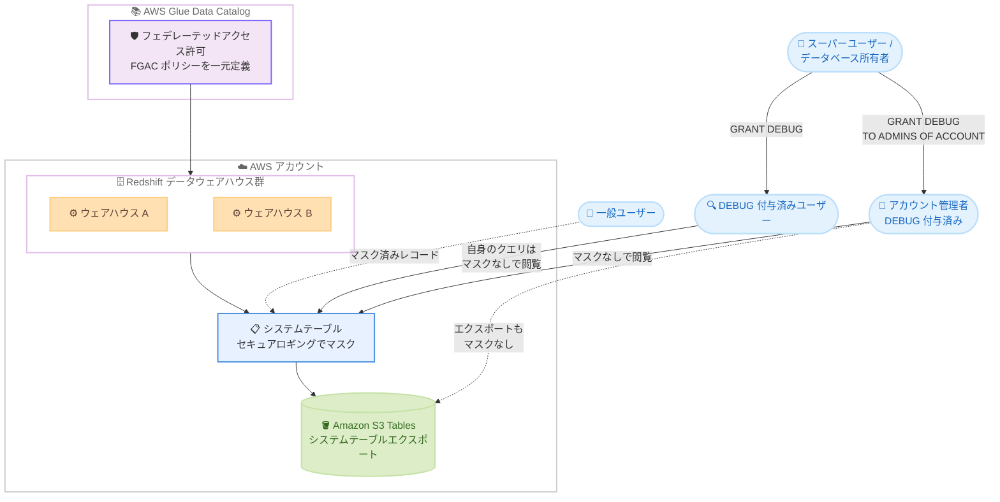

# Amazon Redshift - フェデレーテッドアクセス許可環境でのセキュアロギングへのアクセス簡素化

**リリース日**: 2026 年 9 月 30 日
**サービス**: Amazon Redshift
**機能**: DEBUG 権限によるセキュアロギングレコードの非マスク表示

📊 [このアップデートのインフォグラフィックを見る](https://takech9203.github.io/aws-news-summary/20260930-redshift-secure-logging-permissions.html)

## 概要

Amazon Redshift が、フェデレーテッドアクセス許可 (federated permissions) と細粒度アクセス制御 (FGAC: fine-grained access control) で保護されたデータに関わるクエリのトラブルシューティングと監査を容易にする、新しい DEBUG 権限を発表しました。データ所有者は、特定の ID (アイデンティティ) に対して、複数の Redshift データウェアハウスにまたがるセキュアロギングレコードをマスクなしで閲覧することを許可できるようになりました。

フェデレーテッドアクセス許可では、データ権限を一度定義すれば、AWS アカウント内のすべてのウェアハウスで Redshift が自動的に適用します。FGAC で保護されたデータにクエリがアクセスすると、セキュアロギングにより、システムテーブル内の機密情報 (書き換えられたクエリテキスト、エラーメッセージ、オブジェクト名など) が自動的にマスクされ、プロデューサーのデータがコンシューマーから保護されます。一方で、監査担当者や管理者は、トラブルシューティングやコンプライアンス対応のためにログの可視性を必要とします。今回のアップデートにより、セキュアロギングを無効化することなく、「誰がログを閲覧できるか」を正確かつ監査可能な形で制御できるようになりました。

データ共有やデータメッシュ構成を採用し、プロデューサー / コンシューマー間で厳格なデータ保護を維持しながら、運用上のログ可視性も確保したい組織が主な対象です。

**アップデート前の課題**

- FGAC で保護されたデータに関わるクエリのログは、システムテーブル上でクエリテキストやエラーメッセージなどがマスクされるため、クエリ失敗時の原因調査が困難だった
- 監査担当者や管理者がログの詳細を確認するには、データ保護とログ可視性のどちらかを犠牲にするトレードオフが発生していた
- マスクされていないログを特定のユーザーだけに見せる、きめ細かな制御手段がなかった

**アップデート後の改善**

- スーパーユーザーまたはデータベース所有者が、標準の GRANT コマンドで DEBUG 権限を付与し、特定の ID に自身のクエリのマスクなしログレコードの閲覧を許可できるようになった
- IAM ユーザー、IAM ロール、IAM Identity Center のユーザー / グループに対して権限を付与でき、複数の Redshift データウェアハウスにまたがって一貫したログ可視性を実現できるようになった
- コンシューマーアカウントの管理者に DEBUG を付与すると、ログ全体の可視性が得られ、システムテーブルデータを Amazon S3 Tables にエクスポートする際も該当レコードはマスクされないままとなった
- セキュアロギングを有効にしたまま、トラブルシューティングと監査要件の両方を満たせるようになった

## アーキテクチャ図



フェデレーテッドアクセス許可環境では、FGAC 保護データへのクエリのログレコードがシステムテーブル上で自動的にマスクされます。DEBUG 権限を付与された ID は自身のクエリのレコードをマスクなしで閲覧でき、アカウント管理者へ付与した場合は S3 Tables へのエクスポートもマスクなしで出力されます。

## サービスアップデートの詳細

### 主要機能

1. **DEBUG 権限の新設**
   - フェデレーテッドアクセス許可を使用する Redshift ウェアハウス内のデータベースを対象とした新しい権限
   - スーパーユーザーまたはデータベース所有者が、標準の GRANT / REVOKE コマンドで付与・取り消しを実行
   - 付与された ID は、自身のクエリが生成したシステムログレコードをマスクなしで閲覧可能 (他のユーザーやスーパーユーザーでも閲覧不可)

2. **複数の付与対象をサポート**
   - グローバル ID への付与: IAM ユーザー (`IAM:` プレフィックス)、IAM ロール (`IAMR:` プレフィックス)、IAM Identity Center ユーザー (IdC 名前空間プレフィックス)
   - IdC グループへの付与: `TO ROLE` 構文でグループメンバー各自が自身のクエリのレコードを閲覧可能
   - アカウント管理者への付与: `TO ADMINS OF ACCOUNT` 構文で、指定したコンシューマーアカウントのすべてのスーパーユーザーがマスクなしレコードを閲覧可能

3. **S3 Tables エクスポートとの連携**
   - アカウント管理者向けに許可されたレコードは、Redshift がシステムテーブルデータを Amazon S3 Tables にエクスポートする際もマスクされない
   - 監査基盤やログ分析基盤へのエクスポート後も、必要な詳細情報を保持可能

4. **複数ウェアハウスにまたがる一貫した制御**
   - フェデレーテッドアクセス許可はアカウント内のすべてのウェアハウスに自動適用されるため、DEBUG によるログ可視性の制御も複数ウェアハウスにわたり一貫して機能

## 技術仕様

### セキュアロギングの動作

| 項目 | 詳細 |
|------|------|
| マスク対象 | FGAC 保護データにアクセスしたクエリのシステムテーブルレコード |
| マスクされる情報 | 書き換え後のクエリテキスト、エラーメッセージ、オブジェクト名、行数 / バイト数などの統計情報 |
| マスク形式 | テキストは `******` (最大 6 文字分のアスタリスク)、数値は `-1` |
| 対象システムテーブル例 | SYS_QUERY_HISTORY、SYS_QUERY_DETAIL、STL_QUERY、STL_QUERYTEXT、SVL_STATEMENTTEXT など多数 |
| 付与可能者 | スーパーユーザーまたはデータベース所有者 |
| 付与対象データベース | フェデレーテッドアクセス許可を使用するウェアハウス内のデータベースのみ (ローカルデータベースや Lake Formation / Glue Data Catalog 由来のデータベースは不可) |

### GRANT DEBUG の構文例

```sql
-- IAM ユーザーに DEBUG を付与 (自身のクエリのレコードをマスクなしで閲覧可能)
GRANT DEBUG ON DATABASE sales_db TO "IAM:analyst_user";

-- IAM ロールに DEBUG を付与
GRANT DEBUG ON DATABASE sales_db TO "IAMR:AuditRole";

-- IAM Identity Center のグループに DEBUG を付与
GRANT DEBUG ON DATABASE sales_db TO ROLE "AWSIDC:audit-group";

-- コンシューマーアカウントの管理者全員に DEBUG を付与
GRANT DEBUG ON DATABASE sales_db TO ADMINS OF ACCOUNT '123456789012';

-- DEBUG の取り消し
REVOKE DEBUG ON DATABASE sales_db FROM "IAM:analyst_user";
```

## 設定方法

### 前提条件

1. Redshift ウェアハウス (クラスターまたは Serverless 名前空間) がフェデレーテッドアクセス許可を使用するよう AWS Glue Data Catalog に登録されていること
2. 対象データベースで FGAC によるデータ保護とセキュアロギングが機能していること
3. GRANT DEBUG を実行する ID がスーパーユーザーまたはデータベース所有者であること

### 手順

#### ステップ 1: マスクされているログレコードの確認

```sql
SELECT query_id, query_text, status, error_message
FROM sys_query_history
WHERE status = 'failed'
ORDER BY start_time DESC
LIMIT 10;
```

FGAC 保護データにアクセスしたクエリのレコードでは、`query_text` や `error_message` が `******` のようにマスクされていることを確認します。

#### ステップ 2: DEBUG 権限の付与

```sql
GRANT DEBUG ON DATABASE sales_db TO "IAM:analyst_user";
```

スーパーユーザーまたはデータベース所有者として実行し、指定した IAM ユーザーに `sales_db` データベースに対する DEBUG 権限を付与します。DEBUG は 1 ステートメントにつき 1 データベースのみ指定でき、他の権限と組み合わせることはできません。

#### ステップ 3: マスクなしレコードの閲覧

```sql
SELECT query_id, query_text, status, error_message
FROM sys_query_history
WHERE user_id = current_user_id
ORDER BY start_time DESC
LIMIT 10;
```

DEBUG を付与された ID が、権限付与後に自身が実行したクエリのログレコードを照会すると、クエリテキストやエラーメッセージがマスクされずに表示されます。DEBUG は付与後に生成されたレコードにのみ適用される点に注意してください。

## メリット

### ビジネス面

- **監査とコンプライアンスの両立**: データ保護 (セキュアロギング) を維持したまま、監査担当者に必要なログ可視性を提供でき、規制要件への対応が容易になる
- **運用効率の向上**: クエリ失敗時のトラブルシューティングに必要な情報へ迅速にアクセスでき、問題解決までの時間を短縮できる
- **ガバナンスの強化**: 「誰がマスクなしログを閲覧できるか」を GRANT / REVOKE で明示的かつ監査可能な形で管理できる

### 技術面

- **標準 SQL での制御**: 既存の GRANT / REVOKE コマンド体系に統合されており、新しいツールや API を学習する必要がない
- **最小権限の原則に適合**: 付与された ID は原則として自身のクエリのレコードのみ閲覧可能で、必要以上の情報開示を防げる
- **マルチウェアハウス対応**: フェデレーテッドアクセス許可の仕組みにより、アカウント内の複数ウェアハウスで一貫したログ可視性制御を実現できる

## デメリット・制約事項

### 制限事項

- DEBUG はフェデレーテッドアクセス許可を使用するウェアハウス内のデータベースにのみ付与可能 (ローカルデータベースや、AWS Lake Formation / AWS Glue Data Catalog のカタログから作成したデータベースには付与不可)
- DEBUG は `GRANT ALL ON DATABASE` には含まれず、明示的に付与する必要がある
- 1 ステートメントで付与できるのは 1 データベースのみで、他の権限との同時付与は不可
- PUBLIC、ローカルユーザー、ローカルグループには付与できない
- DEBUG は将来のレコードにのみ有効 (付与前に生成されたレコードはマスクされたまま。取り消し後も、有効期間中に生成されたレコードはログの保持期間中閲覧可能)
- 複数のフェデレーテッドアクセス許可データベースを結合するクエリでは、FGAC 保護データを含むすべてのデータベースに対して DEBUG が必要

### 考慮すべき点

- IAM ロールに DEBUG を付与した場合、`ALTER USER SET GLOBAL IDENTITY` と `SET SESSION AUTHORIZATION` でそのロールを引き受けたローカルスーパーユーザーもマスクなしレコードを閲覧できる (IAM ユーザーと IdC ユーザーはこの方法では偽装できない)
- クラスターや名前空間を AWS Glue Data Catalog から登録解除すると、既存の DEBUG 付与は保持されるが効果を持たなくなる (再登録すると再び有効化される。付与はデータベース削除時にのみ削除される)
- `TO ADMINS OF ACCOUNT` で指定できるのはプロデューサーを所有するアカウントと同一のアカウントのみ

## ユースケース

### ユースケース 1: データメッシュ環境でのクエリトラブルシューティング

**シナリオ**: プロデューサーチームが FGAC で保護した共有データを、コンシューマーチームのアナリストがクエリしているが、クエリ失敗時にエラーメッセージがマスクされており原因を特定できない。

**実装例**:
```sql
-- データベース所有者がアナリストの IAM ユーザーに DEBUG を付与
GRANT DEBUG ON DATABASE shared_sales_db TO "IAM:analyst_tanaka";
```

**効果**: アナリストは自身のクエリのエラーメッセージとクエリテキストをマスクなしで確認でき、プロデューサーチームへの問い合わせなしに自己解決が可能になる。他のユーザーのログは引き続き保護される。

### ユースケース 2: 監査チームによるコンプライアンス監査

**シナリオ**: 金融機関の監査チームが、コンシューマーアカウント上のすべてのクエリアクティビティを定期的に監査する必要があるが、セキュアロギングは有効のまま維持したい。

**実装例**:
```sql
-- コンシューマーアカウントの管理者全員にログ全体の可視性を付与
GRANT DEBUG ON DATABASE regulated_data_db TO ADMINS OF ACCOUNT '123456789012';
```

**効果**: 指定アカウントのスーパーユーザーがマスクなしのログレコードを閲覧でき、S3 Tables へのエクスポート時もマスクされないため、既存の監査パイプラインで詳細な監査証跡を分析できる。

### ユースケース 3: IAM Identity Center グループ単位での運用チームへの権限管理

**シナリオ**: 複数の Redshift ウェアハウスを運用するプラットフォームチームのメンバーが入れ替わるため、個人単位ではなくグループ単位でログ可視性を管理したい。

**実装例**:
```sql
-- IdC グループに DEBUG を付与
GRANT DEBUG ON DATABASE platform_db TO ROLE "AWSIDC:platform-ops";
```

**効果**: グループメンバー各自が自身のクエリのマスクなしレコードを閲覧できる。メンバーの追加・削除は IAM Identity Center 側のグループ管理に集約され、Redshift 側での個別権限管理が不要になる。

## 料金

DEBUG 権限およびセキュアロギングの利用自体に追加料金は発生しません。Amazon Redshift の標準料金 (プロビジョニングされたクラスターまたは Serverless) が適用されます。システムテーブルデータを Amazon S3 Tables にエクスポートする場合は、S3 Tables の標準料金が別途発生します。

## 利用可能リージョン

Amazon Redshift が利用可能なすべての AWS リージョンで利用できます (東京・大阪リージョンを含む)。

## 関連サービス・機能

- **AWS Glue Data Catalog**: フェデレーテッドアクセス許可の基盤。ウェアハウスをカタログに登録することでアカウント全体のデータ権限を一元管理する
- **AWS Lake Formation**: FGAC ポリシーの定義に使用され、行・列・セルレベルのアクセス制御を提供する
- **AWS IAM / IAM Identity Center**: DEBUG の付与対象となるグローバル ID (IAM ユーザー、IAM ロール、IdC ユーザー / グループ) を管理する
- **Amazon S3 Tables**: Redshift システムテーブルデータのエクスポート先。アカウント管理者向けに許可されたレコードはマスクなしでエクスポートされる

## 参考リンク

- 📊 [インフォグラフィック](https://takech9203.github.io/aws-news-summary/20260930-redshift-secure-logging-permissions.html)
- [公式発表 (What's New)](https://aws.amazon.com/about-aws/whats-new/2026/09/redshift-secure-logging-permissions/)
- [ドキュメント: フェデレーテッドアクセス許可](https://docs.aws.amazon.com/redshift/latest/dg/federated-permissions.html)
- [ドキュメント: GRANT の使用に関する注意事項 (DEBUG 権限)](https://docs.aws.amazon.com/redshift/latest/dg/r_GRANT-usage-notes.html)
- [ドキュメント: セキュアロギング](https://docs.aws.amazon.com/redshift/latest/mgmt/db-auditing-secure-logging.html)
- [料金ページ](https://aws.amazon.com/redshift/pricing/)

## まとめ

このアップデートにより、フェデレーテッドアクセス許可と FGAC によるデータ保護を維持したまま、トラブルシューティングや監査に必要なログ可視性を特定の ID にだけ付与できるようになりました。データ共有やデータメッシュ構成を採用している組織は、セキュアロギングを無効化する運用回避策が不要になるため、監査担当者や運用チーム向けの DEBUG 権限付与ポリシーの整備を検討することを推奨します。
