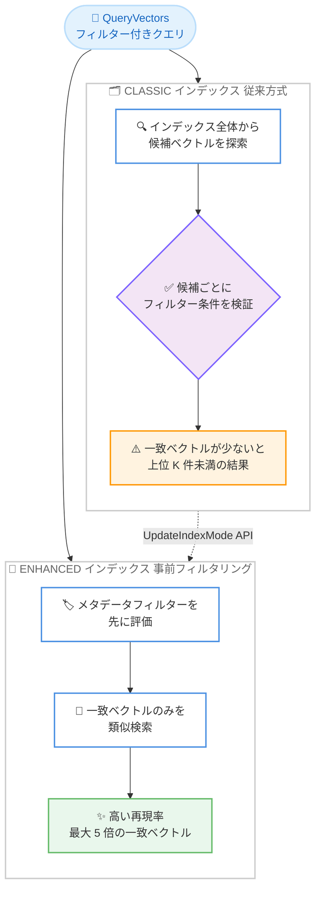

# Amazon S3 Vectors - メタデータ事前フィルタリング

**リリース日**: 2026 年 9 月 30 日
**サービス**: Amazon S3 Vectors
**機能**: メタデータ事前フィルタリング (Metadata Pre-Filtering)

📊 [このアップデートのインフォグラフィックを見る](https://takech9203.github.io/aws-news-summary/20260930-s3-vectors-introduces-metadata-pre-filtering.html)

## 概要

Amazon S3 Vectors が、類似検索の実行前にメタデータフィルターを評価する「事前フィルタリング (pre-filtering)」をサポートしました。選択性の高いフィルター (フィルターに一致するベクトルがインデックス全体のごく一部である場合) において、従来方式と比較して最大 5 倍多くの一致ベクトルを返すことができ、フィルター付き検索の再現率 (recall) が大幅に向上します。あわせて、パスや URL などの値をプレフィックスで照合する新しいフィルター演算子 `$startsWith` も追加されました。

事前フィルタリングは、インデックスモードが `ENHANCED` のベクトルインデックスに適用されます。2026 年 9 月 30 日以降に作成されたベクトルバケットでは、新規インデックスはデフォルトで `ENHANCED` モードとなり、追加の設定なしで事前フィルタリングが有効になります。既存のインデックス (`CLASSIC` モード) は、新しい `UpdateIndexMode` API により、再取り込み不要でインプレースにアップグレードできます。`PutVectors` によるベクトルの書き込みや `QueryVectors` によるフィルター付きクエリのコードを変更する必要はありません。

RAG (検索拡張生成)、エージェント型アプリケーション、セマンティック検索など、テナント ID やカテゴリでスコープを絞った検索を行うワークロードでは、より完全な検索結果が得られることで回答の関連性が向上します。追加料金なしで利用できます。

**アップデート前の課題**

従来の S3 Vectors (`CLASSIC` モード) では、ベクトル検索とフィルター評価を同時並行で実行していました。

- 候補ベクトルをインデックス全体から探索しながらフィルター条件を検証するため、フィルターに一致するベクトルが少ない場合、要求した上位 K 件よりも少ない結果しか返らないことがあった
- 例えば 800 万件のナレッジベースのうち特定顧客のデータが 400 件しかない場合、テナントスコープのクエリで十分な件数の結果を得られないことがあった
- パスや URL のプレフィックスで絞り込むための演算子が存在しなかった

**アップデート後の改善**

- フィルターに一致するベクトルを先に特定し、その中だけを類似検索するため、選択性の高いフィルターでも高い再現率を維持できるようになった
- 選択性の高いフィルターでは、一致ベクトルの取得数が従来比最大 5 倍に向上した
- 新演算子 `$startsWith` により、階層的なパスや URL のプレフィックス照合が可能になった
- `UpdateIndexMode` API により、既存インデックスを再取り込みやクエリ変更なしでアップグレードできるようになった
- `QueryVectors` のクエリ単位パラメータ `queryMode` により、アップグレード前に事前フィルタリングと現行方式の結果を比較検証できるようになった

## アーキテクチャ図



`CLASSIC` モードは検索とフィルター評価を同時並行で行うのに対し、`ENHANCED` モードはフィルターで対象を絞り込んでから類似検索を実行するため、選択性の高いフィルターでも高い再現率を維持できます。

## サービスアップデートの詳細

### 主要機能

1. **メタデータ事前フィルタリング (`ENHANCED` インデックスモード)**
   - 類似検索の実行前にメタデータフィルターを評価し、一致するベクトルのみを検索対象とする
   - 選択性の高いフィルターにおいて、従来比最大 5 倍の一致ベクトルを取得可能
   - 2026 年 9 月 30 日以降に作成されたベクトルバケットでは、新規インデックスがデフォルトで `ENHANCED` モードになる
   - `PutVectors` や `QueryVectors` の既存コードを変更する必要はない

2. **新しいプレフィックス照合演算子 `$startsWith`**
   - 指定した文字列で始まる値を照合する (例: `{"s3_path": {"$startsWith": "/marketing/"}}`)
   - S3 パス、URL、階層的なドキュメント ID などの絞り込みに有効
   - `ENHANCED` クエリ動作が必要 (`ENHANCED` インデックス、または `queryMode` を `ENHANCED` に設定した `CLASSIC` インデックスへのクエリで利用可能)

3. **既存インデックスのインプレースアップグレード**
   - 新しい `UpdateIndexMode` API により、既存の `CLASSIC` インデックスを `ENHANCED` に変更できる
   - データの再取り込みは不要で、その場で切り替わる
   - 新しい `PutVectorBucketDefaultIndexMode` API により、バケット内で新規作成されるインデックスのデフォルトモードを設定できる

4. **クエリ単位でのモード比較**
   - `QueryVectors` の新しい `queryMode` パラメータにより、インデックスモードを変更する前に、事前フィルタリング (`ENHANCED`) と現行方式 (`CLASSIC`) の結果をクエリ単位で比較できる
   - 未指定の場合はインデックスに設定されたモードが使用される

## 技術仕様

### インデックスモードの比較

| 項目 | CLASSIC | ENHANCED |
|------|---------|----------|
| フィルター評価のタイミング | ベクトル検索と同時並行 | ベクトル検索の前 (事前フィルタリング) |
| 選択性の高いフィルターでの再現率 | 上位 K 件未満になる場合がある | 高い再現率を維持 (最大 5 倍の一致ベクトル) |
| `$startsWith` 演算子 | `queryMode` を `ENHANCED` にした場合のみ | 利用可能 |
| フィルター制約数の上限 | 制限の適用なし | 1 クエリあたり 100 制約 |
| デフォルト適用 | 2026 年 9 月 30 日より前に作成されたバケットのインデックス | 2026 年 9 月 30 日以降に作成されたバケットのインデックス |

### 利用可能なフィルター演算子

| 演算子 | 入力タイプ | 説明 |
|--------|-----------|------|
| `$eq` / `$ne` | String、Number、Boolean | 完全一致 / 不一致 |
| `$gt` / `$gte` / `$lt` / `$lte` | Number | 数値の大小比較 |
| `$startsWith` | String | プレフィックス照合 (**新規**) |
| `$in` / `$nin` | 配列 | 配列内のいずれかに一致 / すべてに不一致 |
| `$exists` | Boolean | メタデータキーの存在確認 |
| `$and` / `$or` | フィルターの配列 | 複数条件の論理積 / 論理和 |

### フィルター制約数のカウント方法

`ENHANCED` インデックスでは、1 つのクエリフィルターで最大 100 制約まで使用できます。フィルターが評価する値 1 つが 1 制約としてカウントされます。

| フィルター例 | 制約数 |
|-------------|--------|
| `{"category": "electronics"}` | 1 |
| `{"region": {"$in": ["us-east-1", "us-west-2", "eu-west-1"]}}` | 3 |
| `{"$and": [{"category": "electronics"}, {"price": {"$lte": 500}}]}` | 2 |

### API 変更履歴

| 日付 | サービス | 変更内容 |
|------|----------|----------|
| 2026/09/30 | [s3vectors](https://awsapichanges.com/archive/changes/ca596c-s3vectors.html) | 2 new 3 updated api methods - `UpdateIndexMode` と `PutVectorBucketDefaultIndexMode` を新規追加。`GetIndex` (`indexMode` フィールド追加)、`GetVectorBucket` (`defaultIndexMode` フィールド追加)、`QueryVectors` (`queryMode` パラメータ追加) を更新 |

## 設定方法

### 前提条件

1. S3 Vectors のベクトルバケットとベクトルインデックスが作成済みであること
2. AWS CLI または AWS SDK が最新バージョンに更新されていること
3. IAM ポリシーで新しい API アクション (`UpdateIndexMode` など) が許可されていること

### 手順

#### ステップ 1: 既存インデックスのモードを確認する

```bash
aws s3vectors get-index \
  --vector-bucket-name my-vector-bucket \
  --index-name product-catalog
```

指定したベクトルインデックスの情報を取得します。レスポンスに含まれる `indexMode` フィールドで、現在のモードが `CLASSIC` と `ENHANCED` のどちらであるかを確認できます。

#### ステップ 2: クエリ単位で事前フィルタリングの結果を比較する (任意)

```bash
aws s3vectors query-vectors \
  --vector-bucket-name my-vector-bucket \
  --index-name product-catalog \
  --query-vector '{"float32": [0.1, 0.2, 0.3]}' \
  --top-k 10 \
  --filter '{"category": "electronics"}' \
  --query-mode ENHANCED
```

`queryMode` パラメータに `ENHANCED` を指定してクエリを実行し、インデックスモードを変更する前に、事前フィルタリングによる検索結果を現行方式の結果と比較検証します。

#### ステップ 3: 既存インデックスを ENHANCED モードに更新する

```bash
aws s3vectors update-index-mode \
  --vector-bucket-name my-vector-bucket \
  --index-name product-catalog \
  --index-mode ENHANCED
```

既存のベクトルインデックスのモードを `ENHANCED` に変更します。データの再取り込みやクエリコードの変更は不要で、変更後は事前フィルタリングと `$startsWith` 演算子が即座に利用可能になります。

#### ステップ 4: バケットのデフォルトインデックスモードを設定する (任意)

```bash
aws s3vectors put-vector-bucket-default-index-mode \
  --vector-bucket-name my-vector-bucket \
  --default-index-mode ENHANCED
```

ベクトルバケット内で今後新規作成されるインデックスのデフォルトモードを `ENHANCED` に設定します。この設定は既存のインデックスには影響しません。2026 年 9 月 30 日より前に作成されたバケットでは、この設定を行わない限り新規インデックスも `CLASSIC` になる点に注意してください。

## メリット

### ビジネス面

- **回答品質の向上**: RAG やエージェント型アプリケーションにおいて、より完全な検索結果が得られることで、生成される回答の関連性と信頼性が向上する
- **追加コストなし**: 事前フィルタリングは追加料金なしで利用でき、既存の S3 Vectors の低コストなベクトルストレージの利点をそのまま享受できる
- **マルチテナント対応の強化**: テナント ID でスコープを絞った検索でも十分な件数の結果を返せるため、マルチテナント型 SaaS の検索品質が安定する

### 技術面

- **最大 5 倍の再現率向上**: 選択性の高いフィルターにおいて、従来比最大 5 倍の一致ベクトルを取得できる
- **移行の容易さ**: `UpdateIndexMode` によるインプレースアップグレードで、データの再取り込みやアプリケーションコードの変更が不要
- **段階的な検証が可能**: `queryMode` パラメータにより、インデックスモードを変更する前にクエリ単位で結果を比較検証できる
- **柔軟なフィルター表現**: `$startsWith` の追加により、階層的なパスや URL ベースの絞り込みが可能になった

## デメリット・制約事項

### 制限事項

- `ENHANCED` インデックスでは、1 クエリあたりのフィルター制約数が 100 に制限される (評価される値 1 つが 1 制約としてカウント)
- `ENHANCED` インデックスに対して `queryMode` を `CLASSIC` に指定したクエリは実行できない
- `UpdateIndexMode` で `CLASSIC` に変更できるのは、2026 年 9 月 30 日より前に作成されたバケット内のインデックスに限られる
- 非フィルター可能メタデータ (non-filterable metadata) はフィルターに使用できない (インデックス作成時に指定し、後から変更不可)

### 考慮すべき点

- `ENHANCED` インデックスではフィルターを先に評価するため、クエリのレイテンシーはインデックスのサイズ、フィルターに一致するベクトルの割合、フィルターの制約数に応じて増加する。代表的なデータとクエリでの事前テストが推奨される
- 2026 年 9 月 30 日より前に作成されたバケットでは、新規インデックスもデフォルトで `CLASSIC` になるため、`PutVectorBucketDefaultIndexMode` での明示的な設定が必要
- 大量の値を持つ `$in` フィルター (例: 300 値) は制約数上限を超えるため、単一フィールドへの集約や、クエリの分割と距離によるマージなどの対応が必要
- 展開は段階的に進行中であり、すべての対象リージョンで利用可能になるまで数日かかる場合がある (発表時点)

## ユースケース

### ユースケース 1: マルチテナント型サポートナレッジベース

**シナリオ**: 800 万件のサポートチケットを格納したナレッジベースで、特定の顧客 (チケット数 400 件) に限定したセマンティック検索を行う。従来の `CLASSIC` モードでは、インデックス全体から候補を探索するため、上位 10 件を要求しても 2 件しか返らないことがあった。

**実装例**:
```bash
aws s3vectors query-vectors \
  --vector-bucket-name support-kb \
  --index-name tickets \
  --query-vector '{"float32": [...]}' \
  --top-k 10 \
  --filter '{"customer_id": "cust-12345"}'
```

**効果**: 事前フィルタリングにより、まず顧客の 400 件のチケットが特定され、その中だけで類似検索が実行されるため、要求した件数の結果を安定して取得できる。

### ユースケース 2: RAG アプリケーションでのドキュメント階層の絞り込み

**シナリオ**: 法務ドキュメントの RAG システムで、特定案件の添付資料配下のドキュメントチャンクのみを検索対象にしたい。

**実装例**:
```bash
aws s3vectors query-vectors \
  --vector-bucket-name legal-docs \
  --index-name document-chunks \
  --query-vector '{"float32": [...]}' \
  --top-k 20 \
  --filter '{"document_id": {"$startsWith": "matter-4417/exhibits/"}}'
```

**効果**: 新しい `$startsWith` 演算子により、階層的なドキュメント ID のプレフィックスで検索範囲を限定でき、該当案件に関連する完全な検索結果を取得できる。

### ユースケース 3: 既存インデックスの段階的アップグレード

**シナリオ**: 本番運用中の `CLASSIC` インデックスを、検索品質への影響を検証しながら `ENHANCED` に移行したい。

**実装例**:
```bash
# 1. queryMode で事前フィルタリングの結果を検証
aws s3vectors query-vectors \
  --vector-bucket-name prod-vectors \
  --index-name embeddings \
  --query-vector '{"float32": [...]}' \
  --top-k 10 \
  --filter '{"genre": "mystery"}' \
  --query-mode ENHANCED

# 2. 検証後にインデックスモードを更新
aws s3vectors update-index-mode \
  --vector-bucket-name prod-vectors \
  --index-name embeddings \
  --index-mode ENHANCED
```

**効果**: クエリ単位の `queryMode` パラメータで事前に結果を比較検証した上で、再取り込みやダウンタイムなしに本番インデックスをアップグレードできる。

## 料金

メタデータ事前フィルタリングは**追加料金なし**で利用できます。S3 Vectors の標準料金 (ストレージ、PUT リクエスト、クエリ) がそのまま適用されます。詳細は [Amazon S3 の料金ページ](https://aws.amazon.com/s3/pricing/)を参照してください。

## 利用可能リージョン

Amazon S3 Vectors が提供されているすべての AWS 商用リージョン、および AWS 中国リージョンで利用可能です。発表時点では展開が進行中であり、数日以内にすべての対象リージョンで利用可能になる見込みです。

## 関連サービス・機能

- **Amazon Bedrock Knowledge Bases**: S3 Vectors をベクトルストアとして使用する RAG アプリケーションで、フィルター付き検索の再現率向上の恩恵を受けられる
- **Amazon OpenSearch Service**: より低レイテンシーが必要な場合の代替ベクトル検索エンジン。S3 Vectors からのエクスポートも可能
- **Amazon S3**: S3 Vectors の基盤となるオブジェクトストレージサービス

## 参考リンク

- 📊 [インフォグラフィック](https://takech9203.github.io/aws-news-summary/20260930-s3-vectors-introduces-metadata-pre-filtering.html)
- [公式発表 (What's New)](https://aws.amazon.com/about-aws/whats-new/2026/09/s3-vectors-introduces-metadata-pre-filtering/)
- [AWS Blog](https://aws.amazon.com/blogs/aws/amazon-s3-vectors-now-supports-metadata-pre-filtering-for-higher-recall-on-filtered-searches)
- [ドキュメント: Metadata filtering](https://docs.aws.amazon.com/AmazonS3/latest/userguide/s3-vectors-metadata-filtering.html)
- [API 変更履歴 (awsapichanges.com)](https://awsapichanges.com/archive/changes/ca596c-s3vectors.html)
- [料金ページ](https://aws.amazon.com/s3/pricing/)

## まとめ

S3 Vectors のメタデータ事前フィルタリングは、選択性の高いフィルター付き検索における再現率を最大 5 倍向上させる重要なアップデートであり、マルチテナント検索や RAG アプリケーションの品質に直結します。既存コードの変更なしに `UpdateIndexMode` でインプレースにアップグレードでき、追加料金も発生しないため、まずは `queryMode` パラメータで結果を比較検証した上で、既存インデックスの `ENHANCED` モードへの移行を検討することを推奨します。
