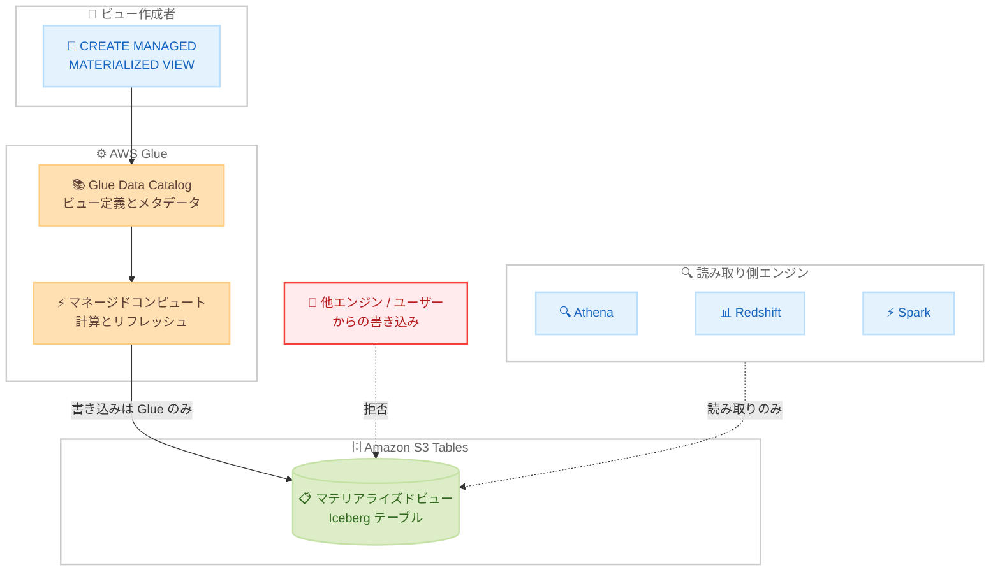

# AWS Glue - Apache Iceberg マテリアライズドビューのシステム管理型書き込み保護

**リリース日**: 2026 年 9 月 30 日
**サービス**: AWS Glue (AWS Glue Data Catalog、Amazon S3 Tables)
**機能**: Apache Iceberg materialized views system-managed write protection

📊 [このアップデートのインフォグラフィックを見る](https://takech9203.github.io/aws-news-summary/20260930-system-managed-iceberg-materialized-views.html)

## 概要

AWS は、Apache Iceberg マテリアライズドビューにおけるシステム管理型の書き込み保護 (system-managed materialized views) を発表しました。マテリアライズドビューは、コストの高いクエリの結果を事前計算して保存し、複数のクエリエンジンから再利用できる仕組みです。今回のアップデートにより、マテリアライズドビューのデータと定義への書き込みを AWS Glue のみに限定し、他のエンジンやユーザーによる変更から保護できるようになりました。

ユーザーが SQL でビュー定義 (必要に応じてリフレッシュスケジュールも) を記述すると、AWS Glue が結果を計算し、ユーザーアカウント内の Amazon S3 Tables バケットに標準の Apache Iceberg テーブルとして保存します。書き込みは AWS Glue のみが行えるため、テーブルへの書き込みアクセス権を持つユーザーが存在しても、結果は計算されたとおりの状態に保たれます。読み取りは AWS Glue Data Catalog を通じて、Iceberg 互換の任意のエンジンから直接行えます。

このアップデートは、データレイク上で信頼性の高いデータセットを複数チーム・複数エンジンで共有したいデータエンジニアやデータプラットフォーム管理者に特に有用です。

**アップデート前の課題**

マテリアライズドビューの結果はオープンな Iceberg テーブルとして保存されるため、以下の課題がありました。

- テーブルへの書き込みアクセス権を持つユーザーであれば誰でも、カタログ経由でマテリアライズドビューの結果を変更できてしまった
- S3 上のファイルを直接変更することでも、計算結果を書き換えることが可能だった
- 共有データセットとしての信頼性・一貫性を担保するには、アクセス権限の厳密な管理を利用者側で行う必要があった

**アップデート後の改善**

- マテリアライズドビューのデータと定義 (スキーマやストレージロケーションなどのメタデータ) への書き込みが AWS Glue のみに限定された
- 他のクエリエンジンからの書き込み、AWS Glue の `UpdateTable` API 直接呼び出し、基盤となる Iceberg テーブルへの直接書き込みのいずれも拒否されるようになった
- 誰が書き込みアクセス権を持っていても結果が計算どおりに保たれるため、信頼できる一貫したデータセットとして安心して共有できるようになった
- ユーザーはこれまでどおり、リフレッシュの実行、スケジュール変更、ビューの削除を行える

## アーキテクチャ図



ビュー作成者が SQL で定義すると、AWS Glue が結果を計算して Amazon S3 Tables 内の Iceberg テーブルに書き込みます。書き込みは AWS Glue のみに許可され、他のエンジンやユーザーからの変更は拒否されます。読み取りは Iceberg 互換の任意のエンジンから可能です。

## サービスアップデートの詳細

### 主要機能

1. **システム管理型の書き込み保護**
   - マテリアライズドビューのデータとメタデータ (スキーマ、ストレージロケーションなど) の書き込みが AWS Glue のみに限定される
   - 他のクエリエンジン経由、AWS Glue `UpdateTable` API の直接呼び出し、基盤 Iceberg テーブルへの直接書き込みのいずれも拒否される
   - 計算結果が「計算されたとおりの状態」に保たれ、信頼できるデータセットとして共有可能

2. **MANAGED キーワードによる作成**
   - Spark セッション設定 `spark.sql.mv.managed.enabled=true` を有効化した上で、`CREATE MANAGED MATERIALIZED VIEW` 構文で作成する
   - AWS Glue がユーザーに代わって計算と書き込みを実行し、Spark セッションは直接書き込まない
   - 作成ステートメントは AWS Glue の作成完了を待ってから返るため、通常のマテリアライズドビューより時間がかかる場合がある

3. **作成状況のトラッキング**
   - AWS Glue は最初に空のテーブルを Amazon S3 Tables に作成し、その後に定義クエリを実行してデータを投入する
   - `GetTable` API を `IncludeStatusDetails=true` で呼び出すことで、作成ジョブのステータスを確認できる
   - 作成に失敗した場合、失敗理由がテーブルステータスのエラーメッセージに含まれる

4. **ユーザーが引き続き実行できる操作**
   - マテリアライズドビューのリフレッシュ (AWS Glue がリフレッシュを実行し、結果を書き込む)
   - リフレッシュスケジュールおよびテーブルプロパティの変更
   - マテリアライズドビューの削除 (削除権限を持つ場合)

## 技術仕様

### システム管理型マテリアライズドビューの要件

| 項目 | 詳細 |
|------|------|
| AWS Glue バージョン | 6.0 以降 (通常のマテリアライズドビューは 5.1 以降) |
| 有効化設定 | Spark セッション設定 `spark.sql.mv.managed.enabled=true` |
| 作成構文 | `CREATE MANAGED MATERIALIZED VIEW` |
| 保存先 | Amazon S3 Tables バケットのみ (S3 汎用バケットは非サポート) |
| 保存形式 | 標準の Apache Iceberg テーブル |
| 読み取り | AWS Glue Data Catalog 経由で Iceberg 互換エンジンから可能 |
| 最小自動リフレッシュ間隔 | 10 分 (AWS Glue 6.0 以降) |
| スキーマ進化 | 非サポート (定義変更にはビューの再作成が必要) |

### API 変更履歴

| 日付 | サービス | 変更内容 |
|------|----------|----------|
| 2026/09/29 | [AWS Glue](https://awsapichanges.com/archive/changes/e9bb16-glue.html) | 8 updated api methods - Add support for Glue system-managed materialized views |
| 2026/09/30 | [AWS Glue](https://awsapichanges.com/archive/changes/ca596c-glue.html) | 11 updated api methods - Enable Catalog ID for crawler, column statistics and materialized views |

## 設定方法

### 前提条件

1. AWS Glue 6.0 以降を使用していること
2. ソーステーブルが AWS Glue Data Catalog に登録された Apache Iceberg (または Apache Hive) テーブルであること
3. マテリアライズドビュー保存先となる Amazon S3 Tables バケットが同一アカウント・同一リージョンに存在すること
4. ビュー作成者 (definer) ロールに Glue Data Catalog (`GetTable`、`GetTables`、`CreateTable` など) とソーステーブルの S3 ロケーションへの読み取りアクセスがあること
5. 自動リフレッシュを利用する場合、ロールに `glue.amazonaws.com` を信頼する信頼ポリシーと `iam:PassRole` 権限が設定されていること

### 手順

#### ステップ1: Spark セッションの設定

```python
# AWS Glue ジョブのジョブパラメータに Iceberg 拡張と S3 Tables カタログを設定
# system-managed materialized view を有効化する設定を追加
DefaultArguments={
    '--enable-glue-datacatalog': 'true',
    '--conf': 'spark.sql.extensions=org.apache.iceberg.spark.extensions.IcebergSparkSessionExtensions '
              '--conf spark.sql.catalog.s3t_catalog=org.apache.iceberg.spark.SparkCatalog '
              '--conf spark.sql.catalog.s3t_catalog.type=glue '
              '--conf spark.sql.catalog.s3t_catalog.glue.id=111122223333:s3tablescatalog/my-table-bucket '
              '--conf spark.sql.mv.managed.enabled=true'
}
```

AWS Glue ジョブに Iceberg Spark 拡張、Amazon S3 Tables バケットをカタログとして参照する設定、およびシステム管理型マテリアライズドビューを有効化する `spark.sql.mv.managed.enabled=true` を追加しています。

#### ステップ2: システム管理型マテリアライズドビューの作成

```python
spark.sql("""
    CREATE MANAGED MATERIALIZED VIEW s3t_catalog.analytics.customer_summary
    AS
    SELECT
        customer_name,
        COUNT(*) as order_count,
        SUM(amount) as total_amount
    FROM glue_catalog.sales.orders
    GROUP BY customer_name
""")
```

`MANAGED` キーワード付きでマテリアライズドビューを作成しています。AWS Glue が結果を計算して Amazon S3 Tables 内の Iceberg テーブルに書き込みます。ソーステーブルの参照には 3 部構成の命名規則 (カタログ.データベース.テーブル) を使用します。

#### ステップ3: 作成ステータスの確認

```bash
aws glue get-table \
    --database-name analytics \
    --name customer_summary \
    --include-status-details
```

`GetTable` API を `IncludeStatusDetails=true` で呼び出し、作成ジョブのステータスを確認しています。作成に失敗した場合は、テーブルステータスのエラーメッセージに失敗理由が含まれます。

#### ステップ4: リフレッシュとスケジュール管理

```python
# 手動リフレッシュ (AWS Glue がリフレッシュを実行)
spark.sql("REFRESH MATERIALIZED VIEW s3t_catalog.analytics.customer_summary")

# リフレッシュスケジュールの変更
spark.sql("""
    ALTER MATERIALIZED VIEW s3t_catalog.analytics.customer_summary
    ADD SCHEDULE REFRESH EVERY 1 HOUR
""")
```

システム管理型であっても、リフレッシュの実行やスケジュール変更はユーザーが行えます。実際の書き込み処理は AWS Glue が代行します。

## メリット

### ビジネス面

- **データの信頼性向上**: 共有データセットが意図しない変更から保護されるため、組織横断でのデータ共有を安心して行える
- **ガバナンス強化**: 書き込み主体が AWS Glue に一元化され、「誰がデータを変更できるか」の統制が明確になる
- **運用コスト削減**: 計算結果の改ざん・破損を防ぐための複雑なアクセス権限設計や監視の負担を軽減できる

### 技術面

- **多層的な書き込み保護**: 他エンジン経由、`UpdateTable` API 直接呼び出し、S3 上の Iceberg ファイル直接変更のいずれの経路からの変更も拒否される
- **オープンフォーマットの維持**: 保護されていても標準の Apache Iceberg テーブルであるため、Iceberg 互換の任意のエンジンから読み取れる
- **マネージドな運用**: 計算、書き込み、スケジュールに基づくリフレッシュを AWS Glue のマネージドコンピュートが実行する

## デメリット・制約事項

### 制限事項

- AWS Glue 6.0 以降が必要 (通常のマテリアライズドビューは 5.1 以降)
- 保存先は Amazon S3 Tables バケットのみで、S3 汎用バケットは非サポート
- スキーマ進化は非サポートのため、SQL 定義を変更するにはビューを削除して再作成する必要がある
- ソーステーブルはマテリアライズドビューと同一リージョン・同一アカウントに存在する必要がある (クロスリージョン・クロスアカウントは非サポート)
- マテリアライズドビュー定義では `SORT BY`、`LIMIT`、`OFFSET`、`CLUSTER BY`、`ORDER BY` 句や非決定的関数 (`rand()`、`current_timestamp()` など) は使用できない

### 考慮すべき点

- `CREATE MANAGED MATERIALIZED VIEW` は AWS Glue の作成完了を待つため、通常のマテリアライズドビュー作成より時間がかかる場合がある
- マテリアライズドビューはソーステーブルと結果整合性であり、リフレッシュまでの間は古いデータが返る可能性がある (即時整合性が必要な場合は手動リフレッシュを実行)
- AWS Lake Formation の細粒度アクセス制御 (行・列・セルレベル) はマテリアライズドビューに対して現時点で非サポート
- インクリメンタルリフレッシュは単一の SELECT-FROM-WHERE-GROUP BY-HAVING ブロックなど、限定された SQL サブセットのみをサポートする

## ユースケース

### ユースケース1: 組織横断で共有する信頼済みデータマートの提供

**シナリオ**: データプラットフォームチームが売上集計データを複数の分析チームに提供している。各チームは Athena、Redshift、Spark など異なるエンジンを使用しており、集計結果が誰かに書き換えられないことを保証したい。

**実装例**:
```sql
CREATE MANAGED MATERIALIZED VIEW s3t_catalog.shared_marts.daily_sales_summary
SCHEDULE REFRESH EVERY 1 HOUR
AS
SELECT
    order_date,
    region,
    SUM(amount) as total_sales,
    COUNT(*) as order_count
FROM glue_catalog.sales.orders
GROUP BY order_date, region
```

**効果**: 書き込みが AWS Glue のみに限定されるため、集計結果の正確性を保証した「信頼済みデータマート」として各チームに提供できる。各チームは使い慣れたエンジンでそのまま読み取れる。

### ユースケース2: 監査・レポーティング用データの改ざん防止

**シナリオ**: コンプライアンス要件により、監査用レポートの元データが生成後に変更されていないことを担保する必要がある。従来はオープンな Iceberg テーブルのため、S3 への直接書き込みを含むあらゆる変更経路を権限設計で塞ぐ必要があった。

**実装例**:
```sql
CREATE MANAGED MATERIALIZED VIEW s3t_catalog.audit.monthly_transactions
AS
SELECT
    account_id,
    transaction_month,
    SUM(amount) as monthly_total,
    COUNT(*) as transaction_count
FROM glue_catalog.finance.transactions
GROUP BY account_id, transaction_month
```

**効果**: カタログ API 経由、他エンジン経由、S3 直接書き込みのすべての変更経路がサービス側で拒否されるため、複雑な権限設計なしに「計算されたとおりの結果」を監査証跡として維持できる。

### ユースケース3: BI ダッシュボード向け事前集計の安定提供

**シナリオ**: BI ダッシュボードが参照する事前集計テーブルを AWS Glue で管理している。ETL ジョブの誤設定や開発者の誤操作により集計テーブルが上書きされ、ダッシュボードに誤った数値が表示される事故を防ぎたい。

**実装例**:
```sql
CREATE MANAGED MATERIALIZED VIEW s3t_catalog.bi.product_kpi
SCHEDULE REFRESH EVERY 10 MINUTES
AS
SELECT
    product_id,
    COUNT(*) as view_count,
    SUM(revenue) as total_revenue
FROM glue_catalog.app.events
GROUP BY product_id
```

**効果**: 誤操作や誤設定による上書きがサービス側で拒否されるため、ダッシュボードの数値品質を安定して維持できる。AWS Glue 6.0 以降では最短 10 分間隔の自動リフレッシュにより鮮度も確保できる。

## 料金

What's New 発表には料金に関する記載はありません。マテリアライズドビューの計算・リフレッシュには AWS Glue のマネージドコンピュートが使用され、結果の保存には Amazon S3 Tables が使用されるため、それぞれのサービスの料金が適用されると考えられます。詳細は各サービスの料金ページを確認してください。

## 利用可能リージョン

Apache Iceberg マテリアライズドビューがサポートされているすべてのリージョンで利用可能です。具体的なリージョン一覧は AWS Glue のドキュメントを参照してください。

## 関連サービス・機能

- **AWS Glue Data Catalog**: ビュー定義とメタデータを保存し、ソーステーブルの変更検知、リフレッシュのスケジューリング、書き込み保護の実施を担う
- **Amazon S3 Tables**: システム管理型マテリアライズドビューの保存先となるマネージド Iceberg ストレージ。S3 汎用バケットは本機能では非サポート
- **Amazon Athena / Amazon Redshift**: Iceberg 互換エンジンとして、Glue Data Catalog 経由でマテリアライズドビューを直接読み取り可能
- **AWS Lake Formation**: データレイクのアクセス制御に利用可能 (ただしマテリアライズドビューへの細粒度アクセス制御は現時点で非サポート)

## 参考リンク

- 📊 [インフォグラフィック](https://takech9203.github.io/aws-news-summary/20260930-system-managed-iceberg-materialized-views.html)
- [公式発表 (What's New)](https://aws.amazon.com/about-aws/whats-new/2026/10/system-managed-iceberg-materialized-views)
- [ドキュメント: Using materialized views with AWS Glue](https://docs.aws.amazon.com/glue/latest/dg/materialized-views.html)
- [ドキュメント: System-managed materialized views](https://docs.aws.amazon.com/glue/latest/dg/materialized-views.html#materialized-views-system-managed)
- [API 変更履歴 (awsapichanges.com)](https://awsapichanges.com/archive/changes/e9bb16-glue.html)

## まとめ

Apache Iceberg マテリアライズドビューのシステム管理型書き込み保護により、計算結果への書き込みを AWS Glue のみに限定し、オープンテーブルフォーマットの相互運用性を維持しながら、信頼できる一貫したデータセットとして共有できるようになりました。複数チーム・複数エンジンでデータマートや集計結果を共有している場合は、AWS Glue 6.0 以降で `CREATE MANAGED MATERIALIZED VIEW` の採用を検討することを推奨します。既存のマテリアライズドビューを移行する場合は、保存先が Amazon S3 Tables に限定される点とスキーマ進化が非サポートである点に注意してください。
