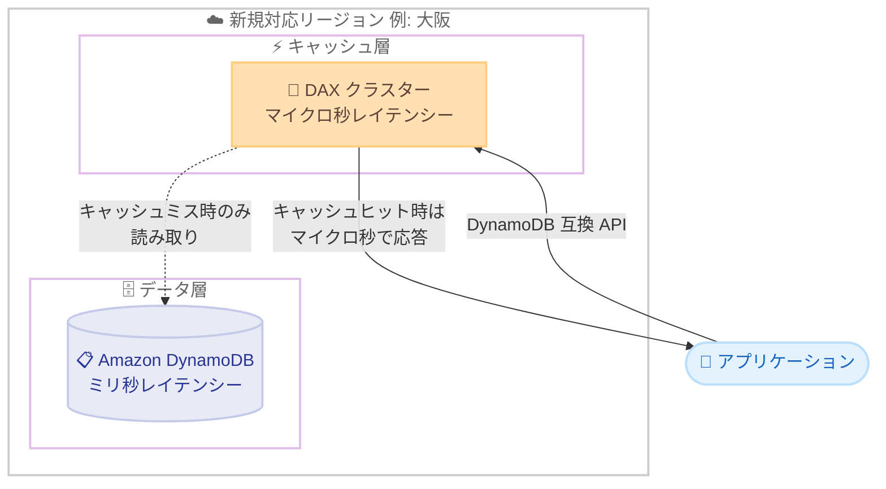

# Amazon DynamoDB Accelerator (DAX) - 追加リージョンでの提供開始

**リリース日**: 2026 年 10 月 1 日
**サービス**: Amazon DynamoDB Accelerator (DAX)
**機能**: 17 の追加リージョンでの提供開始 (大阪リージョンを含む)

📊 [このアップデートのインフォグラフィックを見る](https://takech9203.github.io/aws-news-summary/20261001-amazon-dynamodb-accelerator.html)

## 概要

Amazon DynamoDB Accelerator (DAX) が、新たに 17 のリージョンで利用可能になりました。今回の拡大には、日本の大阪リージョンをはじめ、アジアパシフィック、ヨーロッパ、中東、北米・中南米の各リージョン、および AWS GovCloud (US) が含まれます。

DAX は、Amazon DynamoDB 向けのフルマネージド型・高可用性のインメモリキャッシュです。読み取りレイテンシーをミリ秒単位からマイクロ秒単位に短縮し、最大 10 倍のパフォーマンス向上を実現します。毎秒数百万リクエスト規模のワークロードでも性能を維持でき、リアルタイム入札、ゲームのリーダーボード、小売の商品カタログなど、読み取り負荷が高くバースト性のあるワークロードに適しています。

DAX は DynamoDB と API 互換であるため、既存のアプリケーションに最小限のコード変更でキャッシュ層を追加できます。パッチ適用、フェイルオーバー、スケーリングといった運用タスクは AWS が自動で管理します。

**アップデート前の課題**

今回のアップデート以前には、以下の課題がありました。

- 大阪リージョンなど一部のリージョンでは DAX が利用できず、マイクロ秒単位の読み取りレイテンシーを実現するには自前のキャッシュ層 (ElastiCache など) の構築・運用が必要だった
- データレジデンシー要件により特定リージョンでの運用が必須の場合、DAX によるキャッシュ戦略を採用できなかった
- 日本国内でのディザスタリカバリ構成 (東京・大阪) において、両リージョンで同一のキャッシュアーキテクチャを採用できなかった

**アップデート後の改善**

今回のアップデートにより、以下が可能になりました。

- 大阪リージョンを含む 17 の追加リージョンで、DynamoDB の読み取りをマイクロ秒レイテンシーに高速化できるようになった
- 各地域のデータレジデンシー要件と低レイテンシー要件を同時に満たせるようになった
- 東京・大阪のマルチリージョン構成で、同一のキャッシュアーキテクチャを採用できるようになった

## アーキテクチャ図



アプリケーションは DynamoDB 互換 API を通じて DAX クラスターにアクセスし、キャッシュヒット時はマイクロ秒単位で応答を受け取ります。キャッシュミス時のみ DynamoDB テーブルへ読み取りが発生するため、テーブルへの読み取り負荷も軽減されます。

## サービスアップデートの詳細

### 主要機能

1. **17 リージョンへの提供拡大**
   - アジアパシフィック: 香港、ハイデラバード、ジャカルタ、マレーシア、メルボルン、ニュージーランド、大阪、ソウル、台北、タイ
   - カナダ西部 (カルガリー)、ヨーロッパ (ミラノ、チューリッヒ)、イスラエル (テルアビブ)、メキシコ (中部)
   - AWS GovCloud (US-East)、AWS GovCloud (US-West)

2. **マイクロ秒単位の読み取りレイテンシー**
   - DynamoDB のミリ秒単位のレイテンシーをマイクロ秒単位に短縮し、最大 10 倍のパフォーマンス向上を実現
   - 毎秒数百万リクエスト規模でも性能を維持

3. **フルマネージドな運用**
   - パッチ適用、フェイルオーバー、スケーリングを AWS が自動管理
   - DynamoDB 互換 API により、最小限のコード変更でキャッシュを導入可能

## 技術仕様

### DAX の特徴

| 項目 | 詳細 |
|------|------|
| キャッシュ方式 | インメモリ、ライトスルー / リードスルー |
| 読み取りレイテンシー | マイクロ秒単位 (キャッシュヒット時) |
| パフォーマンス向上 | 最大 10 倍 |
| API 互換性 | DynamoDB API と互換 (SDK クライアントの差し替えで利用可能) |
| 運用管理 | パッチ適用、フェイルオーバー、スケーリングを自動化 |
| 主な対象ワークロード | 読み取り負荷が高い、またはバースト性のあるワークロード |

## 設定方法

### 前提条件

1. 新規対応リージョン (例: 大阪) に DynamoDB テーブルが存在すること
2. DAX クラスターを配置する VPC とサブネットグループが用意されていること
3. DAX が DynamoDB にアクセスするための IAM サービスロールが設定されていること

### 手順

#### ステップ1: DAX クラスターの作成

```bash
aws dax create-cluster \
  --cluster-name my-dax-cluster \
  --node-type dax.r5.large \
  --replication-factor 3 \
  --iam-role-arn arn:aws:iam::123456789012:role/DAXServiceRole \
  --subnet-group-name my-dax-subnet-group \
  --region ap-northeast-3
```

大阪リージョン (ap-northeast-3) に、3 ノード構成の DAX クラスターを作成します。レプリケーションファクターを 3 にすることで、プライマリノード 1 つとリードレプリカ 2 つによる高可用性構成になります。

#### ステップ2: クラスターのステータス確認

```bash
aws dax describe-clusters \
  --cluster-names my-dax-cluster \
  --region ap-northeast-3 \
  --query "Clusters[0].{Status:Status,Endpoint:ClusterDiscoveryEndpoint}"
```

クラスターの作成状況とクラスターエンドポイントを確認します。ステータスが `available` になればアプリケーションから接続できます。

#### ステップ3: アプリケーションの接続先を変更

```python
import amazondax
import boto3

# DynamoDB クライアントの代わりに DAX クライアントを使用
dax = amazondax.AmazonDaxClient.resource(
    endpoint_url="daxs://my-dax-cluster.xxxxx.dax-clusters.ap-northeast-3.amazonaws.com"
)
table = dax.Table("MyTable")
response = table.get_item(Key={"pk": "item-001"})
```

DAX SDK クライアントを使用して、クラスターエンドポイントに接続します。DynamoDB API と互換のため、`get_item` などの既存コードはほぼそのまま利用できます。

## メリット

### ビジネス面

- **データレジデンシー要件への対応**: データを国内・域内に保持したままマイクロ秒レイテンシーを実現でき、各地域の規制要件とパフォーマンス要件を両立できる
- **ユーザー体験の向上**: 読み取り応答の高速化により、リアルタイム性が求められるアプリケーションの体験が向上する
- **コスト最適化の可能性**: 読み取りトラフィックを DAX にオフロードすることで、DynamoDB テーブルの読み取りキャパシティ消費を抑えられる

### 技術面

- **最小限のコード変更**: DynamoDB 互換 API のため、クライアントの差し替えのみでキャッシュ層を導入できる
- **運用負荷の軽減**: パッチ適用、フェイルオーバー、スケーリングが自動化されており、自前キャッシュの運用が不要
- **国内マルチリージョン構成**: 東京と大阪で同一のキャッシュアーキテクチャを採用でき、ディザスタリカバリ設計が簡素化される

## デメリット・制約事項

### 制限事項

- DAX は結果整合性のある読み取りの高速化に最適化されており、強い整合性のある読み取りはキャッシュを経由せず DynamoDB に直接ルーティングされる
- DAX クラスターは VPC 内に配置する必要があり、VPC 外からの直接アクセスには追加のネットワーク設計が必要
- キャッシュの TTL 設定によっては、更新直後に古いデータが返る可能性がある

### 考慮すべき点

- 書き込み中心のワークロードや、読み取りの再利用性が低いワークロードでは効果が限定的
- ノード時間に応じた DAX クラスターの料金が発生するため、読み取りパターンに基づいた費用対効果の検証が必要
- 利用予定リージョンで利用可能なノードタイプを事前に確認することを推奨

## ユースケース

### ユースケース1: 国内 EC サイトの商品カタログ

**シナリオ**: 大阪リージョンで運用する EC サイトで、セール時に商品カタログへの読み取りリクエストが急増する。

**実装例**:
```text
アプリケーション → DAX クラスター (大阪) → DynamoDB 商品カタログテーブル
人気商品の読み取りはキャッシュヒットし、マイクロ秒で応答
```

**効果**: セール時のバーストトラフィックをキャッシュで吸収し、応答速度の維持と DynamoDB の読み取りキャパシティ消費の抑制を両立できます。

### ユースケース2: ゲームのリーダーボード

**シナリオ**: ソウル・台北・大阪など各リージョンで展開するゲームで、リーダーボードの参照が高頻度に発生する。

**実装例**:
```text
ゲームクライアント → 各リージョンの DAX クラスター → DynamoDB リーダーボードテーブル
上位ランキングの読み取りをキャッシュから高速に返却
```

**効果**: プレイヤーに近いリージョンでマイクロ秒単位の応答を実現し、大量の同時参照にも安定したパフォーマンスを提供できます。

### ユースケース3: 東京・大阪のディザスタリカバリ構成

**シナリオ**: 金融系システムで、東京リージョンをプライマリ、大阪リージョンをセカンダリとするマルチリージョン構成を採用している。

**実装例**:
```text
DynamoDB グローバルテーブル (東京・大阪) + 各リージョンの DAX クラスター
フェイルオーバー時も大阪側で同一のキャッシュアーキテクチャを維持
```

**効果**: 両リージョンで同一構成を採用できるため、フェイルオーバー後もパフォーマンス特性が変わらず、DR 設計と運用手順が簡素化されます。

## 料金

DAX の料金は、クラスターを構成するノードのノードタイプと稼働時間に基づく従量課金です。リージョンごとに料金が異なるため、詳細は料金ページで確認してください。オンデマンドに加え、リザーブドノードによる割引も利用できます。

## 利用可能リージョン

今回新たに以下の 17 リージョンで利用可能になりました。

- **アジアパシフィック**: 香港、ハイデラバード、ジャカルタ、マレーシア、メルボルン、ニュージーランド、大阪、ソウル、台北、タイ
- **北米・中南米**: カナダ西部 (カルガリー)、メキシコ (中部)
- **ヨーロッパ**: ミラノ、チューリッヒ
- **中東**: イスラエル (テルアビブ)
- **AWS GovCloud (US)**: US-East、US-West

利用可能リージョンの全体像は [AWS Capabilities by Region](https://builder.aws.com/build/capabilities) で確認できます。

## 関連サービス・機能

- **Amazon DynamoDB**: DAX のキャッシュ対象となる NoSQL データベース。DAX は DynamoDB テーブルの手前に配置される
- **Amazon ElastiCache**: 汎用的なインメモリキャッシュサービス。DynamoDB 専用のキャッシュには DAX、複数データソースのキャッシュには ElastiCache が適する
- **DynamoDB グローバルテーブル**: マルチリージョンレプリケーション機能。各リージョンに DAX を配置することで、グローバルに低レイテンシーな読み取りを実現できる

## 参考リンク

- 📊 [インフォグラフィック](https://takech9203.github.io/aws-news-summary/20261001-amazon-dynamodb-accelerator.html)
- [公式発表 (What's New)](https://aws.amazon.com/about-aws/whats-new/2026/09/amazon-dynamodb-accelerator/)
- [ドキュメント (DAX Developer Guide)](https://docs.aws.amazon.com/amazondynamodb/latest/developerguide/DAX.html)
- [料金ページ](https://aws.amazon.com/dynamodb/pricing/on-demand/)
- [AWS Capabilities by Region](https://builder.aws.com/build/capabilities)

## まとめ

DAX の提供リージョンが大阪を含む 17 リージョンに拡大され、データレジデンシー要件を満たしながらマイクロ秒単位の読み取りレイテンシーを実現できる地域が大幅に広がりました。読み取り負荷の高い DynamoDB ワークロードを対象リージョンで運用している場合は、DAX の導入によるパフォーマンス向上と読み取りコスト最適化の検証をおすすめします。
