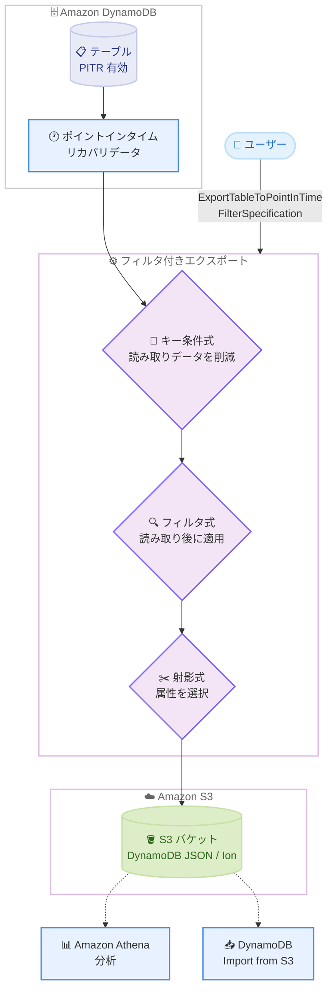

# Amazon DynamoDB - Amazon S3 へのフィルタ付きエクスポート

**リリース日**: 2026 年 10 月 1 日
**サービス**: Amazon DynamoDB
**機能**: フィルタ付きエクスポート (Filtered Export to Amazon S3)

📊 [このアップデートのインフォグラフィックを見る](https://takech9203.github.io/aws-news-summary/20261001-amazon-dynamodb-introduces-filtered-export.html)

## 概要

Amazon DynamoDB が、Amazon S3 へのテーブルデータエクスポートにおいてフィルタリング機能をサポートしました。従来のエクスポート機能はテーブル全体 (フルエクスポート) または指定期間の変更分 (増分エクスポート) をそのまま出力していましたが、今回のアップデートにより、エクスポート対象の項目 (アイテム) と属性を条件式で絞り込み、必要なデータのみを S3 に出力できるようになりました。

フィルタリングには、DynamoDB の `Query` や `Scan` 操作と同じ構文のキー条件式 (KeyConditionExpression)、フィルタ式 (FilterExpression)、射影式 (ProjectionExpression) を使用します。エクスポートはポイントインタイムリカバリ (PITR) のバックアップデータから読み取るため、テーブルのキャパシティを消費せず、本番トラフィックに影響を与えません。

この機能は、特定テナントのデータのみの復旧、機密属性を除外したパートナーへのデータ共有、コンプライアンス要件に沿った分析など、テーブルの一部データだけが必要なユースケースに適しています。マルチテナント構成の大規模テーブルを運用する SaaS 事業者や、分析・データ共有パイプラインを構築するユーザーにとって価値の高いアップデートです。

**アップデート前の課題**

- エクスポートはテーブル全体または期間内の全変更分が対象であり、特定の項目や属性だけを取り出すことができなかった
- 一部のデータのみが必要な場合でも、テーブル全体をエクスポートした後に Athena や Glue などで後処理 (フィルタリング・不要属性の除去) を行う必要があり、追加のコストと手間が発生していた
- 機密属性を含むテーブルを外部共有する際、エクスポート後に別途マスキングや属性除去の処理が必要だった

**アップデート後の改善**

- キー条件式・フィルタ式・射影式を組み合わせて、必要な項目と属性のみを直接 S3 にエクスポートできるようになった
- キー条件式でパーティションキーを指定した場合、一致するデータのみが読み取られるため、エクスポートの処理データ量と課金額を削減できるようになった
- 射影式により機密属性を除外した状態でエクスポートできるため、データ共有時の後処理が不要になった
- フルエクスポートと増分エクスポートの両方でフィルタリングを利用できる

## アーキテクチャ図



フィルタ付きエクスポートでは、PITR データからの読み取り時にキー条件式でデータ量を削減し、その後フィルタ式と射影式で項目・属性を絞り込んで S3 に出力します。出力データは Athena での分析や DynamoDB Import from S3 による別テーブルへの取り込みに利用できます。

## サービスアップデートの詳細

### 主要機能

1. **キー条件式 (KeyConditionExpression)**
   - プライマリキーに基づいて項目を選択する。`Query` 操作のキー条件式と同じ構文・ルールを使用
   - 単一のパーティションキー値を等価比較で指定し、オプションでソートキーの条件を追加できる
   - 非キー属性は参照できず、複数のパーティションキー値も指定できない
   - エクスポートを単一のパーティションキー値に限定するため、DynamoDB が読み取るデータ量 (および課金対象データ量) を削減できる

2. **フィルタ式 (FilterExpression)**
   - キー属性・非キー属性の両方に条件を適用できる。`Scan` 操作のフィルタ式と同じ構文・ルールを使用
   - 等価・不等価・`OR` などの比較に加え、`contains`、`IN`、`begins_with`、`BETWEEN`、`attribute_exists`、`size` 関数をサポート
   - データの読み取り後に適用されるため、エクスポートで処理されるデータ量は削減されない
   - キー条件式を併用する場合、キー条件式で使用したキー属性をフィルタ式で再度参照することはできない

3. **射影式 (ProjectionExpression)**
   - エクスポート出力に含める属性を指定する。他の DynamoDB 操作の射影式と同じ構文・ルールを使用
   - 機密属性 (メールアドレス、電話番号など) を除外したエクスポートが可能

4. **フル / 増分エクスポートの両対応**
   - フィルタリングはフルエクスポートと増分エクスポートの両方で動作する
   - 増分エクスポートでは、変更された各項目の最新イメージに対してフィルタを評価する。削除された項目については新イメージが存在しないため、旧イメージに対して評価する

## 技術仕様

### 式の制限

| 項目 | 制限 |
|------|------|
| 式のサイズ | 最大 4 KB |
| 属性名 | 最大 250 バイト |
| 属性値 | 最大 2 MB |
| 式に含められる演算子数 | 最大 300 個 |
| キー条件式 | 単一のパーティションキー値のみ (等価比較)、ソートキー条件はオプション |
| エクスポート形式 | DynamoDB JSON または Amazon Ion |

### API 変更履歴

| 日付 | サービス | 変更内容 |
|------|----------|----------|
| 2026/09/30 | [dynamodb](https://awsapichanges.com/archive/changes/ca596c-dynamodb.html) | 2 updated api methods - `ExportTableToPointInTime` に `FilterSpecification` パラメータが追加され、`DescribeExport` のレスポンスに `FilterSpecification` が追加 |

### FilterSpecification の構造

```json
{
  "FilterSpecification": {
    "KeyConditionExpression": "string",
    "FilterExpression": "string",
    "ProjectionExpression": "string",
    "ExpressionAttributeNames": {
      "#name": "AttributeName"
    },
    "ExpressionAttributeValues": {
      ":value": { "S": "string" }
    }
  }
}
```

## 設定方法

### 前提条件

1. エクスポート元の DynamoDB テーブルでポイントインタイムリカバリ (PITR) が有効になっていること
2. エクスポート先の S3 バケットが存在し、適切な書き込み権限があること (クロスアカウント・クロスリージョンの宛先もサポート)
3. `dynamodb:ExportTableToPointInTime` および S3 への書き込みに必要な IAM 権限があること

### 手順

#### ステップ 1: PITR の有効化を確認

```bash
aws dynamodb describe-continuous-backups \
  --table-name MyTable
```

テーブルの継続バックアップ設定を確認します。`PointInTimeRecoveryStatus` が `ENABLED` であることを確認してください。無効の場合は `update-continuous-backups` コマンドで有効化します。

#### ステップ 2: フィルタ付きエクスポートの実行

```bash
aws dynamodb export-table-to-point-in-time \
  --table-arn arn:aws:dynamodb:ap-northeast-1:123456789012:table/MyTable \
  --s3-bucket my-export-bucket \
  --s3-prefix exports/tenant-4213 \
  --export-format DYNAMODB_JSON \
  --export-type FULL_EXPORT \
  --filter-specification '{
    "KeyConditionExpression": "#tid = :tid",
    "ExpressionAttributeNames": {"#tid": "TenantId"},
    "ExpressionAttributeValues": {":tid": {"S": "tenant-4213"}}
  }'
```

`--filter-specification` パラメータでフィルタ条件を指定してエクスポートを開始します。この例では、パーティションキー `TenantId` が `tenant-4213` に一致する項目のみをエクスポートします。キー条件式により一致するパーティションのみが読み取られます。

#### ステップ 3: エクスポートステータスの確認

```bash
aws dynamodb describe-export \
  --export-arn arn:aws:dynamodb:ap-northeast-1:123456789012:table/MyTable/export/01234567890123-abcdefgh
```

エクスポートの進行状況を確認します。レスポンスの `ExportStatus` が `COMPLETED` になるとエクスポート完了です。レスポンスには指定した `FilterSpecification` も含まれるため、どのような条件でエクスポートしたかを後から確認できます。

## メリット

### ビジネス面

- **コスト削減**: キー条件式を使用した場合、一致したデータ量に対してのみ課金されるため、テーブル全体のエクスポートと比較してコストを大幅に削減できる。フィルタリングによる追加料金は発生しない
- **データ共有の安全性向上**: 射影式で機密属性を除外してエクスポートできるため、パートナーや別チームへのデータ提供時のリスクと後処理コストを低減できる
- **障害復旧の迅速化**: 障害の影響を受けた特定テナントや特定キー範囲のデータのみを抽出して復旧作業を行えるため、復旧時間を短縮できる

### 技術面

- **本番環境への無影響**: PITR データから読み取るため、テーブルの読み取りキャパシティを消費せず、本番トラフィックに影響しない
- **既存スキルの活用**: `Query` / `Scan` と同じ式構文を使用するため、新しい構文の学習が不要
- **パイプラインの簡素化**: エクスポート後の Athena / Glue などによるフィルタリング・属性除去の後処理工程を削減できる

## デメリット・制約事項

### 制限事項

- エクスポート元テーブルで PITR の有効化が必須 (エクスポート可能な期間は最大 35 日間)
- キー条件式は単一のパーティションキー値の等価比較のみをサポート。複数のパーティションキー値や不等価条件はフィルタ式で指定する必要がある
- フィルタ式は読み取り後に適用されるため、非キー属性のフィルタでは読み取りデータ量 (課金対象) は削減されない
- セカンダリインデックスに対するエクスポートはサポートされない
- 式のサイズは最大 4 KB、演算子は最大 300 個までの制限がある
- AWS GovCloud (US) リージョンでは利用不可

### 考慮すべき点

- エクスポートはパーティション間で結果整合性となり、トランザクションを考慮しない
- 射影式は含める属性のリストであり、属性値の中身は検査しない。フリーテキスト属性に個人情報が含まれる場合、属性ごと除外しない限りそのまま出力される
- エクスポートごとに 10 MB の最低課金データ量がある
- DynamoDB はエクスポート出力を S3 バケットから削除しないため、ライフサイクル管理はユーザー側で行う必要がある。エクスポートのメタデータは 90 日で期限切れになる

## ユースケース

### ユースケース 1: マルチテナントテーブルにおける特定テナントの復旧

**シナリオ**: 不具合のあるデプロイにより、4 TB のマルチテナントテーブルのうち 1 テナントの約 48,000 項目が破損した。該当テナントのデータのみを障害発生前の状態に復旧したい。

**実装例**:
```bash
aws dynamodb export-table-to-point-in-time \
  --table-arn arn:aws:dynamodb:ap-northeast-1:123456789012:table/MultiTenantTable \
  --export-type INCREMENTAL_EXPORT \
  --incremental-export-specification '{
    "ExportFromTime": "2026-09-30T00:00:00Z",
    "ExportToTime": "2026-09-30T06:00:00Z",
    "ExportViewType": "NEW_AND_OLD_IMAGES"
  }' \
  --s3-bucket my-recovery-bucket \
  --export-format DYNAMODB_JSON \
  --filter-specification '{
    "KeyConditionExpression": "#tid = :tid",
    "ExpressionAttributeNames": {"#tid": "TenantId"},
    "ExpressionAttributeValues": {":tid": {"S": "tenant-4213"}}
  }'
```

**効果**: 障害期間の増分エクスポートを `NEW_AND_OLD_IMAGES` で取得することで、影響を受けた項目と障害前のイメージの両方を抽出できる。Athena で破損レコードを特定し、条件付き `PutItem` で旧イメージを書き戻すことで、テーブル全体を復元することなく特定テナントのみを復旧できる。

### ユースケース 2: 機密属性を除外したパートナーへのデータ共有

**シナリオ**: 特定テナントの注文履歴をパートナー企業に提供したいが、顧客のメールアドレスや電話番号などの個人情報は除外する必要がある。

**実装例**:
```json
{
  "KeyConditionExpression": "#tid = :tid",
  "ProjectionExpression": "TenantId, OrderId, OrderDate, OrderAmount, OrderStatus",
  "ExpressionAttributeNames": {"#tid": "TenantId"},
  "ExpressionAttributeValues": {":tid": {"S": "tenant-100"}}
}
```

**効果**: 射影式で必要な属性のみを指定することで、`CustomerEmail` や `CustomerPhone` などの機密属性を含まないエクスポートを直接生成できる。エクスポート後のマスキング処理が不要になり、情報漏えいリスクを低減できる。

### ユースケース 3: テナントの別リージョンへの移行

**シナリオ**: 特定テナントのデータレジデンシー要件に対応するため、該当テナントのデータのみを別リージョンの新しいテーブルに移行したい。

**実装例**:
```bash
# 1. 移行先リージョンの S3 バケットへフィルタ付きフルエクスポート
aws dynamodb export-table-to-point-in-time \
  --table-arn arn:aws:dynamodb:ap-northeast-1:123456789012:table/MultiTenantTable \
  --export-type FULL_EXPORT \
  --s3-bucket my-eu-bucket \
  --export-format DYNAMODB_JSON \
  --filter-specification '{
    "KeyConditionExpression": "#tid = :tid",
    "ExpressionAttributeNames": {"#tid": "TenantId"},
    "ExpressionAttributeValues": {":tid": {"S": "tenant-eu-55"}}
  }'

# 2. 移行先リージョンで DynamoDB Import from S3 を実行して新テーブルを作成
```

**効果**: クロスリージョンの S3 バケットを宛先に指定したフィルタ付きエクスポートと DynamoDB Import from S3 を組み合わせることで、特定テナントのデータのみを別リージョンへ移行できる。中間処理用の ETL ジョブが不要になる。

## 料金

フィルタ付きエクスポートの料金は、既存のフルエクスポート / 増分エクスポートと同じ GB 単位の料金体系であり、フィルタリングに対する追加料金はありません。

- **キー条件式を使用した場合**: 一致したパーティションのデータのみが読み取られるため、一致したデータ量に基づいて課金される (エクスポートごとに 10 MB の最低課金あり)
- **フィルタ式のみの場合**: 非キー属性に対するフィルタは読み取り後に適用されるため、読み取り (課金対象) データ量は削減されない
- **その他の料金**: S3 のストレージ / リクエスト料金、Athena のスキャン料金、PITR の継続バックアップ料金が別途発生する

詳細は [DynamoDB 料金ページ](https://aws.amazon.com/dynamodb/pricing/) を参照してください。

## 利用可能リージョン

AWS GovCloud (US) リージョンを除くすべての AWS リージョンで利用可能です (東京・大阪リージョンを含む)。

## 関連サービス・機能

- **Amazon S3**: エクスポートの出力先。クロスアカウント・クロスリージョンのバケットも指定可能
- **DynamoDB ポイントインタイムリカバリ (PITR)**: エクスポートのデータソース。フィルタ付きエクスポートの利用には PITR の有効化が必須
- **Amazon Athena**: エクスポートされた DynamoDB JSON / Ion データを S3 上で直接クエリして分析可能
- **DynamoDB Import from S3**: エクスポートしたデータから新しいテーブルを作成でき、テナント移行などに活用可能

## 参考リンク

- 📊 [インフォグラフィック](https://takech9203.github.io/aws-news-summary/20261001-amazon-dynamodb-introduces-filtered-export.html)
- [公式発表 (What's New)](https://aws.amazon.com/about-aws/whats-new/2026/10/amazon-dynamodb-introduces-filtered-export/)
- [AWS Blog: Introducing filtered export from Amazon DynamoDB to Amazon S3](https://aws.amazon.com/blogs/database/introducing-filtered-export-from-amazon-dynamodb-to-amazon-s3/)
- [ドキュメント: DynamoDB data export to Amazon S3](https://docs.aws.amazon.com/amazondynamodb/latest/developerguide/S3DataExport.HowItWorks.html)
- [ドキュメント: Filtering a table export](https://docs.aws.amazon.com/amazondynamodb/latest/developerguide/S3DataExport.Filtered.html)
- [料金ページ](https://aws.amazon.com/dynamodb/pricing/)

## まとめ

DynamoDB のフィルタ付きエクスポートにより、テーブル全体をエクスポートせずに必要な項目と属性のみを S3 に出力できるようになり、特定テナントの復旧、安全なデータ共有、コンプライアンス対応の分析が大幅に簡素化されました。特にキー条件式を使用した場合はエクスポートコストの削減効果も大きいため、マルチテナントテーブルを運用しているユーザーは、既存のエクスポートパイプラインへのフィルタ適用を検討することを推奨します。利用には PITR の有効化が前提となるため、対象テーブルの PITR 設定を事前に確認してください。
