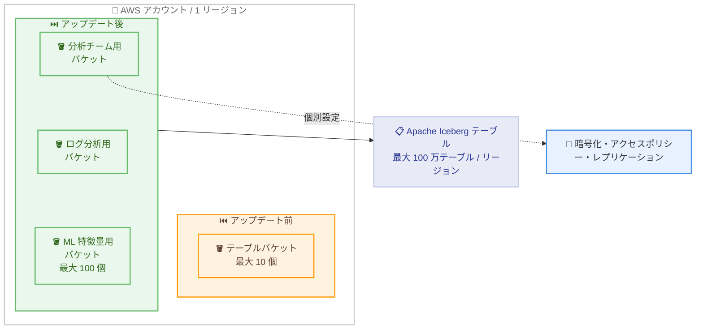

# Amazon S3 Tables - テーブルバケット数の上限を 100 に引き上げ

**リリース日**: 2026 年 10 月 1 日
**サービス**: Amazon S3 Tables
**機能**: 1 アカウントあたり 1 リージョンにつき最大 100 テーブルバケットをサポート

📊 [このアップデートのインフォグラフィックを見る](https://takech9203.github.io/aws-news-summary/20261001-amazon-s3-tables-table-bucket-increase.html)

## 概要

Amazon S3 Tables が、1 つの AWS アカウントにおいて 1 AWS リージョンあたり最大 100 個のテーブルバケットをサポートするようになりました。従来のデフォルト上限である 10 個から 10 倍に引き上げられ、1 アカウントあたり 1 リージョンにつき最大 100 万テーブルを作成できるようになります。

S3 Tables は、Apache Iceberg サポートを組み込みで提供する初のクラウドオブジェクトストアであり、データレイクの成長に合わせてクエリパフォーマンスとストレージコストを最適化する継続的なメンテナンスを自動実行します。今回の上限引き上げにより、データセット、ワークロード、チームごとに専用のテーブルバケットを割り当て、それぞれに暗号化、アクセスポリシー、レプリケーションなどの個別設定を適用する運用がより柔軟に行えるようになりました。

新しい上限はすべてのアカウントにデフォルトで自動適用され、追加料金は不要です。設定変更やクォータ引き上げ申請なしで、すぐに利用できます。

**アップデート前の課題**

このアップデート以前は、テーブルバケット数のデフォルト上限が制約となるケースがありました。

- 以前はテーブルバケットのデフォルト上限が 1 アカウントあたり 1 リージョンにつき 10 個に制限されていた
- データセットやチームごとにテーブルバケットを分離する設計では、上限にすぐ到達する可能性があった
- 多数のワークロードを単一アカウントで運用する場合、テーブルバケットの共有を強いられ、暗号化やアクセスポリシーの個別管理が難しかった

**アップデート後の改善**

今回のアップデートにより、以下が可能になりました。

- 1 アカウントあたり 1 リージョンにつき最大 100 個のテーブルバケットをデフォルトで作成可能になった
- 1 アカウントあたり 1 リージョンにつき最大 100 万テーブルの作成が可能になった
- データセット、ワークロード、チームごとに専用テーブルバケットを割り当て、暗号化、アクセスポリシー、レプリケーションを個別に設定しやすくなった
- 100 個を超えるテーブルバケットが必要な場合は、AWS Support 経由で追加の引き上げを申請できる

## アーキテクチャ図



テーブルバケットの上限が 10 個から 100 個に拡大され、ワークロードごとに専用バケットを割り当てて個別のセキュリティ・レプリケーション設定を適用できるようになりました。

## サービスアップデートの詳細

### 主要機能

1. **テーブルバケット上限の 10 倍への引き上げ**
   - デフォルト上限が 1 アカウントあたり 1 リージョンにつき 10 個から 100 個に増加
   - すべてのアカウントに自動適用され、申請や設定変更は不要
   - 追加料金なしで利用可能

2. **リージョンあたり最大 100 万テーブルのスケール**
   - 各テーブルバケットは最大 10,000 テーブルをサポートするため、100 バケットで最大 100 万テーブルを作成可能
   - 大規模データレイクやマルチテナント環境での利用に対応

3. **ワークロード単位でのバケット分離**
   - データセット、ワークロード、チームごとに専用テーブルバケットを割り当て可能
   - テーブルバケットごとに暗号化、アクセスポリシー、レプリケーションを個別設定できる

4. **さらなる上限引き上げへの対応**
   - 100 個を超えるテーブルバケットが必要な場合は、AWS Support 経由で引き上げを申請可能

## 技術仕様

### クォータの変更内容

| 項目 | アップデート前 | アップデート後 |
|------|----------------|----------------|
| テーブルバケット数 (アカウント / リージョンあたり) | 10 個 | 100 個 |
| 作成可能なテーブル数 (アカウント / リージョンあたり) | 最大 10 万テーブル | 最大 100 万テーブル |
| 追加の上限引き上げ | AWS Support 経由で申請 | AWS Support 経由で申請 |
| 適用方法 | - | すべてのアカウントにデフォルトで自動適用 |
| 追加料金 | - | なし |

### テーブルバケット数の確認

```bash
# 現在のテーブルバケット一覧を確認
aws s3tables list-table-buckets --region ap-northeast-1
```

既存のテーブルバケットの一覧を取得し、現在の利用状況を確認できます。

## 設定方法

### 前提条件

1. S3 Tables が利用可能な AWS リージョンを使用していること
2. テーブルバケットを作成する IAM 権限 (`s3tables:CreateTableBucket`) を持っていること

### 手順

#### ステップ 1: 追加のテーブルバケットを作成

```bash
aws s3tables create-table-bucket \
    --name analytics-team-bucket \
    --region ap-northeast-1
```

新しいテーブルバケットを作成します。上限引き上げは自動適用されているため、特別な設定なしで 11 個目以降のテーブルバケットを作成できます。

#### ステップ 2: 名前空間とテーブルを作成

```bash
# 名前空間の作成
aws s3tables create-namespace \
    --table-bucket-arn arn:aws:s3tables:ap-northeast-1:123456789012:bucket/analytics-team-bucket \
    --namespace sales_data

# テーブルの作成
aws s3tables create-table \
    --table-bucket-arn arn:aws:s3tables:ap-northeast-1:123456789012:bucket/analytics-team-bucket \
    --namespace sales_data \
    --name daily_transactions \
    --format ICEBERG
```

作成したテーブルバケット内に名前空間と Apache Iceberg テーブルを作成します。

#### ステップ 3: 100 個を超える場合は上限引き上げを申請

100 個を超えるテーブルバケットが必要な場合は、AWS Support でクォータ引き上げをリクエストします。

## メリット

### ビジネス面

- **組織の成長に対応**: チームやプロジェクトの増加に合わせてテーブルバケットを追加でき、アカウント分割などの回避策が不要
- **追加コストなし**: 上限引き上げは追加料金なしで、すべてのアカウントに自動適用される
- **ガバナンスの向上**: チームやデータセットごとにバケットを分離することで、責任範囲と管理境界を明確化できる

### 技術面

- **きめ細かなセキュリティ設定**: テーブルバケット単位で暗号化とアクセスポリシーを個別に設定可能
- **柔軟なレプリケーション設計**: ワークロードごとにレプリケーション要件を分けて構成できる
- **大規模スケール**: 1 リージョンあたり最大 100 万テーブルまで拡張可能で、大規模データレイクに対応

## デメリット・制約事項

### 制限事項

- デフォルト上限は 100 テーブルバケットであり、それを超える場合は AWS Support への申請が必要
- 上限は AWS アカウントかつ AWS リージョン単位で適用される

### 考慮すべき点

- テーブルバケットが増えると、アクセスポリシーや暗号化設定の管理対象も増えるため、IaC (Infrastructure as Code) などによる一元管理を検討する
- バケット分割の粒度はチーム構成やデータガバナンス方針に合わせて設計する必要がある

## ユースケース

### ユースケース 1: チームごとの専用テーブルバケット運用

**シナリオ**: 大規模組織で、分析チーム、マーケティングチーム、ML チームがそれぞれ独自のデータセットを管理しており、チームごとに異なるアクセス制御と暗号化要件がある。

**実装例**:
```bash
# チームごとに専用テーブルバケットを作成
aws s3tables create-table-bucket --name analytics-team
aws s3tables create-table-bucket --name marketing-team
aws s3tables create-table-bucket --name ml-features-team
```

**効果**: チームごとに独立したアクセスポリシーと KMS キーを適用でき、最小権限の原則に沿ったデータガバナンスを実現できる。

### ユースケース 2: マルチテナント SaaS のテナント分離

**シナリオ**: SaaS プロバイダーが顧客ごとにデータを分離して管理したいが、従来の上限 10 バケットではテナント単位の分離が困難だった。

**実装例**:
```bash
# テナントごとにテーブルバケットを作成し、専用ポリシーを適用
aws s3tables create-table-bucket --name tenant-a-tables
aws s3tables put-table-bucket-policy \
    --table-bucket-arn arn:aws:s3tables:ap-northeast-1:123456789012:bucket/tenant-a-tables \
    --resource-policy file://tenant-a-policy.json
```

**効果**: テナントごとのデータ分離とアクセス制御をバケットレベルで実装でき、セキュリティ要件やコンプライアンス要件への対応が容易になる。

### ユースケース 3: 環境別・ワークロード別のデータレイク構成

**シナリオ**: 開発、ステージング、本番の各環境と、ストリーミング取り込み、バッチ分析などのワークロード種別の組み合わせでテーブルバケットを分離したい。

**実装例**:
```bash
# 環境 x ワークロードの組み合わせでバケットを作成
aws s3tables create-table-bucket --name prod-streaming-ingest
aws s3tables create-table-bucket --name prod-batch-analytics
aws s3tables create-table-bucket --name staging-streaming-ingest
```

**効果**: 環境やワークロードごとにレプリケーションやメンテナンス設定を最適化でき、障害や設定ミスの影響範囲を限定できる。

## 料金

上限引き上げ自体に追加料金はなく、すべてのアカウントにデフォルトで適用されます。S3 Tables の利用料金は従来どおり、ストレージ使用量、リクエスト数、オブジェクトモニタリング、コンパクション処理に基づいて課金されます。

## 利用可能リージョン

S3 Tables が利用可能なすべての AWS リージョンで利用できます。

## 関連サービス・機能

- **Amazon S3 Tables**: Apache Iceberg サポートを組み込みで提供するマネージドテーブルストレージ。自動コンパクションなどのメンテナンスでクエリパフォーマンスとストレージコストを最適化する
- **AWS Glue Data Catalog**: S3 Tables と統合し、Amazon Athena、Amazon Redshift、Amazon EMR などの分析エンジンからテーブルへアクセス可能にする
- **AWS KMS**: テーブルバケットごとに個別の暗号化キーを設定し、データ保護要件に対応する
- **AWS Lake Formation**: テーブルレベルのきめ細かなアクセス制御を実現する

## 参考リンク

- 📊 [インフォグラフィック](https://takech9203.github.io/aws-news-summary/20261001-amazon-s3-tables-table-bucket-increase.html)
- [公式発表 (What's New)](https://aws.amazon.com/about-aws/whats-new/2026/10/amazon-s3-tables-table-bucket-increase)
- [Amazon S3 Tables 製品ページ](https://aws.amazon.com/s3/features/tables/)
- [S3 Tables ユーザーガイド](https://docs.aws.amazon.com/AmazonS3/latest/userguide/s3-tables.html)
- [S3 Tables のリージョンとクォータ](https://docs.aws.amazon.com/AmazonS3/latest/userguide/s3-tables-regions-quotas.html)

## まとめ

Amazon S3 Tables のテーブルバケット上限が 10 個から 100 個へと 10 倍に引き上げられ、1 リージョンあたり最大 100 万テーブルのスケールが追加料金なしで利用可能になりました。チーム、データセット、ワークロードごとに専用バケットを割り当てる設計が現実的になったため、データガバナンスやセキュリティ要件に応じたバケット分離戦略の見直しを推奨します。
