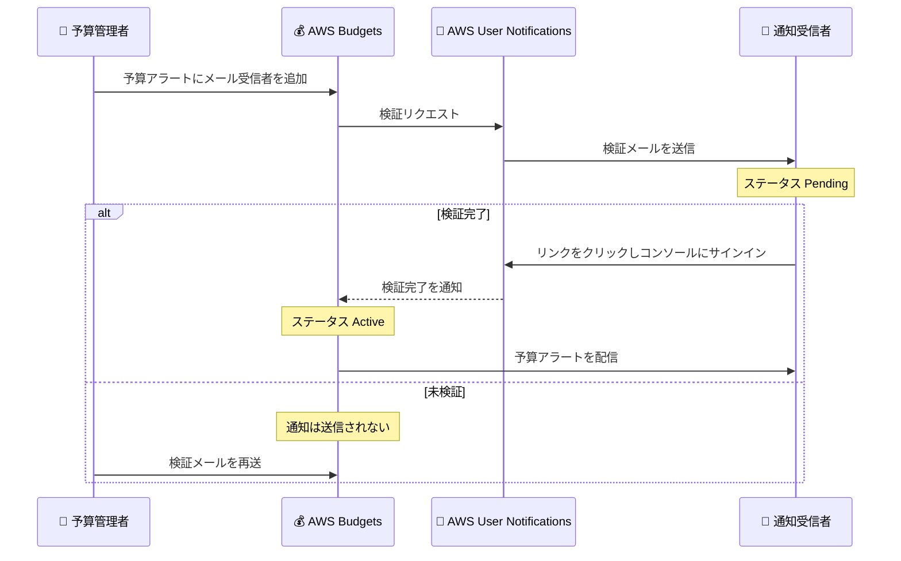

# AWS Budgets - 通知サブスクライバーのメール検証サポート

**リリース日**: 2026 年 10 月 1 日
**サービス**: AWS Budgets
**機能**: 通知サブスクライバーのメールアドレス検証 (Email Verification for Notification Subscribers)

📊 [このアップデートのインフォグラフィックを見る](https://takech9203.github.io/aws-news-summary/20261001-aws-budgets.html)

## 概要

AWS Budgets は、予算アラートの通知先として新しく追加されたメールアドレスに対して、通知送信前にメールアドレスの検証 (verification) を行う機能をサポートしました。新しいメールアドレスを予算通知の受信者として追加すると、AWS からそのアドレスに検証メールが送信され、受信者がリンクをクリックして確認を完了した後にのみ予算アラートが届くようになります。

この検証は 2026 年 9 月 30 日以降に追加されたメールアドレスに適用されます。既存の予算に登録済みのサブスクライバーには影響がなく、追加の対応は不要です。メール配信は AWS User Notifications を通じて行われ、受信者はいつでもオプトアウトできます。

本アップデートにより、誤入力されたアドレスや本人の同意がないアドレスへの通知送信を防止でき、コスト管理者と通知受信者の双方にとって信頼性の高いアラート運用が可能になります。

**アップデート前の課題**

- 以前は予算通知に追加されたメールアドレスに対して、本人確認なしでアラートが送信されていた
- メールアドレスの誤入力に気付きにくく、意図した受信者にアラートが届かないリスクがあった
- 受信者の同意なしに通知が送信されるため、意図しないメール受信が発生する可能性があった

**アップデート後の改善**

- 新規追加されたメールアドレスは検証完了後にのみ通知を受信するため、誤送信を防止できる
- AWS Budgets コンソールで各サブスクライバーの検証ステータス (Active / Pending / Expiring / Inactive) を確認できるようになった
- 検証待ちのアドレスに対して検証メールの再送 (Resend verification) が可能になった
- 受信者はいつでもオプトアウトでき、同意に基づいた通知運用が実現された

## アーキテクチャ図



メールアドレス追加から検証完了、アラート配信開始までの流れを示しています。検証が完了するまで予算アラートは送信されません。

## サービスアップデートの詳細

### 主要機能

1. **新規メールサブスクライバーの検証**
   - 予算通知に新しいメールアドレスを追加すると、AWS が検証メールを送信する
   - 検証メールは `@aws.com` ドメインの送信者アドレスから送信される
   - 受信者がメール内のリンクをクリックすると AWS Management Console が開き、アドレスを追加した AWS アカウントにサインインして検証を完了する
   - 検証が完了するまで、そのアドレスには予算アラートが送信されない

2. **検証ステータスの可視化**
   - AWS Budgets コンソールの予算詳細ページで、各受信者の検証ステータスを確認できる
   - Pending ステータスの行には検証メールを再送する [Resend verification] ボタンが表示される
   - Expiring または Inactive ステータスの行には、アドレスを登録して検証メールを送信する [Send Notification] ボタンが表示される

3. **アカウント単位の検証と再利用**
   - 検証はメールアドレスと AWS アカウントの組み合わせごとに行われる
   - 同一アカウント内の複数の予算で同じアドレスを使用する場合、1 回の検証ですべての予算に適用される
   - AWS User Notifications を利用する他の AWS サービスで既に検証済みのアドレスは、新たな検証メールなしで即座に Active になる

4. **既存サブスクライバーへの影響なし**
   - 2026 年 9 月 30 日より前に追加された既存の受信者は、引き続き通知を受信でき、対応は不要
   - 受信者はいつでも通知をオプトアウトできる

## 技術仕様

### 検証ステータス

| ステータス | 説明 |
|------|------|
| Active | 検証完了済み、または他の AWS サービス経由で検証済み。通知を受信する |
| Pending | 検証メール送信済みで、受信者の確認待ち |
| Expiring | 検証導入前に追加されたアドレス。猶予期間中は通知を受信し続ける。[Send Notification] で Pending に移行可能 |
| Inactive | 通知受信の登録が未完了。[Send Notification] で登録と検証メール送信が可能 |

### 検証の仕様

| 項目 | 詳細 |
|------|------|
| 検証メール送信元 | `@aws.com` ドメインのアドレス |
| 検証リンクの有効期限 | 送信から 12 時間 |
| 再送 | 可能 (配信品質保護のため短いクールダウンあり) |
| 検証の単位 | メールアドレス × AWS アカウントごと |
| 受信者数の上限 | 予算通知あたり最大 10 件のメール受信者 |
| 配信基盤 | AWS User Notifications |
| 適用対象 | 2026 年 9 月 30 日以降に追加されたメールアドレス |

## 設定方法

### 前提条件

1. AWS Billing and Cost Management コンソールへのアクセス権限があること
2. 予算の作成または編集権限があること
3. 通知受信者が、アドレスを追加した AWS アカウントにサインインできること (サインインできない場合はメール配布リストの利用を検討)

### 手順

#### ステップ 1: 予算アラートにメール受信者を追加

1. AWS Billing and Cost Management コンソール (https://console.aws.amazon.com/cost-management/) を開く
2. ナビゲーションペインで [Budgets] を選択する
3. 新しい予算を作成するか既存の予算を開き、アラートを追加または編集する
4. [Email recipients] フィールドにメールアドレスを入力して保存する

保存すると、アカウント内で未検証のアドレスそれぞれに検証メールが送信されます。

#### ステップ 2: 受信者による検証の完了

1. 受信者が検証メールを開き、メール内のリンクをクリックする
2. AWS Management Console が開くので、アドレスを追加した AWS アカウントにサインインして検証を完了する

検証が完了すると、次回のスケジュールされた評価から予算通知の配信が開始されます。

#### ステップ 3: 検証ステータスの確認

1. 予算詳細ページを更新し、受信者の検証ステータスを確認する
2. Pending のままの場合は、受信者に迷惑メールフォルダの確認を依頼するか、[Resend verification] で検証メールを再送する

検証メールが届かない場合は、組織のメール許可リストに `@aws.com` ドメインを追加することも検討してください。

## メリット

### ビジネス面

- **通知の信頼性向上**: 検証済みアドレスのみに通知が届くため、誤入力による重要なコストアラートの未達リスクを低減できる
- **コンプライアンス強化**: 受信者の明示的な同意に基づく通知運用となり、意図しないメール送信を防止できる
- **運用の可視化**: コンソール上で検証ステータスを一元的に確認でき、通知体制の健全性を監査しやすくなる

### 技術面

- **AWS User Notifications との統合**: 他の AWS サービスと共通の検証パターンを採用しており、検証済みアドレスはサービス間で再利用される
- **既存環境への影響なし**: 既存のサブスクライバーは影響を受けず、移行作業が不要
- **再送機能**: Pending 状態のアドレスに対してコンソールから簡単に検証メールを再送できる

## デメリット・制約事項

### 制限事項

- 検証リンクの有効期限は送信から 12 時間で、期限切れの場合は再送が必要
- 検証の完了には、アドレスを追加した AWS アカウントへのサインインが必要
- 検証はアカウントごとに行われるため、複数アカウントで同じアドレスを使用する場合は各アカウントで検証が必要
- 検証メールの再送には短いクールダウン期間がある
- 予算通知あたりのメール受信者は最大 10 件

### 考慮すべき点

- AWS アカウントにサインインできない受信者 (経理部門の担当者など) がいる場合は、メール配布リストを受信者として登録し、リストのメンバー管理を AWS の外部で行う方法を検討する
- Organizations 環境で中央の FinOps アドレスを複数の連結アカウントに登録している場合、アカウントごとに検証が必要になる
- 検証メールが迷惑メールフォルダに振り分けられる可能性があるため、`@aws.com` ドメインの許可リスト登録を事前に案内しておく
- Amazon SNS トピック経由の予算通知は、本機能とは別に SNS のサブスクリプション確認フローに従う

## ユースケース

### ユースケース 1: 新規予算作成時の確実なアラート体制の構築

**シナリオ**: 新しいプロジェクトの予算を作成し、プロジェクトマネージャーと財務担当者にアラートを送りたい。アドレスの誤入力による通知漏れを防ぎたい。

**実装例**:
```
1. 予算を作成し、アラートに 2 名のメールアドレスを追加
2. 各受信者に検証メールが届いたことを確認
3. 予算詳細ページで両者のステータスが Active になったことを確認
```

**効果**: 検証ステータスにより、アラート開始前に全受信者への到達性を確認でき、コスト超過の見逃しを防止できる。

### ユースケース 2: マルチアカウント環境での FinOps 通知の整備

**シナリオ**: AWS Organizations 配下の複数の連結アカウントで、中央の FinOps チームのアドレスに予算アラートを集約したい。

**実装例**:
```
1. FinOps チームのメール配布リスト finops@example.com を各アカウントの予算通知に追加
2. 各アカウントで 1 回ずつ検証を完了 (検証はアカウント単位)
3. 配布リストのメンバー管理は社内のメールシステム側で実施
```

**効果**: 配布リストを使うことでメンバーの入れ替え時に AWS 側の再検証が不要になり、アカウント横断のコスト監視体制を効率的に維持できる。

### ユースケース 3: 既存予算の検証ステータス棚卸し

**シナリオ**: 検証機能の導入を機に、既存予算の通知先アドレスの有効性を点検したい。

**実装例**:
```
1. 各予算の詳細ページで受信者の検証ステータスを確認
2. Expiring ステータスのアドレスは [Send Notification] で検証フローに移行
3. 不要になったアドレスや誤ったアドレスを削除
```

**効果**: 猶予期間が終了する前に既存アドレスの検証を完了させ、通知の途絶を防ぎながら通知先リストを最新化できる。

## 料金

AWS Budgets のメール検証機能自体に追加料金はありません。AWS Budgets は、最初の 2 つのアクション有効予算まで無料で利用でき、以降はアクション有効予算ごとに料金が発生します (メール通知のみの予算は無料)。詳細は料金ページを参照してください。

## 利用可能リージョン

AWS GovCloud (US) リージョンと中国リージョンを除く、すべての AWS リージョンで利用可能です。

## 関連サービス・機能

- **AWS User Notifications**: 本機能のメール配信と検証を担う基盤サービス。他の AWS サービスで検証済みのアドレスは AWS Budgets でも再利用される
- **Amazon SNS**: 予算通知を SNS トピック経由で配信する場合は、SNS 独自のサブスクリプション確認フローが適用される
- **AWS Cost Anomaly Detection**: 予算ベースの監視と組み合わせて、異常なコスト増加を早期に検知できる

## 参考リンク

- 📊 [インフォグラフィック](https://takech9203.github.io/aws-news-summary/20261001-aws-budgets.html)
- [公式発表 (What's New)](https://aws.amazon.com/about-aws/whats-new/2026/10/aws-budgets/)
- [ドキュメント: Adding email recipients to a budget notification](https://docs.aws.amazon.com/cost-management/latest/userguide/budgets-email-recipients.html)
- [AWS Budgets 製品ページ](https://aws.amazon.com/aws-cost-management/aws-budgets/)
- [料金ページ](https://aws.amazon.com/aws-cost-management/pricing/)

## まとめ

AWS Budgets の通知メールに検証ステップが導入され、新規追加されたアドレスは受信者本人の確認後にのみアラートを受け取るようになりました。既存のサブスクライバーへの影響はありませんが、今後追加するアドレスは検証完了まで通知が届かないため、追加後は必ずコンソールで検証ステータスが Active になっていることを確認する運用を推奨します。
