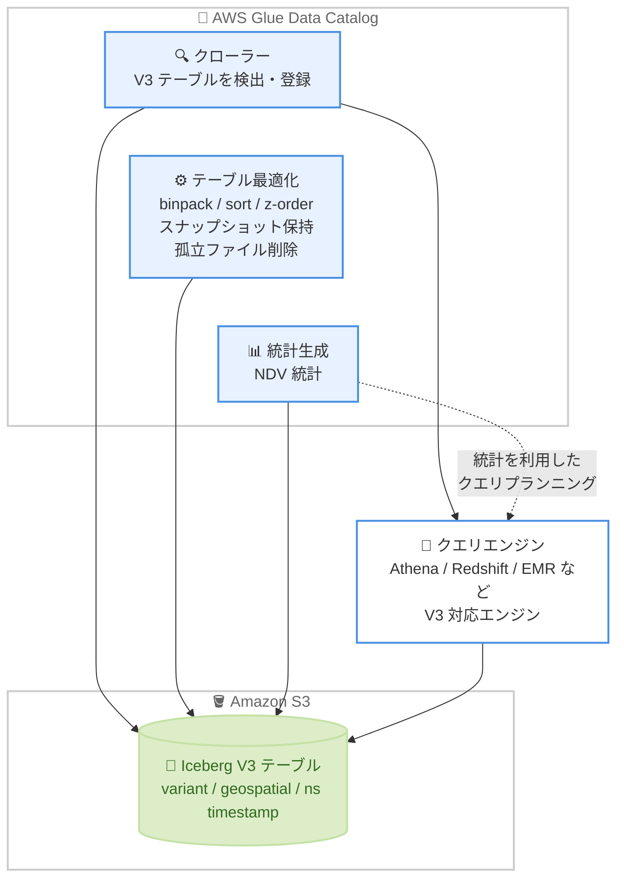

# AWS Glue - Data Catalog による Apache Iceberg V3 のテーブル最適化・統計・クローラーサポート

**リリース日**: 2026 年 10 月 1 日
**サービス**: AWS Glue (Glue Data Catalog)
**機能**: Apache Iceberg V3 テーブルに対するテーブル最適化、統計生成、クローラーのサポート

📊 [このアップデートのインフォグラフィックを見る](https://takech9203.github.io/aws-news-summary/20261001-aws-glue-iceberg-v3-optimization.html)

## 概要

AWS Glue Data Catalog が、Apache Iceberg Version 3 (V3) テーブルに対するテーブル最適化 (table optimization)、統計 (statistics)、クローラー (crawlers) の 3 つのマネージド機能をサポートしました。これにより、Iceberg V3 で導入された variant 型、地理空間 (geospatial) 型、ナノ秒精度タイムスタンプなどの新しいデータ型を含むテーブルでも、Data Catalog のマネージド運用機能をフル活用できるようになります。

テーブル最適化では、binpack、sort、z-order の各戦略によるコンパクションでクエリパフォーマンスを向上させ、期限切れスナップショットや孤立ファイル (orphan files) の削除によりストレージコストを削減できます。統計機能では、V3 テーブルの NDV (個別値数) 統計を生成し、分析エンジンによる効率的なクエリプランニングを支援します。クローラーは、Amazon S3 上の V3 テーブルを自動検出して Data Catalog に登録し、V3 対応の任意のクエリエンジンから利用可能にします。

データレイクを Iceberg V3 へ移行したい、または V3 の新機能 (削除ベクトルや新データ型など) を採用したいデータエンジニアや分析基盤の運用チームにとって、マネージドな運用機能の対応が揃うことで V3 移行の障壁が大きく下がるアップデートです。

**アップデート前の課題**

- Glue Data Catalog のテーブル最適化 (コンパクション、スナップショット保持、孤立ファイル削除) は Iceberg V3 テーブルに対応しておらず、V3 テーブルの最適化は Spark ジョブなどで自前実装する必要があった
- V3 テーブルの NDV 統計を Data Catalog のマネージド機能で生成できず、クエリエンジンのコストベース最適化の恩恵を十分に受けられなかった
- Glue クローラーが S3 上の V3 テーブルを検出・登録できず、V3 テーブルのカタログ登録を手動で行う必要があった

**アップデート後の改善**

- V3 テーブルに対して binpack、sort、z-order 戦略のコンパクションをマネージドで実行でき、クエリパフォーマンスが向上する
- 期限切れスナップショットと孤立ファイルの自動削除により、V3 テーブルのストレージコストを削減できる
- V3 テーブルの NDV 統計を生成でき、分析エンジンが効率的なクエリプランを立てられる
- クローラーが S3 上の V3 テーブルを自動検出して Data Catalog に登録し、V3 対応クエリエンジンからすぐに利用できる

## アーキテクチャ図



Glue Data Catalog の 3 つのマネージド機能 (クローラー、テーブル最適化、統計生成) が Iceberg V3 テーブルに対応し、V3 対応クエリエンジンからの効率的なアクセスを支える構成を示しています。

## サービスアップデートの詳細

### 主要機能

1. **Iceberg V3 テーブルのテーブル最適化**
   - binpack (デフォルト)、sort、z-order の 3 つのコンパクション戦略で V3 テーブルの小さなデータファイルを統合し、クエリエンジンがスキャンするデータ量を削減
   - スナップショット保持 (snapshot retention) 設定により、期限切れスナップショットと関連ファイルを自動削除
   - 孤立ファイル削除 (orphan file deletion) により、テーブルメタデータから参照されなくなったファイルを定期的に削除し、ストレージを解放
   - variant 型、地理空間型、ナノ秒精度タイムスタンプを含む V3 のデータ型をサポート

2. **Iceberg V3 テーブルの統計生成**
   - V3 テーブルのカラムに対する NDV (number of distinct values) 統計を生成
   - 分析エンジンがコストベース最適化で効率的なクエリプランを立てるために統計を活用し、クエリパフォーマンスを向上

3. **Iceberg V3 テーブルのクローラーサポート**
   - Amazon S3 に保存された Iceberg V3 テーブルをクローラーが検出し、Glue Data Catalog に登録
   - 登録されたテーブルは、Iceberg V3 をサポートする任意のクエリエンジンから利用可能

## 技術仕様

### Apache Iceberg V3 の主な特徴

| 項目 | 詳細 |
|------|------|
| 新データ型 | variant 型 (半構造化データ)、地理空間型、ナノ秒精度タイムスタンプ |
| コンパクション戦略 | binpack (デフォルト)、sort、z-order |
| ストレージ管理 | スナップショット保持、孤立ファイル削除 |
| 統計 | NDV (個別値数) 統計の生成 |
| カタログ登録 | クローラーによる S3 上の V3 テーブルの自動検出・登録 |

### 最適化の設定レベル

| 設定レベル | 設定方法 |
|------------|----------|
| カタログレベル | Lake Formation コンソール、Glue `UpdateCatalog` API |
| テーブルレベル | Glue コンソール、AWS CLI、Glue API |

## 設定方法

### 前提条件

1. Amazon S3 に Apache Iceberg V3 形式のテーブルが保存されていること
2. テーブル最適化の実行に必要な IAM ロール (S3 および Glue Data Catalog へのアクセス権限) が用意されていること
3. 利用するリージョンで Glue Data Catalog のテーブル最適化・統計・クローラーが提供されていること

### 手順

#### ステップ 1: クローラーで V3 テーブルを Data Catalog に登録

```bash
aws glue create-crawler \
  --name iceberg-v3-crawler \
  --role arn:aws:iam::123456789012:role/GlueCrawlerRole \
  --database-name analytics_db \
  --targets '{"IcebergTargets": [{"Paths": ["s3://my-datalake/iceberg-v3-tables/"]}]}'

aws glue start-crawler --name iceberg-v3-crawler
```

S3 上の Iceberg V3 テーブルを対象とするクローラーを作成し、実行しています。クローラーが V3 テーブルを検出し、Glue Data Catalog の `analytics_db` データベースに登録します。

#### ステップ 2: テーブル最適化 (コンパクション) を有効化

```bash
aws glue create-table-optimizer \
  --catalog-id 123456789012 \
  --database-name analytics_db \
  --table-name sales_v3 \
  --type compaction \
  --table-optimizer-configuration '{
    "roleArn": "arn:aws:iam::123456789012:role/GlueOptimizerRole",
    "enabled": true
  }'
```

V3 テーブル `sales_v3` に対してコンパクション最適化を有効化しています。小さなデータファイルが自動的に統合され、クエリパフォーマンスが向上します。スナップショット保持 (`retention`) や孤立ファイル削除 (`orphan_file_deletion`) も同様に `--type` を変更して設定できます。

#### ステップ 3: カラム統計の生成を設定

```bash
aws glue start-column-statistics-task-run \
  --database-name analytics_db \
  --table-name sales_v3 \
  --role arn:aws:iam::123456789012:role/GlueStatsRole
```

V3 テーブルのカラム統計 (NDV 統計を含む) の生成タスクを開始しています。生成された統計は Athena や Redshift などの分析エンジンがクエリプランニングに利用します。

## メリット

### ビジネス面

- **ストレージコストの削減**: 期限切れスナップショットと孤立ファイルの自動削除により、V3 テーブルの不要なストレージ使用を抑制できる
- **クエリコストの削減**: コンパクションによりクエリエンジンのスキャンデータ量が減り、スキャン量ベースの課金 (Athena など) のコストを削減できる
- **V3 移行の加速**: マネージド運用機能が V3 に対応したことで、variant 型や地理空間型などの新機能を安心して採用でき、データ基盤のモダナイゼーションを進めやすい

### 技術面

- **運用の自動化**: V3 テーブルのコンパクションやファイルクリーンアップを自前の Spark ジョブで実装・運用する必要がなくなる
- **クエリパフォーマンスの向上**: binpack、sort、z-order 戦略と NDV 統計の組み合わせにより、クエリエンジンの実行効率が向上する
- **カタログ登録の自動化**: クローラーが S3 上の V3 テーブルを自動検出するため、手動でのテーブル定義が不要になる

## デメリット・制約事項

### 制限事項

- 対象は Glue Data Catalog のテーブル最適化・統計・クローラーが提供されているリージョンに限られる
- クエリ側で V3 の新データ型を活用するには、クエリエンジン自体が Iceberg V3 に対応している必要がある

### 考慮すべき点

- テーブル最適化や統計生成の実行には Glue の料金 (DPU 時間ベース) が発生するため、テーブル数や実行頻度に応じたコストを見積もる必要がある
- スナップショット保持の設定によっては過去バージョンへのタイムトラベルができなくなるため、保持期間はデータ利用要件に合わせて設計する必要がある

## ユースケース

### ユースケース 1: 半構造化データを含むデータレイクの V3 移行

**シナリオ**: JSON 形式のイベントデータを variant 型で保持する Iceberg V3 テーブルへ移行し、ストリーミング書き込みで発生する小さなファイルを自動的に最適化したい。

**実装例**:
```
1. ストリーミングジョブで S3 上の Iceberg V3 テーブル (variant 型カラムを含む) に書き込み
2. 対象テーブルにコンパクション最適化 (binpack) を有効化
3. スナップショット保持と孤立ファイル削除を有効化してストレージを自動クリーンアップ
```

**効果**: 小さなファイルの蓄積によるクエリ性能劣化を防ぎつつ、variant 型による柔軟なスキーマ運用とストレージコスト削減を両立できる。

### ユースケース 2: 地理空間分析基盤のクエリ高速化

**シナリオ**: 地理空間型カラムを持つ V3 テーブルに対し、位置情報と時間帯の複合条件で頻繁にクエリを実行する分析基盤を運用している。

**実装例**:
```
1. 対象テーブルに z-order 戦略のコンパクションを設定 (位置情報カラムと時刻カラムを指定)
2. NDV 統計の生成タスクを定期実行
3. Athena などの V3 対応エンジンからクエリを実行
```

**効果**: 複数カラムでの絞り込みクエリのスキャン量が削減され、クエリの応答時間とコストが改善する。

### ユースケース 3: 既存 S3 上の V3 テーブルのカタログ統合

**シナリオ**: 外部ツールや別チームが作成した Iceberg V3 テーブルが S3 上に散在しており、全社の分析基盤から統一的にアクセスできるようにしたい。

**実装例**:
```
1. V3 テーブルが保存されている S3 パスを対象にクローラーを作成
2. スケジュール実行で新規テーブルや変更を定期的に検出・登録
3. Data Catalog 経由で各種クエリエンジンからアクセス
```

**効果**: 手動のテーブル登録作業が不要になり、V3 テーブルを含むデータレイク全体を単一のカタログで統合管理できる。

## 料金

Glue Data Catalog のテーブル最適化、統計生成、クローラーは、それぞれ実行時間 (DPU 時間) に基づく既存の AWS Glue 料金体系で課金されます。Iceberg V3 テーブルを対象とする場合の追加料金はありません。詳細は AWS Glue の料金ページを参照してください。

## 利用可能リージョン

Glue Data Catalog のテーブル最適化、統計、クローラーが利用可能なすべての AWS リージョンで、Iceberg V3 テーブル向けに提供されます。

## 関連サービス・機能

- **Amazon Athena**: Data Catalog に登録された Iceberg テーブルへのサーバーレスクエリ。NDV 統計をコストベース最適化に活用
- **Amazon Redshift**: データレイク上の Iceberg テーブルへのクエリで Data Catalog と統計を利用
- **Amazon EMR / AWS Glue ETL**: Iceberg テーブルへの書き込み・変換処理を実行し、最適化機能と組み合わせて運用
- **AWS Lake Formation**: カタログレベルの最適化設定ときめ細かなアクセス制御を提供

## 参考リンク

- 📊 [インフォグラフィック](https://takech9203.github.io/aws-news-summary/20261001-aws-glue-iceberg-v3-optimization.html)
- [公式発表 (What's New)](https://aws.amazon.com/about-aws/whats-new/2026/10/aws-glue-iceberg-v3-optimization/)
- [ドキュメント: Optimizing Iceberg tables](https://docs.aws.amazon.com/glue/latest/dg/table-optimizers.html)
- [ドキュメント: Column statistics for Iceberg tables](https://docs.aws.amazon.com/glue/latest/dg/iceberg-column-statistics.html)
- [ドキュメント: Crawler data stores](https://docs.aws.amazon.com/glue/latest/dg/crawler-data-stores.html)
- [料金ページ](https://aws.amazon.com/glue/pricing/)

## まとめ

Glue Data Catalog のマネージド運用機能 (テーブル最適化、統計、クローラー) が Apache Iceberg V3 に対応し、variant 型や地理空間型などの新データ型を採用しながら運用を自動化できるようになりました。Iceberg V3 への移行を検討しているデータ基盤チームは、まず既存の V3 テーブルをクローラーで登録し、コンパクションと統計生成を有効化してクエリパフォーマンスとストレージコストの改善効果を確認することを推奨します。
