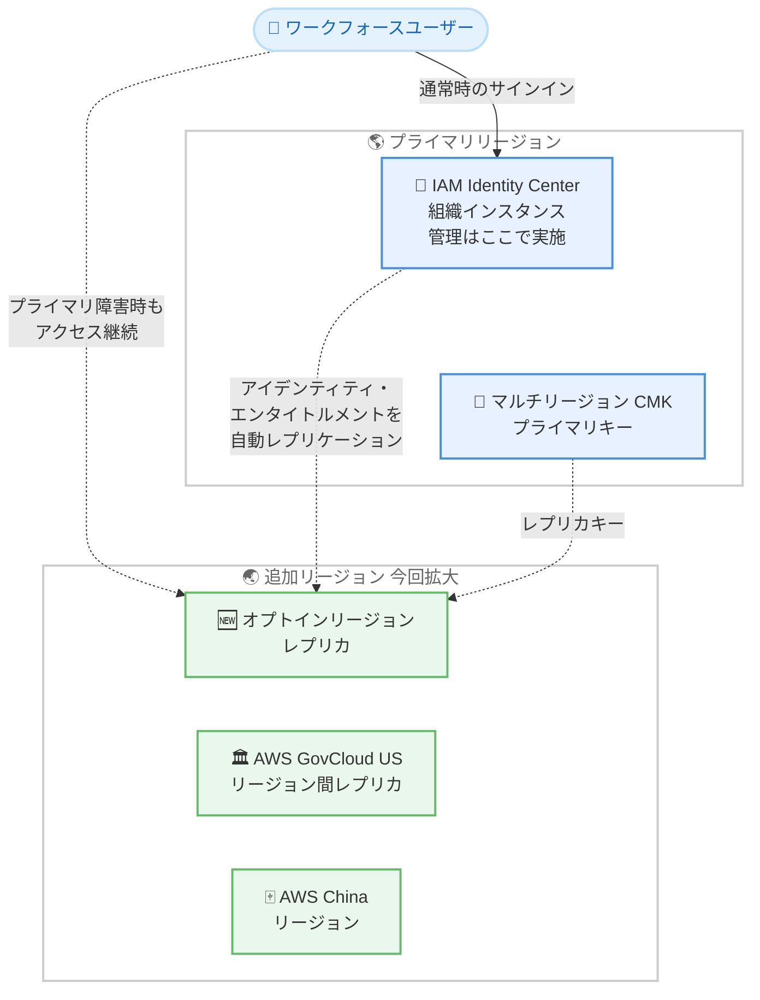

# AWS IAM Identity Center - マルチリージョンサポートの対象リージョン拡大

**リリース日**: 2026年10月01日
**サービス**: AWS IAM Identity Center
**機能**: オプトインリージョン、AWS GovCloud (US)、AWS China リージョンへのマルチリージョンサポート拡大

📊 [このアップデートのインフォグラフィックを見る](https://takech9203.github.io/aws-news-summary/20261001-aws-iam-identity-center-extends-multi-region-support-to-more-aws-regions.html)

## 概要

AWS IAM Identity Center のマルチリージョンサポートが、より多くの AWS リージョンに拡大されました。今回のアップデートにより、IAM Identity Center をオプトインリージョンへレプリケートできるようになったほか、AWS GovCloud (US) リージョン間および AWS China リージョンでもマルチリージョンサポートを利用できるようになりました。従来、マルチリージョンサポートは enabled-by-default の商用リージョンに限定されていました。

マルチリージョンサポートを有効化すると、アイデンティティ、エンタイトルメント (アクセス権限) などの情報がプライマリリージョンから追加リージョンへ自動的にレプリケートされます。プライマリリージョンで障害が発生した場合でも、追加リージョンに既にプロビジョニング済みのエンタイトルメントを通じて、ユーザーは AWS アカウントへのアクセスを継続できます。また、IAM Identity Center の管理はプライマリリージョンで維持しながら、対応する AWS アプリケーションを追加リージョンに標準のワークフローでデプロイできます。

公共部門のお客様や中国でビジネスを展開するお客様、データレジデンシー要件からオプトインリージョンを利用するお客様にとって、ワークフォースアクセスのレジリエンスを強化できる重要なアップデートです。

**アップデート前の課題**

- マルチリージョンサポートは enabled-by-default の商用リージョンに限定されており、オプトインリージョンへはレプリケートできなかった
- AWS GovCloud (US) を利用する公共部門のお客様は、リージョン障害時のワークフォースアクセス継続の仕組みとしてマルチリージョンサポートを利用できなかった
- AWS China リージョンでも同様に、マルチリージョンサポートによるレジリエンス強化の選択肢がなかった

**アップデート後の改善**

- オプトインリージョンを追加リージョンとして選択し、IAM Identity Center をレプリケートできるようになった
- AWS GovCloud (US) のリージョン間でマルチリージョンサポートを利用し、障害時もユーザーアクセスを維持できるようになった
- AWS China リージョンでもマルチリージョンサポートが利用可能になり、より多くのお客様がレジリエンスとリージョン拡張の恩恵を受けられるようになった

## アーキテクチャ図



この図は、プライマリリージョンの IAM Identity Center から、今回新たに対象となったオプトインリージョンなどへアイデンティティとエンタイトルメントが自動レプリケートされ、障害時もユーザーアクセスが継続される構成を示しています。AWS GovCloud (US) ではパーティション内のリージョン間でレプリケーションを利用できます。

## サービスアップデートの詳細

### 主要機能

1. **オプトインリージョンへのレプリケーション対応**
   - 従来は enabled-by-default の商用リージョンに限定されていたマルチリージョンサポートが、オプトインリージョンにも拡大
   - データレジデンシーやユーザー近接性の要件でオプトインリージョンを利用する組織も、レジリエンス強化が可能に
   - 対応リージョンの全一覧は AWS Capabilities by Region で確認可能

2. **AWS GovCloud (US) および AWS China リージョンでの利用**
   - AWS GovCloud (US) のリージョン間でマルチリージョンサポートを利用可能
   - AWS China リージョンでも利用可能になり、各パーティションのお客様がレジリエンスを強化できる

3. **アイデンティティとエンタイトルメントの自動レプリケーション**
   - 有効化すると、アイデンティティ、エンタイトルメントなどの情報がプライマリリージョンから追加リージョンへ自動的にレプリケートされる
   - プライマリリージョンの障害時も、追加リージョンのプロビジョニング済みエンタイトルメントを通じて AWS アカウントへのアクセスを維持
   - アプリケーション管理者は、標準のデプロイワークフローで対応 AWS アプリケーションを追加リージョンにデプロイ可能

## 技術仕様

### 前提条件と要件

| 項目 | 詳細 |
|------|------|
| インスタンスタイプ | 組織インスタンス |
| ID ソース | 外部アイデンティティプロバイダーまたは Identity Center directory |
| KMS キー | マルチリージョンカスタマー管理キー (CMK) が必須 |
| 新規インスタンス | ワンクリックでマルチリージョンサポートを有効化可能 (CMK も自動作成) |
| 既存インスタンス | AWS KMS でマルチリージョン CMK を作成し、Identity Center で設定 |
| 対象リージョン | enabled-by-default 商用リージョンに加え、オプトインリージョン、AWS GovCloud (US)、AWS China リージョン |
| 管理操作 | プライマリリージョンで実施 |

### マルチリージョン CMK の要件

マルチリージョンサポートの有効化には、マルチリージョンカスタマー管理キー (CMK) が必要です。新規に組織インスタンスを作成する場合はワンクリックで有効化でき、その際に CMK も作成されます。既存インスタンスの場合は、先に AWS KMS でマルチリージョン CMK を作成し、Identity Center で設定します。

```bash
# プライマリリージョンでマルチリージョン CMK を作成する例
aws kms create-key \
  --multi-region \
  --description "Multi-Region key for IAM Identity Center" \
  --key-usage ENCRYPT_DECRYPT \
  --region us-east-1
```

## 設定方法

### 前提条件

1. AWS Organizations で IAM Identity Center の組織インスタンスが有効化されている
2. ID ソースとして外部アイデンティティプロバイダーまたは Identity Center directory が設定されている
3. マルチリージョンカスタマー管理キー (CMK) が作成され、インスタンスで使用されている (既存インスタンスの場合)
4. 追加リージョンがオプトインリージョンの場合、対象アカウントで該当リージョンが有効化されている

### 手順

#### ステップ 1: オプトインリージョンの有効化 (該当する場合)

```bash
aws account enable-region \
  --region-name ap-southeast-7
```

追加リージョンとしてオプトインリージョンを使用する場合、事前にアカウントで該当リージョンを有効化します。

#### ステップ 2: マルチリージョン CMK の作成とレプリカの配置

```bash
# プライマリリージョンでマルチリージョン CMK を作成
aws kms create-key \
  --multi-region \
  --description "Multi-Region key for IAM Identity Center" \
  --region us-east-1

# 追加リージョンにレプリカキーを作成
aws kms replicate-key \
  --key-id <primary-key-id> \
  --replica-region ap-southeast-7 \
  --region us-east-1
```

既存インスタンスの場合、プライマリリージョンでマルチリージョン CMK を作成し、追加リージョンにレプリカキーを配置します。新規インスタンスの場合は、ワンクリック有効化で CMK が自動作成されるため、この手順は不要です。

#### ステップ 3: マルチリージョンサポートの有効化

AWS Management Console で IAM Identity Center の設定を開き、マルチリージョンの設定から追加リージョンを選択して有効化します。有効化後、アイデンティティとエンタイトルメントがプライマリリージョンから追加リージョンへ自動的にレプリケートされます。

#### ステップ 4: アプリケーションのデプロイ

標準のデプロイワークフローを使用して、対応する AWS アプリケーションを追加リージョンにデプロイします。対応アプリケーションの一覧はユーザーガイドで確認できます。

## メリット

### ビジネス面

- **公共部門・規制業界への対応**: AWS GovCloud (US) や AWS China リージョンを利用するお客様も、ワークフォースアクセスのビジネス継続性を強化できる
- **データレジデンシー要件との両立**: オプトインリージョンを含む幅広いリージョン選択により、各国の規制要件を満たしながらレジリエンスを確保できる
- **業務中断リスクの低減**: プライマリリージョン障害時もユーザーアクセスが維持され、AWS アカウントへのアクセス不能による業務停止を回避できる

### 技術面

- **自動レプリケーション**: アイデンティティとエンタイトルメントが自動的にレプリケートされるため、手動同期の仕組みを構築する必要がない
- **一元管理の維持**: 管理操作はプライマリリージョンに集約したまま、アクセスの可用性を複数リージョンへ拡張できる
- **ワンクリック有効化**: 新規の組織インスタンスでは、ワンクリックでマルチリージョンサポートと CMK の作成を完了できる

## デメリット・制約事項

### 制限事項

- 組織インスタンスが対象 (ID ソースは外部 IdP または Identity Center directory)
- マルチリージョンカスタマー管理キー (CMK) の使用が必須
- IAM Identity Center の管理操作はプライマリリージョンでのみ実施可能
- 対応リージョンの詳細は AWS Capabilities by Region での確認が必要

### 考慮すべき点

- CMK の保存と使用に対して AWS KMS の標準料金が発生する
- 既存インスタンスで AWS 所有キーやシングルリージョン CMK を使用している場合、マルチリージョン CMK への移行作業が必要
- オプトインリージョンを追加リージョンとする場合、事前にアカウントでリージョンを有効化する必要がある
- AWS GovCloud (US) と AWS China は独立したパーティションであり、レプリケーションは各パーティション内のリージョン間で構成する

## ユースケース

### ユースケース 1: AWS GovCloud (US) を利用する公共部門のディザスタリカバリ

**シナリオ**: 米国政府機関や関連事業者が、AWS GovCloud (US) 上のワークフォースアクセスについて、リージョン障害時の継続性を確保したい。

**実装例**:
```bash
# GovCloud West をプライマリ、GovCloud East を追加リージョンとして構成
aws kms create-key --multi-region --region us-gov-west-1
aws kms replicate-key --key-id <key-id> \
  --replica-region us-gov-east-1 --region us-gov-west-1
# コンソールから追加リージョンを有効化
```

**効果**: GovCloud (US) パーティション内でアイデンティティとエンタイトルメントがレプリケートされ、コンプライアンス境界を維持したままディザスタリカバリ体制を強化できる。

### ユースケース 2: データレジデンシー要件によるオプトインリージョンの活用

**シナリオ**: 規制要件により特定の国や地域のオプトインリージョンで AWS アプリケーションを稼働させる必要がある企業が、Identity Center のレジリエンスも同時に確保したい。

**実装例**:
```bash
# オプトインリージョンを有効化してからレプリカキーを配置
aws account enable-region --region-name me-central-1
aws kms replicate-key --key-id <key-id> \
  --replica-region me-central-1 --region eu-central-1
# コンソールから追加リージョンを有効化し、対応アプリケーションをデプロイ
```

**効果**: ID ソースや管理リージョンを変更することなく、データレジデンシー要件を満たすオプトインリージョンへアプリケーションを展開し、障害時のアクセス継続性も確保できる。

### ユースケース 3: グローバル展開企業のユーザー近接性向上

**シナリオ**: 中東やアジアなどのオプトインリージョンに拠点を持つ企業が、各拠点のユーザーに近いリージョンで AWS アプリケーションを提供し、レイテンシーを低減したい。

**実装例**:
```bash
# プライマリリージョン: us-east-1
# 追加リージョン: me-central-1 と ap-southeast-3
aws kms replicate-key --key-id <key-id> \
  --replica-region me-central-1 --region us-east-1
aws kms replicate-key --key-id <key-id> \
  --replica-region ap-southeast-3 --region us-east-1
```

**効果**: 各地域のユーザーが近接リージョンのアプリケーションを利用でき、アクセスの応答性とレジリエンスの両方が向上する。

## 料金

IAM Identity Center 自体は追加料金なしで利用できます。ただし、マルチリージョンサポートに必須のカスタマー管理キー (CMK) の保存と使用に対して、AWS KMS の標準料金が適用されます。

### 料金例

| 使用量 | 月額料金 (概算) |
|--------|-----------------|
| マルチリージョン CMK (プライマリ + レプリカ 1 リージョン) | $2.00 (各リージョン $1.00) |
| KMS API リクエスト (20,000 リクエスト/月、無料枠超過分) | 約 $0.03 |

**注意**: 実際の料金はリージョンや使用量によって異なります。詳細は [AWS KMS 料金ページ](https://aws.amazon.com/kms/pricing/) をご確認ください。

## 利用可能リージョン

従来の enabled-by-default 商用リージョンに加え、オプトインリージョン、AWS GovCloud (US) リージョン間、AWS China リージョンでマルチリージョンサポートを利用できるようになりました。対応リージョンの全一覧は [AWS Capabilities by Region](https://builder.aws.com/explore/capabilities-by-region) を参照してください。

## 関連サービス・機能

- **AWS Organizations**: IAM Identity Center の組織インスタンスを利用するための基盤サービス
- **AWS KMS**: マルチリージョンカスタマー管理キーによるレプリケーションデータの暗号化を提供
- **AWS マネージドアプリケーション**: IAM Identity Center と統合し、追加リージョンへデプロイ可能な AWS アプリケーション群

## 参考リンク

- 📊 [インフォグラフィック](https://takech9203.github.io/aws-news-summary/20261001-aws-iam-identity-center-extends-multi-region-support-to-more-aws-regions.html)
- [公式発表 (What's New)](https://aws.amazon.com/about-aws/whats-new/2026/10/aws-iam-identity-center-extends-multi-region-support-to-more-aws-regions)
- [IAM Identity Center ユーザーガイド - マルチリージョン](https://docs.aws.amazon.com/singlesignon/latest/userguide/multi-region.html)
- [IAM Identity Center と連携する AWS アプリケーション](https://docs.aws.amazon.com/singlesignon/latest/userguide/awsapps.html)
- [AWS Capabilities by Region](https://builder.aws.com/explore/capabilities-by-region)
- [AWS KMS 料金ページ](https://aws.amazon.com/kms/pricing/)

## まとめ

今回のアップデートにより、IAM Identity Center のマルチリージョンサポートがオプトインリージョン、AWS GovCloud (US)、AWS China リージョンへ拡大され、公共部門や規制業界を含むより多くのお客様がワークフォースアクセスのレジリエンスを強化できるようになりました。対象リージョンを利用している組織は、マルチリージョン CMK の準備状況を確認したうえで、ディザスタリカバリ戦略への本機能の組み込みを検討することを推奨します。
