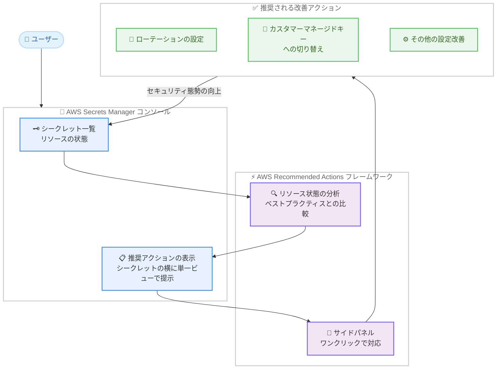

# AWS Secrets Manager - コンソールでの実用的なセキュリティ推奨アクションの表示

**リリース日**: 2026年10月1日
**サービス**: AWS Secrets Manager
**機能**: AWS Recommended Actions フレームワークとの連携によるシークレットのセキュリティ態勢改善の推奨表示

📊 [このアップデートのインフォグラフィックを見る](https://takech9203.github.io/aws-news-summary/20261001-aws-secrets-manager-security-posture-recommendations.html)

## 概要

AWS Secrets Manager が AWS Recommended Actions フレームワークと連携し、シークレットに関するコンテキストに応じた実用的な推奨アクションを Secrets Manager コンソール内に直接表示するようになりました。シークレットの横に表示されるガイダンスに従うことで、コンソールから移動することなく、セキュリティ態勢の強化とベストプラクティスの適用を進められます。

表示される推奨の例としては、ローテーションが未設定のシークレットの特定、デフォルトの AWS 管理キーからカスタマーマネージドキー (CMK) への暗号化キーの切り替え、その他の設定改善のアクションなどがあり、これらを 1 つのビューで確認して対応できます。シークレット管理のベストプラクティス適用を効率化したいセキュリティ管理者や、多数のシークレットを運用する開発チームにとって有用なアップデートです。

本機能は追加料金なしで、Secrets Manager が利用可能なすべての AWS 商用リージョンで提供されます。

**アップデート前の課題**

シークレットのセキュリティ態勢の改善には、以下の課題がありました。

- ローテーション未設定のシークレットや、デフォルトキーで暗号化されたままのシークレットを、利用者が自ら棚卸しして特定する必要があった
- どのシークレットにどのベストプラクティスを適用すべきかの判断を、ドキュメントを参照しながら個別に行う必要があった
- 改善アクションの確認と実施のために、コンソール内の複数のページやドキュメントを行き来する必要があった

**アップデート後の改善**

今回のアップデートにより、以下が可能になりました。

- Secrets Manager コンソール内で、シークレットの状態に基づいたコンテキストに応じた推奨アクションが自動的に表示されるようになった
- ローテーション設定やカスタマーマネージドキーへの切り替えなどの改善アクションを、1 つのビューで確認して対応できるようになった
- コンソールから移動することなく、推奨に沿ってセキュリティベストプラクティスを適用できるようになった

## アーキテクチャ図



AWS Recommended Actions フレームワークがシークレットのリソース状態を分析し、Secrets Manager コンソール内に改善アクションを提示する流れを示しています。ユーザーはコンソールから移動することなく、推奨に沿った対応を実施できます。

## サービスアップデートの詳細

### 主要機能

1. **コンソール内でのコンテキストに応じた推奨表示**
   - シークレットの状態に基づいた実用的な推奨アクションを Secrets Manager コンソール内に直接表示
   - シークレットの横にカスタマイズされたガイダンスが表示され、対象のシークレットと改善内容を即座に把握可能
   - 複数の改善アクションを 1 つのビューで確認して対応可能

2. **セキュリティベストプラクティスへの誘導**
   - ローテーションが未設定のシークレットを特定し、ローテーション設定を推奨
   - デフォルトの AWS 管理キー (`aws/secretsmanager`) で暗号化されているシークレットに対して、カスタマーマネージドキーへの切り替えを提案
   - その他の設定改善についても、状態に応じたアクションを提示

3. **AWS Recommended Actions フレームワークとの連携**
   - リソースの状態、ベストプラクティス、一般的な利用パターンに基づいて関連性の高い推奨を生成 (ユーザーデータは処理しない)
   - 推奨が利用可能な場合に「Recommended actions」ボタンが動的に表示され、統合されたサイドパネルからワークフローを中断せずに対応可能
   - 推奨アクションに関する API 呼び出しは AWS CloudTrail に記録され、監査可能

## 技術仕様

### AWS Recommended Actions フレームワークの特徴

| 項目 | 詳細 |
|------|------|
| 推奨の生成基準 | リソースの状態、ベストプラクティス、一般的な利用パターン |
| 表示方法 | コンソール内の動的な「Recommended actions」ボタン、統合サイドパネル |
| 対応方法 | 成功メッセージやリソースビューからのワンクリックアクション |
| データの取り扱い | リソースの状態を分析するが、ユーザーデータ (シークレットの値など) は処理しない |
| 監査 | AWS CloudTrail による API 呼び出しの記録に対応 |
| 対応サービス | 複数の AWS サービスに対応 (今回 Secrets Manager が追加) |

### 推奨される主なアクションの例

| 推奨アクション | 内容 |
|------|------|
| ローテーションの設定 | ローテーションが未設定のシークレットに対して、自動ローテーションの設定を推奨 |
| カスタマーマネージドキーへの切り替え | デフォルトの AWS 管理キーからカスタマーマネージドキーへの暗号化キーの変更を推奨 |
| 設定の改善 | その他、シークレットの状態に応じた設定改善のアクションを提示 |

## 設定方法

### 前提条件

1. AWS Secrets Manager を利用しており、シークレットが作成されていること
2. AWS Management Console へのサインインが可能であること
3. シークレットの参照および推奨アクションの実施に必要な IAM 権限 (ローテーション設定や KMS キー変更の権限など) が付与されていること

### 手順

#### ステップ1: Secrets Manager コンソールを開く

[AWS Secrets Manager コンソール](https://console.aws.amazon.com/secretsmanager/)にサインインします。追加の有効化作業は不要で、推奨が利用可能な場合は自動的に表示されます。

#### ステップ2: 推奨アクションを確認する

シークレットの横に表示される推奨ガイダンス、または「Recommended actions」ボタンを選択し、利用可能な推奨アクションの一覧を確認します。ボタンは推奨アクションが利用可能な場合にのみ表示されます。

#### ステップ3: 推奨アクションを実施する

推奨アクションを直接実行するか、統合サイドパネルから対応します。例えばローテーション未設定のシークレットに対しては、推奨に従ってローテーションスケジュールとローテーション用 Lambda 関数 (またはマネージドローテーション) を設定します。

```bash
# 参考: CLI でローテーションを設定する場合の例
aws secretsmanager rotate-secret \
  --secret-id MySecret \
  --rotation-lambda-arn arn:aws:lambda:ap-northeast-1:123456789012:function:MyRotationFunction \
  --rotation-rules '{"ScheduleExpression": "rate(30 days)"}'
```

`rotate-secret` コマンドにより、指定したシークレットに 30 日ごとの自動ローテーションを設定しています。コンソールの推奨アクションからも同等の設定が可能です。

## メリット

### ビジネス面

- **セキュリティ態勢の継続的な改善**: ベストプラクティスからの逸脱がコンソール上で可視化されるため、組織全体のシークレット管理の品質を底上げできる
- **追加コストなし**: 追加料金なしで利用できるため、既存の Secrets Manager ユーザーはすぐに活用を開始できる
- **運用負荷の軽減**: 棚卸しや個別のドキュメント調査にかけていた工数を削減し、改善アクションの実施に集中できる

### 技術面

- **コンテキストに応じたガイダンス**: 一般論ではなく、個々のシークレットの状態に基づいたカスタマイズされた推奨が表示される
- **ワークフローを中断しない対応**: 統合サイドパネルとワンクリックアクションにより、コンソールから移動せずに改善を実施できる
- **監査可能性**: 推奨アクションに関する API 呼び出しは CloudTrail に記録されるため、対応状況を追跡できる

## デメリット・制約事項

### 制限事項

- 推奨アクションは AWS Management Console 上での機能であり、「Recommended actions」ボタンは推奨が利用可能な場合にのみ表示される
- 商用リージョンでの提供であり、GovCloud (US) や中国リージョンでの提供は発表時点で明記されていない

### 考慮すべき点

- 推奨アクションの実施 (ローテーション設定や KMS キーの変更など) には、対応する IAM 権限が別途必要
- カスタマーマネージドキーへの切り替えは KMS の料金 (キー保管料や API リクエスト料金) が発生するため、コストとセキュリティ要件のバランスを検討することを推奨
- ローテーションの導入時は、アプリケーションがシークレットの最新値を取得する実装になっているかを事前に確認することが重要

## ユースケース

### ユースケース1: ローテーション未設定シークレットの解消

**シナリオ**: 長期間運用しているアカウントに多数のデータベース認証情報が保存されており、ローテーションが設定されていないシークレットが残っている。

**実装例**:
```
1. Secrets Manager コンソールを開き、推奨アクションを確認
2. ローテーション未設定として提示されたシークレットを特定
3. 推奨アクションからローテーションスケジュールを設定
```

**効果**: 棚卸し作業なしでローテーション未設定のシークレットを特定でき、認証情報の長期固定化によるリスクを低減できる。

### ユースケース2: カスタマーマネージドキーへの移行

**シナリオ**: セキュリティポリシーで、シークレットの暗号化にはキーポリシーやローテーションを自組織で管理できるカスタマーマネージドキーの利用が求められている。

**実装例**:
```
1. 推奨アクションで、デフォルトの AWS 管理キーで暗号化されたシークレットを確認
2. 推奨に従い、暗号化キーをカスタマーマネージドキーに変更
3. キーポリシーでシークレットへのアクセスを細かく制御
```

**効果**: ポリシー非準拠のシークレットをコンソール上で把握し、組織のコンプライアンス要件への準拠を効率的に進められる。

### ユースケース3: 新規チームメンバーのベストプラクティス習得

**シナリオ**: Secrets Manager の運用経験が浅いメンバーが、シークレット作成後にどのような設定を追加すべきか判断に迷っている。

**実装例**:
```
1. シークレット作成後、コンソールに表示される推奨アクションを確認
2. 統合サイドパネルのガイダンスに沿って設定を実施
```

**効果**: ドキュメントを探し回ることなく、コンソールのガイダンスに沿ってベストプラクティスを適用でき、チーム全体の設定品質が均一化される。

## 料金

本機能は追加料金なしで利用できます。Secrets Manager 自体の料金 (シークレットあたりの月額料金および API コール料金) については、[AWS Secrets Manager の料金ページ](https://aws.amazon.com/secrets-manager/pricing/)を参照してください。なお、推奨に従ってカスタマーマネージドキーを利用する場合は、AWS KMS の料金が別途発生します。

## 利用可能リージョン

AWS Secrets Manager が利用可能なすべての AWS 商用リージョンで提供されます。詳細は [AWS リージョン別サービス一覧](https://aws.amazon.com/about-aws/global-infrastructure/regional-product-services/)を参照してください。

## 関連サービス・機能

- **AWS Recommended Actions フレームワーク**: 本機能の基盤となる、AWS Management Console 全体でコンテキストに応じた推奨を提供するフレームワーク
- **AWS KMS**: 推奨アクションの 1 つであるカスタマーマネージドキーへの切り替えで利用する暗号化キー管理サービス
- **AWS Lambda**: シークレットの自動ローテーションを実行するローテーション関数の実行基盤
- **AWS CloudTrail**: Recommended Actions の API 呼び出しを記録し、監査を可能にするサービス

## 参考リンク

- 📊 [インフォグラフィック](https://takech9203.github.io/aws-news-summary/20261001-aws-secrets-manager-security-posture-recommendations.html)
- [公式発表 (What's New)](https://aws.amazon.com/about-aws/whats-new/2026/10/aws-secrets-manager-security-posture-recommendations)
- [AWS Recommended Actions ドキュメント](https://docs.aws.amazon.com/awsconsolehelpdocs/latest/gsg/recommended-actions.html)
- [AWS Secrets Manager ドキュメント](https://docs.aws.amazon.com/secretsmanager/)
- [料金ページ](https://aws.amazon.com/secrets-manager/pricing/)

## まとめ

AWS Secrets Manager が AWS Recommended Actions フレームワークと連携し、ローテーション設定やカスタマーマネージドキーへの切り替えなどの改善アクションがコンソール内に直接表示されるようになりました。追加料金なしで利用できるため、まずは Secrets Manager コンソールで自アカウントのシークレットに対する推奨アクションを確認し、優先度の高い改善から着手することを推奨します。
