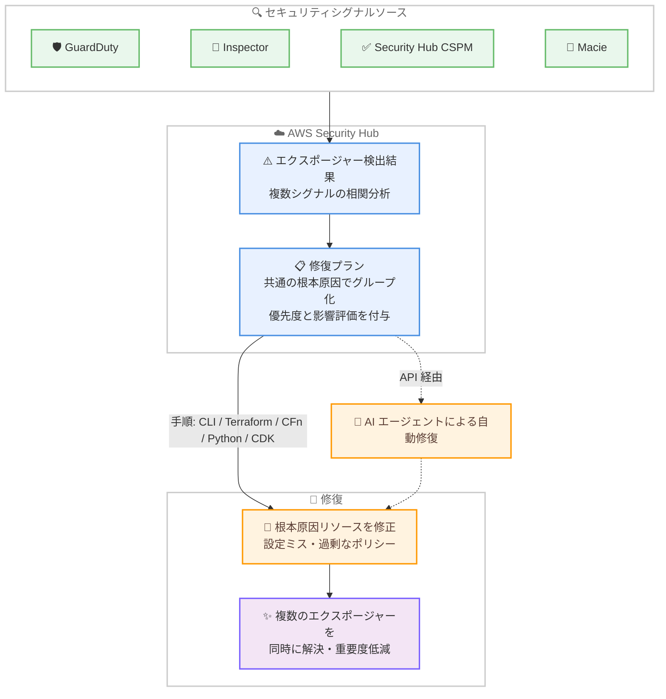

# AWS Security Hub - 修復プラン (Remediation Plans) の導入

**リリース日**: 2026年10月1日
**サービス**: AWS Security Hub
**機能**: セキュリティエクスポージャーの優先順位付けと修復を支援する修復プラン

📊 [このアップデートのインフォグラフィックを見る](https://takech9203.github.io/aws-news-summary/20261001-aws-security-hub-remediation-plans.html)

## 概要

AWS Security Hub に、セキュリティエクスポージャー (露出リスク) の優先順位付けと修復を支援する「修復プラン (Remediation Plans)」が導入されました。修復プランは、共通の根本原因に起因する複数のエクスポージャー検出結果を 1 つにまとめ、個々のエクスポージャーを 1 件ずつ対処するのではなく、根本原因となっている 1 つのリソース (設定ミスや過剰に許可されたポリシーなど) を修正することで、複数のエクスポージャーを同時に解決または重要度を低減できるようにします。

各修復プランには、Critical / High / Medium / Low の優先度ガイダンス、影響評価、そして AWS CLI、Terraform、CloudFormation、Python、CDK の複数フォーマットによるステップバイステップの修復手順が含まれます。Security Hub はリスク削減効果が最も高いプランが上位に表示されるよう自動的にランク付けするため、セキュリティチームは最も効果の大きい箇所に労力を集中できます。さらに、AI エージェントが API 経由でプランをプログラマティックに取得し、修復を自動化することも可能です。

本機能は、セキュリティ運用チーム、クラウドセキュリティ管理者、そしてセキュリティ自動化に取り組む組織にとって、エクスポージャー対応の効率を大きく向上させるアップデートです。

**アップデート前の課題**

Security Hub のエクスポージャー検出結果に対して、以下の課題がありました。

- エクスポージャー検出結果を 1 件ずつ個別に分析し、対処する必要があった
- 複数の検出結果が同じ根本原因 (同一リソースの設定ミスなど) に起因していても、その関連性を手動で特定する必要があった
- どの修正が最も大きなリスク削減につながるかの優先順位付けを、セキュリティチームが独自に判断する必要があった
- 修復手順を各チームが利用するツール (CLI、IaC など) に合わせて自分で作成する必要があった

**アップデート後の改善**

今回のアップデートにより、以下が可能になりました。

- 共通の根本原因を持つエクスポージャーが自動的に 1 つの修復プランにまとめられ、1 つの修正で複数の検出結果を解決または重要度を低減できるようになった
- 優先度ガイダンス (Critical / High / Medium / Low) と影響評価により、リスク削減効果の高い修復から着手できるようになった
- AWS CLI、Terraform、CloudFormation、Python、CDK の例を含むステップバイステップの修復手順が提供され、チームの既存ワークフローに沿った修復が可能になった
- AI エージェントが API 経由で修復プランを取得し、修復作業を自動化できるようになった

## アーキテクチャ図



Security Hub が複数のセキュリティサービスからのシグナルを相関分析してエクスポージャー検出結果を生成し、共通の根本原因でグループ化した修復プランを提示する流れを示しています。1 つの根本原因リソースを修正することで、複数のエクスポージャーが同時に解決されます。

## サービスアップデートの詳細

### 主要機能

1. **根本原因によるエクスポージャーのグループ化**
   - 共通の根本原因に起因するエクスポージャー検出結果を 1 つの修復プランにまとめて提示
   - 設定ミスや過剰に許可されたポリシーなど、根本原因となっている 1 つのリソースを修正することで、複数のエクスポージャーを同時に解決または重要度を低減
   - 各エクスポージャーについて、修復による影響 (Resolves: 解決 / Reduces: 重要度低減 / Unchanged: 変化なし) と修復前後の重要度の変化を確認可能

2. **優先度ガイダンスと影響評価**
   - 各修復プランに Critical / High / Medium / Low の優先度を付与
   - リスク削減効果が最も高いプランが上位に表示されるよう自動的にランク付け
   - 解決される検出結果数、重要度が低減される検出結果数などの修復効果 (Outcome) を提示

3. **複数フォーマットの修復手順**
   - AWS CLI、Terraform、CloudFormation、Python、CDK の例を含むステップバイステップの修復手順を提供
   - 問題の説明 (ProblemStatement)、リスク評価 (RiskAssessment)、影響範囲 (AffectedScope)、前提条件、必要な IAM 権限などのコンテキスト情報も含まれる
   - 修復後の確認手順 (PostRemediationSteps) や関連ナレッジ記事へのリンクも提供

4. **AI エージェントによる自動修復への対応**
   - 新しい API (`GetRemediationsV2`、`ListExposuresByRemediationV2`) 経由で修復プランをプログラマティックに取得可能
   - AI エージェントがプランを読み取り、修復を自動化するワークフローを構築可能
   - 自動化レベル (AutomationLevel) や人によるレビュー要否 (HumanReviewRequired) などのメタデータも提供

## 技術仕様

### 修復プランの構成要素

| 項目 | 詳細 |
|------|------|
| 優先度 (Priority) | Critical / High / Medium / Low |
| 修復効果 (Outcome) | 解決される検出結果数、重要度低減される検出結果数、変化なしの件数 |
| 修復サマリー | アクション、説明、即時実行可否、修復後の確認手順、関連ナレッジ記事 |
| ガイダンスコンテキスト | 問題の説明、リスク評価、影響範囲、前提条件 |
| ガイダンス仕様 | パラメータ、修復ステップ、期待される最終状態、必要な IAM 権限 |
| 修復手順フォーマット | AwsCli / Cli / Python / Terraform / Cdk / CloudFormation / IaC / Template |
| ステータス (Status) | New / Updated / Resolved |
| メタデータ | リソースタイプ、エクスポージャータイプ、可逆性、自動化レベル、人によるレビュー要否など |

### エクスポージャーごとの修復影響

`ListExposuresByRemediationV2` API では、修復プランに関連する各エクスポージャーについて以下を確認できます。

| 項目 | 詳細 |
|------|------|
| PreviousSeverity | 修復前の重要度 (Informational / Low / Medium / High / Critical) |
| ProjectedSeverity | 修復後に予測される重要度 |
| Impact | Resolves (解決) / Reduces (重要度低減) / Unchanged (変化なし) |

### API変更履歴

| 日付 | サービス | 変更内容 |
|------|----------|----------|
| 2026/10/01 | [securityhub](https://awsapichanges.com/archive/changes/646bd4-securityhub.html) | 2 new api methods - `GetRemediationsV2` および `ListExposuresByRemediationV2` の追加。エクスポージャー検出結果に対する最優先の修復を確認する機能を提供 |

### API 呼び出し例

```python
# 修復プランの一覧をガイダンス付きで取得
response = client.get_remediations_v2(
    Filters={
        'CompositeFilters': [
            {
                'StringFilters': [
                    {
                        'FieldName': 'Priority',
                        'Filter': {'Value': 'Critical'}
                    }
                ]
            }
        ]
    },
    ShowGuidance=True,
    GuidanceFormat='Terraform',
    MaxResults=10
)

# 特定の修復プランに関連するエクスポージャーの一覧を取得
response = client.list_exposures_by_remediation_v2(
    TargetUid='<remediation-target-uid>',
    MaxResults=50
)
```

## 設定方法

### 前提条件

1. AWS Security Hub (Essentials プラン以上) が有効化されていること
2. エクスポージャー検出結果の生成元となるセキュリティサービス (Security Hub CSPM、Amazon Inspector、GuardDuty、Macie など) が有効化されていること
3. 修復プランの参照に必要な IAM 権限 (`securityhub:GetRemediationsV2`、`securityhub:ListExposuresByRemediationV2` など) が付与されていること

### 手順

#### ステップ1: Security Hub コンソールで修復プランを確認

Security Hub コンソールのエクスポージャー関連ページから、優先度順にランク付けされた修復プランを確認します。各プランには優先度、影響評価、修復により解決されるエクスポージャーの一覧が表示されます。

#### ステップ2: API で修復プランを取得

```bash
# 修復プランの一覧を AWS CLI 形式のガイダンス付きで取得
aws securityhub get-remediations-v2 \
  --show-guidance \
  --guidance-format AwsCli \
  --max-results 10
```

`GetRemediationsV2` API を呼び出し、修復プランの一覧をステップバイステップの修復手順 (ここでは AWS CLI 形式) 付きで取得しています。`--guidance-format` には `Terraform`、`CloudFormation`、`Python`、`Cdk` なども指定できます。

#### ステップ3: 修復プランに関連するエクスポージャーを確認

```bash
# 特定の修復プランで解決されるエクスポージャーの一覧を取得
aws securityhub list-exposures-by-remediation-v2 \
  --target-uid "<remediation-target-uid>"
```

`ListExposuresByRemediationV2` API を呼び出し、指定した修復プランを実行した場合に解決または重要度低減される各エクスポージャーと、修復前後の重要度の変化を確認しています。

#### ステップ4: 修復手順の実行と検証

修復プランに含まれるステップバイステップの手順に従い、根本原因となっているリソースを修正します。修復後は、プランに含まれる確認手順 (PostRemediationSteps) に従って修正の効果を検証します。

## メリット

### ビジネス面

- **セキュリティ対応の効率化**: 複数のエクスポージャーを 1 つの修正で解決できるため、セキュリティチームの対応工数を大幅に削減できる
- **リスク削減効果の最大化**: リスク削減効果の高いプランから優先的に対応することで、限られたリソースで最大のセキュリティ改善を実現できる
- **追加コストなし**: Security Hub Essentials プランに追加料金なしで含まれるため、既存ユーザーはすぐに活用を開始できる

### 技術面

- **根本原因ベースの修復**: 症状 (個々の検出結果) ではなく根本原因に対処するアプローチにより、再発防止と恒久的なセキュリティ改善につながる
- **マルチフォーマットの修復手順**: AWS CLI、Terraform、CloudFormation、Python、CDK から選択でき、チームの既存の IaC ワークフローにそのまま組み込める
- **自動化対応**: API 経由でプランを取得できるため、AI エージェントや自動修復パイプラインとの統合が容易

## デメリット・制約事項

### 制限事項

- Security Hub (Essentials プラン) の利用が前提となる
- エクスポージャー検出結果は Security Hub CSPM、Amazon Inspector、GuardDuty、Macie などのシグナルに基づいて生成されるため、これらのサービスが有効化されていない場合は修復プランの効果が限定的になる
- 修復プランは Security Hub が利用可能なリージョンでのみ提供される

### 考慮すべき点

- 修復手順の実行は環境に変更を加えるため、本番環境への適用前にステージング環境での検証を推奨
- AI エージェントによる自動修復を導入する場合は、メタデータの `HumanReviewRequired` を確認し、人によるレビューが必要な修復には適切な承認フローを組み込むことを推奨
- 修復による影響 (Resolves / Reduces / Unchanged) を事前に確認し、意図しないワークロードへの影響がないかを評価することが重要

## ユースケース

### ユースケース1: 過剰に許可された IAM ポリシーの一括修復

**シナリオ**: 複数の EC2 インスタンスや Lambda 関数が、過剰に許可された共通の IAM ポリシーを利用しており、それぞれに関連する複数のエクスポージャー検出結果が生成されている。

**実装例**:
```bash
# Critical 優先度の修復プランを Terraform 形式のガイダンス付きで取得
aws securityhub get-remediations-v2 \
  --filters '{"CompositeFilters":[{"StringFilters":[{"FieldName":"Priority","Filter":{"Value":"Critical"}}]}]}' \
  --show-guidance \
  --guidance-format Terraform
```

**効果**: 根本原因である 1 つの IAM ポリシーを修正することで、関連する複数のエクスポージャーを同時に解決し、個別対応と比較して対応時間を大幅に短縮できる。

### ユースケース2: AI エージェントによる修復の自動化

**シナリオ**: セキュリティ運用の自動化を進めており、AI エージェントに修復プランを読み取らせて、承認済みの修復を自動実行させたい。

**実装例**:
```python
# AI エージェントが修復プランを取得し、自動化可能なものを抽出
response = client.get_remediations_v2(
    ShowGuidance=True,
    GuidanceFormat='Python'
)
for item in response['Items']:
    metadata = item['Guidance']['Metadata']
    if not metadata['HumanReviewRequired']:
        # 自動修復ワークフローに連携
        execute_remediation(item)
```

**効果**: 人によるレビューが不要と判断された修復を自動化し、セキュリティチームは判断が必要な高リスクの修復に集中できる。

### ユースケース3: 経営層へのリスク削減効果の報告

**シナリオ**: セキュリティ投資の効果を定量的に経営層へ報告するため、修復活動によるリスク削減効果を可視化したい。

**実装例**:
```bash
# 修復プランごとの効果 (解決・低減される検出結果数) を取得
aws securityhub get-remediations-v2 \
  --query 'Items[].{Priority:Priority,Resolved:Outcome.ResolvedFindingsCount,Reduced:Outcome.SeverityReductionFindingsCount}'
```

**効果**: 修復プランごとの解決・低減される検出結果数を集計することで、修復活動の効果を定量的に報告でき、セキュリティ投資の正当性を示しやすくなる。

## 料金

修復プランは AWS Security Hub Essentials プランに追加料金なしで含まれます。Security Hub 自体の料金については、[AWS Security Hub の料金ページ](https://aws.amazon.com/security-hub/pricing/)を参照してください。

## 利用可能リージョン

AWS Security Hub が利用可能なすべての AWS リージョンで提供されます。

## 関連サービス・機能

- **AWS Security Hub CSPM**: 設定コンプライアンスチェックの結果がエクスポージャー検出結果のシグナルとして利用される
- **Amazon Inspector**: ソフトウェア脆弱性やネットワーク到達性の評価結果がエクスポージャー検出結果に反映される
- **Amazon GuardDuty**: 脅威検出の結果がエクスポージャーの相関分析に利用される
- **Amazon Macie**: 機密データの検出結果がエクスポージャーの影響評価に活用される
- **IAM Access Analyzer**: 未使用のアクセス権限情報がエクスポージャー検出結果のコンテキスト特性として表示される

## 参考リンク

- 📊 [インフォグラフィック](https://takech9203.github.io/aws-news-summary/20261001-aws-security-hub-remediation-plans.html)
- [公式発表 (What's New)](https://aws.amazon.com/about-aws/whats-new/2026/10/aws-security-hub-remediation-plans/)
- [AWS Security Hub ドキュメント](https://docs.aws.amazon.com/securityhub/)
- [エクスポージャー検出結果のドキュメント](https://docs.aws.amazon.com/securityhub/latest/userguide/exposure-findings.html)
- [料金ページ](https://aws.amazon.com/security-hub/pricing/)

## まとめ

AWS Security Hub の修復プランにより、共通の根本原因に起因する複数のセキュリティエクスポージャーを 1 つの修正で解決できるようになり、セキュリティ対応の効率とリスク削減効果が大きく向上します。Security Hub Essentials プランに追加料金なしで含まれるため、既存ユーザーはまずコンソールまたは `GetRemediationsV2` API で優先度の高い修復プランを確認し、リスク削減効果の大きい修復から着手することを推奨します。
