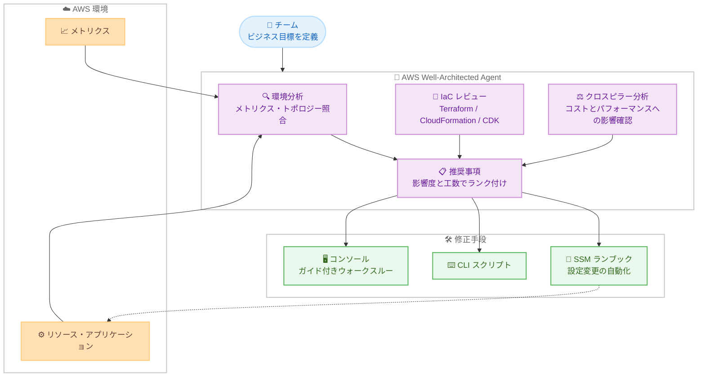

# AWS Well-Architected Agent - プレビュー提供開始

**リリース日**: 2026 年 10 月 1 日
**サービス**: AWS Well-Architected Tool / AWS Trusted Advisor
**機能**: AWS Well-Architected Agent (プレビュー)

📊 [このアップデートのインフォグラフィックを見る](https://takech9203.github.io/aws-news-summary/20261001-aws-well-architected-agent.html)

## 概要

AWS は、AWS Well-Architected Agent のプレビュー提供を発表しました。AWS Trusted Advisor と AWS Well-Architected Tool の次世代進化版と位置付けられる AI エージェントサービスで、コスト、セキュリティ、パフォーマンス、信頼性の 4 つの観点から AWS インフラストラクチャを分析し、最適化を支援します。

Well-Architected Agent は、メトリクスとアプリケーショントポロジーを Well-Architected ベストプラクティスと自動的に照合し、ビジネス目標、影響度、工数に基づいてランク付けされた、コンテキストに即した推奨事項をリソース、アプリケーション、アーキテクチャの各レベルで提供します。チームがビジネス目標を定義すると、優先順位付けされた推奨事項を受け取ることができ、該当する場合は設定変更を自動化する SSM ランブック、規範的な CLI スクリプト、ガイド付きコンソールウォークスルーが修正手段として提供されます。

さらに、Terraform、CloudFormation、CDK テンプレートといった Infrastructure as Code (IaC) をレビューしてベストプラクティスとのギャップを特定し、準拠に必要なコード変更を返す機能や、信頼性の変更がコストやパフォーマンスに与える影響を事前に確認できるクロスピラー分析も備えています。本サービスは AWS Support によって提供され、AWS Support プランを持つ AWS のお客様が利用できます。

**アップデート前の課題**

- Well-Architected Tool によるレビューは質問への回答を人手で行う形式であり、実際の環境のメトリクスや構成との照合は利用者自身が実施する必要があった
- Trusted Advisor のチェックは個別リソース単位が中心で、ビジネス目標やアプリケーション全体の文脈に基づく優先順位付けが難しかった
- IaC テンプレートがベストプラクティスに準拠しているかの確認や、準拠のためのコード修正は手作業に依存していた
- ある柱 (ピラー) の改善が他の柱に与える影響 (例: 信頼性向上によるコスト増) を事前に把握することが困難だった

**アップデート後の改善**

- ビジネス目標を定義するだけで、影響度と工数に基づいてランク付けされた推奨事項をリソース、アプリケーション、アーキテクチャの各レベルで受け取れるようになった
- メトリクスとアプリケーショントポロジーが Well-Architected ベストプラクティスと自動的に照合されるようになった
- Terraform、CloudFormation、CDK テンプレートのレビューと、ベストプラクティス準拠に必要なコード変更の提示が可能になった
- SSM ランブック、CLI スクリプト、コンソールウォークスルーにより、推奨事項の適用までを支援するようになった
- クロスピラー分析により、変更をコミットする前に他の観点への影響を確認できるようになった

## アーキテクチャ図



チームが定義したビジネス目標に基づき、Well-Architected Agent が AWS 環境のメトリクスとトポロジー、IaC テンプレートを分析し、優先順位付けされた推奨事項と自動化された修正手段を提供します。

## サービスアップデートの詳細

### 主要機能

1. **ビジネス目標に基づく優先順位付けされた推奨事項**
   - コスト、セキュリティ、パフォーマンス、信頼性の 4 つの観点で分析
   - ビジネス目標、影響度、工数に基づいて推奨事項をランク付け
   - リソースレベル、アプリケーションレベル、アーキテクチャレベルの各粒度で提供

2. **環境の自動分析**
   - メトリクスとアプリケーショントポロジーを Well-Architected ベストプラクティスと自動的に照合
   - 利用者が質問に回答する従来のレビュー形式に比べ、実環境に即した分析が可能

3. **Infrastructure as Code のレビュー**
   - Terraform、CloudFormation、CDK テンプレートをレビュー
   - ベストプラクティスとのギャップを特定
   - 準拠に必要なコード変更を提示

4. **クロスピラー分析**
   - ある観点の変更が他の観点に与える影響を事前に確認可能
   - 例: 信頼性向上のための変更がコストとパフォーマンスに与える影響をコミット前に把握

5. **自動化された修正手段**
   - 設定変更を自動化する SSM ランブック
   - 規範的な CLI スクリプト
   - ガイド付きコンソールウォークスルー
   - 例: 重要なデータベースへのマルチ AZ フェイルオーバー追加の推奨事項に、自動化された SSM ランブックが同梱される

## 技術仕様

### サービス概要

| 項目 | 詳細 |
|------|------|
| 提供形態 | プレビュー |
| 分析対象の観点 | コスト、セキュリティ、パフォーマンス、信頼性 |
| 推奨事項の粒度 | リソース / アプリケーション / アーキテクチャ |
| 対応 IaC | Terraform、CloudFormation、CDK |
| 修正手段 | SSM ランブック、CLI スクリプト、コンソールウォークスルー |
| 提供元 | AWS Support (AWS Support プランを持つ顧客が利用可能) |
| 位置付け | AWS Trusted Advisor と AWS Well-Architected Tool の次世代進化版 |

### API 変更履歴

| 日付 | サービス | 変更内容 |
|------|----------|----------|
| 2026/09/25 | [AWS Well-Architected Tool](https://awsapichanges.com/archive/changes/a0db94-wellarchitected.html) | 2 updated api methods - Well-Architected Agent のリリースに伴う更新。AWS 環境を分析し、コスト、セキュリティ、パフォーマンス、レジリエンスにわたるパーソナライズされた優先順位付き推奨事項を提供する生成 AI サービス |

## 設定方法

### 前提条件

1. AWS アカウントと AWS Support プラン
2. エージェントへのアクセスが可能なリージョン (US East バージニア北部、US East オハイオ、US West オレゴン) の利用
3. 分析対象ワークロードのオンボーディング (任意の AWS 商用リージョンから可能)

### 手順

#### ステップ 1: コンソールから Well-Architected Agent を開始

[AWS Well-Architected コンソール](https://us-east-1.console.aws.amazon.com/wellarchitected/home?region=us-east-1#/) にアクセスし、Well-Architected Agent を開始します。エージェントへのアクセスはバージニア北部、オハイオ、オレゴンの各リージョンで利用できます。

#### ステップ 2: ビジネス目標の定義とワークロードのオンボーディング

分析対象のワークロードをオンボーディングし、チームのビジネス目標 (例: 信頼性重視、コスト最適化重視) を定義します。ワークロードのオンボーディングは任意の AWS 商用リージョンからサポートされます。

#### ステップ 3: 推奨事項の確認と適用

エージェントがメトリクスとアプリケーショントポロジーをベストプラクティスと照合し、影響度と工数でランク付けされた推奨事項を提示します。推奨事項に同梱される SSM ランブック、CLI スクリプト、またはコンソールウォークスルーを使用して修正を適用します。適用前にクロスピラー分析で他の観点への影響を確認できます。

詳細な手順は [ユーザーガイド](https://docs.aws.amazon.com/wellarchitected/latest/userguide/wa-agent.html) を参照してください。

## メリット

### ビジネス面

- **優先順位の明確化**: ビジネス目標、影響度、工数に基づくランク付けにより、限られたリソースで最も効果の高い改善から着手できる
- **レビューコストの削減**: 人手による Well-Architected レビューの準備・実施工数を削減し、継続的な改善サイクルを実現できる
- **意思決定の質向上**: クロスピラー分析により、トレードオフを把握した上で変更を判断できる

### 技術面

- **実環境に即した分析**: メトリクスとアプリケーショントポロジーの自動照合により、自己申告ベースではなく実態に基づく評価が得られる
- **IaC へのシフトレフト**: Terraform、CloudFormation、CDK テンプレートの段階でギャップを特定し、必要なコード変更を取得できる
- **修正の自動化**: SSM ランブックによる設定変更の自動化で、推奨事項の適用までの時間を短縮できる

## デメリット・制約事項

### 制限事項

- プレビュー段階のため、機能や提供条件は今後変更される可能性がある
- エージェントへのアクセスと推奨事項の提供は、US East (バージニア北部)、US East (オハイオ)、US West (オレゴン) の 3 リージョンに限定される
- AWS Support プランを持つ顧客が対象となる

### 考慮すべき点

- 推奨事項や生成されたコード変更は適用前に内容を確認し、自組織の要件やポリシーに合致するか検証する必要がある
- SSM ランブックによる自動変更を実行する際は、対象リソースへの影響範囲と実行権限を事前に確認する必要がある
- 既存の Trusted Advisor や Well-Architected Tool の運用プロセスとの使い分け・移行方針を検討する必要がある

## ユースケース

### ユースケース 1: 信頼性向上施策の優先順位付けと自動適用

**シナリオ**: 信頼性を重視するチームが、重要なワークロードの耐障害性を体系的に改善したい。

**実装例**:
```
1. Well-Architected Agent にワークロードをオンボーディング
2. ビジネス目標として信頼性重視を定義
3. 重要なデータベースへのマルチ AZ フェイルオーバー追加などの
   推奨事項を受領
4. 同梱の SSM ランブックで設定変更を自動適用
```

**効果**: 影響度と工数でランク付けされた推奨事項に基づき、効果の高い信頼性改善を自動化された手順で迅速に適用できます。

### ユースケース 2: IaC テンプレートのベストプラクティス準拠チェック

**シナリオ**: Terraform で管理しているインフラストラクチャを、デプロイ前に Well-Architected ベストプラクティスへ準拠させたい。

**実装例**:
```
1. Terraform テンプレートを Well-Architected Agent でレビュー
2. ベストプラクティスとのギャップを特定
3. 提示されたコード変更をテンプレートに反映し、
   レビュー済みの状態でデプロイ
```

**効果**: デプロイ前の段階でギャップを修正でき、本番環境での手戻りを削減できます。CloudFormation、CDK にも同様に対応します。

### ユースケース 3: クロスピラー分析によるトレードオフの事前評価

**シナリオ**: 信頼性向上のための構成変更を計画しているが、コストへの影響が懸念されるため、事前にトレードオフを把握したい。

**実装例**:
```
1. 信頼性に関する推奨事項を確認
2. クロスピラー分析で、当該変更がコストと
   パフォーマンスに与える影響を確認
3. ビジネス目標と照らし合わせて適用可否を判断
```

**効果**: 変更をコミットする前に他の観点への影響を定量的に把握でき、根拠に基づく意思決定が可能になります。

## 料金

What's New の発表では個別の料金は示されていません。Well-Architected Agent は AWS Support によって提供され、AWS Support プランを持つ AWS のお客様が利用できます。最新の提供条件は [ユーザーガイド](https://docs.aws.amazon.com/wellarchitected/latest/userguide/wa-agent.html) を確認してください。

## 利用可能リージョン

- **エージェントへのアクセスと推奨事項の提供**: US East (バージニア北部)、US East (オハイオ)、US West (オレゴン)
- **ワークロードのオンボーディング**: すべての AWS 商用リージョンからサポート

## 関連サービス・機能

- **AWS Well-Architected Tool**: 質問ベースでワークロードを評価する従来のレビューツール。Well-Architected Agent はその次世代進化版と位置付けられる
- **AWS Trusted Advisor**: コスト、セキュリティ、耐障害性などのチェックを提供するサービス。同じく Well-Architected Agent の前身と位置付けられる
- **AWS Systems Manager (SSM)**: 推奨事項に同梱されるランブックの実行基盤として、設定変更の自動化を担う
- **AWS Support**: Well-Architected Agent の提供元。利用には AWS Support プランが必要

## 参考リンク

- 📊 [インフォグラフィック](https://takech9203.github.io/aws-news-summary/20261001-aws-well-architected-agent.html)
- [公式発表 (What's New)](https://aws.amazon.com/about-aws/whats-new/2026/10/aws-well-architected-agent/)
- [AWS Well-Architected Agent ユーザーガイド](https://docs.aws.amazon.com/wellarchitected/latest/userguide/wa-agent.html)
- [AWS Well-Architected](https://aws.amazon.com/architecture/well-architected/)

## まとめ

AWS Well-Architected Agent は、Trusted Advisor と Well-Architected Tool を進化させ、ビジネス目標に基づく優先順位付けされた推奨事項、IaC レビュー、クロスピラー分析、SSM ランブックによる自動修正までを一貫して提供する AI エージェントです。プレビュー段階かつ提供リージョンは限定されますが、Well-Architected レビューの運用負荷に課題を感じているチームは、AWS Support プランの範囲でまず非本番ワークロードから試用し、既存のレビュープロセスとの使い分けを検討することをお勧めします。
