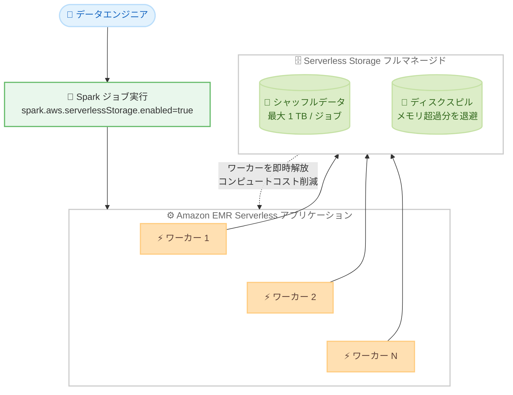

# Amazon EMR Serverless - Serverless Storage がテラバイト規模のシャッフルをサポート

**リリース日**: 2026 年 10 月 1 日
**サービス**: Amazon EMR Serverless
**機能**: Serverless Storage のシャッフルデータ上限拡大 (ジョブあたり最大 1 TB) とディスクスピルのサポート

📊 [このアップデートのインフォグラフィックを見る](https://takech9203.github.io/aws-news-summary/20261001-emr-serverless-terabyte-scale-shuffle.html)

## 概要

Amazon EMR Serverless の Serverless Storage が、ジョブあたり最大 1 TB のシャッフル操作をサポートしました。Serverless Storage は、Apache Spark ジョブのシャッフルなどの中間データをフルマネージドなサーバーレスストレージに保存する機能で、ローカルディスクの容量設計を不要にし、中間データの保存は無料で提供されます。今回のアップデートにより、取り扱える中間データ量が従来のジョブあたり 200 GB から 1 TB に拡大されました。

あわせてディスクスピル (disk spill) のサポートも追加され、メモリ集約的なジョブがメモリに収まらないデータをストレージへ退避できるようになり、ジョブの信頼性と成功率が向上します。マルチテラバイト規模のデータセットに対する大規模テーブルの結合や、高カーディナリティデータに対する複雑な集計など、大量のデータシャッフルを伴う本番規模の Spark ワークロードを運用するエンタープライズのお客様が主な対象です。

本機能は Amazon EMR リリース emr-7.14、emr-spark-8.1 以降で利用でき、東京・大阪リージョンを含む 18 の AWS リージョンで 1 TB 上限が適用されます。

**アップデート前の課題**

- Serverless Storage で扱える中間データはジョブあたり 200 GB までに制限されており、マルチテラバイト規模のデータセットの結合や集計など、大量のシャッフルを伴うジョブは上限超過で失敗する可能性があった
- 大規模シャッフルを伴うジョブでは、ローカルディスクのサイズを見積もって手動でプロビジョニングする従来方式に戻る必要があり、容量設計の負担とディスク課金が発生していた
- メモリ集約的なジョブでメモリに収まらないデータを退避する手段が限られ、ジョブの安定性に課題があった

**アップデート後の改善**

- ジョブあたり最大 1 TB の中間データを読み書きできるようになり、テラバイト規模のシャッフルを伴う本番ワークロードを Serverless Storage で実行できるようになった
- ディスクスピルのサポートにより、メモリ集約的なジョブがデータをストレージへ退避できるようになり、ジョブの信頼性と成功率が向上した
- 容量設計不要・中間データ保存無料という Serverless Storage の利点を、より大規模なワークロードでも享受できるようになった

## アーキテクチャ図



Spark ジョブのシャッフルデータとディスクスピルがフルマネージドな Serverless Storage に保存され、中間データがワーカーのローカルディスクから分離される構成を示しています。ストレージの分離により、アイドル状態のワーカーを即時解放してコンピュートコストを削減できます。

## サービスアップデートの詳細

### 主要機能

1. **シャッフルデータ上限の 1 TB への拡大**
   - ジョブあたりの中間データ読み書き上限が 200 GB から 1 TB に拡大
   - マルチテラバイトデータセットにまたがる大規模テーブル結合をサポート
   - 高カーディナリティデータに対する複雑な集計やソートなど、大量シャッフルを伴う処理に対応
   - emr-7.14 および emr-spark-8.1 以降のリリースで利用可能

2. **ディスクスピルのサポート**
   - メモリ集約的なジョブがメモリに収まらないデータを Serverless Storage へ退避可能
   - メモリ不足によるジョブ失敗を防ぎ、ジョブの信頼性と成功率を向上

3. **Serverless Storage の既存の利点を継承**
   - ローカルディスクのタイプ・サイズ設定が不要なゼロコンフィグレーションストレージ
   - ワークロード需要に応じた自動スケーリングにより、ディスク容量不足によるジョブ失敗を防止
   - 中間データの保存は無料で、コンピュートとメモリのリソースにのみ課金
   - 中間データは転送時・保存時に暗号化され、ジョブレベルで厳密に分離
   - AWS Lake Formation 連携によるきめ細かなアクセス制御をサポート

## 技術仕様

### Serverless Storage のデータ量上限

| EMR リリース | 中間データ上限 (ジョブあたり) |
|------|------|
| emr-7.12 / emr-7.13 / emr-spark-8.0 | 200 GB |
| emr-7.14 / emr-spark-8.1 以降 | 1 TB (一部リージョンは 200 GB) |

### 主な制約

| 項目 | 詳細 |
|------|------|
| 対応リリース | Amazon EMR リリース 7.12 以降 (1 TB は emr-7.14 / emr-spark-8.1 以降) |
| ジョブ実行タイムアウト | 最大 24 時間 (超える設定のジョブは失敗) |
| 事前初期化容量 | Pre-initialized capacity のワーカーは Serverless Storage 非対応 |
| ワークロードタイプ | ストリーミングジョブとインタラクティブジョブは非対応 |
| ワーカー構成 | 1 vCPU および 2 vCPU のワーカーは非対応 |

### 設定プロパティ

```json
{
  "classification": "spark-defaults",
  "properties": {
    "spark.aws.serverlessStorage.enabled": "true"
  }
}
```

`spark.aws.serverlessStorage.enabled` を `true` に設定することで、アプリケーションレベルまたはジョブレベルで Serverless Storage を有効化できます。

## 設定方法

### 前提条件

1. Amazon EMR リリース emr-7.14 または emr-spark-8.1 以降を使用すること (1 TB 上限を利用する場合)
2. 利用するリージョンで Serverless Storage がサポートされていること
3. ジョブの実行タイムアウトが 24 時間以内であること

### 手順

#### ステップ 1: Serverless Storage を有効化したアプリケーションを作成

```bash
aws emr-serverless create-application \
  --type "SPARK" \
  --name my-application \
  --release-label emr-7.14.0 \
  --runtime-configuration '[{
      "classification": "spark-defaults",
      "properties": {
        "spark.aws.serverlessStorage.enabled": "true"
      }
    }]' \
  --region ap-northeast-1
```

emr-7.14.0 リリースで Spark タイプの EMR Serverless アプリケーションを作成し、spark-defaults 分類で `spark.aws.serverlessStorage.enabled` を `true` に設定して Serverless Storage を有効化しています。

#### ステップ 2: Spark ジョブを実行

```bash
aws emr-serverless start-job-run \
  --application-id <application-id> \
  --execution-role-arn <job-role-arn> \
  --job-driver '{
    "sparkSubmit": {
      "entryPoint": "s3://my-bucket/script.py",
      "sparkSubmitParameters": "--conf spark.executor.cores=4 --conf spark.executor.memory=20g --conf spark.driver.cores=4 --conf spark.driver.memory=8g --conf spark.executor.instances=10"
    }
  }'
```

アプリケーション上でジョブランを開始しています。シャッフルやディスクスピルなどの中間データ操作は Serverless Storage が自動的に処理するため、ディスク容量の設定は不要です。

#### ステップ 3: ジョブレベルでの有効化・無効化 (必要に応じて)

アプリケーションレベルで有効化していない場合でも、`start-job-run` の `sparkSubmitParameters` に `--conf spark.aws.serverlessStorage.enabled=true` を追加することで、特定のジョブのみ Serverless Storage を有効化できます。逆に `false` を指定すれば、特定のジョブのみ従来のローカルディスク方式に戻すこともできます。

## メリット

### ビジネス面

- **コスト削減**: 中間データの保存は無料で、ローカルディスクのプロビジョニングと課金が不要。さらにストレージとコンピュートの分離により、アイドル状態のワーカーを即時解放してコンピュートコストを削減できる
- **本番ワークロードの拡大**: 従来は上限により実行できなかったテラバイト規模のシャッフルを伴う本番ジョブを、サーバーレスのまま実行できる
- **運用負荷の軽減**: ディスク容量の見積もりや容量計画が不要になり、データエンジニアがビジネスロジックに集中できる

### 技術面

- **ジョブ信頼性の向上**: ストレージの自動スケーリングとディスクスピルのサポートにより、ディスク容量不足やメモリ不足によるジョブ失敗を防止できる
- **ステージ単位の高速なスケーリング**: 中間データがワーカーのローカルディスクから分離されるため、Spark の動的リソース割り当てと組み合わせてステージごとに素早くスケールアウト・スケールインできる
- **セキュリティ**: 中間データは転送時・保存時に暗号化され、ジョブレベルで分離される。Lake Formation によるきめ細かなアクセス制御にも対応

## デメリット・制約事項

### 制限事項

- 1 TB 上限の利用には emr-7.14 または emr-spark-8.1 以降が必要 (emr-7.12 / 7.13 / emr-spark-8.0 は 200 GB 上限)
- アフリカ (ケープタウン)、アジアパシフィック (メルボルン)、カナダ西部 (カルガリー)、欧州 (ロンドン、ミラノ、パリ、チューリッヒ) の各リージョンは 200 GB 上限のまま
- ジョブの実行タイムアウトは最大 24 時間まで
- ストリーミングジョブとインタラクティブジョブは非対応
- 1 vCPU および 2 vCPU のワーカーは非対応

### 考慮すべき点

- Pre-initialized capacity のワーカーは Serverless Storage に対応していないため、事前初期化容量を利用するジョブはジョブレベルで Serverless Storage を明示的に無効化する必要がある
- 1 TB を超える中間データを読み書きするジョブは、上限到達のエラーメッセージとともに失敗するため、ジョブの中間データ量を事前に把握しておくことが望ましい

## ユースケース

### ユースケース 1: マルチテラバイトデータセットの大規模テーブル結合

**シナリオ**: データウェアハウスへのロード前処理として、数テラバイトのトランザクションテーブルとマスタテーブルを日次で結合する ETL ジョブを運用している。結合時のシャッフルデータが 200 GB を超えるため、従来はローカルディスクを手動設計していた。

**実装例**:
```
1. emr-7.14 のアプリケーションで spark.aws.serverlessStorage.enabled=true を設定
2. 結合処理の Spark ジョブをそのまま実行 (ディスク設定は削除)
3. CloudWatch でジョブメトリクスを確認し、安定稼働を検証
```

**効果**: ディスク容量設計が不要になり、シャッフルデータが増減してもジョブが安定して完了する。中間データの保存コストもゼロになる。

### ユースケース 2: 高カーディナリティデータの複雑な集計

**シナリオ**: 数十億行のクリックストリームデータに対して、ユーザー ID やセッション ID などカーディナリティの高いキーで集計・ソートを行う分析ジョブで、大量のシャッフルが発生する。

**実装例**:
```
1. ジョブレベルで --conf spark.aws.serverlessStorage.enabled=true を指定
2. 集計ジョブを実行し、シャッフルは Serverless Storage に自動退避
3. ステージ後半でワーカー数が減る処理は動的リソース割り当てで即時スケールイン
```

**効果**: 最大 1 TB のシャッフルに対応しつつ、後続ステージで不要になったワーカーが即時解放されるため、コンピュートコストを削減できる。

### ユースケース 3: メモリ集約的なジョブの安定化

**シナリオ**: ウィンドウ関数や大規模なソートを多用するメモリ集約的な Spark ジョブが、メモリ不足により断続的に失敗している。

**実装例**:
```
1. Serverless Storage を有効化してディスクスピルを利用可能にする
2. メモリに収まらないデータは自動的にストレージへスピル
3. 失敗していたジョブの成功率を監視して改善を確認
```

**効果**: メモリ超過分がストレージへ退避されることでジョブの成功率が向上し、リトライによる無駄なコンピュートコストと運用対応を削減できる。

## 料金

Serverless Storage による中間データの保存に追加料金はかかりません。EMR Serverless の通常の料金体系に従い、ジョブが使用するコンピュート (vCPU 時間) とメモリ (GB 時間) に対してのみ課金されます。中間データをローカルディスクから分離することでアイドルワーカーを即時解放できるため、ステージごとにワーカー数が変動するジョブではコンピュートコストの削減が期待できます。詳細は Amazon EMR の料金ページを参照してください。

## 利用可能リージョン

1 TB 上限の Serverless Storage は、以下の 18 リージョンで利用できます。

- 米国東部 (バージニア北部、オハイオ)
- 米国西部 (北カリフォルニア、オレゴン)
- アジアパシフィック (香港、ジャカルタ、ムンバイ、大阪、ソウル、シンガポール、シドニー、東京)
- カナダ (中部)
- 欧州 (フランクフルト、アイルランド、スペイン、ストックホルム)
- 南米 (サンパウロ)

以下のリージョンでは Serverless Storage を利用できますが、上限は 200 GB です。

- アフリカ (ケープタウン)、アジアパシフィック (メルボルン)、カナダ西部 (カルガリー)、欧州 (ロンドン、ミラノ、パリ、チューリッヒ)

## 関連サービス・機能

- **Apache Spark on EMR Serverless**: Serverless Storage はシャッフル、ディスクスピル、ディスクキャッシュなど Spark の中間データ操作を自動処理する
- **AWS Lake Formation**: Serverless Storage はきめ細かなアクセス制御 (FGAC) との統合をサポート
- **Amazon S3**: ジョブの入出力データの保存先として利用され、Serverless Storage は中間データのみを対象とする
- **Amazon CloudWatch**: ジョブランのメトリクス監視により、シャッフル規模やジョブ成功率の変化を把握できる

## 参考リンク

- 📊 [インフォグラフィック](https://takech9203.github.io/aws-news-summary/20261001-emr-serverless-terabyte-scale-shuffle.html)
- [公式発表 (What's New)](https://aws.amazon.com/about-aws/whats-new/2026/10/emr-serverless-terabyte-scale-shuffle/)
- [ドキュメント: Using serverless storage for Amazon EMR Serverless](https://docs.aws.amazon.com/emr/latest/EMR-Serverless-UserGuide/jobs-serverless-storage.html)
- [Amazon EMR Serverless 製品ページ](https://aws.amazon.com/emr/serverless/)
- [料金ページ](https://aws.amazon.com/emr/pricing/)

## まとめ

EMR Serverless の Serverless Storage がジョブあたり最大 1 TB のシャッフルとディスクスピルに対応し、テラバイト規模の本番 Spark ワークロードをディスク容量設計なしで実行できるようになりました。大規模な結合や集計を伴うジョブを運用しているチームは、emr-7.14 または emr-spark-8.1 以降へ更新し、`spark.aws.serverlessStorage.enabled` を有効化してジョブの安定性とコスト削減の効果を検証することを推奨します。
