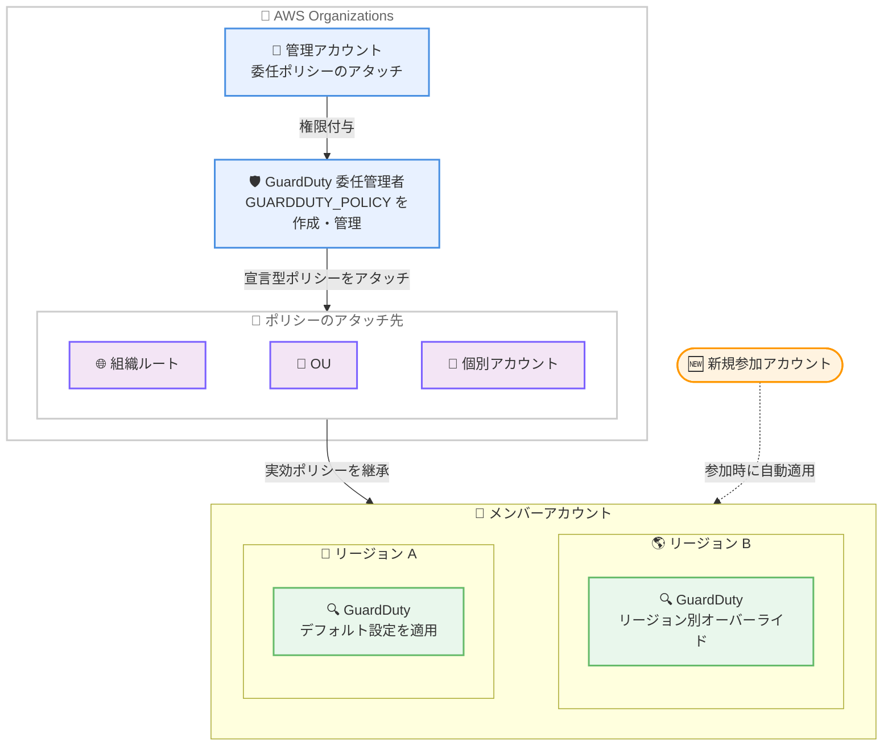

# Amazon GuardDuty - AWS Organizations 宣言型ポリシーによる一元管理

**リリース日**: 2026 年 10 月 1 日
**サービス**: Amazon GuardDuty, AWS Organizations
**機能**: AWS Organizations declarative policies による GuardDuty の一元的な有効化・管理

📊 [このアップデートのインフォグラフィックを見る](https://takech9203.github.io/aws-news-summary/20261001-guardduty-org-enablement-policies.html)

## 概要

Amazon GuardDuty が AWS Organizations の宣言型ポリシー (declarative policies) に対応しました。委任管理者アカウントが一元的なポリシーを定義することで、組織全体の GuardDuty 脅威検出を単一の場所から有効化・管理できるようになります。ポリシーは組織ルート、組織単位 (OU)、個別アカウントのいずれにもアタッチでき、既存アカウントへの適用に加えて、新規アカウントが組織に参加した際にも自動的に設定が維持されます。

ポリシーでは、GuardDuty が提供されるすべてのリージョンに適用されるデフォルト設定を定義し、異なる設定が必要なリージョンにはリージョン単位のオーバーライドを指定できます。ポリシーによる有効化は GuardDuty のコンソールや API から上書きできないため、組織全体で一貫した脅威検出のベースラインを強制できます。

マルチアカウント・マルチリージョン環境で GuardDuty を運用するセキュリティ管理者、特に Security OU の委任管理者アカウントから組織全体のセキュリティベースラインを統制したい組織にとって重要なアップデートです。

**アップデート前の課題**

従来の GuardDuty の組織管理には以下の課題がありました。

- 自動有効化 (auto-enable) 設定はリージョンごとに個別に構成する必要があり、マルチアカウント環境では全リージョンでの設定作業が繰り返し発生していた
- リージョンごとの設定が時間の経過とともにドリフト (乖離) する可能性があった
- メンバーアカウント側での設定変更を防ぎ、組織として一貫した有効化状態を強制する仕組みがなかった

**アップデート後の改善**

今回のアップデートにより以下が可能になりました。

- 委任管理者アカウントから単一のポリシーで、全リージョン・全アカウントの GuardDuty 有効化ベースラインを定義できるようになった
- デフォルトブロックとリージョン別オーバーライドにより、GuardDuty が利用可能なすべてのリージョン (新規リージョンを含む) に設定が自動適用されるようになった
- ポリシーによる設定は GuardDuty コンソールや API から上書きできず、新規参加アカウントにも自動的に継承されるため、設定ドリフトを防止できるようになった

## アーキテクチャ図



委任管理者アカウントが宣言型ポリシーを組織ルート、OU、またはアカウントにアタッチすると、対象スコープ内の全メンバーアカウント・全リージョンで GuardDuty と保護プランが自動的に有効化・管理されます。新規参加アカウントもポリシーを自動継承します。

## サービスアップデートの詳細

### 主要機能

1. **宣言型ポリシーによる組織全体の一元有効化**
   - 単一のポリシーで GuardDuty の基盤脅威検出 (foundational) と各保護プランの有効化状態を定義
   - 組織ルート、OU、個別アカウントのいずれにもアタッチ可能
   - 新規アカウントの組織参加時や OU 間の移動時に、実効ポリシーが自動的に適用される

2. **デフォルト設定とリージョン別オーバーライド**
   - `default` ブロックで GuardDuty が利用可能なすべてのリージョンに適用されるベースラインを定義
   - リージョン名をキーとするブロックで特定リージョンの設定を上書き可能 (リージョンブロックはそのリージョンのデフォルトを完全に置き換える)
   - `default` ブロックを使用している場合、新規リージョンも自動的に管理対象に含まれる

3. **ポリシーによる強制とドリフト防止**
   - ポリシーで管理される設定は GuardDuty のコンソールや API から上書き不可
   - GuardDuty コンソールの [アカウント] ページでは、ポリシー管理下の項目が読み取り専用の「Managed by Organization policy」として表示される
   - ポリシー継承は AWS Organizations の階層に従い、複数ポリシーはマージされて実効ポリシーとなる (アカウントに近いポリシーが優先)

4. **保護プラン単位の制御**
   - S3 Protection、EKS Protection、Malware Protection (EBS)、RDS Protection、Lambda Protection、AI Protection、Runtime Monitoring を個別に制御可能
   - いずれかの機能を有効化するブロックでは、基盤脅威検出 (foundational) の有効化が必須

## 技術仕様

### ポリシーで制御できる GuardDuty 機能

| ポリシーキー | GuardDuty 機能 |
|------|------|
| `foundational` | 基盤となる脅威検出 |
| `s3_data_events` | S3 Protection |
| `eks_audit_logs` | EKS Protection |
| `ebs_malware_protection` | Malware Protection (EBS ボリューム) |
| `rds_login_events` | RDS Protection |
| `lambda_network_logs` | Lambda Protection |
| `ai_protection` | AI Protection |
| `runtime_monitoring` | Runtime Monitoring (EKS、ECS Fargate、EC2 エージェント管理を含む) |

### ポリシーの動作仕様

| 項目 | 詳細 |
|------|------|
| ポリシータイプ | `GUARDDUTY_POLICY` (AWS Organizations) |
| アタッチ先 | 組織ルート、OU、個別アカウント |
| リージョン適用 | `default` ブロック + リージョン別オーバーライド。リージョンブロックはデフォルトを完全置換 |
| 継承 | Organizations 階層に従って継承。複数ポリシーはマージされ、アカウントに近いものが優先 |
| 強制力 | ポリシー管理下の設定は GuardDuty コンソール / API から上書き不可 |
| 既存機能との関係 | ポリシータイプ有効化後は、リージョンごとの自動有効化 (auto-enable) 設定は適用されなくなる |
| デタッチ時の動作 | GuardDuty は有効のまま残るが、以後の新規アカウントへの自動有効化は行われない |

### API変更履歴

| 日付 | サービス | 変更内容 |
|------|----------|----------|
| 2026/09/30 | [Amazon GuardDuty](https://awsapichanges.com/archive/changes/ca596c-guardduty.html) | 2 updated api methods - `GetDetector` と `GetMemberDetectors` が、機能が GuardDuty ポリシーで管理されているかどうかを返すように更新 |
| 2026/09/30 | [AWS Organizations](https://awsapichanges.com/archive/changes/ca596c-organizations.html) | 13 updated api methods - `GUARDDUTY_POLICY` ポリシータイプに対するポリシー操作のサポートを追加 |

## 設定方法

### 前提条件

1. AWS Organizations で GuardDuty サービスの信頼されたアクセス (trusted access) を有効化する
2. GuardDuty の委任管理者アカウントを指定する
3. 管理アカウントから委任管理者に、GuardDuty ポリシーの管理権限を付与する委任ポリシー (delegation policy) をアタッチする
4. 組織ルートで `GUARDDUTY_POLICY` ポリシータイプを有効化する (委任管理者が GuardDuty コンソールで最初のポリシーを作成すると自動的に有効化される)

### 手順

#### ステップ1: 信頼されたアクセスの有効化と委任管理者の指定

```bash
# GuardDuty の信頼されたアクセスを有効化
aws organizations enable-aws-service-access \
  --service-principal guardduty.amazonaws.com

# GuardDuty の委任管理者を指定
aws guardduty enable-organization-admin-account \
  --admin-account-id 111122223333
```

管理アカウントで AWS Organizations と GuardDuty の統合を有効化し、組織の GuardDuty 管理を委任するアカウントを指定します。

#### ステップ2: GUARDDUTY_POLICY ポリシータイプの有効化

```bash
# 組織ルートで GUARDDUTY_POLICY ポリシータイプを有効化
aws organizations enable-policy-type \
  --root-id r-examplerootid \
  --policy-type GUARDDUTY_POLICY
```

組織ルートで GuardDuty ポリシータイプを有効化します。委任管理者が GuardDuty コンソールの [Organization policies] から最初のポリシーを作成する場合は自動的に有効化されます。なお、このポリシータイプを有効化した時点で、ポリシーをアタッチする前であっても、既存のリージョンごとの自動有効化設定は適用されなくなる点に注意してください。

#### ステップ3: ポリシーの作成とアタッチ

委任管理者アカウントで、GuardDuty コンソールの [Organization policies] または AWS Organizations API を使用してポリシーを作成し、組織ルート、OU、またはアカウントにアタッチします。`default` ブロックで全リージョン共通のベースラインを定義し、必要に応じてリージョン別ブロックで上書きします。コンソールでは、ポリシー適用前に影響範囲をレビューする機能も提供されています。

## メリット

### ビジネス面

- **ガバナンスの強化**: ポリシーによる設定はメンバーアカウント側で上書きできないため、組織のセキュリティベースラインを確実に強制できる
- **運用コストの削減**: リージョンごと・アカウントごとの繰り返し設定作業が不要になり、セキュリティチームの管理負荷が大幅に軽減される
- **コンプライアンス対応**: OU 単位で異なるポリシーを適用できるため、規制要件に応じた保護プランの出し分けが可能

### 技術面

- **設定ドリフトの防止**: 一元管理された実効ポリシーが継続的に適用されるため、リージョン間・アカウント間の設定の乖離を防げる
- **自動スケーリング**: 新規アカウントの参加時や新規リージョンの追加時に、ベースライン設定が自動的に適用される
- **柔軟なスコープ制御**: 組織ルート、OU、個別アカウントへのアタッチと継承・マージの仕組みにより、きめ細かな設定の階層化が可能

## デメリット・制約事項

### 制限事項

- `GUARDDUTY_POLICY` ポリシータイプを有効化すると、ポリシーをアタッチする前であっても、従来のリージョンごとの自動有効化 (auto-enable) 設定が適用されなくなる
- いずれかの保護プランを有効化するブロックでは、基盤脅威検出 (foundational) の有効化が必須
- リージョン別ブロックは `default` ブロックを完全に置き換えるため、そのリージョンで管理したいすべての機能を列挙する必要がある
- ポリシーのコンテンツサイズおよび組織あたりのポリシー数には上限がある

### 考慮すべき点

- 委任管理者がコンソールで最初のポリシーを作成するとポリシータイプが自動有効化されるため、意図せず既存の自動有効化設定が無効になる可能性がある。移行前に既存の auto-enable 設定を必ず確認すること
- ポリシーをデタッチしても GuardDuty は有効のまま残るが、以後の新規アカウントには自動適用されないため、デタッチ時は代替の有効化手段を検討する必要がある
- `default` ブロックを省略した場合、名前を指定したリージョン以外は管理対象外 (有効化も無効化もされない) となる

## ユースケース

### ユースケース1: 組織全体のセキュリティベースライン強制

**シナリオ**: 数百アカウント規模の組織で、全アカウント・全リージョンにおいて GuardDuty の基盤脅威検出と S3 Protection を必ず有効化したい。

**実装例**:
```
1. 委任管理者アカウントで GuardDuty コンソールの [Organization policies] を開く
2. default ブロックで foundational と s3_data_events を有効化するポリシーを作成
3. 組織ルートにアタッチ
```

**効果**: 既存の全アカウントに即座に適用され、新規参加アカウントにも自動適用される。メンバーアカウント側では無効化できないため、カバレッジの抜け漏れがなくなる。

### ユースケース2: コンプライアンス要件に応じた OU 別の保護プラン適用

**シナリオ**: 金融関連ワークロードを扱う OU では Runtime Monitoring と Malware Protection を追加で必須とし、開発用 OU では基盤脅威検出のみとしたい。

**実装例**:
```
1. 組織ルートに foundational のみのベースラインポリシーをアタッチ
2. 金融 OU に runtime_monitoring と ebs_malware_protection を
   追加で有効化する子ポリシーをアタッチ
3. 実効ポリシーのマージにより、金融 OU 配下のアカウントには
   両方の設定が適用される
```

**効果**: アカウントに近いポリシーが優先される継承モデルにより、OU 単位で保護レベルを柔軟に出し分けながら、組織全体の最低限のベースラインを維持できる。

### ユースケース3: 急成長する組織での新規アカウント自動オンボーディング

**シナリオ**: M&A や事業拡大により毎月多数の新規アカウントが組織に追加される環境で、セキュリティ設定の適用漏れを防ぎたい。

**実装例**:
```
1. 組織ルートに default ブロックを含むポリシーをアタッチ
2. 新規アカウントは組織参加時に実効ポリシーを自動継承
3. GetDetector / GetMemberDetectors API で各機能が
   ポリシー管理下にあることを確認
```

**効果**: 手動でのオンボーディング作業なしに、新規アカウントが参加した時点でベースラインの脅威検出が有効化され、常にセキュリティ基準を満たした状態を維持できる。

## 料金

今回の発表では、宣言型ポリシーによる一元管理機能自体の追加料金についての記載はありません。ポリシーによって有効化される GuardDuty の基盤脅威検出および各保護プランには、通常の Amazon GuardDuty の料金が適用されます。詳細は [Amazon GuardDuty 料金ページ](https://aws.amazon.com/guardduty/pricing/) を参照してください。

## 利用可能リージョン

すべての AWS 商用リージョンおよび AWS GovCloud (US) リージョンで利用可能です。

## 関連サービス・機能

- **AWS Organizations**: 宣言型ポリシー (`GUARDDUTY_POLICY` ポリシータイプ) の作成・アタッチ・継承の基盤となるサービス
- **GuardDuty の自動有効化 (auto-enable) 設定**: 従来のリージョンごとの組織管理機能。ポリシータイプ有効化後は適用されなくなるため、移行時に注意が必要
- **AWS Security Hub / AWS Control Tower**: 組織全体のセキュリティガバナンスを補完するサービス。GuardDuty の検出結果の集約やガードレール運用と組み合わせて利用可能

## 参考リンク

- 📊 [インフォグラフィック](https://takech9203.github.io/aws-news-summary/20261001-guardduty-org-enablement-policies.html)
- [公式発表 (What's New)](https://aws.amazon.com/about-aws/whats-new/2026/10/guardduty-org-enablement-policies/)
- [ドキュメント: Managing accounts using organization policies (GuardDuty User Guide)](https://docs.aws.amazon.com/guardduty/latest/ug/guardduty-organization-policies.html)
- [ドキュメント: Amazon GuardDuty policies (AWS Organizations User Guide)](https://docs.aws.amazon.com/organizations/latest/userguide/orgs_manage_policies_guardduty.html)
- [料金ページ](https://aws.amazon.com/guardduty/pricing/)

## まとめ

GuardDuty の有効化管理が AWS Organizations の宣言型ポリシーに統合され、マルチアカウント・マルチリージョン環境における脅威検出のベースラインを単一のポリシーで強制できるようになりました。リージョンごとの設定作業と設定ドリフトという長年の運用課題を解消する重要なアップデートです。組織で GuardDuty を運用している場合は、既存の自動有効化設定を確認した上で、ポリシーベースの管理への移行を検討することを推奨します。
