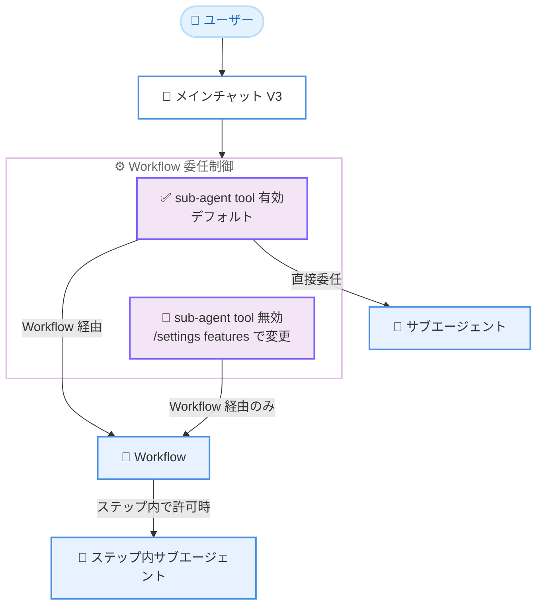

# Kiro - Workflow 委任制御、Steering ライブコンテキスト、保存プロンプトのスラッシュコマンド化

**リリース日**: 2026 年 10 月 1 日
**サービス**: Kiro (CLI 2.27.0)
**機能**: Workflow Delegation, Live Steering Context, and Saved Prompt Commands

📊 [このアップデートのインフォグラフィックを見る](https://takech9203.github.io/aws-news-summary/20261001-kiro-changelog-2026-10-01.html)

## 概要

Kiro CLI 2.27.0 がリリースされ、V3 セッションにおける 3 つの主要な機能強化が導入されました。Workflows 有効時にメインチャットがどのように委任を行うかを制御する新しい設定、ライブなファイル / フォルダコンテキストを参照できる Steering の拡張、そして保存済みプロンプトをスラッシュコマンドとして呼び出せる機能です。あわせて、ローカルの Kiro 状態データへのアクセス制限の強化、ターミナル描画やツールの信頼性改善も含まれています。

**アップデート前の課題**

このアップデート以前には、以下のような課題がありました。

- Workflows を有効にすると、メインチャットがサブエージェントへ直接委任するか Workflow 経由で委任するかを制御できなかった
- Steering ドキュメントではファイル全体の参照しかできず、特定の行や行範囲、フォルダ構成を動的に取り込む手段がなかった
- 保存済みプロンプトを利用するには個別の操作が必要で、チャット内からスラッシュコマンドとして素早く呼び出すことができなかった
- Kiro のホーム状態や過去のセッションデータに対するファイルアクセス権限が緩く、他のローカルユーザーから参照されるリスクがあった

**アップデート後の改善**

今回のアップデートにより、以下が可能になりました。

- 新設定「Workflows: sub-agent tool」により、メインチャットからの委任経路 (サブエージェント直接委任 / Workflow 経由のみ) を制御できるようになった
- Steering で 1 行指定・行範囲指定の `#[[file:...]]` 参照と、1 階層のディレクトリ一覧を取り込む `#[[folder:...]]` 参照が使えるようになった
- ワークスペース、グローバル、MCP の各プロンプトがスラッシュコマンドとして公開され、補完時に引数ヒントも表示されるようになった
- Kiro のホーム状態と過去のセッションデータが所有者のみアクセス可能な権限で保存されるようになった

## アーキテクチャ図



新設定「Workflows: sub-agent tool」によるメインチャットからの委任経路の違いを示しています。設定を無効にしてもサブエージェントは Workflow のステップ内で引き続き利用可能です (エージェント設定で許可されている場合)。

## サービスアップデートの詳細

### 主要機能

1. **Workflow 委任制御 (Workflows: sub-agent tool 設定)**
   - Workflows 有効時、新しい「Workflows: sub-agent tool」設定がデフォルトでオンになり、メインチャットはサブエージェントへの直接委任と Workflow 経由の委任の両方を利用できる
   - `/settings features` でこの設定をオフにすると、メインチャットからの委任は Workflow 経由のみに制限される
   - 設定をオフにしても、エージェント設定で許可されていれば Workflow のステップ内ではサブエージェントを引き続き利用できる

2. **Steering のライブコンテキスト参照**
   - ファイル全体を参照する `#[[file:...]]` 記法がすべてのサーフェス (CLI、IDE、Web) で動作する
   - CLI V3 では 1 行指定および行範囲指定のセレクターが追加され、さらに `#[[folder:...]]` 参照で 1 階層のディレクトリ一覧を取り込める
   - CLI V3 では、参照されたコンテンツは Steering ドキュメントの読み込み時に解決され、セッションのファイル読み取りポリシーに従う

3. **保存プロンプトのスラッシュコマンド化**
   - V3 がワークスペース、グローバル、MCP の各プロンプトをスラッシュコマンドとして公開する
   - コマンド補完時に引数のヒントが表示される
   - プロンプトを呼び出すと、ファイルテンプレートまたは MCP コンテンツが解決され、展開後のテキストがモデルに送信される

4. **ローカル状態のアクセス制限強化**
   - Kiro のホーム状態と過去のセッションデータが所有者のみアクセス可能 (owner-only) な権限で保存されるようになった

## 技術仕様

### 主な改善点

| 項目 | 詳細 |
|------|------|
| V3 セッション再開 | `--resume` が、ローカル / クラウドの起動配置に一致する最新セッションを選択するようになった |
| Workflow ステップのリカバリー | 接続障害時に最大 24 時間その場でリトライしてから一時停止し、Kiro 再起動後に回答されたステップは進行と完了報告を再開する。表示される実行時間から一時停止中の時間が除外される |
| Herdr クラウドリストア | サーバー再起動後にクラウド V3 会話を復元できるようになった (2.26.1 のローカル復元とは別機能) |
| フォーカスされたファイル差分 | フル TUI の書き込みカードがファイル全体ではなく変更行と周辺コンテキストを表示する。デフォルトで最大 40 行の差分を表示し、Ctrl+O または自動展開で完全なライブ差分を確認できる |
| 非対話モードの reasoning effort | `--effort` が非対話実行にも適用されるようになった |
| レジストリ MCP 設定 | レジストリモードで、一致するローカル MCP エントリはレジストリサーバーのコマンドまたは URL を使用しつつ、サポートされるローカルオーバーライドを保持する |
| V3 エージェント一覧 | `kiro-cli agent list` に V3 形式のエージェントが含まれるようになった |
| V3 起動パフォーマンス | 大きな `permissions.yaml` ファイルがある場合、起動が最大約 0.5 秒高速化 |
| V3 todo リストツール | V3 では `todo_list` ツールが提供されなくなり、`chat.enableTodoList` は V3 で無効になった |

### 主な修正点

- 失敗したシェルコマンドの出力と失敗情報が 1 つの output ラベルの下にまとめて表示され、折り返された行が上書きされず、スクロールバック時のトランスクリプトの間隔が安定するようになった
- 未知のエージェント名を指定したサブエージェントリクエストが、デフォルトエージェントのツールを使用するのではなくエラーを報告するようになった
- 選択的な `web_fetch` の結果に上限が設けられ、過大なフォローアップリクエストを防止するようになった
- 遅いテレメトリエクスポートが CLI のシャットダウンを停滞させなくなった
- ホームディレクトリから Kiro を起動した場合に、V3 の `/context` がグローバル Steering を重複表示しなくなった
- アトミックにリネームされたエージェント設定が再起動なしでホットリロードされるようになった
- フルスクリーンでのドラッグコピーが、視覚的に折り返された行ではなく元のメッセージテキストを使用するようになった
- V3 の Workflow ステップが、応答停滞からのリカバリー時に完了済みのツール結果を保持し、再実行しなくなった
- V3 の context-gatherer サブエージェントが調査結果を親に返すようになった
- V3 の trust-all モードが、永続化可能なケイパビリティをエージェントサービスが省略した場合に承認を繰り返し要求しなくなった

## 設定方法

### 前提条件

1. Kiro CLI 2.27.0 以降がインストールされていること
2. V3 セッションを使用していること
3. Workflow 委任制御を使う場合は、Workflows 機能が有効化されていること

### 手順

#### ステップ 1: Workflow 委任の制御

```bash
# V3 セッション内で設定メニューを開く
/settings features
```

`/settings features` から「Workflows: sub-agent tool」設定を切り替えます。オフにすると、メインチャットからの委任が Workflow 経由のみに制限されます。

#### ステップ 2: Steering にライブコンテキストを追加

```markdown
<!-- Steering ドキュメント内の記述例 -->
#[[file:src/config.ts]]
#[[file:src/api/handler.ts:10-45]]
#[[folder:src/components]]
```

Steering ドキュメントにファイル参照 (全体、1 行、行範囲) やフォルダ参照を記述します。CLI V3 では、ドキュメントの読み込み時に参照先の内容が解決されます。

#### ステップ 3: 保存プロンプトをスラッシュコマンドとして使用

```bash
# チャット内でスラッシュを入力すると、保存済みプロンプトが補完候補に表示される
/my-saved-prompt 引数
```

ワークスペース、グローバル、MCP のプロンプトがスラッシュコマンドとして補完され、引数ヒントを確認しながら呼び出せます。

## メリット

### ビジネス面

- **ガバナンスの向上**: 委任経路を Workflow 経由に限定することで、チームで定義した標準化された手順に沿ったエージェント実行を徹底できる
- **生産性の向上**: 保存プロンプトのスラッシュコマンド化により、定型タスクの呼び出しが高速化し、チーム内でのプロンプト再利用が促進される
- **セキュリティ強化**: ローカル状態データの所有者限定アクセスにより、共有マシン環境での情報漏えいリスクが低減される

### 技術面

- **コンテキスト精度の向上**: Steering の行範囲指定やフォルダ参照により、必要最小限かつ常に最新のコンテキストをエージェントに提供できる
- **委任動作の予測可能性**: サブエージェントへの直接委任を制御できるため、Workflows 有効時のエージェント動作が予測しやすくなる
- **信頼性の向上**: Workflow ステップの接続障害リトライ (最大 24 時間)、ツール結果の保持、ターミナル描画の安定化により、長時間タスクの実行信頼性が高まる

## デメリット・制約事項

### 制限事項

- Workflow 委任制御は Workflows 機能が有効な場合にのみ意味を持つ
- Steering の行指定・行範囲指定セレクターと `#[[folder:...]]` 参照は CLI V3 のみで利用可能
- `#[[folder:...]]` 参照で取得できるのは 1 階層のディレクトリ一覧のみ
- V3 では `todo_list` ツールが削除され、`chat.enableTodoList` 設定が無効になった

### 考慮すべき点

- Steering の参照コンテンツはセッションのファイル読み取りポリシーに従って解決されるため、ポリシーで制限されたファイルは取り込まれない
- 保存プロンプトのスラッシュコマンドは展開後のテキストがモデルに送信されるため、プロンプトテンプレートの内容がコンテキスト消費に影響する

## ユースケース

### ユースケース 1: 標準化された Workflow 経由の委任の徹底

**シナリオ**: チームで定義した Workflow レシピに沿ってのみエージェントにタスクを委任させ、アドホックなサブエージェント実行を抑制したい。

**実装例**:
```
/settings features で「Workflows: sub-agent tool」をオフに設定
→ メインチャットからの委任が Workflow 経由のみに制限される
```

**効果**: チームの標準手順に沿ったエージェント実行が徹底され、レビューや承認ポイントを含む Workflow の統制が維持される。

### ユースケース 2: 常に最新のプロジェクト規約を参照する Steering

**シナリオ**: API 仕様ファイルの特定セクションやコンポーネントのディレクトリ構成を、Steering ドキュメントの更新なしで常に最新の状態でエージェントに伝えたい。

**実装例**:
```markdown
# コーディング規約 Steering
#[[file:docs/api-spec.md:1-50]]
#[[folder:src/components]]
```

**効果**: ソースファイルの変更が Steering 読み込み時に自動反映され、ドキュメントの二重管理が不要になる。

### ユースケース 3: 定型レビュープロンプトのスラッシュコマンド化

**シナリオ**: コードレビューやコミットメッセージ作成などの定型プロンプトを、チャット内から素早く呼び出したい。

**実装例**:
```bash
# ワークスペースに保存したプロンプトをスラッシュコマンドで呼び出す
/code-review src/handler.ts
```

**効果**: 引数ヒント付きの補完により定型タスクの実行が高速化し、プロンプトの品質が個人に依存しなくなる。

## 利用可能リージョン

グローバル (Kiro はグローバルに提供されるサービスです)

## 関連サービス・機能

- **Kiro Workflows**: 再利用可能なマルチステップのエージェントプランを実行する機能。CLI 2.26.0 で導入され、今回のアップデートで委任制御が追加された
- **Kiro Steering**: プロジェクト固有のルールやコンテキストをエージェントに伝える仕組み。今回ライブファイル / フォルダ参照が拡張された
- **MCP (Model Context Protocol)**: MCP サーバーが提供するプロンプトも今回のアップデートでスラッシュコマンドとして利用可能になった

## 参考リンク

- 📊 [インフォグラフィック](https://takech9203.github.io/aws-news-summary/20261001-kiro-changelog-2026-10-01.html)
- [Kiro Changelog](https://kiro.dev/changelog/)
- [Kiro CLI 設定ドキュメント (Settings Features)](https://kiro.dev/docs/cli/chat/settings/#settings-features)
- [Kiro Steering ドキュメント (File References)](https://kiro.dev/docs/steering/#file-references)
- [Kiro CLI プロンプト管理ドキュメント](https://kiro.dev/docs/cli/chat/manage-prompts/)

## まとめ

Kiro CLI 2.27.0 は、Workflow 委任の制御、Steering のライブコンテキスト参照、保存プロンプトのスラッシュコマンド化という 3 つの機能強化により、エージェント実行の統制とコンテキスト管理の柔軟性を大きく向上させるアップデートです。Workflows を活用しているチームは `/settings features` で委任ポリシーを確認し、Steering ドキュメントへのライブ参照の導入を検討することを推奨します。
