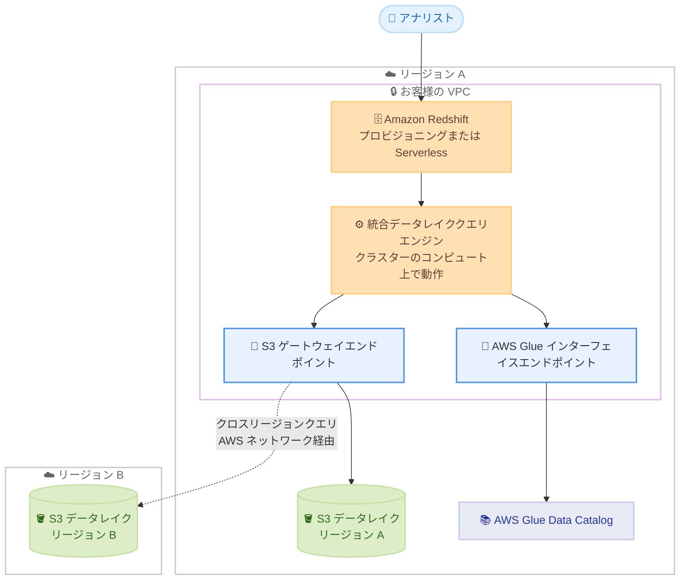

# Amazon Redshift - データレイクに対するクロスリージョンクエリのサポート

**リリース日**: 2026 年 10 月 1 日
**サービス**: Amazon Redshift
**機能**: データレイクに対するクロスリージョンクエリと拡張 VPC ルーティング対応

📊 [このアップデートのインフォグラフィックを見る](https://takech9203.github.io/aws-news-summary/20261001-redshift-cross-Region-queries-for-data-lake.html)

## 概要

Amazon Redshift が、別の AWS リージョンにある Amazon S3 データレイクのテーブルを直接クエリできるようになりました。あわせて、拡張 VPC ルーティング (Enhanced VPC Routing) を有効にすると、データレイククエリにおける S3 と Redshift 間のトラフィックをお客様自身の VPC 内に保持できるようになりました。

これらの機能は、プロビジョニングされたクラスターおよび Redshift Serverless のコンピュートリソース上で直接動作する統合データレイククエリエンジンによって実現されています。クエリエンジンがクラスターのコンピュート上 (VPC 内) で動作するため、拡張 VPC ルーティング使用時には S3 と Redshift 間のトラフィックがパブリックネットワークを経由せず、すべて VPC 内を流れます。

グローバルに分散したデータを持つ企業や、データの移動経路を厳密に管理する必要があるセキュリティ要件の高いお客様が主な対象です。金融、医療、政府機関などの規制業種では、コンプライアンスで求められるネットワーク境界内にクエリトラフィックを保持したまま、リージョンをまたぐ分析が可能になります。

**アップデート前の課題**

- 別リージョンの S3 データレイクを Redshift で分析するには、事前にデータをクエリ実行リージョンへコピーまたはレプリケーションする必要があった
- データのコピーにより、ストレージコストの増加、データ鮮度の低下、パイプライン運用の負担が発生していた
- データレイククエリのトラフィック経路を自社の VPC 内に閉じることができず、厳格なネットワーク統制が求められる環境では採用が難しかった

**アップデート後の改善**

- 別リージョンの S3 データレイクテーブルを、コピーやレプリケーションなしで直接クエリできるようになった
- 拡張 VPC ルーティングを有効にすると、データレイククエリの S3 - Redshift 間トラフィックが VPC 内のみを流れ、パブリックネットワークを経由しなくなった
- データレジデンシー要件により特定リージョンに保持する必要があるデータに対しても、他リージョンからの統合分析やレポーティングが可能になった

## アーキテクチャ図



統合データレイククエリエンジンはクラスターのコンピュート上 (VPC 内) で動作するため、拡張 VPC ルーティング有効時には S3 へのアクセスが VPC エンドポイント経由となり、別リージョンの S3 データレイクへのクエリもコピーなしで直接実行できます。

## サービスアップデートの詳細

### 主要機能

1. **クロスリージョンデータレイククエリ**
   - 別の AWS リージョンにある S3 データレイクテーブルを Redshift から直接クエリ可能
   - 事前のデータコピーやレプリケーションが不要
   - グローバル分析、リージョン横断の統合レポーティング、データレジデンシー要件のあるデータの分析に対応

2. **拡張 VPC ルーティングによるデータレイククエリ**
   - 拡張 VPC ルーティング有効時、S3 と Redshift 間のデータレイククエリトラフィックが VPC 内のみを流れる
   - パブリックネットワークを経由しないため、厳格なネットワーク統制が可能
   - S3 アクセスが VPC エンドポイント経由となるため、特定の VPC エンドポイントからのアクセスのみを許可する S3 バケットポリシーにも対応 (従来の Redshift Spectrum では不可)
   - COPY / UNLOAD と同様に、トラフィックが VPC フローログに記録され監査性が向上

3. **統合データレイククエリエンジン**
   - プロビジョニングされたクラスターおよび Redshift Serverless のコンピュートリソース上で直接動作
   - RA3 / DC2 クラスターで AWS 管理リソース上の Redshift Spectrum がクエリを処理する方式とは異なり、お客様の VPC 内で処理が完結
   - クラスターまたはワークグループにアタッチされた IAM ロールに基づいてアクセスを認可

## 技術仕様

### クエリエンジンの比較

| 項目 | 統合データレイククエリエンジン | Redshift Spectrum |
|------|------|------|
| 対象 | 対応するプロビジョニングクラスター、Redshift Serverless | RA3 / DC2 プロビジョニングクラスター |
| 実行場所 | クラスター / ワークグループ自身のコンピュート (VPC 内) | AWS 管理リソース (VPC 外) |
| 拡張 VPC ルーティング時の S3 トラフィック | VPC エンドポイント経由で VPC 内を流れる | VPC を経由しない (AWS プライベートネットワーク経由) |
| VPC エンドポイント限定の S3 バケットポリシー | 対応 | 非対応 |
| VPC フローログへの記録 | 記録される | 記録されない |

### 拡張 VPC ルーティング利用時に必要な VPC エンドポイント

| エンドポイント | 用途 |
|------|------|
| Amazon S3 ゲートウェイエンドポイント | データレイクのデータファイル読み取り経路 |
| AWS Glue インターフェイスエンドポイント | データレイクのスキーマ / テーブルのメタデータ解決 |
| AWS Lake Formation インターフェイスエンドポイント | Lake Formation 管理テーブルの場合のみ必要 |

### IAM ロールの信頼ポリシー例

クラスターにアタッチする IAM ロールは、Amazon Redshift サービスプリンシパルのみが引き受けられるように設定します。

```json
{
  "Version": "2012-10-17",
  "Statement": [
    {
      "Effect": "Allow",
      "Principal": {
        "Service": "redshift.amazonaws.com"
      },
      "Action": "sts:AssumeRole"
    }
  ]
}
```

## 設定方法

### 前提条件

1. 対応するプロビジョニングクラスターまたは Amazon Redshift Serverless ワークグループを使用していること
2. データレイクテーブルが Amazon S3 にデータを、AWS Glue Data Catalog にメタデータを保持していること
3. クラスター / ワークグループに、対象 S3 バケットと AWS Glue へのアクセスを許可する IAM ロールがアタッチされていること

### 手順

#### ステップ 1: 拡張 VPC ルーティングの有効化

```bash
aws redshift modify-cluster \
  --cluster-identifier my-cluster \
  --enhanced-vpc-routing
```

プロビジョニングクラスターで拡張 VPC ルーティングを有効化します。Redshift Serverless の場合はワークグループ設定で `enhancedVpcRouting` を有効にします。

#### ステップ 2: VPC エンドポイントの作成

```bash
# S3 ゲートウェイエンドポイント
aws ec2 create-vpc-endpoint \
  --vpc-id vpc-xxxxxxxx \
  --service-name com.amazonaws.ap-northeast-1.s3 \
  --vpc-endpoint-type Gateway \
  --route-table-ids rtb-xxxxxxxx

# AWS Glue インターフェイスエンドポイント
aws ec2 create-vpc-endpoint \
  --vpc-id vpc-xxxxxxxx \
  --service-name com.amazonaws.ap-northeast-1.glue \
  --vpc-endpoint-type Interface \
  --subnet-ids subnet-xxxxxxxx \
  --security-group-ids sg-xxxxxxxx
```

クラスター / ワークグループが動作する VPC とサブネットに、S3 ゲートウェイエンドポイントと AWS Glue インターフェイスエンドポイントを作成します。Lake Formation 管理テーブルを使用する場合は Lake Formation のインターフェイスエンドポイントも作成します。

#### ステップ 3: 外部スキーマの作成とクエリの実行

```sql
-- Glue Data Catalog を参照する外部スキーマを作成
CREATE EXTERNAL SCHEMA datalake_schema
FROM DATA CATALOG
DATABASE 'my_datalake_db'
IAM_ROLE 'arn:aws:iam::123456789012:role/myRedshiftRole';

-- 別リージョンの S3 データレイクテーブルをクエリ
SELECT region_name, SUM(sales_amount)
FROM datalake_schema.global_sales
GROUP BY region_name;
```

外部スキーマを作成し、通常の SQL と同じ構文でデータレイクテーブルをクエリします。対象の S3 バケットが別リージョンにある場合も、コピーなしで直接クエリできます。

## メリット

### ビジネス面

- **データ統合コストの削減**: リージョン間のデータコピーやレプリケーションパイプラインが不要になり、ストレージコストと運用負担を削減できる
- **コンプライアンス対応**: データレジデンシー要件で特定リージョンに保持しているデータを移動させずに分析でき、規制業種でも採用しやすい
- **グローバル分析の迅速化**: 世界各地のリージョンに分散したデータを単一の Redshift 環境から統合的に分析でき、意思決定を迅速化できる

### 技術面

- **ネットワーク境界の統制**: 拡張 VPC ルーティングにより S3 - Redshift 間のトラフィックが VPC 内に閉じ、パブリックネットワークを経由しない
- **監査性の向上**: VPC フローログでデータレイククエリのトラフィックを記録でき、セキュリティ監査に活用できる
- **アーキテクチャの簡素化**: クロスリージョンのデータ複製や ETL ジョブが不要になり、データ鮮度の問題も解消される

## デメリット・制約事項

### 制限事項

- 統合データレイククエリエンジンは、対応するプロビジョニングクラスターと Redshift Serverless で利用可能であり、RA3 / DC2 クラスターのデータレイククエリは従来どおり Redshift Spectrum (VPC 外の AWS 管理リソース) で処理される
- 拡張 VPC ルーティング利用時は、S3 / AWS Glue (必要に応じて Lake Formation) の VPC エンドポイントを正しく構成しないとデータレイククエリが失敗する

### 考慮すべき点

- クロスリージョンクエリには標準のデータ転送料金が発生するため、大量データを頻繁にスキャンする場合はコストへの影響を事前に見積もる必要がある
- クロスリージョンアクセスではリージョン間のネットワークレイテンシーがクエリ性能に影響する可能性があるため、頻繁にアクセスするデータについてはパーティショニングやファイルフォーマットの最適化が重要
- S3 バケットポリシーと IAM ロールの設定を見直し、意図したプリンシパルのみがアクセスできるよう構成することが推奨される

## ユースケース

### ユースケース 1: グローバル売上の統合レポーティング

**シナリオ**: 多国籍企業が、米国、欧州、アジアの各リージョンの S3 データレイクに売上データを保持しており、本社のある東京リージョンの Redshift で全世界の売上を統合分析したい。

**実装例**:
```sql
-- 各リージョンのデータレイクテーブルを横断して集計
SELECT country, product_category, SUM(revenue) AS total_revenue
FROM datalake_schema.sales_us
GROUP BY country, product_category
UNION ALL
SELECT country, product_category, SUM(revenue)
FROM datalake_schema.sales_eu
GROUP BY country, product_category;
```

**効果**: リージョン間のデータレプリケーションパイプラインを構築せずに、常に最新のデータでグローバルレポートを作成できる。

### ユースケース 2: データレジデンシー要件下での分析

**シナリオ**: 金融機関が、規制によりデータを特定リージョンから移動できない顧客データを保持している。分析基盤は別リージョンに集約されており、データを移動させずに分析する必要がある。

**実装例**:
```sql
-- データを移動せず、保管リージョンの S3 を直接クエリ
SELECT risk_segment, COUNT(*) AS customer_count
FROM datalake_schema.customer_profiles_eu
WHERE snapshot_date = '2026-09-30'
GROUP BY risk_segment;
```

**効果**: データを規制対象リージョンに保持したまま分析でき、コンプライアンスを維持しながら分析基盤を一元化できる。

### ユースケース 3: 拡張 VPC ルーティングによるセキュアなデータレイク分析

**シナリオ**: 医療機関が、データレイククエリのトラフィックをすべて自社 VPC 内に閉じ、VPC フローログで監査できる状態にすることをセキュリティ要件としている。

**実装例**:
```bash
# 拡張 VPC ルーティングを有効化した Serverless ワークグループを作成
aws redshift-serverless create-workgroup \
  --workgroup-name secure-analytics \
  --namespace-name analytics-ns \
  --enhanced-vpc-routing \
  --subnet-ids subnet-aaaa subnet-bbbb \
  --security-group-ids sg-xxxxxxxx
```

**効果**: データレイククエリのトラフィックがパブリックネットワークを経由せず、VPC エンドポイント限定の S3 バケットポリシーと VPC フローログによる監査で、コンプライアンス要件を満たしたまま分析を実行できる。

## 料金

クロスリージョンクエリには標準のデータ転送料金が発生します。クエリ自体の料金は、プロビジョニングクラスターまたは Redshift Serverless の既存の料金体系に従います。

詳細は [Amazon Redshift 料金ページ](https://aws.amazon.com/redshift/pricing/) および [AWS データ転送料金](https://aws.amazon.com/ec2/pricing/on-demand/#Data_Transfer) を参照してください。

## 利用可能リージョン

統合データレイククエリエンジンに対応するプロビジョニングクラスターおよび Amazon Redshift Serverless が利用可能なすべてのリージョンで利用できます。

## 関連サービス・機能

- **Amazon S3**: データレイクのデータファイルを保存するストレージ。本アップデートにより別リージョンのバケットも直接クエリ可能
- **AWS Glue Data Catalog**: データレイクテーブルのメタデータ (スキーマ、テーブル定義) を管理するカタログ
- **AWS Lake Formation**: データレイクのきめ細かなアクセス制御。Lake Formation 管理テーブルの場合は専用の VPC エンドポイントが必要
- **Amazon Redshift Spectrum**: RA3 / DC2 クラスター向けの従来のデータレイククエリ機能。AWS 管理リソース上で動作する点が統合エンジンと異なる

## 参考リンク

- 📊 [インフォグラフィック](https://takech9203.github.io/aws-news-summary/20261001-redshift-cross-Region-queries-for-data-lake.html)
- [公式発表 (What's New)](https://aws.amazon.com/about-aws/whats-new/2026/10/redshift-cross-Region-queries-for-data-lake)
- [ドキュメント: Querying data lake tables with enhanced VPC routing](https://docs.aws.amazon.com/redshift/latest/mgmt/spectrum-enhanced-vpc.html#spectrum-enhanced-vpc-integrated-engine)
- [Amazon Redshift ドキュメント](https://docs.aws.amazon.com/redshift/)
- [料金ページ](https://aws.amazon.com/redshift/pricing/)

## まとめ

Amazon Redshift のクロスリージョンデータレイククエリにより、リージョン間のデータコピーなしでグローバルなデータレイク分析が可能になりました。あわせて拡張 VPC ルーティング対応により、データレイククエリのトラフィックを VPC 内に閉じられるため、規制業種でも採用しやすくなっています。複数リージョンにデータレイクを展開しているお客様は、既存のレプリケーションパイプラインの簡素化と、VPC エンドポイント構成の見直しから検討することを推奨します。
