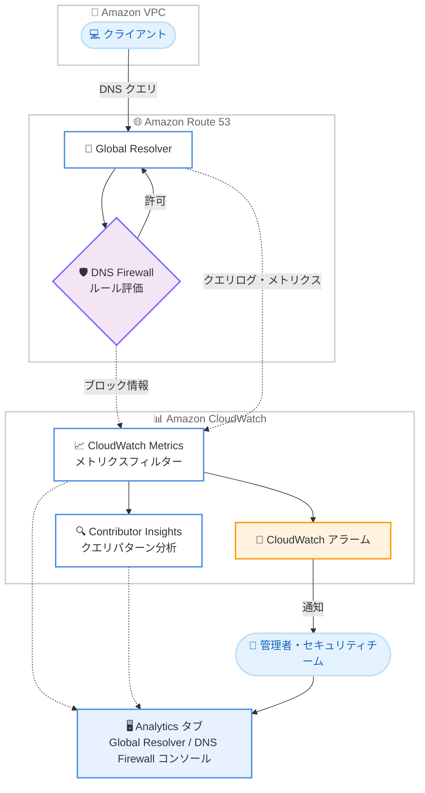

# Amazon Route 53 - Global Resolver と DNS Firewall 向け DNS 分析・インサイト機能

**リリース日**: 2026 年 10 月 1 日
**サービス**: Amazon Route 53 (Global Resolver / DNS Firewall)
**機能**: DNS analytics and insights (Amazon CloudWatch ネイティブ統合)

📊 [このアップデートのインフォグラフィックを見る](https://takech9203.github.io/aws-news-summary/20261001-route-53-dns-analytics-insights.html)

## 概要

Amazon Route 53 Global Resolver と Route 53 Resolver DNS Firewall が、Amazon CloudWatch とのネイティブ統合による DNS 分析・インサイト機能の提供を開始しました。この機能により、ネットワーク管理者やセキュリティチームは、DNS クエリパターンの完全な可観測性を獲得し、DNS Firewall ルールの有効性のモニタリング、異常の検出、DNS パフォーマンスのチューニングを行えるようになります。

CloudWatch Metrics と CloudWatch Contributor Insights を使用して、DNS クエリログの検索・分析、メトリクスフィルターの作成 (例: ブロックされたクエリや DNS レスポンスコードに基づくフィルター)、自動アラームの設定が可能です。また、Global Resolver コンソールと DNS Firewall コンソールの両方に新しい「Analytics」タブが追加され、分析機能へのアクセスが 1 か所に集約されました。

例えば、ブロックされた DNS クエリを VPC 単位でフィルタリングし、「1 時間以内に 10 件を超えるクエリがブロックされた場合」にアラームを発報するといった設定により、脅威への迅速な対応が可能になります。

**アップデート前の課題**

- DNS クエリパターンや DNS Firewall ルールの有効性を把握するには、クエリログを外部に出力して独自に集計・分析する仕組みを構築する必要があった
- ブロックされたクエリや DNS レスポンスコードの傾向を可視化するためのダッシュボードやフィルターを自前で整備する必要があった
- 分析機能がコンソール上の 1 か所にまとまっておらず、DNS の異常検出やパフォーマンスチューニングに手間がかかっていた

**アップデート後の改善**

- CloudWatch Metrics と Contributor Insights により、DNS クエリログの検索・分析、メトリクスフィルターの作成、自動アラームの設定がネイティブに行えるようになった
- Global Resolver と DNS Firewall の両コンソールに追加された「Analytics」タブから、分析機能に 1 か所でアクセスできるようになった
- ブロックされたクエリの VPC 単位のフィルタリングとアラーム設定により、脅威への対応を迅速化できるようになった

## アーキテクチャ図



Global Resolver と DNS Firewall の DNS クエリ情報が CloudWatch に送信され、メトリクスフィルターや Contributor Insights で分析し、アラームで管理者に通知するまでの流れを示しています。分析結果はコンソールの Analytics タブに集約されます。

## サービスアップデートの詳細

### 主要機能

1. **CloudWatch Metrics によるメトリクスフィルターとアラーム**
   - DNS クエリログに対してメトリクスフィルターを作成可能 (例: ブロックされたクエリ、DNS レスポンスコード)
   - フィルターに基づく自動アラームを設定し、しきい値超過時に通知を受け取れる
   - オプトインしたメトリクスには標準の CloudWatch 料金が適用される

2. **CloudWatch Contributor Insights によるクエリパターン分析**
   - DNS クエリログを検索・分析し、クエリパターンの傾向や上位の寄与要素を可視化
   - 異常なクエリ発生元や急増するドメインの特定など、異常検出に活用可能

3. **コンソールの Analytics タブへの集約**
   - Global Resolver コンソールと DNS Firewall コンソールの両方に Analytics タブを追加
   - DNS 分析機能へのアクセスが 1 か所に集約され、運用時の導線が簡素化

4. **DNS Firewall ルール有効性のモニタリング**
   - ブロックされた DNS クエリを VPC 単位でフィルタリング可能
   - 例: 1 時間以内に 10 件を超えるクエリがブロックされた場合にアラームを発報し、脅威対応を迅速化

## 技術仕様

### 分析機能の構成要素

| 項目 | 詳細 |
|------|------|
| 対象サービス | Route 53 Global Resolver、Route 53 Resolver DNS Firewall |
| 分析基盤 | Amazon CloudWatch (Metrics、Contributor Insights、アラーム) |
| 分析対象 | DNS クエリログ、ブロックされたクエリ、DNS レスポンスコードなど |
| フィルタリング単位 | VPC 単位でのフィルタリングに対応 (ブロックされたクエリの例) |
| コンソール | Global Resolver / DNS Firewall 両コンソールの Analytics タブ |
| 料金 | オプトインしたメトリクスに標準の CloudWatch 料金が適用 |

## 設定方法

### 前提条件

1. Route 53 Global Resolver または Route 53 Resolver DNS Firewall を利用していること
2. CloudWatch および Route 53 の操作に必要な IAM 権限を保有していること
3. 分析対象とする DNS クエリログやメトリクスへのオプトイン設定を行うこと

### 手順

#### ステップ 1: Analytics タブへのアクセス

Route 53 コンソールで Global Resolver または DNS Firewall のページを開き、新しく追加された「Analytics」タブを選択します。ここから DNS クエリパターンの分析やメトリクスの確認を 1 か所で行えます。

#### ステップ 2: メトリクスフィルターの作成

```bash
# DNS クエリログのロググループに対してメトリクスフィルターを作成する例
aws logs put-metric-filter \
  --log-group-name "<DNS クエリログのロググループ名>" \
  --filter-name "BlockedDnsQueries" \
  --filter-pattern '{ $.firewall_rule_action = "BLOCK" }' \
  --metric-transformations \
    metricName=BlockedQueryCount,metricNamespace=DNS/Firewall,metricValue=1
```

DNS クエリログからブロックされたクエリを抽出し、カスタムメトリクス (BlockedQueryCount) として CloudWatch に記録するメトリクスフィルターを作成しています。レスポンスコードなど他の条件でもフィルターを作成できます。

#### ステップ 3: アラームの設定

```bash
# ブロックされたクエリが 1 時間に 10 件を超えた場合のアラームを作成する例
aws cloudwatch put-metric-alarm \
  --alarm-name "HighBlockedDnsQueries" \
  --namespace "DNS/Firewall" \
  --metric-name "BlockedQueryCount" \
  --statistic Sum \
  --period 3600 \
  --threshold 10 \
  --comparison-operator GreaterThanThreshold \
  --evaluation-periods 1 \
  --alarm-actions "<SNS トピックの ARN>"
```

ステップ 2 で作成したメトリクスを 1 時間単位で集計し、ブロックされたクエリが 10 件を超えた場合に Amazon SNS 経由で通知するアラームを作成しています。これにより脅威への迅速な対応が可能になります。

## メリット

### ビジネス面

- **セキュリティ対応の迅速化**: ブロックされたクエリの急増をアラームで即座に検知でき、脅威への初動対応時間を短縮できる
- **運用コストの削減**: DNS 分析用の独自の集計・可視化基盤を構築・維持する必要がなくなる
- **ガバナンスの向上**: DNS Firewall ルールの有効性を継続的にモニタリングし、ポリシーの改善サイクルを回せる

### 技術面

- **ネイティブな CloudWatch 統合**: 既存の CloudWatch の運用 (ダッシュボード、アラーム、通知) に DNS 分析をそのまま組み込める
- **柔軟なフィルタリング**: ブロックされたクエリや DNS レスポンスコードなど、目的に応じたメトリクスフィルターを作成できる
- **一元化されたコンソール体験**: Analytics タブにより、Global Resolver と DNS Firewall の分析導線が統一される

## デメリット・制約事項

### 制限事項

- オプトインしたメトリクスには標準の CloudWatch 料金が発生する
- CloudWatch、Route 53 Global Resolver、DNS Firewall が提供されているリージョンでのみ利用可能

### 考慮すべき点

- クエリ量の多い環境では、メトリクスや Contributor Insights のコストを事前に見積もることを推奨
- アラームのしきい値 (例: 1 時間あたりのブロック件数) は、環境ごとの平常時のクエリパターンを把握した上で調整が必要

## ユースケース

### ユースケース 1: DNS Firewall によるブロックの急増検知

**シナリオ**: マルウェア感染や設定ミスにより、特定の VPC から悪性ドメインへの DNS クエリが急増し、DNS Firewall でブロックされるケースを早期に検知したい。

**実装例**:
```
1. DNS Firewall のブロックされたクエリに対するメトリクスフィルターを VPC 単位で作成
2. 1 時間以内に 10 件を超えるブロックが発生した場合のアラームを設定
3. SNS 経由でセキュリティチームに通知
```

**効果**: 感染端末や不審な通信の存在を早期に把握し、インシデント対応を迅速化できる。

### ユースケース 2: DNS レスポンスコードによる障害の切り分け

**シナリオ**: アプリケーションの名前解決エラーが増加しており、SERVFAIL や NXDOMAIN などのレスポンスコードの傾向から原因を切り分けたい。

**実装例**:
```
1. DNS レスポンスコードごとのメトリクスフィルターを作成
2. Analytics タブと CloudWatch ダッシュボードでレスポンスコードの推移を可視化
3. 特定コードの増加に対してアラームを設定
```

**効果**: ゾーン設定ミスやフォワーダー障害などの原因を迅速に特定し、DNS パフォーマンスをチューニングできる。

### ユースケース 3: Contributor Insights によるクエリパターンの分析

**シナリオ**: 組織全体の DNS クエリの傾向を把握し、クエリ量の多い発生元や頻繁に照会されるドメインを特定して、キャッシュ戦略や Firewall ルールの改善に役立てたい。

**実装例**:
```
1. DNS クエリログに対して Contributor Insights ルールを作成
2. クエリ量上位の VPC・ドメインを継続的に可視化
3. 分析結果に基づき DNS Firewall ルールやアーキテクチャを最適化
```

**効果**: データに基づいた DNS Firewall ルールの改善と、DNS インフラ全体の最適化を実現できる。

## 料金

オプトインしたメトリクスに対して、標準の Amazon CloudWatch 料金が適用されます。メトリクス数、アラーム数、Contributor Insights ルール数などに応じた従量課金となるため、詳細は [CloudWatch 料金ページ](https://aws.amazon.com/cloudwatch/pricing/) を参照してください。

## 利用可能リージョン

Amazon CloudWatch、Route 53 Global Resolver、DNS Firewall が提供されているすべての AWS リージョンで利用可能です。

## 関連サービス・機能

- **Amazon CloudWatch**: メトリクス、メトリクスフィルター、アラーム、Contributor Insights を提供する分析基盤
- **Route 53 Resolver DNS Firewall**: VPC からのアウトバウンド DNS クエリをドメインリストやルールでフィルタリングするサービス。今回のアップデートでルール有効性のモニタリングが強化
- **Route 53 Global Resolver**: 複数リージョンにまたがる DNS 解決を一元管理するリゾルバー。今回のアップデートでクエリパターンの可観測性が向上
- **Amazon SNS**: CloudWatch アラームからの通知先として利用可能

## 参考リンク

- 📊 [インフォグラフィック](https://takech9203.github.io/aws-news-summary/20261001-route-53-dns-analytics-insights.html)
- [公式発表 (What's New)](https://aws.amazon.com/about-aws/whats-new/2026/10/route-53-dns-analytics-insights/)
- [Amazon Route 53 ドキュメント](https://docs.aws.amazon.com/Route53/latest/DeveloperGuide/Welcome.html)
- [CloudWatch 料金ページ](https://aws.amazon.com/cloudwatch/pricing/)

## まとめ

Route 53 Global Resolver と DNS Firewall に CloudWatch ネイティブの分析・インサイト機能が追加され、DNS クエリパターンの可観測性と DNS Firewall ルールの有効性モニタリングが大幅に強化されました。DNS Firewall を利用中の組織は、まず Analytics タブで現状のクエリパターンを確認し、ブロックされたクエリに対するメトリクスフィルターとアラームの設定から始めることを推奨します。
