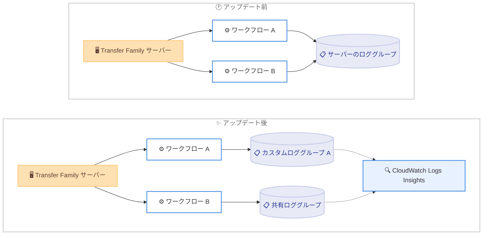

# AWS Transfer Family - マネージドワークフロー向けカスタム CloudWatch ロググループのサポート

**リリース日**: 2026 年 10 月 1 日
**サービス**: AWS Transfer Family
**機能**: マネージドワークフローのカスタム CloudWatch ロググループ指定

📊 [このアップデートのインフォグラフィックを見る](https://takech9203.github.io/aws-news-summary/20261001-transfer-family-custom-cloudwatch-log-groups.html)

## 概要

AWS Transfer Family は、マネージドワークフローの実行ログの出力先として、カスタムの Amazon CloudWatch Logs ロググループを指定できるようになりました。これにより、個々のワークフローを個別にモニタリングしたり、関連する複数のワークフローのログを 1 つのロググループに集約したりすることが可能になります。

ワークフローの作成時に、コンソールまたは API からワークフローレベルのロググループをサーバーのロググループとは別に選択できます。指定した場合、ログは選択したロググループにのみ送信され、サーバーのロギングロールは不要です。ログは既存の構造化 JSON 形式を維持するため、CloudWatch Logs Insights によるクエリも引き続き利用できます。

ファイル転送後の処理 (コピー、タグ付け、復号、カスタム処理など) をワークフローで自動化しているユーザーにとって、ログの分離・集約による運用性向上が期待できるアップデートです。

**アップデート前の課題**

- 以前は、サーバーにアタッチされたすべてのワークフローの実行ログがそのサーバーのロググループに送信され、ワークフローごとに出力先を選択できなかった
- 複数のワークフローのログが混在するため、特定のワークフローだけをモニタリングすることが困難だった
- 関連するワークフローのログを横断的に集約してメトリクスやダッシュボードを構築することが難しかった

**アップデート後の改善**

- ワークフロー作成時に、サーバーとは別のワークフローレベルのロググループを指定できるようになった
- カスタムロググループを指定した場合、サーバーのロギングロールが不要になった
- 複数のワークフローで 1 つのロググループを共有し、統合されたメトリクスやダッシュボードを構築できるようになった

## アーキテクチャ図



アップデート前はすべてのワークフロー実行ログがサーバーのロググループに集約されていましたが、アップデート後はワークフローごとにカスタムロググループを指定でき、ログの分離や関連ワークフロー間での共有が可能になります。

## サービスアップデートの詳細

### 主要機能

1. **ワークフローレベルのロググループ指定**
   - ワークフロー作成時に、コンソールまたは API からサーバーとは別のロググループを選択可能
   - 指定した場合、実行ログは選択したロググループにのみ送信される
   - カスタムロググループを指定した場合、サーバーのロギングロールは不要

2. **構造化 JSON 形式の維持**
   - ログは既存の構造化 JSON 形式を維持
   - CloudWatch Logs Insights による既存のクエリをそのまま利用可能

3. **ログの集約と分離の柔軟な設計**
   - 複数のワークフローで 1 つのロググループを共有し、統合メトリクスやダッシュボードを構築可能
   - ワークフローごとにロググループを分けて、個別のモニタリングやアクセス制御を実現可能

4. **既存ワークフローとの互換性**
   - 構造化ログの出力先を指定しない場合、サーバーのロールベースのロギングが設定されていればそちらにフォールバック
   - 既存のワークフローは現在の設定を維持

## 技術仕様

### ロギング動作の比較

| 項目 | アップデート前 | アップデート後 |
|------|--------------|--------------|
| ログ出力先 | サーバーのロググループのみ | ワークフローごとにカスタムロググループを指定可能 |
| ロギングロール | サーバーのロギングロールが必要 | カスタムロググループ指定時は不要 |
| ログ形式 | 構造化 JSON | 構造化 JSON (変更なし) |
| ログの集約 | サーバー単位 | ワークフロー単位または複数ワークフローで共有 |

### API変更履歴

| 日付 | サービス | 変更内容 |
|------|----------|----------|
| 2026/10/01 | [transfer](https://awsapichanges.com/archive/changes/646bd4-transfer.html) | 2 updated api methods - `CreateWorkflow` と `DescribeWorkflow` に `StructuredLogDestinations` パラメータを追加 |

### API パラメータ例

`CreateWorkflow` API に `StructuredLogDestinations` パラメータが追加されました。

```json
{
  "Description": "Post-upload processing workflow",
  "Steps": [
    {
      "Type": "COPY",
      "CopyStepDetails": {
        "Name": "CopyToProcessed",
        "DestinationFileLocation": {
          "S3FileLocation": {
            "Bucket": "my-processed-bucket",
            "Key": "processed/"
          }
        }
      }
    }
  ],
  "StructuredLogDestinations": [
    "arn:aws:logs:us-east-1:123456789012:log-group:/custom/transfer-workflow-logs"
  ]
}
```

## 設定方法

### 前提条件

1. AWS Transfer Family のサーバーが作成済みであること
2. 出力先となる CloudWatch Logs ロググループが作成済みであること
3. ワークフローを作成・更新する IAM 権限があること

### 手順

#### ステップ1: カスタムロググループの作成

```bash
aws logs create-log-group \
  --log-group-name /custom/transfer-workflow-logs
```

ワークフロー実行ログの出力先となる CloudWatch Logs ロググループを作成します。

#### ステップ2: カスタムロググループを指定してワークフローを作成

```bash
aws transfer create-workflow \
  --description "Post-upload processing workflow" \
  --steps file://workflow-steps.json \
  --structured-log-destinations \
    "arn:aws:logs:us-east-1:123456789012:log-group:/custom/transfer-workflow-logs"
```

`--structured-log-destinations` オプションでカスタムロググループの ARN を指定してワークフローを作成します。実行ログは指定したロググループにのみ送信されます。

#### ステップ3: ワークフロー設定の確認

```bash
aws transfer describe-workflow \
  --workflow-id w-1234567890abcdef0
```

作成したワークフローの詳細を取得し、レスポンスの `StructuredLogDestinations` フィールドでロググループが正しく設定されていることを確認します。

## メリット

### ビジネス面

- **運用の可視性向上**: ワークフロー単位でログを分離することで、業務プロセスごとのモニタリングと障害切り分けが容易になる
- **コンプライアンス対応**: 部門やパートナーごとにログを分離し、ロググループ単位のアクセス制御や保持期間設定を適用できる
- **ダッシュボードの統合**: 関連するワークフローのログを 1 つのロググループに集約し、統合メトリクスやダッシュボードを構築できる

### 技術面

- **権限管理の簡素化**: カスタムロググループを指定した場合、サーバーのロギングロールが不要になる
- **既存クエリとの互換性**: 構造化 JSON 形式が維持されるため、CloudWatch Logs Insights の既存クエリを変更せずに利用できる
- **柔軟なログ設計**: ワークフローごとの分離と複数ワークフローでの共有の両方に対応できる

## デメリット・制約事項

### 制限事項

- ロググループの指定はワークフロー単位であり、ワークフロー内のステップ単位での出力先指定はできない
- カスタムロググループを指定した場合、ログはそのロググループにのみ送信される (サーバーのロググループには送信されない)

### 考慮すべき点

- 既存のワークフローは現在のロギング設定を維持するため、カスタムロググループを利用するには設定の変更が必要
- 構造化ログの出力先を指定しない場合は、サーバーのロールベースのロギング設定へのフォールバックとなるため、ロギング方式の使い分けを設計しておく必要がある
- ロググループごとに保持期間や暗号化設定を管理する運用が必要になる

## ユースケース

### ユースケース1: 業務プロセスごとのログ分離

**シナリオ**: 複数の取引先からのファイル受信を 1 つの SFTP サーバーで処理しており、取引先ごとに異なるワークフロー (復号、コピー、タグ付けなど) を実行している。取引先ごとに運用チームが異なるため、ログを分離したい。

**実装例**:
```bash
# 取引先 A 用のワークフロー
aws transfer create-workflow \
  --description "Partner A processing" \
  --steps file://partner-a-steps.json \
  --structured-log-destinations \
    "arn:aws:logs:us-east-1:123456789012:log-group:/transfer/partner-a"
```

**効果**: 取引先ごとにロググループが分離され、各運用チームは担当するワークフローのログだけにアクセスできる。障害時の切り分けも迅速になる。

### ユースケース2: 関連ワークフローのログ集約と統合ダッシュボード

**シナリオ**: 複数のサーバーに分散した関連ワークフロー (例: すべての PGP 復号処理) の実行状況を 1 つのダッシュボードで横断的に監視したい。

**実装例**:
```bash
# 複数のワークフローで同じロググループを指定
aws transfer create-workflow \
  --description "Decrypt workflow for server 1" \
  --steps file://decrypt-steps.json \
  --structured-log-destinations \
    "arn:aws:logs:us-east-1:123456789012:log-group:/transfer/decrypt-workflows"
```

**効果**: 複数のワークフローのログが 1 つのロググループに集約され、CloudWatch Logs Insights やメトリクスフィルターで統合的な監視とアラートを構築できる。

### ユースケース3: ロギングロール不要のシンプルな構成

**シナリオ**: 新規にワークフローを構築する際、サーバーのロギングロールの作成・管理を省略し、権限設定をシンプルにしたい。

**実装例**:
```bash
aws transfer create-workflow \
  --description "Simple copy workflow" \
  --steps file://copy-steps.json \
  --structured-log-destinations \
    "arn:aws:logs:us-east-1:123456789012:log-group:/transfer/copy-workflow"
```

**効果**: サーバーのロギングロールを設定することなくワークフロー実行ログを取得でき、IAM ロールの管理負荷が軽減される。

## 料金

このアップデートに伴う Transfer Family の追加料金はありません。CloudWatch Logs の取り込み・保存については、CloudWatch の標準料金が適用されます。

## 利用可能リージョン

Transfer Family マネージドワークフローが提供されているすべての AWS リージョンで利用可能です。

## 関連サービス・機能

- **Amazon CloudWatch Logs**: ワークフロー実行ログの出力先。ロググループ単位の保持期間設定、アクセス制御、暗号化が可能
- **CloudWatch Logs Insights**: 構造化 JSON 形式のワークフローログをクエリして分析可能
- **AWS Transfer Family マネージドワークフロー**: ファイル転送後の処理 (コピー、タグ付け、削除、復号、カスタムステップ) を自動化する機能

## 参考リンク

- 📊 [インフォグラフィック](https://takech9203.github.io/aws-news-summary/20261001-transfer-family-custom-cloudwatch-log-groups.html)
- [公式発表 (What's New)](https://aws.amazon.com/about-aws/whats-new/2026/10/transfer-family-custom-cloudwatch-log-groups/)
- [ドキュメント: Transfer Family managed workflows](https://docs.aws.amazon.com/transfer/latest/userguide/transfer-workflows.html)
- [API 変更履歴 (awsapichanges.com)](https://awsapichanges.com/archive/changes/646bd4-transfer.html)
- [料金ページ](https://aws.amazon.com/aws-transfer-family/pricing/)

## まとめ

AWS Transfer Family のマネージドワークフローで、実行ログの出力先としてカスタム CloudWatch ロググループを指定できるようになり、ワークフロー単位のログ分離や関連ワークフロー間でのログ集約が可能になりました。カスタムロググループ指定時はサーバーのロギングロールが不要になるため、権限管理もシンプルになります。マネージドワークフローを利用している場合は、モニタリング要件に合わせたロググループ設計の見直しを推奨します。
