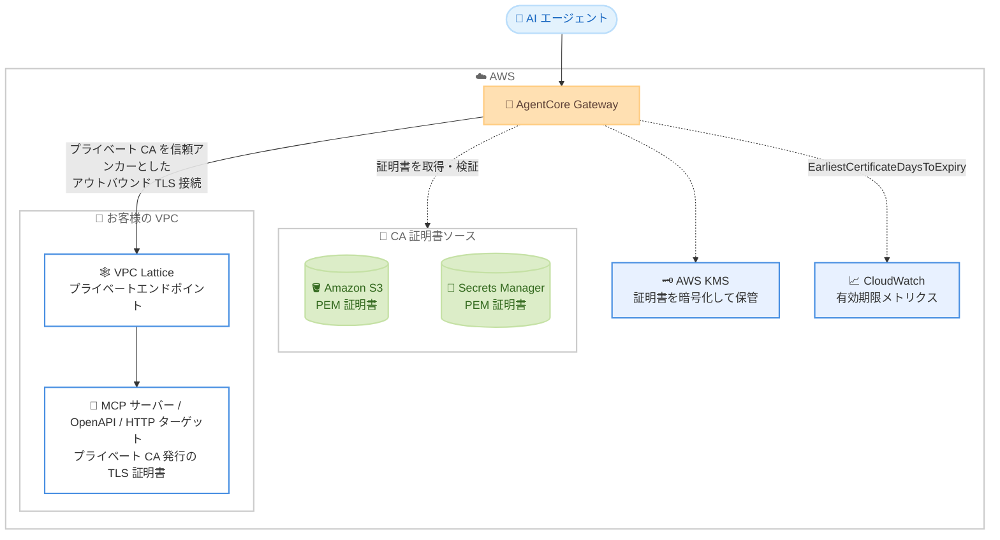

# Amazon Bedrock AgentCore Gateway - VPC エンドポイント向けプライベート TLS 証明書サポート

**リリース日**: 2026 年 10 月 2 日
**サービス**: Amazon Bedrock AgentCore (AgentCore Gateway)
**機能**: ゲートウェイターゲットにおけるプライベート認証局 (CA) 発行 TLS 証明書のサポート

📊 [このアップデートのインフォグラフィックを見る](https://takech9203.github.io/aws-news-summary/20261002-agentcore-gateway-private-tls-vpc.html)

## 概要

Amazon Bedrock AgentCore Gateway が、プライベート認証局 (CA) が発行した TLS 証明書を使用するゲートウェイターゲットへの接続をサポートしました。Amazon VPC Lattice を利用したプライベートエンドポイント (`privateEndpoint`) を持つ MCP サーバーターゲット、OpenAPI ターゲット、HTTP プロキシ (パススルー) ターゲットに対して、独自のプライベート CA 証明書を信頼アンカーとして登録できます。

Amazon S3 または AWS Secrets Manager に保存した PEM 形式の CA 証明書を `certificateConfigurations` パラメータで参照するだけで、ゲートウェイが証明書を取得・検証・暗号化し、該当ターゲットへのアウトバウンド TLS 接続の信頼アンカーとして使用します。これにより、VPC 内の自己署名または社内 CA 発行の証明書を使用するプライベートエンドポイントへ、中間の Application Load Balancer を配置することなくネイティブに接続できるようになりました。

このアップデートは、企業の内部 PKI でサービスを運用しながら、AI エージェントから VPC 内のツールやサービスへセキュアにアクセスしたいエンタープライズユーザーに特に有用です。

**アップデート前の課題**

これまで AgentCore Gateway のアウトバウンド TLS 接続では、パブリック CA が発行したサーバー証明書のみが信頼されていました。

- 以前はプライベート CA 発行の証明書を使用する VPC 内ターゲットに直接接続できなかった
- 以前はプライベート CA を使用するターゲットの前段に、パブリック証明書を終端する内部 Application Load Balancer などの中間コンポーネントを配置する必要があった
- 以前は社内 PKI ポリシーに準拠したまま AgentCore Gateway を利用することが困難で、追加のインフラコストと運用負荷が発生していた

**アップデート後の改善**

今回のアップデートにより、プライベート CA を直接信頼する構成が可能になりました。

- 今回のアップデートにより、プライベート CA 発行の TLS 証明書を使用する VPC 内ターゲットへネイティブに接続可能になった
- 今回のアップデートにより、中間の Application Load Balancer が不要になり、構成の簡素化とコスト削減が実現した
- 今回のアップデートにより、S3 または Secrets Manager に保存した CA 証明書を参照するだけで設定でき、証明書の内容を API リクエストに含める必要がなくなった
- 今回のアップデートにより、CloudWatch メトリクス `EarliestCertificateDaysToExpiry` で証明書の有効期限を監視できるようになった

## アーキテクチャ図



AgentCore Gateway はターゲットの作成・更新時に S3 または Secrets Manager から PEM 形式の CA 証明書を取得・検証し、KMS で暗号化して保管します。以降、その CA を信頼アンカーとして VPC Lattice 経由のプライベートターゲットへアウトバウンド TLS 接続を確立します。

## サービスアップデートの詳細

### 主要機能

1. **プライベート CA 証明書の登録**
   - `CreateGatewayTarget` および `UpdateGatewayTarget` の新しい `certificateConfigurations` パラメータで、ターゲットごとに CA 証明書を登録
   - 証明書の内容そのものではなく、S3 URI または Secrets Manager のシークレット ARN への参照を指定
   - ゲートウェイが証明書を取得・検証した後、ゲートウェイ専用の KMS キーで暗号化して保管

2. **対応ターゲットタイプ**
   - MCP サーバーターゲット (`targetConfiguration.mcp.mcpServer`)
   - OpenAPI ターゲット (`targetConfiguration.mcp.openApiSchema`)
   - HTTP プロキシ / パススルーターゲット (`targetConfiguration.http.passthrough`)
   - いずれも VPC Lattice を利用したプライベートエンドポイント (`privateEndpoint`) の構成が前提 (マネージド / セルフマネージドの両方に対応)

3. **証明書の有効期限監視**
   - CloudWatch メトリクス `EarliestCertificateDaysToExpiry` で、設定した CA 証明書チェーン内の最も早い有効期限までの残日数を確認可能
   - 負の値は証明書がすでに失効していることを示す
   - CloudWatch アラームと組み合わせることで、期限切れ前の証明書ローテーションを計画できる

4. **証明書のローテーションと削除**
   - `UpdateGatewayTarget` で新しい証明書への差し替えが可能
   - `certificateConfigurations` を省略して更新すると、パブリック CA 信頼に戻る
   - 更新に失敗した場合、ターゲットは既存の有効な証明書で動作を継続

## 技術仕様

### 証明書要件

| 項目 | 詳細 |
|------|------|
| 形式 | PEM エンコードされた X.509 証明書 |
| 証明書タイプ | CA 証明書 (basic constraints 拡張が `CA:TRUE`)。リーフ証明書は拒否される |
| 有効期限 | 有効期間内であること。期限切れの場合、ターゲットは `FAILED` または `UPDATE_UNSUCCESSFUL` ステータスになる |
| サイズ上限 | 証明書チェーン全体を含む PEM ファイルで最大 16 KB |
| S3 の場合 | S3 オブジェクトはゲートウェイと同一リージョンに存在する必要がある |
| Secrets Manager の場合 | 文字列シークレットのみ対応 (バイナリシークレットは不可) |
| チェーン | 複数証明書を含むチェーンに対応。最も早い `notAfter` が有効期限として記録される |

### 証明書ソースの指定

| ソース | フィールド | 説明 |
|--------|-----------|------|
| Amazon S3 | `s3.uri` (必須) | `s3://bucket/key.pem` 形式の S3 URI |
| Amazon S3 | `s3.bucketOwnerAccountId` (任意) | バケット所有者の 12 桁の AWS アカウント ID。バケット所有者条件で検証される |
| Secrets Manager | `secretsManager.secretArn` (必須) | シークレットの ARN |

`certificateConfigurations` 配列にはちょうど 1 つのエントリを含め、`s3` または `secretsManager` のいずれか一方のみを指定します。

### API 変更履歴

| 日付 | サービス | 変更内容 |
|------|----------|----------|
| 2026/09/30 | [Amazon Bedrock AgentCore Control](https://awsapichanges.com/archive/changes/ca596c-bedrock-agentcore-control.html) | 5 updated api methods - `CreateGatewayTarget` / `UpdateGatewayTarget` への `certificateConfigurations` パラメータの追加 |

### 必要な IAM / KMS 権限

ゲートウェイはゲートウェイ実行ロールを使用して CA 証明書を取得します。実行ロールに以下の権限が必要です。

```json
{
  "Version": "2012-10-17",
  "Statement": [
    {
      "Effect": "Allow",
      "Action": ["s3:GetObject"],
      "Resource": "arn:aws:s3:::my-ca-bucket/private-ca.pem"
    },
    {
      "Effect": "Allow",
      "Action": ["secretsmanager:GetSecretValue"],
      "Resource": "arn:aws:secretsmanager:us-west-2:111122223333:secret:private-ca-AbCdEf"
    }
  ]
}
```

S3 オブジェクトまたはシークレットが KMS カスタマーマネージドキーで暗号化されている場合は、そのキーに対する復号権限 (`kms:Decrypt`) も必要です。また、実行ロールの信頼ポリシーで AgentCore Gateway サービス (`bedrock-agentcore.amazonaws.com`) によるロールの引き受けを許可しておく必要があります。

## 設定方法

### 前提条件

1. ターゲットが VPC Lattice を利用したプライベートエンドポイント (`privateEndpoint`) を使用していること (マネージド / セルフマネージドの両方に対応)
2. ターゲットタイプが MCP サーバー、OpenAPI、HTTP プロキシのいずれかであること
3. CA 証明書が証明書要件 (PEM 形式、`CA:TRUE`、16 KB 以下、有効期間内) を満たしていること
4. ゲートウェイ実行ロールに証明書ソースへのアクセス権限が付与されていること

### 手順

#### ステップ 1: CA 証明書を S3 または Secrets Manager に保存

```bash
# S3 に保存する場合
aws s3 cp private-ca.pem s3://my-ca-bucket/private-ca.pem

# Secrets Manager に保存する場合
aws secretsmanager create-secret \
  --name private-ca \
  --secret-string file://private-ca.pem
```

PEM 形式のプライベート CA 証明書を、ゲートウェイと同一リージョンの S3 バケットにアップロードするか、Secrets Manager に文字列シークレットとして登録します。

#### ステップ 2: certificateConfigurations を指定してゲートウェイターゲットを作成

```json
{
  "name": "my-private-mcp-target",
  "privateEndpoint": {
    "managedVpcResource": {
      "vpcIdentifier": "vpc-0abc123def456",
      "subnetIds": ["subnet-0abc123", "subnet-0def456"],
      "endpointIpAddressType": "IPV4",
      "securityGroupIds": ["sg-0abc123def"]
    }
  },
  "targetConfiguration": {
    "mcp": {
      "mcpServer": {
        "endpoint": "https://my-mcp-server.internal.example.com/mcp"
      }
    }
  },
  "certificateConfigurations": [
    {
      "s3": {
        "uri": "s3://my-ca-bucket/private-ca.pem",
        "bucketOwnerAccountId": "111122223333"
      }
    }
  ]
}
```

`CreateGatewayTarget` API のリクエストボディで、プライベートエンドポイント構成とともに `certificateConfigurations` を指定します。ゲートウェイが証明書を非同期で取得・検証し、成功するとターゲットが `READY` ステータスになります。

#### ステップ 3: ターゲットのステータスと有効期限監視を設定

```bash
# ターゲットのステータスを確認
aws bedrock-agentcore-control get-gateway-target \
  --gateway-identifier my-gateway-d4jrgkaske \
  --target-id <target-id>

# 証明書有効期限のアラームを作成
aws cloudwatch put-metric-alarm \
  --alarm-name agentcore-gateway-cert-expiry \
  --metric-name EarliestCertificateDaysToExpiry \
  --comparison-operator LessThanOrEqualToThreshold \
  --threshold 30 \
  --evaluation-periods 1 \
  --period 86400 \
  --statistic Minimum \
  --namespace <AgentCore Gateway の名前空間>
```

ターゲットが `READY` ステータスであることを確認し、`EarliestCertificateDaysToExpiry` メトリクスに対する CloudWatch アラーム (例: 残り 30 日でトリガー) を設定して、期限切れ前の証明書ローテーションに備えます。検証に失敗した場合は `statusReasons` フィールドで原因を確認できます。

## メリット

### ビジネス面

- **インフラコストの削減**: 中間の Application Load Balancer が不要になり、ALB の運用コストと管理負荷を削減できる
- **コンプライアンス対応**: 社内 PKI ポリシーに準拠したまま AI エージェント基盤を構築でき、エンタープライズのセキュリティ要件を満たしやすい
- **導入の迅速化**: 既存のプライベート CA 発行証明書をそのまま利用でき、証明書の再発行やドメイン構成の変更が不要

### 技術面

- **エンドツーエンドのプライベート接続**: VPC Lattice 経由のプライベートエンドポイントに対し、プライベート CA を信頼アンカーとした TLS 接続をネイティブに確立できる
- **セキュアな証明書管理**: 証明書の内容は API リクエストに含まれず、取得後はゲートウェイの KMS キーで暗号化して保管される
- **運用の可視性**: CloudWatch メトリクスによる有効期限監視と、`statusReasons` による検証失敗理由の確認が可能
- **安全な更新動作**: 証明書の更新に失敗しても既存の有効な証明書で動作が継続し、サービス断を防げる

## デメリット・制約事項

### 制限事項

- プライベートエンドポイント (`privateEndpoint`) を使用するターゲットのみが対象。パブリックエンドポイントのターゲットでは利用できない
- 対応ターゲットタイプは MCP サーバー、OpenAPI、HTTP プロキシのみ。Smithy ターゲットや Lambda ターゲットは対象外
- `certificateConfigurations` にはちょうど 1 つのエントリしか指定できない
- PEM ファイルは証明書チェーン全体を含めて 16 KB 以下に制限される
- S3 に保存する場合、オブジェクトはゲートウェイと同一リージョンに存在する必要がある
- Secrets Manager のバイナリシークレットは利用できない

### 考慮すべき点

- **証明書失効チェックは行われない**: ゲートウェイは CRL や OCSP による失効確認を実施しない。失効した証明書への信頼を止めるには、`UpdateGatewayTarget` で信頼材料を更新する必要がある
- **証明書変更の反映に遅延がある**: ゲートウェイは確立済みの TLS 接続を最大 900 秒 (15 分) 再利用するため、証明書のローテーションや削除が既存接続に完全に反映されるまで最大 15 分かかる
- **期限切れでターゲットが到達不能になる**: 証明書が期限切れになると TLS ハンドシェイクが失敗し、ツール呼び出しが失敗する。`EarliestCertificateDaysToExpiry` の監視が強く推奨される
- **SAN の一致が必要**: ターゲットサーバー証明書の SAN がターゲットホストと一致しない場合、ハンドシェイクはクライアント側構成エラーとして失敗する
- **証明書の検証は非同期**: 期限切れ証明書などの問題は即時エラーではなく、ターゲットの `FAILED` / `UPDATE_UNSUCCESSFUL` ステータスとして現れる

## ユースケース

### ユースケース 1: 社内 PKI 配下の自己ホスト MCP サーバーへの接続

**シナリオ**: 金融機関が VPC 内で自己ホストする MCP サーバー群を社内 CA 発行の証明書で運用しており、AI エージェントからこれらのツールを利用したい。

**実装例**:
```json
{
  "name": "internal-tools-mcp",
  "privateEndpoint": {
    "managedVpcResource": {
      "vpcIdentifier": "vpc-0abc123def456",
      "subnetIds": ["subnet-0abc123", "subnet-0def456"],
      "endpointIpAddressType": "IPV4",
      "securityGroupIds": ["sg-0abc123def"]
    }
  },
  "targetConfiguration": {
    "mcp": { "mcpServer": { "endpoint": "https://tools.corp.internal/mcp" } }
  },
  "certificateConfigurations": [
    { "secretsManager": { "secretArn": "arn:aws:secretsmanager:us-west-2:111122223333:secret:corp-ca-AbCdEf" } }
  ]
}
```

**効果**: 社内 PKI ポリシーを変更することなく、MCP サーバーを公開インターネットに晒さずに AI エージェントから利用できる。

### ユースケース 2: ALB を排除した構成の簡素化

**シナリオ**: これまでプライベート CA を使用する内部 API の前段にパブリック証明書を持つ内部 ALB を配置して AgentCore Gateway から接続していたが、構成を簡素化したい。

**実装例**:
```json
{
  "name": "internal-api-openapi",
  "privateEndpoint": {
    "managedVpcResource": {
      "vpcIdentifier": "vpc-0abc123def456",
      "subnetIds": ["subnet-0abc123", "subnet-0def456"],
      "endpointIpAddressType": "IPV4",
      "securityGroupIds": ["sg-0abc123def"]
    }
  },
  "targetConfiguration": {
    "mcp": { "openApiSchema": { "inlinePayload": "<プライベートエンドポイントを指す OpenAPI 仕様>" } }
  },
  "certificateConfigurations": [
    { "s3": { "uri": "s3://my-ca-bucket/private-ca.pem" } }
  ]
}
```

**効果**: 中間 ALB とそのパブリック証明書管理が不要になり、ネットワークホップの削減とコスト削減を実現できる。

### ユースケース 3: 証明書ライフサイクル管理の自動化

**シナリオ**: プライベート CA 証明書の有効期限切れによるサービス断を防ぐため、監視とローテーションのプロセスを整備したい。

**実装例**:
```bash
# 残り 30 日で通知するアラームを設定し、通知を受けたら新しい証明書で更新
aws secretsmanager put-secret-value \
  --secret-id private-ca \
  --secret-string file://new-private-ca.pem

# UpdateGatewayTarget で証明書参照を更新 (PUT /gateways/{gatewayIdentifier}/targets/{targetId})
```

**効果**: `EarliestCertificateDaysToExpiry` メトリクスのアラームを起点に計画的なローテーションが可能になり、期限切れによるツール呼び出し失敗を未然に防止できる。

## 料金

今回の発表に、この機能に関する追加料金の記載はありません。AgentCore Gateway の利用料金に加えて、証明書の保存先として使用する Amazon S3 または AWS Secrets Manager、プライベート接続に使用する Amazon VPC Lattice、暗号化に KMS カスタマーマネージドキーを使用する場合の AWS KMS の料金が通常どおり発生します。詳細は [Amazon Bedrock AgentCore の料金ページ](https://aws.amazon.com/bedrock/agentcore/pricing/)を参照してください。

## 利用可能リージョン

AgentCore Gateway と Amazon VPC Lattice の両方が利用可能なすべての AWS リージョンで利用できます。

## 関連サービス・機能

- **Amazon VPC Lattice**: プライベートエンドポイント接続の基盤。マネージド / セルフマネージドの両方の構成に対応
- **Amazon S3 / AWS Secrets Manager**: PEM 形式の CA 証明書の保存先。ゲートウェイ実行ロール経由で取得される
- **AWS KMS**: 取得した証明書の暗号化保管、および証明書ソースの暗号化に使用
- **Amazon CloudWatch**: `EarliestCertificateDaysToExpiry` メトリクスによる証明書有効期限の監視
- **AWS Private CA**: プライベート証明書の発行基盤として組み合わせて利用可能

## 参考リンク

- 📊 [インフォグラフィック](https://takech9203.github.io/aws-news-summary/20261002-agentcore-gateway-private-tls-vpc.html)
- [公式発表 (What's New)](https://aws.amazon.com/about-aws/whats-new/2026/10/agentcore-gateway-private-tls-vpc/)
- [ドキュメント: Connect to targets that use a private certificate authority](https://docs.aws.amazon.com/bedrock-agentcore/latest/devguide/gateway-vpc-egress.html#gateway-private-certificate)
- [ドキュメント: Connect to private resources in your VPC using VPC Lattice](https://docs.aws.amazon.com/bedrock-agentcore/latest/devguide/vpc-egress-private-endpoints.html)
- [API 変更履歴 (awsapichanges.com)](https://awsapichanges.com/archive/changes/ca596c-bedrock-agentcore-control.html)
- [料金ページ](https://aws.amazon.com/bedrock/agentcore/pricing/)

## まとめ

AgentCore Gateway がプライベート CA 発行の TLS 証明書をサポートしたことで、社内 PKI 配下の VPC 内ツールやサービスへ、中間 ALB なしでセキュアに接続できるようになりました。エンタープライズ環境で AI エージェント基盤を構築している場合は、既存の中間コンポーネントの削減余地を評価するとともに、`EarliestCertificateDaysToExpiry` メトリクスによる証明書有効期限の監視とローテーション手順の整備を推奨します。
