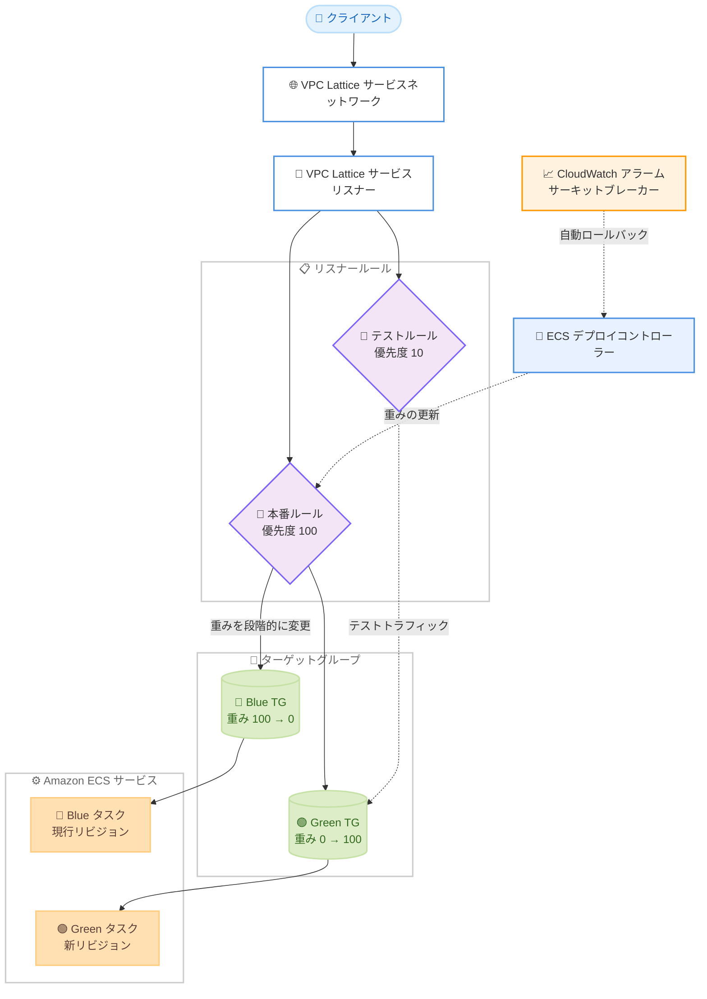

# Amazon ECS - VPC Lattice での blue/green、linear、canary デプロイサポート

**リリース日**: 2026 年 10 月 2 日
**サービス**: Amazon Elastic Container Service (Amazon ECS)、Amazon VPC Lattice
**機能**: VPC Lattice を使用する ECS サービスでの組み込み blue/green、linear、canary デプロイ戦略

📊 [このアップデートのインフォグラフィックを見る](https://takech9203.github.io/aws-news-summary/20261002-amazon-ecs-vpc-lattice-blue-green-deployments.html)

## 概要

Amazon ECS が、Amazon VPC Lattice を使用する ECS サービスに対して、組み込みの blue/green、linear、canary デプロイ戦略をサポートしました。これまで Application Load Balancer (ALB) や Service Connect を使用するサービスで利用できた ECS ネイティブの高度なデプロイ戦略が、VPC Lattice を利用するサービスにも拡張された形です。

VPC Lattice は、VPC やアカウントをまたいだサービス間通信を実現するアプリケーションネットワーキングサービスです。今回のアップデートにより、VPC Lattice でクロス VPC・クロスアカウント通信を行うアプリケーションでも、外部のデプロイツールを用意することなく、ECS によるマネージドなトラフィックシフトを利用して安全にサービスを更新できるようになりました。マイクロサービスアーキテクチャを VPC Lattice で構築しているチームや、デプロイリスクを最小化したい運用チームが主な対象です。

**アップデート前の課題**

- 以前は、VPC Lattice を使用する ECS サービスではローリングデプロイのみが利用可能で、新旧バージョンが混在する期間が発生していた
- blue/green デプロイを実現するには、リスナールールの重み変更を自前のスクリプトや外部ツールで制御する必要があった
- 本番トラフィックを流す前に新バージョンを検証する仕組みや、問題検出時の即時ロールバックを独自に構築する必要があった

**アップデート後の改善**

- ECS のサービス設定で VPC Lattice のターゲットグループとリスナールール、デプロイ戦略を指定するだけで、マネージドなトラフィックシフトが利用可能になった
- blue/green (一括切替)、linear (均等な増分で段階的に切替)、canary (少量から開始して切替) の 3 つの戦略から、リリースへの確信度に応じて選択できるようになった
- テストリスナールールによる本番前検証、Lambda フックや pause フックによるライフサイクルフック、CloudWatch アラームとデプロイサーキットブレーカーによる自動ロールバック、ベイクタイムによるダウンタイムなしの迅速なロールバックが組み込みで利用できるようになった

## アーキテクチャ図



VPC Lattice のリスナールールが Blue と Green の 2 つのターゲットグループへの重み付きフォワードを持ち、ECS デプロイコントローラーが選択された戦略に従って重みを書き換えることでトラフィックを移行します。テストルールを設定すると、本番トラフィック移行前に新リビジョンへテストトラフィックを流して検証できます。

## サービスアップデートの詳細

### 主要機能

1. **3 種類のデプロイ戦略**
   - `BLUE_GREEN`: 本番トラフィックを一括で新リビジョンに切り替える
   - `LINEAR`: 均等な増分でトラフィックを段階的に移行する (ステップごとに重みを変更)
   - `CANARY`: まず少量のトラフィックを新リビジョンに流し、問題がなければ残りを移行する (重みの変更は 2 回)

2. **テストリスナールールによる本番前検証**
   - 本番ルールとは別のリクエスト条件 (特定ヘッダーやパスなど) にマッチするテストルールを任意で設定可能
   - `TEST_TRAFFIC_SHIFT` ステージで ECS がテストルールを新リビジョンに向け、本番トラフィック移行前に動作検証できる
   - テストルールは本番ルールより先に評価されるよう、小さい優先度番号を設定する

3. **デプロイライフサイクルフック**
   - Lambda フックによるカスタム検証 (スモークテスト、外部システム連携など) を組み込み可能
   - pause フックにより手動承認ステップを挟むことが可能

4. **自動ロールバックとベイクタイム**
   - CloudWatch アラームと ECS デプロイサーキットブレーカーを組み合わせ、問題検出時に自動でロールバック
   - ベイクタイム中は旧リビジョンを稼働させたまま維持するため、ダウンタイムなしで迅速にロールバックできる
   - ロールバック時は ECS がリスナールールの重みを旧リビジョンに戻し、新タスクを停止する

## 技術仕様

### 必要な VPC Lattice リソース

| 項目 | 詳細 |
|------|------|
| ターゲットグループ | 2 つ (Blue 用と Green 用)。タイプは `IP` 必須、ECS タスクと同じ VPC、`ACTIVE` 状態であること |
| VPC Lattice サービス | リスナーを持つサービス。サービスネットワーク経由または VPC 関連付け経由でクライアントが到達 |
| 本番リスナールール | 必須。アクションは `forward` で、両方のターゲットグループに重み 100 と 0 を設定 |
| テストリスナールール | 任意。本番ルールと異なるマッチ条件で、先に評価される優先度を設定 |
| インフラストラクチャロール | ECS が VPC Lattice リソースを操作するための IAM ロール (`roleArn`) |
| セキュリティグループ | タスクのセキュリティグループで VPC Lattice マネージドプレフィックスリストからのインバウンドを許可 |

### デプロイ時の待機時間

ECS はターゲット登録や重み変更が VPC Lattice データプレーンに伝播するまで、以下のステージで待機します。

| ステージ | 待機時間 |
|------|------|
| `POST_SCALE_UP` | 約 3 分 (新タスクがヘルシーになるのを待機) |
| `TEST_TRAFFIC_SHIFT` / `PRODUCTION_TRAFFIC_SHIFT` / `RECONCILE_SERVICE` | 各重み変更後に約 90 秒 |

### サービス設定例

```json
{
    "vpcLatticeConfigurations": [
        {
            "roleArn": "arn:aws:iam::111122223333:role/ecsInfrastructureRoleVpcLattice",
            "targetGroupArn": "arn:aws:vpc-lattice:region:111122223333:targetgroup/tg-0123456789abcdef0",
            "portName": "web",
            "advancedConfiguration": {
                "alternateTargetGroupArn": "arn:aws:vpc-lattice:region:111122223333:targetgroup/tg-0fedcba9876543210",
                "productionListenerRule": "arn:aws:vpc-lattice:region:111122223333:service/svc-0123456789abcdef0/listener/listener-0123456789abcdef0/rule/rule-0123456789abcdef0",
                "testListenerRule": "arn:aws:vpc-lattice:region:111122223333:service/svc-0123456789abcdef0/listener/listener-0123456789abcdef0/rule/rule-0fedcba9876543210"
            }
        }
    ],
    "deploymentController": {
        "type": "ECS"
    },
    "deploymentConfiguration": {
        "strategy": "BLUE_GREEN",
        "maximumPercent": 200,
        "minimumHealthyPercent": 100,
        "bakeTimeInMinutes": 5
    }
}
```

`strategy` には `BLUE_GREEN`、`LINEAR`、`CANARY` のいずれかを指定し、`bakeTimeInMinutes` で本番トラフィック移行後に新旧リビジョンを並行稼働させる時間を設定します。

## 設定方法

### 前提条件

1. VPC Lattice を使用する ECS サービス (新規または既存)
2. ECS が VPC Lattice リソースを管理するための ECS インフラストラクチャ IAM ロール
3. タスクのセキュリティグループで VPC Lattice マネージドプレフィックスリスト (`com.amazonaws.region.vpc-lattice`) からのインバウンド許可

### 手順

#### ステップ 1: ターゲットグループを 2 つ作成する

```bash
aws vpc-lattice create-target-group \
    --name blue-target-group \
    --type IP \
    --config '{
        "port": 80,
        "protocol": "HTTP",
        "ipAddressType": "IPV4",
        "vpcIdentifier": "vpc-abcd1234",
        "healthCheck": {
            "enabled": true,
            "protocol": "HTTP",
            "path": "/",
            "healthCheckIntervalSeconds": 30,
            "healthCheckTimeoutSeconds": 5,
            "healthyThresholdCount": 2,
            "unhealthyThresholdCount": 2
        }
    }'
```

Blue 用のターゲットグループを作成します。同じ設定で `green-target-group` も作成し、合計 2 つのターゲットグループを用意します。ECS タスクを登録するため、ターゲットタイプは `IP` を指定します。2 つのターゲットグループはデプロイのたびに役割が入れ替わります。

#### ステップ 2: VPC Lattice サービスとリスナー、ルールを作成する

```bash
aws vpc-lattice create-rule \
    --service-identifier svc-0123456789abcdef0 \
    --listener-identifier listener-0123456789abcdef0 \
    --name production \
    --priority 100 \
    --match '{"httpMatch": {"pathMatch": {"match": {"prefix": "/"}}}}' \
    --action '{
        "forward": {
            "targetGroups": [
                {"targetGroupIdentifier": "tg-0123456789abcdef0", "weight": 100},
                {"targetGroupIdentifier": "tg-0fedcba9876543210", "weight": 0}
            ]
        }
    }'
```

本番リスナールールを作成し、全トラフィックを Blue ターゲットグループ (重み 100) に転送します。両方のターゲットグループをルールに含めることが必須です。本番前検証を行う場合は、特定ヘッダー (例: `X-Environment: test`) にマッチするテストルールを、より小さい優先度番号で追加作成します。

#### ステップ 3: ECS サービスにデプロイ戦略を設定する

```bash
aws ecs update-service \
    --cluster my-cluster \
    --service my-service \
    --vpc-lattice-configurations file://vpc-lattice-config.json \
    --deployment-configuration '{
        "strategy": "CANARY",
        "bakeTimeInMinutes": 10
    }'
```

ECS サービスの設定で VPC Lattice のターゲットグループペア、本番およびテストリスナールール、デプロイ戦略を指定します。既存のローリングデプロイのサービスからの切り替えは、`advancedConfiguration` ブロックを追加して戦略を変更するだけで可能です。マネジメントコンソール、AWS CLI、SDK、IaC ツールのいずれからも設定できます。

## メリット

### ビジネス面

- **デプロイリスクの低減**: canary や linear 戦略により、問題のあるリリースの影響範囲を一部のトラフィックに限定し、顧客影響を最小化できる
- **ダウンタイムなしのリリース**: ベイクタイム中は旧バージョンが待機しているため、問題発生時も即座に切り戻せる
- **運用コストの削減**: 外部デプロイツールや自前のトラフィック制御スクリプトの構築・保守が不要になる

### 技術面

- **ECS ネイティブの統合**: ALB や Service Connect と同じデプロイ戦略の仕組みを VPC Lattice でも利用でき、デプロイ手法を統一できる
- **柔軟な検証フロー**: テストリスナールール、Lambda フック、pause フックを組み合わせて、組織の要件に合わせた検証・承認プロセスを構築できる
- **自動ロールバック**: CloudWatch アラームとサーキットブレーカーにより、メトリクス異常を検出して人手を介さずロールバックできる

## デメリット・制約事項

### 制限事項

- ターゲットグループのターゲットタイプは `IP` のみサポート (ECS タスク登録のため)
- VPC Lattice のターゲットグループ、サービス、リスナールールは ECS サービスと同一アカウントに存在する必要がある
- リスナールールのアクションは `forward` のみで、両方のターゲットグループ (重み 100 と 0) を含む必要がある
- 各リスナールールは ECS サービス上の 1 つの VPC Lattice 設定でのみ使用可能

### 考慮すべき点

- 初期設定後に本番・テストリスナールールの forward アクションを ECS の外部から変更すると、デプロイが失敗する
- VPC Lattice データプレーンへの伝播待機のため、ローリングデプロイと比べてデプロイ時間が長くなる (`POST_SCALE_UP` で約 3 分、各重み変更後に約 90 秒)
- 複数の VPC Lattice 設定を持つサービスでは、設定ごとに独自のターゲットグループペアと本番リスナールールが必要
- `TLS_PASSTHROUGH` リスナーなどルールをサポートしないリスナーでは、リスナーのデフォルトルールを本番ルールとして使用する (ルール ARN の代わりにリスナー ARN を指定)

## ユースケース

### ユースケース 1: クロスアカウントマイクロサービスの canary リリース

**シナリオ**: 複数アカウントに分散したマイクロサービスを VPC Lattice のサービスネットワークで接続している環境で、決済サービスの新バージョンを慎重にリリースしたい。

**実装例**:
```json
{
    "deploymentConfiguration": {
        "strategy": "CANARY",
        "bakeTimeInMinutes": 15
    }
}
```

**効果**: まず少量のトラフィックのみを新バージョンに流し、CloudWatch アラームでエラー率を監視しながら残りを移行することで、障害時の影響を最小限に抑えられる。

### ユースケース 2: テストトラフィックによる本番前検証

**シナリオ**: 本番トラフィックを一切流す前に、QA チームが新バージョンの動作を本番環境と同じ構成で検証したい。

**実装例**:
```bash
# X-Environment: test ヘッダー付きリクエストを新リビジョンへ転送
curl -H "X-Environment: test" https://my-service.example.vpc-lattice-svcs.amazonaws.com/
```

**効果**: テストリスナールール経由で新リビジョンのみにテストトラフィックを流し、検証完了後に本番トラフィックを移行する安全なリリースフローを実現できる。

### ユースケース 3: 手動承認付きの blue/green デプロイ

**シナリオ**: コンプライアンス要件により、本番トラフィック切り替え前に責任者の承認が必要な金融系ワークロード。

**実装例**:
```
デプロイライフサイクルフックに pause フックを設定し、
本番トラフィックシフト前のステージでデプロイを一時停止。
承認後に再開し、blue/green 戦略で一括切替。
```

**効果**: 承認プロセスをデプロイパイプラインに組み込みつつ、切り替え自体は一括で行い、ベイクタイムで即時ロールバック可能な状態を維持できる。

## 料金

What's New の発表には、この機能に対する追加料金の記載はありません。Amazon ECS のタスク実行 (Fargate または EC2) と Amazon VPC Lattice の標準料金が適用されます。なお、ベイクタイム中は新旧両方のリビジョンのタスクが並行稼働するため、その間のコンピューティング料金が発生する点に留意してください。

## 利用可能リージョン

Amazon VPC Lattice が利用可能なすべての AWS リージョンで利用できます。最新のリージョン対応状況は [AWS リージョン別サービス一覧](https://aws.amazon.com/about-aws/global-infrastructure/regional-product-services/) を参照してください。

## 関連サービス・機能

- **Amazon VPC Lattice**: クロス VPC・クロスアカウントのサービス間通信を提供するアプリケーションネットワーキングサービス。本機能のトラフィックシフトの基盤
- **Elastic Load Balancing (ALB/NLB)**: ECS の blue/green デプロイは ALB/NLB を使用するサービスでも利用可能。今回 VPC Lattice に対象が拡大
- **Amazon ECS Service Connect**: ECS ネイティブのサービスディスカバリとメッシュ機能。こちらも高度なデプロイ戦略に対応
- **Amazon CloudWatch**: アラームをデプロイに関連付けることで、メトリクス異常時の自動ロールバックを実現
- **AWS Lambda**: デプロイライフサイクルフックとしてカスタム検証ロジックを実行

## 参考リンク

- 📊 [インフォグラフィック](https://takech9203.github.io/aws-news-summary/20261002-amazon-ecs-vpc-lattice-blue-green-deployments.html)
- [公式発表 (What's New)](https://aws.amazon.com/about-aws/whats-new/2026/10/amazon-ecs-vpc-lattice-blue-green-deployments)
- [ドキュメント: VPC Lattice resources for blue/green, linear, and canary deployments](https://docs.aws.amazon.com/AmazonECS/latest/developerguide/vpc-lattice-resources-for-blue-green.html)
- [Amazon ECS 製品ページ](https://aws.amazon.com/ecs/)
- [Amazon VPC Lattice 製品ページ](https://aws.amazon.com/vpc/lattice/)

## まとめ

VPC Lattice を利用する ECS サービスでも、追加ツールなしで blue/green、linear、canary デプロイが利用可能になり、クロス VPC・クロスアカウント構成のマイクロサービスでも安全なリリースプロセスを標準機能で実現できるようになりました。VPC Lattice 上で ECS サービスを運用しているチームは、既存サービスへの `advancedConfiguration` の追加だけで移行できるため、CloudWatch アラームと組み合わせた自動ロールバックを含むデプロイ戦略の導入を検討することを推奨します。
