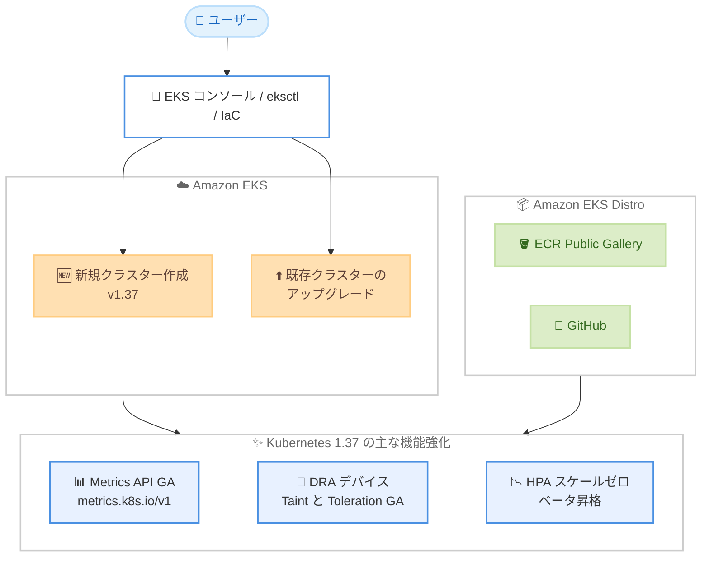

# Amazon EKS - Kubernetes バージョン 1.37 サポート

**リリース日**: 2026 年 10 月 2 日
**サービス**: Amazon Elastic Kubernetes Service (Amazon EKS)、Amazon EKS Distro
**機能**: Kubernetes バージョン 1.37 のサポート

📊 [このアップデートのインフォグラフィックを見る](https://takech9203.github.io/aws-news-summary/20261002-amazon-eks-distro-kubernetes-version-1-37.html)

## 概要

Amazon EKS および Amazon EKS Distro が Kubernetes バージョン 1.37 をサポートしました。EKS コンソール、eksctl CLI、または Infrastructure as Code (IaC) ツールを使用して、Kubernetes 1.37 で新規クラスターを作成したり、既存クラスターを 1.37 にアップグレードしたりできます。

Kubernetes 1.37 では、Metrics API の一般提供 (GA)、Dynamic Resource Allocation (DRA) におけるデバイス単位の Taint と Toleration の GA、HPA のスケールゼロ機能のベータ昇格など、オートスケーリングとリソース管理に関する重要な機能強化が含まれています。特に GPU などのアクセラレーターを利用する AI/ML ワークロードや、コスト最適化を重視するユーザーにとって価値のあるアップデートです。

**アップデート前の課題**

Kubernetes 1.36 以前では、以下の課題や制限がありました。

- Metrics API (metrics.k8s.io) が GA に達しておらず、HPA や `kubectl top` が利用するリソース使用状況 API が安定版ではなかった
- DRA で管理する GPU などのデバイスに障害やメンテナンスの必要が生じても、デバイス単位でスケジューリングを回避する標準的な仕組みがなかった
- HPA の最小レプリカ数は 1 以上に制限されており、アイドル時にワークロードを完全に 0 までスケールインするには KEDA などの追加ツールが必要だった

**アップデート後の改善**

今回のアップデートにより、以下が可能になりました。

- Metrics API が `metrics.k8s.io/v1` として GA となり、Pod やノードの CPU / メモリ使用状況を安定した API で取得できるようになった
- DRA のデバイス Taint と Toleration が GA となり、ドライバーや管理者が GPU などの特定デバイスに Taint を付与して、Toleration を持たない Pod のスケジューリングを回避できるようになった
- HPA のスケールゼロ機能がベータに昇格しデフォルトで有効化され、`minReplicas: 0` を設定することでオブジェクトメトリクスまたは外部メトリクスに基づいてアイドル時に Pod を 0 までスケールインし、需要に応じて再起動できるようになった

## アーキテクチャ図



Amazon EKS と Amazon EKS Distro の両方で Kubernetes 1.37 が利用可能になり、新規クラスター作成とアップグレードのいずれでも 1.37 の新機能を活用できます。

## サービスアップデートの詳細

### 主要機能

1. **Metrics API の一般提供 (GA)**
   - リソースメトリクス API が `metrics.k8s.io/v1` として GA に到達
   - Pod およびノードの CPU / メモリ使用状況データを提供
   - Horizontal Pod Autoscaler (HPA) によるオートスケーリングや `kubectl top` コマンドの基盤となる API が安定版に

2. **DRA デバイス Taint と Toleration の GA**
   - Dynamic Resource Allocation (DRA) ドライバーおよびクラスター管理者が、GPU などのデバイス単位で Taint を設定可能
   - Toleration を持たない Pod はその該当デバイスへのスケジューリングを回避
   - 障害が発生したデバイスやメンテナンス対象のデバイスを安全に切り離すことが可能に

3. **HPA スケールゼロのベータ昇格**
   - `minReplicas: 0` の設定がベータとなり、デフォルトで有効化
   - オブジェクトメトリクスまたは外部メトリクスを使用する HPA で、アイドル時にワークロードを 0 Pod までスケールイン
   - 需要の発生に応じて自動的にスケールアウトし、リソースコストを削減

4. **Amazon EKS Distro での提供**
   - Kubernetes 1.37 の EKS Distro ビルドを ECR Public Gallery および GitHub から取得可能
   - オンプレミスやセルフマネージド環境でも EKS と同一の Kubernetes ディストリビューションを利用可能

## 技術仕様

### バージョンサポート

| 項目 | 詳細 |
|------|------|
| 新規サポートバージョン | Kubernetes 1.37 |
| 利用方法 | EKS コンソール、eksctl CLI、IaC ツール (CloudFormation、Terraform など) |
| EKS Distro の入手先 | ECR Public Gallery、GitHub |
| 標準サポート | EKS でのリリースから 14 か月間 (バージョンライフサイクルポリシーに基づく) |
| 延長サポート | 標準サポート終了後、さらに 12 か月間 (追加料金が発生) |
| アップグレード支援 | EKS クラスターインサイトによるアップグレード阻害要因の検出 |

### API 変更履歴

本アップデートに伴う EKS の API 変更は、直近の AWS API Changes には確認されていません (2026 年 10 月 3 日時点)。既存の `UpdateClusterVersion` API などで新バージョン `1.37` を指定できます。

## 設定方法

### 前提条件

1. 既存クラスターをアップグレードする場合、現在のバージョンが 1.36 であること (マイナーバージョンは 1 つずつアップグレード)
2. アップグレード前に EKS クラスターインサイトで互換性の問題を確認すること
3. アドオン (VPC CNI、CoreDNS、kube-proxy など) が 1.37 対応バージョンであることを確認すること

### 手順

#### ステップ 1: クラスターインサイトでアップグレード準備状況を確認

```bash
aws eks list-insights \
  --cluster-name my-cluster \
  --filter kubernetesVersions=1.37
```

EKS クラスターインサイトを使用して、1.37 へのアップグレードに影響する可能性のある問題 (非推奨 API の使用など) を検出します。

#### ステップ 2: コントロールプレーンをアップグレード

```bash
aws eks update-cluster-version \
  --name my-cluster \
  --kubernetes-version 1.37
```

クラスターのコントロールプレーンを Kubernetes 1.37 にアップグレードします。eksctl を使用する場合は `eksctl upgrade cluster --name my-cluster --version 1.37 --approve` を実行します。

#### ステップ 3: ノードグループとアドオンをアップグレード

```bash
aws eks update-nodegroup-version \
  --cluster-name my-cluster \
  --nodegroup-name my-nodegroup
```

マネージドノードグループを最新の 1.37 対応 AMI に更新します。あわせて各アドオンも 1.37 互換バージョンに更新します。

#### ステップ 4: HPA スケールゼロの動作確認 (任意)

```yaml
apiVersion: autoscaling/v2
kind: HorizontalPodAutoscaler
metadata:
  name: queue-worker
spec:
  scaleTargetRef:
    apiVersion: apps/v1
    kind: Deployment
    name: queue-worker
  minReplicas: 0
  maxReplicas: 10
  metrics:
    - type: External
      external:
        metric:
          name: sqs_queue_depth
        target:
          type: AverageValue
          averageValue: "5"
```

外部メトリクス (例: SQS キューの深さ) を使用する HPA で `minReplicas: 0` を設定し、アイドル時のスケールゼロを有効にします。

## メリット

### ビジネス面

- **コスト最適化**: HPA スケールゼロにより、アイドル時のワークロードを 0 Pod までスケールインし、コンピューティングコストを削減できる
- **最新機能の早期活用**: アップストリーム Kubernetes の最新機能をマネージドサービス上で利用でき、コミュニティのイノベーションを迅速に取り込める
- **サポート期間の確保**: 新バージョンへ早期にアップグレードすることで、標準サポート期間を最大限活用し、延長サポートの追加費用を回避できる

### 技術面

- **安定したメトリクス基盤**: Metrics API の GA により、HPA や `kubectl top` が依存するリソースメトリクスの取得が安定版 API で保証される
- **GPU 運用の信頼性向上**: DRA デバイス Taint により、障害やメンテナンス中の GPU デバイスをスケジューリング対象から安全に除外できる
- **環境の一貫性**: EKS Distro により、オンプレミスを含むあらゆる環境で EKS と同一の Kubernetes ビルドを利用できる

## デメリット・制約事項

### 制限事項

- マイナーバージョンのアップグレードは 1 つずつしか実行できないため、古いバージョンからは複数回のアップグレードが必要
- コントロールプレーンのアップグレード後、ダウングレードはできない
- HPA スケールゼロはベータ機能であり、オブジェクトメトリクスまたは外部メトリクスを使用する HPA が対象 (CPU / メモリのリソースメトリクスのみでは利用不可)

### 考慮すべき点

- アップグレード前に、1.37 で削除・非推奨となった API を使用しているワークロードがないかクラスターインサイトで確認が必要
- アドオン、カスタムコントローラー、Webhook などの 1.37 互換性を事前に検証する必要がある
- 標準サポート期間 (14 か月) を過ぎたバージョンは延長サポート料金が発生するため、計画的なアップグレード運用が重要

## ユースケース

### ユースケース 1: イベント駆動型ワークロードのコスト最適化

**シナリオ**: バッチ処理やキューワーカーなど、処理対象が存在しない時間帯が長いワークロードを運用しており、アイドル時のコストを削減したい。

**実装例**:
```yaml
spec:
  minReplicas: 0
  maxReplicas: 20
  metrics:
    - type: External
      external:
        metric:
          name: sqs_queue_depth
```

**効果**: 外部メトリクスに基づいてアイドル時に Pod を 0 までスケールインし、追加ツールなしでコンピューティングコストを削減できる。

### ユースケース 2: GPU クラスターの安全なメンテナンス運用

**シナリオ**: AI/ML 学習基盤として多数の GPU ノードを運用しており、障害が疑われる GPU やファームウェア更新対象の GPU への新規ワークロード配置を防ぎたい。

**実装例**:
```bash
# DRA ドライバーまたは管理者がデバイスに Taint を付与
# Toleration を持たない Pod は該当デバイスにスケジュールされない
kubectl get resourceslices -o yaml
```

**効果**: ノード全体ではなくデバイス単位でスケジューリングを制御でき、GPU クラスターの稼働率を維持しながら安全にメンテナンスを実施できる。

### ユースケース 3: ハイブリッド環境での Kubernetes バージョン統一

**シナリオ**: クラウド上の EKS とオンプレミスのセルフマネージド Kubernetes を併用しており、両環境のバージョンとビルドを統一して運用負荷を下げたい。

**実装例**:
```bash
# ECR Public Gallery から EKS Distro 1.37 のイメージを取得
docker pull public.ecr.aws/eks-distro/kubernetes/kube-apiserver:v1.37.0-eks-1-37-latest
```

**効果**: EKS Distro を利用することで、オンプレミス環境でも EKS と同一の Kubernetes 1.37 ビルドを利用でき、環境間の挙動差異を最小化できる。

## 料金

Kubernetes 1.37 のサポート自体に追加料金はありません。EKS の標準料金が適用されます。

### 料金例

| 項目 | 料金 (米国東部 バージニア北部) |
|------|------------------------------|
| EKS クラスター (標準サポート期間中) | 0.10 USD/時間/クラスター |
| EKS クラスター (延長サポート期間中) | 0.60 USD/時間/クラスター |
| Amazon EKS Distro | 無料 (実行環境のコストのみ) |

最新の料金は [Amazon EKS 料金ページ](https://aws.amazon.com/eks/pricing/) を参照してください。

## 利用可能リージョン

Amazon EKS が利用可能なすべての AWS リージョンで利用できます (AWS GovCloud (US) リージョンを含む)。

## 関連サービス・機能

- **Amazon EKS クラスターインサイト**: アップグレードに影響する可能性のある問題を自動検出し、安全なバージョンアップを支援
- **Amazon EKS Auto Mode**: コンピューティング、ストレージ、ネットワークの管理を自動化し、バージョンアップグレードの運用負荷を軽減
- **Karpenter**: ノードのプロビジョニングを自動化し、HPA スケールゼロと組み合わせることでノードレベルのコスト最適化が可能
- **Amazon ECR Public Gallery**: EKS Distro のコンテナイメージ配布に使用

## 参考リンク

- 📊 [インフォグラフィック](https://takech9203.github.io/aws-news-summary/20261002-amazon-eks-distro-kubernetes-version-1-37.html)
- [公式発表 (What's New)](https://aws.amazon.com/about-aws/whats-new/2026/10/amazon-eks-distro-kubernetes-version-1-37)
- [Amazon EKS でサポートされる Kubernetes バージョン](https://docs.aws.amazon.com/eks/latest/userguide/kubernetes-versions.html)
- [Amazon EKS クラスターのアップグレード手順](https://docs.aws.amazon.com/eks/latest/userguide/update-cluster.html)
- [Kubernetes 1.37 リリースノート](https://github.com/kubernetes/kubernetes/blob/master/CHANGELOG/CHANGELOG-1.37.md)
- [Amazon EKS Distro](https://distro.eks.amazonaws.com/)
- [Amazon EKS 料金ページ](https://aws.amazon.com/eks/pricing/)

## まとめ

Amazon EKS と Amazon EKS Distro が Kubernetes 1.37 に対応し、Metrics API の GA、DRA デバイス Taint の GA、HPA スケールゼロのベータ昇格といった、オートスケーリングと GPU 運用に直結する機能強化が利用可能になりました。EKS のバージョンライフサイクルポリシーに沿った計画的なアップグレード運用のため、クラスターインサイトで互換性を確認した上で、早期の 1.37 への移行を検討することを推奨します。
