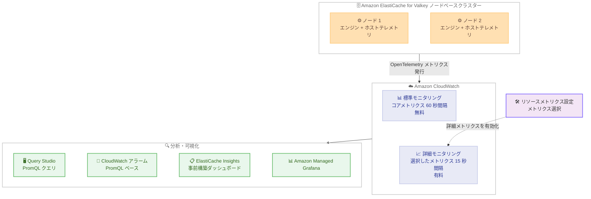

# Amazon ElastiCache - Valkey 向け OpenTelemetry メトリクスと詳細モニタリングのサポート

**リリース日**: 2026 年 10 月 2 日
**サービス**: Amazon ElastiCache
**機能**: OpenTelemetry メトリクスと詳細モニタリング

📊 [このアップデートのインフォグラフィックを見る](https://takech9203.github.io/aws-news-summary/20261002-amazon-elasticache-valkey-opentelemetry-metrics-detailed-monitoring.html)

## 概要

Amazon ElastiCache for Valkey が、ノードベースのクラスターに対して OpenTelemetry (OTLP) メトリクスを Amazon CloudWatch に発行する機能をサポートしました。各メトリクスにはアカウント、リージョン、アベイラビリティゾーン、レプリケーショングループ、シャード、ノードを識別する属性が付与され、Prometheus Query Language (PromQL) 式を使用してフィルタリングや集計を実行できます。

モニタリングには 2 つのモードが用意されています。標準モニタリングでは、従来の CloudWatch メトリクス (Classic) に加えて、コアセットの OpenTelemetry メトリクスが 60 秒間隔で追加料金なしで発行されます。新しく追加された詳細モニタリングでは、完全な OpenTelemetry メトリクスセットから必要なメトリクスを選択し、15 秒間隔で発行できます。コアメトリクスセットは、事前構築された CloudWatch ダッシュボードである ElastiCache Insights にも活用されています。

このアップデートは、接続数上限に近づいているノードの検出、インシデント発生時のエラー種別ごとの分析、ノードのメモリ枯渇予測など、Valkey クラスターの詳細な可観測性を必要とする運用チームや SRE チームを対象としています。

**アップデート前の課題**

このアップデート以前には、以下の課題が存在していました。

- CloudWatch メトリクス (Classic) は 60 秒間隔のため、短時間のレイテンシースパイクなどの瞬間的なイベントを捉えにくかった
- メトリクスの次元が限られており、コマンド名やエラー種別などの属性で柔軟にフィルタリング・集計することが難しかった
- Prometheus や Grafana に慣れたチームが PromQL のスキルを活かして ElastiCache のメトリクスを分析することができなかった

**アップデート後の改善**

今回のアップデートにより、以下が可能になりました。

- 詳細モニタリングにより 15 秒間隔のメトリクス発行が可能になり、短時間のレイテンシースパイクなどの瞬間的なイベントを検出できるようになった
- 各データポイントに付与される豊富な属性 (レプリケーショングループ、シャード、ノード、コマンド名、ネットワーク方向など) を使用して、クエリ時に柔軟なフィルタリングと集計が可能になった
- CloudWatch の Query Studio や Amazon Managed Grafana から PromQL でメトリクスをクエリでき、既存のチームスキルを活用できるようになった
- PromQL クエリから CloudWatch アラームを作成でき、メモリ使用率などクエリ時に計算した値に対するアラーム設定が可能になった

## アーキテクチャ図



各ノードがキャッシュエンジンとホストからテレメトリを収集して CloudWatch に OpenTelemetry メトリクスとして発行し、PromQL クエリ、アラーム、ダッシュボード、Grafana から活用できる構成を示しています。

## サービスアップデートの詳細

### 主要機能

1. **OpenTelemetry メトリクスの自動発行 (標準モニタリング)**
   - コアセットのベンディッドメトリクスが 60 秒間隔で自動的に発行される
   - レプリケーショングループが稼働を開始すると設定不要で発行され、追加料金は発生しない
   - 従来の CloudWatch メトリクス (Classic) の 60 秒間隔での発行も継続される
   - コアメトリクスセットは事前構築ダッシュボードの ElastiCache Insights にも活用される

2. **詳細モニタリング (15 秒間隔)**
   - 完全な OpenTelemetry メトリクスセットから必要なメトリクスを選択可能
   - 選択したメトリクスは 15 秒間隔で発行され、短時間のイベント検出に有効
   - CloudWatch のリソースメトリクス設定 (resource metrics configuration) で管理し、レプリケーショングループごとに 1 つの設定を保持
   - すでにベンディッドされているメトリクスを選択すると、粒度が 60 秒から 15 秒に向上する (選択中は課金対象)

3. **豊富なメトリクス属性**
   - リソース属性: AWS アカウント、リージョン、アベイラビリティゾーン、レプリケーショングループ、シャード、ノードを識別
   - データポイント属性: ノードのレプリケーションロールに加え、コマンド名やネットワーク方向などメトリクス固有の次元を提供
   - クエリ時にこれらの属性でフィルタリング・集計が可能

4. **PromQL によるクエリとアラーム**
   - CloudWatch の Query Studio でインタラクティブにクエリを実行可能
   - PromQL クエリから CloudWatch アラームを作成でき、1 つのアラームで全ノードを監視可能
   - Amazon Managed Grafana から CloudWatch の PromQL エンドポイントを Prometheus データソースとして追加してクエリ可能

## 技術仕様

### モニタリングモードの比較

| 項目 | 標準モニタリング | 詳細モニタリング |
|------|------------------|------------------|
| メトリクスセット | コアセット (自動発行) | 完全なセットから選択 |
| 発行間隔 | 60 秒 | 15 秒 |
| 料金 | 追加料金なし | CloudWatch によるデータポイント量ベースの課金 |
| 設定 | 不要 | リソースメトリクス設定の作成が必要 |

### サポート対象の構成

| 項目 | 詳細 |
|------|------|
| 対象 | ノードベースの Valkey レプリケーショングループ (全 Valkey バージョン) |
| 対象外 | AWS Outposts 上のレプリケーショングループ、サーバーレスキャッシュ、Redis OSS、Memcached |
| グローバルデータストア | リージョンごとのレプリケーショングループで個別にメトリクスを選択 |
| クエリ制限 | 1 クエリあたり最大 500 時系列、範囲関数のレンジは最大 7 日 |

### 必要な IAM 権限

リソースメトリクス設定の作成・取得・更新・削除には、対応する `cloudwatch:*ResourceMetricsConfiguration` 権限が必要です。これらの操作はリソースレベルの権限をサポートしないため、IAM ポリシーでは `"Resource": "*"` を指定し、`cloudwatch:ResourceArn` 条件キーでアクセスをスコープします。これらは ElastiCache API ではなく Amazon CloudWatch API の操作です。

```json
{
  "Version": "2012-10-17",
  "Statement": [
    {
      "Effect": "Allow",
      "Action": [
        "cloudwatch:CreateResourceMetricsConfiguration",
        "cloudwatch:GetResourceMetricsConfiguration",
        "cloudwatch:UpdateResourceMetricsConfiguration",
        "cloudwatch:DeleteResourceMetricsConfiguration"
      ],
      "Resource": "*",
      "Condition": {
        "StringLike": {
          "cloudwatch:ResourceArn": "arn:aws:elasticache:*:123456789012:replicationgroup:*"
        }
      }
    }
  ]
}
```

## 設定方法

### 前提条件

1. ノードベースの Valkey レプリケーショングループが稼働していること (AWS Outposts 上は対象外)
2. `cloudwatch:*ResourceMetricsConfiguration` 権限を持つ IAM プリンシパルを使用すること
3. Amazon CloudWatch が OpenTelemetry メトリクスをサポートするリージョンであること

### 手順

#### ステップ 1: コンソールで詳細モニタリングを有効化

1. ElastiCache コンソールで対象のレプリケーショングループを選択
2. [Metrics] タブで [Detailed] を選択
3. [Configure detailed metrics] を選択
4. 発行したいメトリクスを選択して保存

レプリケーショングループの作成時に [Monitoring] セクションで [Detailed monitoring] を選択して設定することも可能です。メトリクスを選択するまでは、[Detailed] ビューに「No detailed metrics configured」と表示されます。

#### ステップ 2: AWS CLI で詳細モニタリングを設定

```bash
aws cloudwatch create-resource-metrics-configuration \
    --resource-arn arn:aws:elasticache:us-east-1:123456789012:replicationgroup:my-cluster \
    --metric-selections '[{"IncludeMetrics": ["valkey.memory.used", "valkey.commands.processed"]}]'
```

レプリケーショングループの ARN を指定してリソースメトリクス設定を作成し、`--metric-selections` パラメータで発行するメトリクスを名前で列挙しています。`--metric-selections` を省略すると利用可能な全メトリクスが選択され、ベンディッドメトリクスも 15 秒間隔に移行して課金対象になるため、必要なメトリクスのみを選択することが推奨されます。

#### ステップ 3: 設定の確認・更新・削除

```bash
# 現在発行中のメトリクスを確認
aws cloudwatch get-resource-metrics-configuration \
    --resource-arn arn:aws:elasticache:us-east-1:123456789012:replicationgroup:my-cluster

# 選択するメトリクスを変更
aws cloudwatch update-resource-metrics-configuration \
    --resource-arn arn:aws:elasticache:us-east-1:123456789012:replicationgroup:my-cluster \
    --metric-selections '[{"IncludeMetrics": ["valkey.memory.used", "valkey.keyspace.hits"]}]'

# メトリクスの発行を停止
aws cloudwatch delete-resource-metrics-configuration \
    --resource-arn arn:aws:elasticache:us-east-1:123456789012:replicationgroup:my-cluster
```

設定の取得、更新、削除を実行しています。`--metric-selections` は以前の値を完全に置き換えるため、メトリクスを追加する場合は発行したいすべてのメトリクスを列挙する必要があります。設定の変更が反映されるまで数分かかります。

#### ステップ 4: PromQL でメトリクスをクエリ

```promql
sum by ("@resource.aws.elasticache.shard.id") (
  rate({"valkey.commands.processed",
        "@resource.aws.elasticache.replication_group.id"="my-cluster"}[5m]))
```

シャードごとの TPS (1 秒あたりのトランザクション数) を計算するクエリです。`rate` 関数が累積カウンターを秒間レートに変換し、`sum by` がシャード単位で各ノードの値を集計しています。Query Studio でのインタラクティブな実行、ダッシュボードへの追加、アラームの作成に使用できます。

## メリット

### ビジネス面

- **運用コストの削減**: 接続数上限への接近やメモリ枯渇の予兆を早期に検出でき、インシデントの未然防止と MTTR の短縮につながる
- **既存スキルの活用**: Prometheus や Grafana に慣れたチームが PromQL スキルをそのまま活用でき、学習コストを抑えられる
- **無料で始められる可観測性向上**: コアメトリクスセットと ElastiCache Insights ダッシュボードは追加料金なしで利用可能

### 技術面

- **15 秒粒度の高解像度モニタリング**: 短時間のレイテンシースパイクなど、60 秒間隔では平均化されて見逃していたイベントを検出可能
- **属性ベースの柔軟な分析**: コマンド名、エラー種別、ネットワーク方向などの属性により、インシデント時の詳細な切り分けが可能
- **クエリ時計算に基づくアラーム**: メモリ使用率 (使用量 / 上限) のようなクエリ時に計算した値でアラームを設定でき、1 つのアラームで全ノードのコントリビューターを独立して追跡可能

## デメリット・制約事項

### 制限事項

- 対象はノードベースの Valkey レプリケーショングループのみで、サーバーレスキャッシュ、Redis OSS、Memcached は OpenTelemetry メトリクスを発行しない
- AWS Outposts 上のレプリケーショングループは対象外
- 1 つのレプリケーショングループに保持できるリソースメトリクス設定は 1 つのみ
- PromQL クエリが返せる時系列は最大 500 で、ノードとコマンドの両方で分解するクエリは大規模クラスターで上限を超える可能性がある
- `avg_over_time` や `max_over_time` などの範囲関数のレンジは最大 7 日

### 考慮すべき点

- 詳細モニタリングの課金は選択したメトリクス数ではなく発行されるデータポイント量に基づくため、`valkey.command.calls` のように属性で分解される高カーディナリティメトリクスはワークロードによってコストが変動する
- `--metric-selections` を省略して全メトリクスを選択すると、ベンディッドメトリクスも 15 秒間隔に移行して課金対象になる
- PromQL クエリには複数のデータポイントを含む時間範囲が必要で、60 秒間隔のメトリクスには `[5m]` 以上、15 秒間隔のメトリクスには `[1m]` 以上のレンジが推奨される
- アラームの評価間隔はメトリクスの発行間隔以上に設定する必要がある
- リソースメトリクス設定の変更が反映されるまで数分かかる

## ユースケース

### ユースケース 1: メモリ枯渇の予兆検出とアラート

**シナリオ**: 本番環境の Valkey クラスターで、ノードのメモリ使用量が上限に近づいた際に自動的に通知を受けたい。

**実装例**:
```promql
100 * {"valkey.memory.used",  "@resource.aws.elasticache.replication_group.id"="my-cluster"}
    / {"valkey.memory.max",   "@resource.aws.elasticache.replication_group.id"="my-cluster"}
    > 90
```

```bash
aws cloudwatch put-metric-alarm \
    --alarm-name my-cluster-memory-high \
    --evaluation-criteria '{"PromQLCriteria":{"Query":"<query>","PendingPeriod":300,"RecoveryPeriod":600}}' \
    --evaluation-interval 60
```

**効果**: メモリ使用率 90% 超のノードを 1 つのアラームで全ノード分監視できる。ブリーチした系列の属性からどのノードが原因かを特定でき、ペンディング期間 300 秒により一時的なスパイクでの誤報を防止できる。

### ユースケース 2: インシデント時のコマンドレベル分析

**シナリオ**: レイテンシー悪化のインシデント発生時に、どのコマンドが遅延の原因かを特定したい。

**実装例**:
```promql
1e6 * sum by ("valkey.command") (
        rate({"valkey.command.duration",
              "@resource.aws.elasticache.replication_group.id"="my-cluster"}[5m]))
    / (sum by ("valkey.command") (
        rate({"valkey.command.calls",
              "@resource.aws.elasticache.replication_group.id"="my-cluster"}[5m])) > 0)
```

**効果**: コマンドごとの平均レイテンシー (マイクロ秒単位) をクエリ時に計算でき、問題のあるコマンドを迅速に特定できる。詳細モニタリングの 15 秒粒度により、短時間のスパイクも捉えられる。

### ユースケース 3: Grafana を使用した統合ダッシュボード

**シナリオ**: 既存の Prometheus / Grafana ベースの監視基盤に ElastiCache のメトリクスを統合し、複数のレプリケーショングループを横断して最も負荷の高いノードを可視化したい。

**実装例**:
```promql
topk(5,
  sum without ("cpu.mode") (
    rate({"process.cpu.time", "thread.type"="main"}[5m])))
```

**効果**: Amazon Managed Grafana に CloudWatch の PromQL エンドポイントを Prometheus データソースとして追加するだけで、既存のダッシュボード運用に ElastiCache を統合できる。`topk` により全レプリケーショングループを横断して CPU 負荷の高い上位 5 ノードを一覧できる。

## 料金

詳細モニタリングに対する ElastiCache 側の追加料金はありません。

- **標準モニタリング**: コアセットのベンディッドメトリクスは 60 秒間隔で追加料金なしで発行される
- **詳細モニタリング**: 選択したメトリクスは、発行されるデータポイント量に基づいて Amazon CloudWatch により課金される。作成したアラームや実行した PromQL API クエリにも CloudWatch の OpenTelemetry 料金が適用される

課金は選択したメトリクスの数ではなくデータポイント量に基づくため、属性で分解される高カーディナリティメトリクスのコストはワークロードに依存します。詳細は [Amazon CloudWatch の料金ページ](https://aws.amazon.com/cloudwatch/pricing/) を参照してください。

## 利用可能リージョン

Amazon CloudWatch が OpenTelemetry メトリクスをサポートするすべての AWS リージョンで利用可能です。

## 関連サービス・機能

- **Amazon CloudWatch**: OpenTelemetry メトリクスの受け取り先。Query Studio での PromQL クエリ、アラーム、ダッシュボード、リソースメトリクス設定を提供
- **Amazon Managed Grafana**: CloudWatch の PromQL エンドポイントを Prometheus データソースとして追加し、ElastiCache メトリクスを可視化可能
- **ElastiCache Insights**: コアメトリクスセットを活用した事前構築の CloudWatch ダッシュボード
- **ElastiCache グローバルデータストア**: リージョンごとのレプリケーショングループで個別に詳細メトリクスを選択する必要がある

## 参考リンク

- 📊 [インフォグラフィック](https://takech9203.github.io/aws-news-summary/20261002-amazon-elasticache-valkey-opentelemetry-metrics-detailed-monitoring.html)
- [公式発表 (What's New)](https://aws.amazon.com/about-aws/whats-new/2026/10/amazon-elasticache-valkey-opentelemetry-metrics-detailed-monitoring)
- [ドキュメント: Monitoring ElastiCache with OpenTelemetry metrics](https://docs.aws.amazon.com/AmazonElastiCache/latest/dg/otel-metrics.html)
- [ドキュメント: CloudWatch detailed monitoring for OpenTelemetry metrics](https://docs.aws.amazon.com/AmazonCloudWatch/latest/monitoring/resource-metrics-configuration.html)
- [ドキュメント: Query metrics with PromQL](https://docs.aws.amazon.com/AmazonCloudWatch/latest/monitoring/CloudWatch-PromQL.html)
- [料金ページ: Amazon CloudWatch](https://aws.amazon.com/cloudwatch/pricing/)

## まとめ

Amazon ElastiCache for Valkey の OpenTelemetry メトリクス対応により、豊富な属性と PromQL を活用した柔軟なメトリクス分析、15 秒粒度の詳細モニタリング、クエリ時計算に基づくアラームが可能になりました。コアメトリクスセットは追加料金なしで自動発行されるため、まずは ElastiCache Insights ダッシュボードと PromQL クエリを試し、より高い粒度や追加メトリクスが必要なワークロードに対して詳細モニタリングを選択的に有効化することを推奨します。
