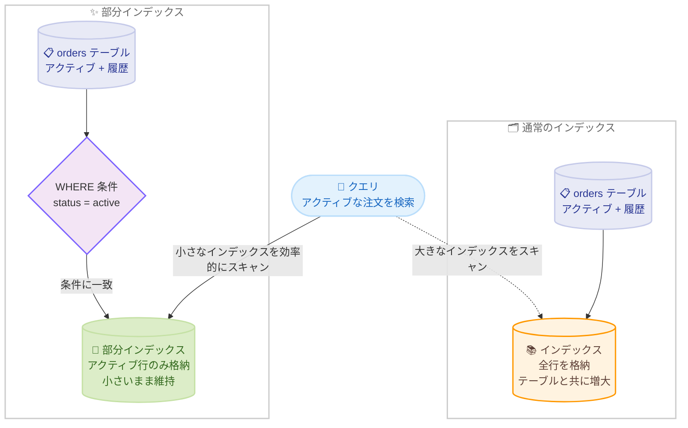

# Amazon Aurora DSQL - 部分インデックスのサポート

**リリース日**: 2026 年 10 月 2 日
**サービス**: Amazon Aurora DSQL
**機能**: 部分インデックス (Partial Indexes)

📊 [このアップデートのインフォグラフィックを見る](https://takech9203.github.io/aws-news-summary/20261002-aurora-dsql-partial-indexes.html)

## 概要

Amazon Aurora DSQL が部分インデックス (Partial Indexes) をサポートしました。部分インデックスは、テーブル全体ではなく、条件に一致する行のサブセットのみを対象として構築されるインデックスです。`CREATE INDEX` 文に `WHERE` 句を追加することで、条件を満たす行のみをインデックスに格納できます。

この機能は、小さなワーキングセットと大量の履歴データが混在するテーブルに特に有効です。例えば、数年分の完了済み注文の中に少数のアクティブな注文が含まれるようなテーブルでは、アクティブな行のみをインデックス化することで、テーブルが成長してもインデックスは小さいまま維持されます。Aurora DSQL は、クエリのフィルタ条件がインデックスの条件に含まれると証明できる場合に、部分インデックスを自動的に使用します。

**アップデート前の課題**

このアップデート以前には、以下の課題がありました。

- インデックスは常にテーブルの全行を対象としており、少数のアクティブな行のみを頻繁にクエリする場合でも、大量の履歴データを含むインデックス全体を維持する必要があった
- テーブルの成長に比例してインデックスサイズも増大し、インデックスのストレージコストが増加していた
- 特定のサブセットを対象とするクエリでも、不要な行を含む大きなインデックスをスキャンするため、クエリパフォーマンスが低下する可能性があった

**アップデート後の改善**

今回のアップデートにより、以下が可能になりました。

- `CREATE INDEX` 文に `WHERE` 句を追加するだけで、条件を満たす行のみを対象とした部分インデックスを作成できるようになった
- テーブルが成長してもインデックスは対象サブセットの分だけ小さく保たれ、インデックスのストレージコストを削減できるようになった
- 対象サブセットへのクエリでスキャンするデータ量が減り、クエリパフォーマンスが向上した

## アーキテクチャ図



通常のインデックスはテーブル全体を格納するためテーブルと共に増大しますが、部分インデックスは `WHERE` 条件に一致する行のみを格納するため小さく保たれ、対象サブセットへのクエリを効率化します。

## サービスアップデートの詳細

### 主要機能

1. **WHERE 句による部分インデックスの定義**
   - `CREATE INDEX` 文に `WHERE` 句 (述語) を追加することで、述語が真と評価される行のみを含むインデックスを作成できる
   - 述語はインデックス対象の列だけでなく、テーブルの任意の列を参照できる
   - 述語には immutable な関数、演算子、列参照のみを使用できる

2. **クエリプランナーによる自動利用**
   - Aurora DSQL は、クエリの `WHERE` 条件がインデックスの述語を含意すると証明できる場合に、部分インデックスを自動的に使用する
   - 証明できない場合は、そのクエリに対して部分インデックスは使用されない
   - アプリケーション側のクエリ変更は不要

3. **ストレージコストの削減とパフォーマンス向上**
   - インデックスに格納される行数が減るため、インデックスのストレージコストが削減される
   - 対象サブセットへのクエリでスキャンするデータ量が減り、クエリパフォーマンスが向上する
   - テーブルが成長してもインデックスサイズは対象サブセットの規模に依存するため、小さいまま維持される

## 技術仕様

### CREATE INDEX のサポート構文

Aurora DSQL ではインデックス作成は常に非同期で実行されるため、`ASYNC` キーワードの指定が必須です。

```sql
CREATE [ UNIQUE ] INDEX ASYNC [ [ IF NOT EXISTS ] name ] ON table_name
    ( { column_name | ( expression ) } [ NULLS { FIRST | LAST } ] [, ...] )
    [ INCLUDE ( column_name [, ...] ) ]
    [ NULLS [ NOT ] DISTINCT ]
    [ WHERE predicate ]
```

### 部分インデックスの仕様

| 項目 | 詳細 |
|------|------|
| 定義方法 | `CREATE INDEX ASYNC ... WHERE predicate` |
| 述語の対象列 | インデックス対象列に限らず、テーブルの任意の列を参照可能 |
| 述語の制約 | immutable な関数、演算子、列参照のみ使用可能 |
| インデックス利用条件 | クエリの `WHERE` 条件がインデックスの述語を含意すると証明できる場合のみ使用される |
| UNIQUE との併用 | 可能 (条件を満たす行の範囲で一意性を保証) |
| INCLUDE との併用 | 可能 (非キー列を含めてインデックスオンリースキャンを実現) |
| 作成方式 | 非同期 (`ASYNC` キーワードが必須) |

## 設定方法

### 前提条件

1. Aurora DSQL クラスターが作成済みであること
2. 対象テーブルに対するインデックス作成権限があること
3. PostgreSQL 互換クライアント (psql など) で接続できること

### 手順

#### ステップ 1: 部分インデックスの作成

```sql
-- rating が 5 より大きい行のみを対象とした部分インデックスを作成
CREATE INDEX ASYNC high_rating_idx ON films (title) WHERE rating > 5;
```

`CREATE INDEX ASYNC` に `WHERE` 句を追加して部分インデックスを作成します。この例では、`films` テーブルのうち `rating > 5` を満たす行のみが `title` 列でインデックス化されます。Aurora DSQL ではインデックス作成は非同期で実行されるため、`ASYNC` キーワードが必須です。

#### ステップ 2: 非同期インデックスビルドの監視

```sql
-- インデックスビルドジョブの状態を確認
SELECT * FROM sys.jobs;
```

インデックス作成は非同期ジョブとして実行されるため、システムビューでビルドの進行状況を確認します。ジョブが完了するとインデックスが利用可能になります。

#### ステップ 3: クエリでのインデックス利用確認

```sql
-- 部分インデックスの述語を含意する条件でクエリを実行し、実行計画を確認
EXPLAIN SELECT title FROM films WHERE rating > 7;
```

`EXPLAIN` で実行計画を確認し、部分インデックスが使用されていることを検証します。この例では `rating > 7` が述語 `rating > 5` を含意するため、部分インデックスが利用されます。

## メリット

### ビジネス面

- **ストレージコストの削減**: インデックスに格納される行数が減るため、インデックスのストレージコストを削減できる
- **運用負荷の軽減**: アクティブデータと履歴データを別テーブルに分離するなどのデータモデル変更をせずに、クエリ性能を最適化できる
- **PostgreSQL 互換性の向上**: PostgreSQL で広く使われている部分インデックスがそのまま利用でき、既存アプリケーションの移行が容易になる

### 技術面

- **クエリパフォーマンスの向上**: 対象サブセットへのクエリでスキャンするデータ量が減り、応答時間が短縮される
- **インデックスサイズの安定**: テーブルが成長してもインデックスは対象サブセットの規模に依存するため、小さいまま維持される
- **透過的な利用**: クエリプランナーが条件の含意を判断して自動的に部分インデックスを使用するため、アプリケーション側の変更が不要

## デメリット・制約事項

### 制限事項

- 述語には immutable な関数、演算子、列参照のみ使用できる (現在時刻や他テーブルの内容に依存する条件は不可)
- クエリの `WHERE` 条件がインデックスの述語を含意すると Aurora DSQL が証明できない場合、部分インデックスは使用されない
- インデックス作成は常に非同期であり、`ASYNC` キーワードの指定が必須 (作成完了まで時間がかかる場合がある)

### 考慮すべき点

- 部分インデックスの述語条件は、実際のクエリパターンと一致するように設計する必要がある (述語より狭い条件のクエリでのみ利用される)
- 述語の対象範囲外の行を検索するクエリには別のインデックスが必要になる場合がある
- `UNIQUE` 部分インデックスの一意性保証は述語を満たす行の範囲に限定される

## ユースケース

### ユースケース 1: アクティブな注文の高速検索

**シナリオ**: EC サイトの注文テーブルに数年分の完了済み注文が蓄積されており、アプリケーションは主に処理中のアクティブな注文のみを頻繁に検索する。

**実装例**:
```sql
CREATE INDEX ASYNC active_orders_idx ON orders (customer_id)
    WHERE status = 'active';

-- このクエリは部分インデックスを使用する
SELECT * FROM orders WHERE customer_id = 12345 AND status = 'active';
```

**効果**: 履歴データを含まない小さなインデックスでアクティブな注文を高速に検索でき、テーブルが成長してもインデックスサイズとクエリ性能が安定する。

### ユースケース 2: 未処理タスクのキュー処理

**シナリオ**: バックグラウンドジョブのタスクテーブルで、大半のタスクは処理済みだが、ワーカーは未処理タスクのみをポーリングする。

**実装例**:
```sql
CREATE INDEX ASYNC pending_tasks_idx ON tasks (created_at)
    WHERE processed = false;

-- ワーカーによる未処理タスクの取得
SELECT * FROM tasks WHERE processed = false ORDER BY created_at LIMIT 10;
```

**効果**: 未処理タスクのみを格納する小さなインデックスにより、ポーリングクエリのレイテンシが低減し、処理済みタスクの蓄積による性能劣化を防止できる。

### ユースケース 3: 条件付き一意性制約の実装

**シナリオ**: ユーザーテーブルで論理削除を採用しており、削除済みユーザーを除いたアクティブなユーザーの間でのみメールアドレスの一意性を保証したい。

**実装例**:
```sql
CREATE UNIQUE INDEX ASYNC unique_active_email_idx ON users (email)
    WHERE deleted = false;
```

**効果**: アクティブなユーザー間でのみメールアドレスの重複を防止でき、削除済みユーザーと同じメールアドレスでの再登録を許可するビジネス要件を実現できる。

## 料金

部分インデックス機能自体に追加料金はありません。Aurora DSQL の料金は DPU (Distributed Processing Unit) とストレージ使用量に基づく従量課金です。部分インデックスは格納される行数が少ないため、通常のインデックスと比較してインデックスのストレージコストを削減できます。

詳細は [Aurora DSQL 料金ページ](https://aws.amazon.com/rds/aurora/dsql/pricing/) を参照してください。

## 利用可能リージョン

Amazon Aurora DSQL が利用可能なすべての AWS リージョンで利用できます。最新のリージョン一覧は [AWS リージョン別サービス一覧](https://aws.amazon.com/about-aws/global-infrastructure/regional-product-services/) を参照してください。

## 関連サービス・機能

- **Amazon Aurora DSQL 非同期インデックス**: Aurora DSQL のインデックス作成は常に非同期で実行され、部分インデックスも同じ仕組みでビルドされる
- **PostgreSQL 部分インデックス**: Aurora DSQL の部分インデックスは PostgreSQL と同様のセマンティクスを提供し、既存の PostgreSQL アプリケーションからの移行を容易にする
- **Amazon Aurora PostgreSQL**: フルマネージドな PostgreSQL 互換データベース。部分インデックスを含む PostgreSQL の機能を利用できる

## 参考リンク

- 📊 [インフォグラフィック](https://takech9203.github.io/aws-news-summary/20261002-aurora-dsql-partial-indexes.html)
- [公式発表 (What's New)](https://aws.amazon.com/about-aws/whats-new/2026/10/aurora-dsql-partial-indexes/)
- [Amazon Aurora DSQL 製品ページ](https://aws.amazon.com/rds/aurora/dsql/)
- [ドキュメント: CREATE INDEX 構文サポート](https://docs.aws.amazon.com/aurora-dsql/latest/userguide/create-index-syntax-support.html)
- [料金ページ](https://aws.amazon.com/rds/aurora/dsql/pricing/)

## まとめ

Aurora DSQL の部分インデックスサポートにより、アクティブデータと履歴データが混在するテーブルで、対象サブセットのみを効率的にインデックス化できるようになりました。クエリパフォーマンスの向上とストレージコストの削減を両立できるため、注文管理やタスクキューなど、小さなワーキングセットを頻繁にクエリするワークロードでは積極的な活用を推奨します。既存のインデックスを見直し、クエリパターンが特定のサブセットに集中している場合は部分インデックスへの置き換えを検討してください。
