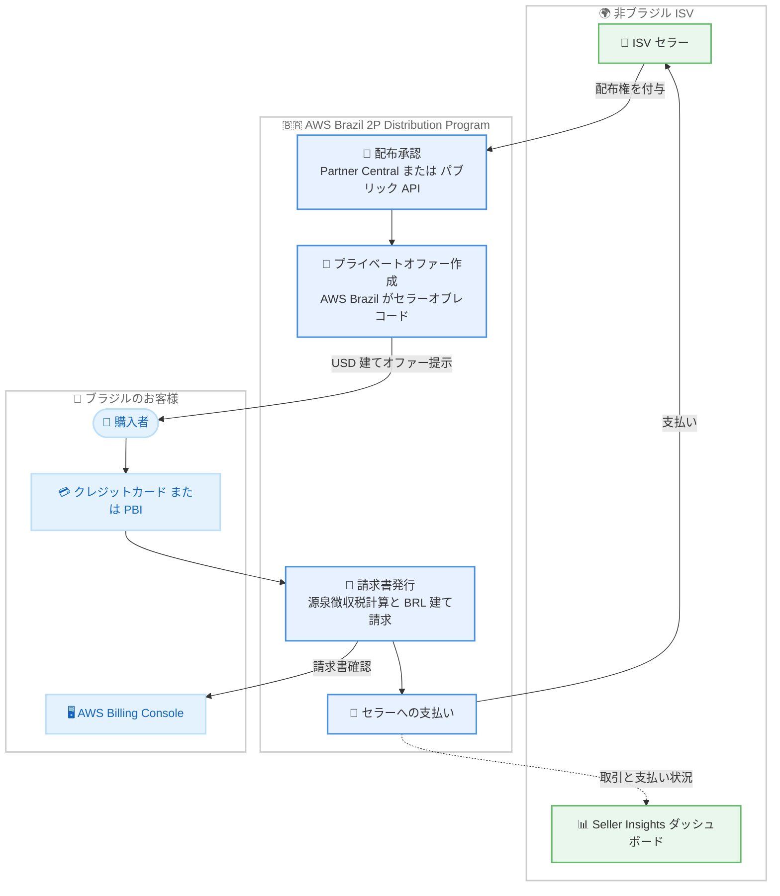

# AWS Marketplace - AWS Brazil 2P Distribution Program による非ブラジル製ソフトウェアライセンスの自動配布

**リリース日**: 2026 年 10 月 2 日
**サービス**: AWS Marketplace (AWS Brazil 2P Distribution Program)
**機能**: ブラジルのお客様向け非ブラジル製 SaaS プロダクトライセンスの自動配布ワークフロー

📊 [このアップデートのインフォグラフィックを見る](https://takech9203.github.io/aws-news-summary/20261002-aws-brazil-software-license-distribution.html)

## 概要

AWS Brazil は、AWS Brazil 2P Distribution Program を通じた自動配布ワークフローの提供を開始しました。対象となる非ブラジルの独立系ソフトウェアベンダー (ISV) が AWS Brazil に SaaS プロダクトライセンスの配布権を付与すると、AWS Brazil がブラジル国内のお客様へライセンスを配布します。AWS Brazil がセラーオブレコード (販売者) となり、ブラジルの適用税を含めてブラジルレアル (BRL) 建てでブラジルのお客様に請求します。

今回のアップデートにより、配布承認、セラーへの支払い、源泉徴収税の計算、請求書発行、セラー向けレポートが自動化されます。ISV は AWS Partner Central またはパブリック API を通じて配布承認を作成し、Seller Insights ダッシュボードで取引と支払い状況を追跡できます。

ブラジルの購入者は USD 建てで価格設定されたプライベートオファーを確認し、請求書発行日の為替レートに基づいて AWS Brazil から BRL 建てで請求を受けます。支払いはクレジットカード (Visa、Mastercard、American Express) または Pay by Invoice (PBI) に対応し、発注書番号の追加や AWS Billing Console での請求書確認も可能です。

**アップデート前の課題**

ブラジルでの SaaS プロダクト販売には、現地特有の商習慣と税制への対応が課題でした。

- 非ブラジルの ISV がブラジルのお客様に販売する際、現地通貨 (BRL) での請求やブラジルの税制への対応を個別に行う必要があった
- 源泉徴収税の計算、請求書発行、支払い処理などの事務作業を手動で管理する必要があった
- ブラジルのお客様は、海外ベンダーとの取引において現地の税務・会計要件との整合を取る負担があった

**アップデート後の改善**

今回のアップデートにより、ブラジル市場への SaaS 配布が自動化されたワークフローで完結します。

- 今回のアップデートにより、配布承認からセラーへの支払いまでの一連のプロセス (配布承認、支払い、源泉徴収税計算、請求書発行、レポート) が自動化された
- AWS Brazil がセラーオブレコードとなるため、ISV はブラジルの税務・請求処理を自前で構築する必要がなくなった
- ブラジルのお客様は BRL 建ての請求書を受け取り、クレジットカードまたは PBI で支払い、AWS Billing Console で請求書を確認できるようになった

## アーキテクチャ図



ISV が AWS Brazil に配布権を付与すると、AWS Brazil がセラーオブレコードとしてプライベートオファーの作成から請求、税計算、セラーへの支払いまでを自動的に処理する流れを示しています。

## サービスアップデートの詳細

### 主要機能

1. **配布承認の自動化**
   - 対象の ISV は、適用される Brazil 2P 配布条件に同意することで、AWS Brazil に SaaS プロダクトライセンスの現地配布権を付与する
   - 配布承認は AWS Partner Central またはパブリック API を通じて作成できる
   - 承認後のワークフロー (請求、税計算、支払い、レポート) は自動で処理される

2. **AWS Brazil によるセラーオブレコードとしての販売**
   - AWS Brazil がブラジルの購入者向けにプライベートオファーを作成し、購入者向け価格を決定する
   - 請求書の自動生成、税金の計算と源泉徴収、セラーへの支払いを自動的に実行する
   - ブラジルの適用税を含めて BRL 建てでブラジルのお客様に請求する

3. **Seller Insights ダッシュボードによる可視化**
   - ISV は Seller Insights ダッシュボードを通じて取引と支払い状況を追跡できる
   - セラー向けレポートが自動化される

4. **ブラジルの購入者向けの支払いオプション**
   - プライベートオファーは USD 建てで価格表示され、請求書発行日の為替レートで AWS Brazil から BRL 建てで請求される
   - クレジットカード (Visa、Mastercard、American Express) または Pay by Invoice (PBI) で支払い可能
   - 発注書 (PO) 番号の追加と、AWS Billing Console での請求書へのアクセスに対応

## 技術仕様

### プログラムの構成要素

| 項目 | 詳細 |
|------|------|
| プログラム名 | AWS Brazil 2P Distribution Program |
| 対象セラー | 対象となる非ブラジルの ISV (SaaS プロダクト) |
| セラーオブレコード | AWS Brazil |
| 配布承認の作成方法 | AWS Partner Central またはパブリック API |
| オファー形式 | AWS Brazil が作成するプライベートオファー |
| 価格表示通貨 | USD (購入者向けオファー表示) |
| 請求通貨 | BRL (請求書発行日の為替レートを適用) |
| 税処理 | ブラジルの適用税の計算と源泉徴収を自動化 |
| 支払い方法 | クレジットカード (Visa、Mastercard、American Express)、Pay by Invoice (PBI) |
| セラー向け可視化 | Seller Insights ダッシュボード |

## 設定方法

### 前提条件

1. AWS Brazil 2P Distribution Program の対象となる非ブラジルの ISV であること
2. 配布対象が SaaS プロダクトライセンスであること
3. 適用される Brazil 2P 配布条件に同意すること

### 手順

#### ステップ 1: Brazil 2P 配布条件への同意

対象の ISV は、適用される Brazil 2P 配布条件に同意し、AWS Brazil に SaaS プロダクトライセンスを現地配布する権利を付与します。詳細な開始手順は [AWS Marketplace Seller Guide](https://docs.aws.amazon.com/marketplace/latest/userguide/brazil-2p-getting-started.html) を参照してください。

#### ステップ 2: 配布承認の作成

AWS Partner Central またはパブリック API を使用して配布承認を作成します。これにより、AWS Brazil がブラジルの購入者向けにプライベートオファーを作成できるようになります。

#### ステップ 3: 取引と支払い状況の追跡

Seller Insights ダッシュボードで、取引および支払い状況を確認します。請求書発行、源泉徴収税計算、支払い、レポートは自動的に処理されます。

## メリット

### ビジネス面

- **ブラジル市場への参入障壁の低減**: AWS Brazil がセラーオブレコードとなるため、ISV は現地法人の設立や現地税制対応の仕組みを自前で用意することなくブラジルのお客様に SaaS を販売できる
- **購入者の調達体験の向上**: ブラジルのお客様は BRL 建ての請求書を受け取り、使い慣れた支払い方法 (クレジットカードまたは PBI) と AWS Billing Console を利用できる
- **事務コストの削減**: 請求書発行、源泉徴収税計算、支払い、レポートの自動化により、手動の事務作業が削減される

### 技術面

- **API による自動化**: 配布承認を AWS Partner Central だけでなくパブリック API からも作成できるため、既存の販売管理システムと統合しやすい
- **可視性の確保**: Seller Insights ダッシュボードにより、取引と支払い状況を一元的に追跡できる
- **請求の一元化**: 購入者は AWS Billing Console で請求書にアクセスでき、発注書番号の追加にも対応する

## デメリット・制約事項

### 制限事項

- 対象は「対象となる (eligible) 非ブラジルの ISV」であり、すべてのセラーが利用できるとは限らない
- 対象プロダクトは SaaS プロダクトライセンスに限定される
- 購入者向け価格は AWS Brazil が決定する

### 考慮すべき点

- プライベートオファーは USD 建てで表示され、BRL 建ての請求額は請求書発行日の為替レートに依存するため、為替変動の影響を受ける
- 参加には適用される Brazil 2P 配布条件への同意が必要であり、条件の内容を事前に確認する必要がある

## ユースケース

### ユースケース 1: ブラジル市場へ初めて参入するグローバル SaaS ベンダー

**シナリオ**: 米国の SaaS ベンダーがブラジルの企業顧客から引き合いを受けたが、現地の税制や BRL 建て請求への対応手段がない。

**実装例**:
```
1. Brazil 2P 配布条件に同意し、AWS Brazil に配布権を付与
2. AWS Partner Central で配布承認を作成
3. AWS Brazil がブラジルの購入者向けにプライベートオファーを作成
```

**効果**: 現地法人や税務処理の仕組みを構築することなく、ブラジルのお客様への販売を開始できる。

### ユースケース 2: 販売管理システムと統合した配布承認の自動化

**シナリオ**: 多数のブラジル顧客向け商談を抱える ISV が、商談成立のたびに手動で配布承認を作成する運用を自動化したい。

**実装例**:
```
1. パブリック API を使用して配布承認の作成を自社 CRM と連携
2. Seller Insights ダッシュボードで取引と支払い状況をモニタリング
```

**効果**: 配布承認の作成から支払い追跡までを自動化し、営業オペレーションの工数を削減できる。

### ユースケース 3: ブラジル企業による海外 SaaS の現地調達

**シナリオ**: ブラジルの企業が海外製 SaaS を導入したいが、社内の調達ポリシー上、BRL 建て請求書と発注書番号の記載が必須となっている。

**実装例**:
```
1. AWS Brazil が提示するプライベートオファーを確認 (USD 建て表示)
2. 発注書番号を追加して受諾
3. BRL 建て請求書を AWS Billing Console で確認し、クレジットカードまたは PBI で支払い
```

**効果**: 現地の調達・会計要件を満たしながら、海外製 SaaS を AWS 経由で調達できる。

## 料金

購入者向け価格は AWS Brazil が決定し、プライベートオファーは USD 建てで表示されます。請求は請求書発行日の為替レートに基づく BRL 建てで、ブラジルの適用税が含まれます。セラー側では源泉徴収税の計算と控除が自動的に行われます。手数料などの詳細は [AWS Marketplace Seller Guide](https://docs.aws.amazon.com/marketplace/latest/userguide/brazil-2p-getting-started.html) を確認してください。

## 利用可能リージョン

本プログラムはブラジル国内のお客様への配布を対象としています。対象となる非ブラジルの ISV が参加できます。

## 関連サービス・機能

- **AWS Marketplace**: SaaS プロダクトの販売・調達基盤であり、本プログラムのプライベートオファーや請求の仕組みの基盤となる
- **AWS Partner Central**: ISV が配布承認を作成するためのポータル
- **AWS Billing Console**: ブラジルの購入者が BRL 建て請求書にアクセスするためのコンソール

## 参考リンク

- 📊 [インフォグラフィック](https://takech9203.github.io/aws-news-summary/20261002-aws-brazil-software-license-distribution.html)
- [公式発表 (What's New)](https://aws.amazon.com/about-aws/whats-new/2026/10/aws-brazil-software-license-distribution/)
- [AWS Marketplace Seller Guide - Brazil 2P Getting Started](https://docs.aws.amazon.com/marketplace/latest/userguide/brazil-2p-getting-started.html)
- [AWS Marketplace Buyer Guide - Brazil 2P Buyer FAQ](https://docs.aws.amazon.com/marketplace/latest/buyerguide/brazil-2p-buyer-faq.html)

## まとめ

AWS Brazil 2P Distribution Program により、非ブラジルの ISV は現地の税務・請求の仕組みを自前で構築することなく、ブラジルのお客様へ SaaS プロダクトライセンスを配布できるようになりました。ブラジル市場への展開を検討している ISV は、Seller Guide で参加資格と Brazil 2P 配布条件を確認し、AWS Partner Central またはパブリック API での配布承認の作成を検討することを推奨します。
