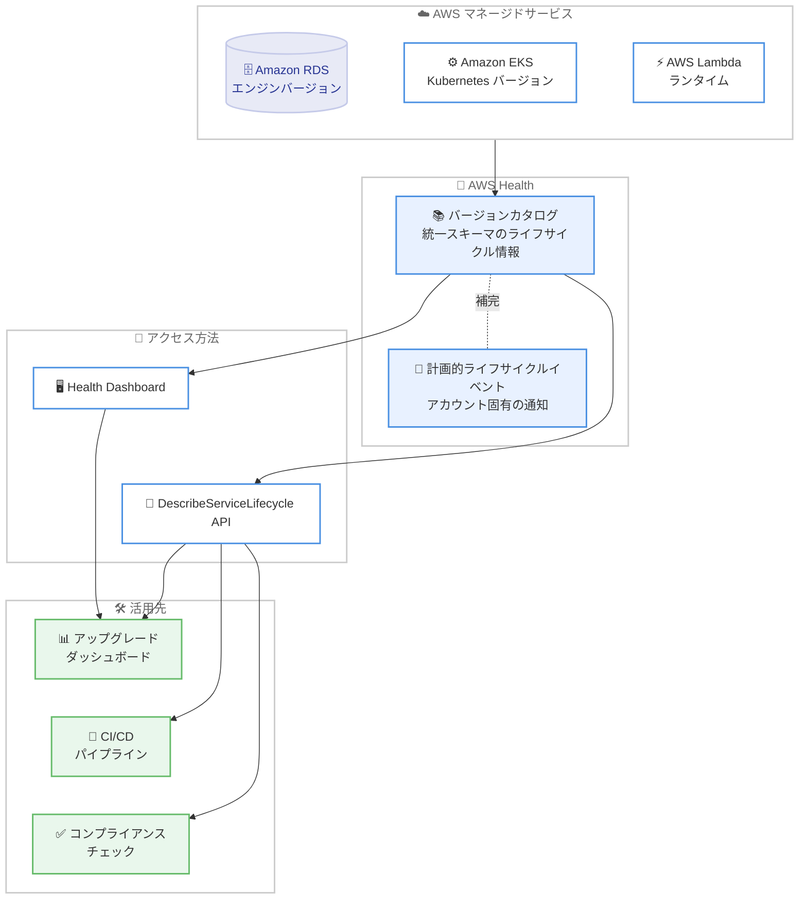

# AWS Health - バージョンカタログによるソフトウェアライフサイクル管理

**リリース日**: 2026 年 10 月 2 日
**サービス**: AWS Health
**機能**: バージョンカタログ (Version Catalog)

📊 [このアップデートのインフォグラフィックを見る](https://takech9203.github.io/aws-news-summary/20261002-aws-health-introduces-version-catalog-software-lifecycle-management.html)

## 概要

AWS Health に、AWS サービス全体のソフトウェアバージョンのライフサイクル情報を一元的に提供する新機能「バージョンカタログ」が導入されました。バージョンカタログは、AWS Health Dashboard および AWS Health API (`DescribeServiceLifecycle`) を通じて、各 AWS サービスコンポーネントのサポートされているバージョンとそのタイムラインをサービス横断で確認できる機能です。

従来、AWS Health はアカウント固有・リソース固有の計画的ライフサイクルイベント (Planned Lifecycle Events) を事前に通知していましたが、バージョンカタログはこれを補完し、サービス全体のバージョンサポート状況を俯瞰する視点を追加します。これにより、お客様はアカウント固有の通知を受け取る前に、アップグレードスケジュールの策定やガバナンス管理を能動的に行い、サポート終了リスクに対してリアクティブからプロアクティブな運用へ移行できます。

リリース時点では Amazon RDS、Amazon EKS、AWS Lambda のライフサイクル情報がカバーされており、今後さらに対象サービスが拡大される予定です。コンプライアンス管理、フリート監査、CI/CD パイプラインへの統合など、幅広い運用自動化に活用できます。

**アップデート前の課題**

このアップデート以前は、バージョンライフサイクル情報の収集と管理に以下の課題がありました。

- 以前は AWS Health の計画的ライフサイクルイベントがアカウント固有・リソース固有の通知であり、サービス全体のバージョンサポート状況を俯瞰する手段がなかった
- 以前は Lambda ランタイム、RDS エンジンバージョン、EKS Kubernetes バージョンなどのサポート終了日を、各サービスのドキュメントから個別に収集する必要があった
- 以前はバージョンのサポート期限情報を自動化パイプラインやコンプライアンスダッシュボードに組み込むための、統一されたスキーマの API が存在しなかった

**アップデート後の改善**

今回のアップデートにより、以下が可能になりました。

- 今回のアップデートにより、AWS Health Dashboard でサポートされているバージョンとライフサイクルタイムラインをサービス横断で一元的に確認できるようになった
- 今回のアップデートにより、`DescribeServiceLifecycle` API の 1 回の呼び出しで、統一スキーマのライフサイクルデータを運用ワークフローに統合できるようになった
- 今回のアップデートにより、アカウント固有のライフサイクル通知を受け取る前に、アップグレード計画やガバナンス管理をプロアクティブに実施できるようになった

## アーキテクチャ図



バージョンカタログは各 AWS マネージドサービスのバージョンライフサイクル情報を統一スキーマで集約し、Health Dashboard と API の 2 つの経路で提供します。取得したデータはダッシュボード構築、CI/CD 自動化、コンプライアンスチェックなどに活用できます。

## サービスアップデートの詳細

### 主要機能

1. **サービス横断のバージョンライフサイクル情報**
   - Lambda の言語ランタイム、RDS のエンジンバージョン、EKS の Kubernetes バージョンなど、AWS サービスコンポーネントのサポートタイムラインを一元的に提供
   - 各バージョンのリリース、標準サポート終了、サポート完全終了などのマイルストーンを時系列で確認可能
   - 既存の計画的ライフサイクルイベント (アカウント固有の通知) を補完する、サービス全体のビュー

2. **DescribeServiceLifecycle API**
   - 1 回の認証済み API 呼び出しで、統一された単一スキーマのライフサイクル情報を取得
   - `service` フィルタによる対象サービスの絞り込み、ページネーション (`nextToken`、`maxResults`) に対応
   - レスポンスには推奨バージョン (`recommendedVersion`) も含まれ、移行先の判断に活用可能

3. **影響リスクタグによる重大度評価**
   - 各ライフサイクルイベントに `END_OF_SUPPORT`、`BILLING`、`AVAILABILITY` などの影響リスクタグが付与される
   - `AVAILABILITY` は期日経過後にリソースが利用不可になる最も緊急性の高いタグ
   - `BILLING` は延長サポート料金など追加費用が発生する可能性を示す

4. **Health Dashboard での可視化**
   - コンソール上でサービス、リソース、バージョンの一覧テーブルを表示
   - 選択したバージョンのライフサイクルイベントのタイムラインをサイドペインで確認可能

## 技術仕様

### バージョンエントリの構造

| 項目 | 詳細 |
|------|------|
| `service` | バージョンが属する AWS サービス (例: `LAMBDA`、`RDS`、`EKS`) |
| `title` | バージョンの表示名 (例: `Python 3.14 Lambda Runtime`) |
| `version` | クエリで指定するサービス固有のバージョン識別子 (例: `python3.14`) |
| `recommendedVersion` | 推奨される移行先バージョン |
| `lifecycleEvents` | 時系列順のライフサイクルイベントのリスト |

### ライフサイクルイベントオブジェクト

| 項目 | 詳細 |
|------|------|
| `lifecycleEventType` | マイルストーンの種類 (例: `END_OF_SUPPORT`、`BLOCK_RESOURCE_CREATE`、`BLOCK_RESOURCE_UPDATE`) |
| `date` | マイルストーンが有効になる日付 |
| `description` | その日付に何が起こるかの説明 |
| `impactRisks` | 影響リスクタグ (`END_OF_SUPPORT`、`BILLING`、`AVAILABILITY` など) |
| `regions` | イベントが適用されるリージョン (`["all"]` は全リージョンを意味する) |

### API変更履歴

| 日付 | サービス | 変更内容 |
|------|----------|----------|
| 2026/10/01 | [health](https://awsapichanges.com/archive/changes/646bd4-health.html) | 1 new api method - `DescribeServiceLifecycle` オペレーションを追加。サポート終了日、推奨バージョン、ライフサイクルイベントを含む AWS サービスのライフサイクル情報を返す |

### API レスポンス例

```json
{
  "service": "LAMBDA",
  "title": "Python 3.14 Lambda Runtime",
  "version": "python3.14",
  "lifecycleEvents": [
    {
      "lifecycleEventType": "END_OF_SUPPORT",
      "date": 1877472000.0,
      "description": "Runtime no longer receives security patches or updates",
      "impactRisks": ["END_OF_SUPPORT"],
      "regions": ["all"]
    },
    {
      "lifecycleEventType": "BLOCK_RESOURCE_CREATE",
      "date": 1880150400.0,
      "description": "Cannot create new Lambda functions using this runtime",
      "impactRisks": ["AVAILABILITY"],
      "regions": ["all"]
    },
    {
      "lifecycleEventType": "BLOCK_RESOURCE_UPDATE",
      "date": 1882828800.0,
      "description": "Cannot update existing Lambda functions using this runtime",
      "impactRisks": ["AVAILABILITY"],
      "regions": ["all"]
    }
  ]
}
```

## 設定方法

### 前提条件

1. AWS アカウントを保有していること
2. API アクセスには対象の AWS サポートプラン (公式発表では Business Support Plus、Enterprise Support、または Unified Operations プラン) に加入していること
3. AWS Health API を呼び出す IAM 権限が設定されていること

### 手順

#### ステップ1: Health Dashboard でバージョンカタログを確認

AWS Health Dashboard のバージョンカタログページにアクセスします。

```text
https://health.console.aws.amazon.com/health/home#/account/version-catalog
```

コンソール上でサービス、リソース、バージョンの一覧が表示され、各バージョンを選択するとライフサイクルイベントのタイムラインをサイドペインで確認できます。

#### ステップ2: API でライフサイクル情報を取得

```bash
aws health describe-service-lifecycle
```

このコマンドは、バージョンカタログに登録されている AWS サービスコンポーネントのライフサイクル情報を統一スキーマで取得します。

#### ステップ3: 特定サービスでフィルタリング

```bash
aws health describe-service-lifecycle \
  --filter service=LAMBDA \
  --max-results 50
```

`--filter` オプションで対象サービスを絞り込み、`--max-results` で取得件数を制御します。取得したデータをダッシュボードや CI/CD パイプラインに統合することで、サポート終了が近いバージョンの検出を自動化できます。

## メリット

### ビジネス面

- **プロアクティブなリスク管理**: サポート終了前に計画的なアップグレードを実施することで、セキュリティリスクや突発的な強制アップグレードによる事業影響を低減できる
- **コンプライアンス対応の効率化**: サポート終了データをコンプライアンスダッシュボードに取り込むことで、PCI DSS、SOC 2、FedRAMP などの監査対応を効率化できる
- **延長サポート費用の回避**: `BILLING` 影響リスクタグにより、延長サポート料金が発生する前に移行計画を立てられる

### 技術面

- **統一スキーマによる自動化**: 1 回の API 呼び出しで複数サービスのライフサイクル情報を一貫したスキーマで取得でき、ツール開発が容易になる
- **CI/CD パイプラインへの統合**: サポート終了間近のランタイムに依存するビルドを失敗させる、サポート中の全バージョンに対するテストマトリクスを自動維持するなどの自動化が可能
- **インベントリ監査との連携**: CMDB やリソースインベントリと突合し、サポート外のデータベースエンジンやランタイムを自動検出できる

## デメリット・制約事項

### 制限事項

- API アクセスは対象のサポートプランに加入しているお客様に限定される
- リリース時点でカバーされるサービスは Amazon RDS、Amazon EKS、AWS Lambda が中心であり、その他のサービスは今後順次追加予定
- 商用リージョンでの提供であり、GovCloud や中国リージョンについては発表内で言及されていない

### 考慮すべき点

- バージョンカタログはサービス全体のビューを提供するものであり、自アカウントで実際に使用中のリソースとの突合は利用者側で実装する必要がある
- `lifecycleEventType` や `impactRisks` の値は今後追加される可能性があるため、自動化ツールは未知の値を許容する設計にすることが望ましい

## ユースケース

### ユースケース1: Lambda ランタイムのサポート終了監視

**シナリオ**: 多数の Lambda 関数を運用しており、ランタイムのサポート終了を事前に検知して計画的に移行したい。

**実装例**:
```bash
# Lambda ランタイムのライフサイクル情報を取得し、サポート終了日を抽出
aws health describe-service-lifecycle \
  --filter service=LAMBDA \
  --query "serviceLifecycles[].{version:version,events:lifecycleEvents[?lifecycleEventType=='END_OF_SUPPORT'].date}" \
  --output json
```

**効果**: サポート終了が近いランタイムを早期に特定し、アカウント固有の通知を待たずに移行計画を開始できる。

### ユースケース2: CI/CD パイプラインでのバージョンチェック

**シナリオ**: ビルドパイプラインで、プロジェクトが依存するランタイムがサポート終了間近の場合に警告またはビルド失敗としたい。

**実装例**:
```python
import boto3
from datetime import datetime, timedelta

health = boto3.client("health", region_name="us-east-1")
response = health.describe_service_lifecycle(filter={"service": "LAMBDA"})

threshold = datetime.now() + timedelta(days=180)
for lifecycle in response["serviceLifecycles"]:
    for event in lifecycle["lifecycleEvents"]:
        if event["lifecycleEventType"] == "END_OF_SUPPORT" and event["date"] < threshold:
            print(f"警告: {lifecycle['title']} は 180 日以内にサポート終了")
```

**効果**: サポート終了間近のバージョンへの依存をビルド段階で検出し、技術的負債の蓄積を防止できる。

### ユースケース3: コンプライアンスダッシュボードへの統合

**シナリオ**: PCI DSS や SOC 2 の監査要件として、サポート外ソフトウェアが稼働していないことを継続的に証明したい。

**実装例**:
```bash
# RDS エンジンバージョンのライフサイクル情報を定期取得し、
# CMDB のインベントリと突合してサポート外バージョンをレポート
aws health describe-service-lifecycle \
  --filter service=RDS \
  --output json > rds_lifecycle.json
```

**効果**: サポート終了データをコンプライアンスダッシュボードに自動反映し、監査対応の工数を削減できる。

## 料金

公式発表では、バージョンカタログ自体の追加料金に関する記載はありません。ただし、API アクセスは対象のサポートプラン (公式発表では Business Support Plus、Enterprise Support、または Unified Operations プラン) に加入しているお客様に限定されます。

## 利用可能リージョン

すべての AWS 商用リージョンで利用可能です。

## 関連サービス・機能

- **AWS Health 計画的ライフサイクルイベント**: アカウント固有・リソース固有のサポート終了通知。バージョンカタログはこれを補完するサービス全体のビューを提供する
- **AWS Lambda**: 言語ランタイムのライフサイクル情報がバージョンカタログの対象。ランタイムの非推奨化スケジュールを API で取得可能
- **Amazon RDS / Amazon Aurora**: データベースエンジンバージョンのライフサイクル情報が対象。延長サポート費用の発生前に移行計画を立てられる
- **Amazon EKS**: Kubernetes バージョンのライフサイクル情報が対象。強制アップグレード前の計画的な対応が可能

## 参考リンク

- 📊 [インフォグラフィック](https://takech9203.github.io/aws-news-summary/20261002-aws-health-introduces-version-catalog-software-lifecycle-management.html)
- [公式発表 (What's New)](https://aws.amazon.com/about-aws/whats-new/2026/10/aws-health-introduces-version-catalog-software-lifecycle-management)
- [ドキュメント: Version catalog for AWS Health](https://docs.aws.amazon.com/health/latest/ug/aws-health-version-catalog.html)
- [AWS Health API リファレンス: DescribeServiceLifecycle](https://docs.aws.amazon.com/health/latest/APIReference/API_DescribeServiceLifecycle.html)
- [AWS Health Dashboard: バージョンカタログ](https://health.console.aws.amazon.com/health/home?region=us-east-1#/account/version-catalog)

## まとめ

AWS Health のバージョンカタログは、AWS サービスコンポーネントのバージョンライフサイクル情報を統一スキーマで一元提供し、サポート終了リスクへの対応をリアクティブからプロアクティブへ転換する重要なアップデートです。Lambda ランタイムや RDS エンジン、EKS バージョンを多数運用している組織は、まず Health Dashboard でカタログを確認し、`DescribeServiceLifecycle` API を既存の運用ダッシュボードや CI/CD パイプラインへ統合することを推奨します。
