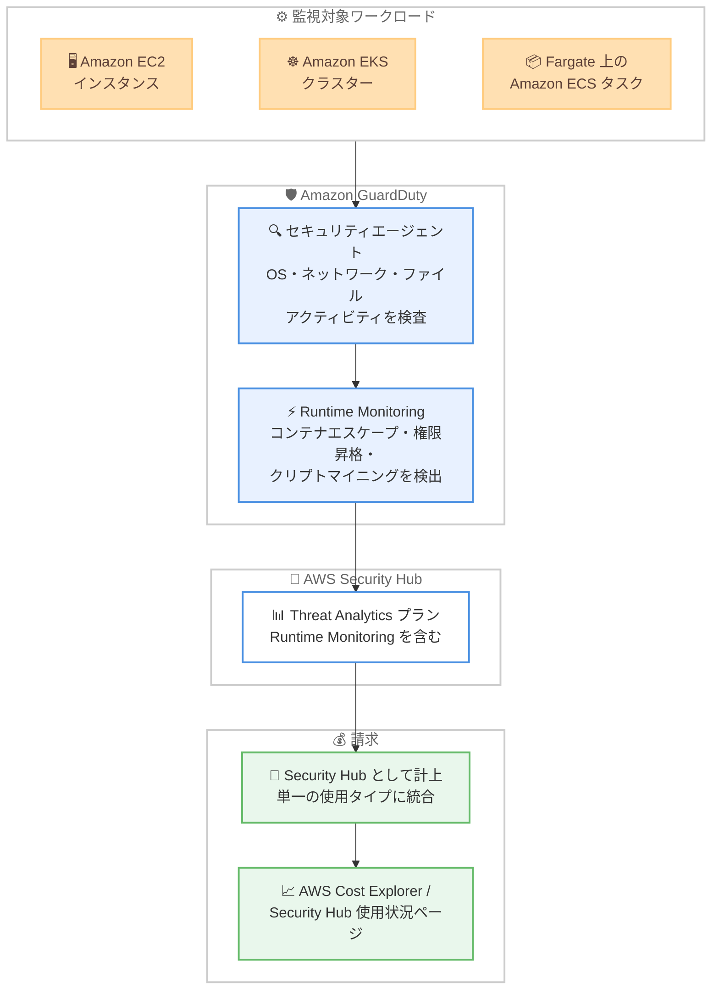

# AWS Security Hub - GuardDuty Runtime Monitoring の Threat Analytics プランへの統合

**リリース日**: 2026 年 10 月 2 日
**サービス**: AWS Security Hub / Amazon GuardDuty
**機能**: GuardDuty Runtime Monitoring の Security Hub Threat Analytics プランへの請求統合

📊 [このアップデートのインフォグラフィックを見る](https://takech9203.github.io/aws-news-summary/20261002-aws-security-hub-runtime-monitoring.html)

## 概要

Amazon GuardDuty Runtime Monitoring が AWS Security Hub の Threat Analytics プランに含まれるようになりました。Runtime Monitoring は、Amazon EC2 インスタンス、Amazon EKS クラスター、AWS Fargate 上の Amazon ECS タスクを対象に、オペレーティングシステム、ネットワーク、ファイルアクティビティを検査し、コンテナエスケープ、権限昇格、クリプトマイニングなどの脅威を検出する機能です。

今回のアップデートは請求 (課金) の統合に関する変更です。Security Hub を有効化しているアカウント・リージョンでは、Runtime Monitoring の利用料金が GuardDuty 側の個別請求項目として計上されなくなり、代わりに AWS Security Hub の請求項目として表示されます。EC2、EKS、Fargate 上の ECS というリソースタイプごとに分かれていた課金は、単一の使用タイプ (usage type) に統合されます。

検出カバレッジ、検出結果 (Finding) のタイプ、GuardDuty セキュリティエージェントの動作に変更はなく、お客様側での再設定や対応は不要です。請求への影響は AWS Cost Explorer または Security Hub の使用状況ページで確認できます。

**アップデート前の課題**

このアップデート以前は、脅威検出機能の課金管理に以下の課題がありました。

- 以前は Security Hub の Threat Analytics プランを利用していても、Runtime Monitoring の料金は GuardDuty 側で別途計上され、脅威分析関連のコストが複数のサービスに分散していた
- 以前は Runtime Monitoring の課金が EC2、EKS、Fargate 上の ECS というリソースタイプごとに分かれており、コスト構造の把握が煩雑だった
- 以前は Security Hub と GuardDuty をまたいだ脅威検出コストの全体像を把握するために、複数の請求項目を突き合わせる必要があった

**アップデート後の改善**

今回のアップデートにより、以下が改善されました。

- 今回のアップデートにより、Security Hub 有効化済みのアカウント・リージョンでは Runtime Monitoring の料金が AWS Security Hub の請求項目に統合され、脅威分析コストを一元的に把握できるようになった
- 今回のアップデートにより、EC2、EKS、Fargate 上の ECS にまたがる Runtime Monitoring の課金が単一の使用タイプに統合され、コスト構造がシンプルになった
- 今回のアップデートにより、設定変更やエージェントの再デプロイを行うことなく、既存の検出カバレッジと Finding タイプを維持したまま請求統合の恩恵を受けられるようになった

## アーキテクチャ図



GuardDuty Runtime Monitoring が EC2、EKS、Fargate 上の ECS を監視する構成は変わらず、課金のみが Security Hub の Threat Analytics プランに統合される流れを示しています。

## サービスアップデートの詳細

### 主要機能

1. **請求の Security Hub への統合**
   - Security Hub を有効化しているアカウント・リージョンでは、Runtime Monitoring の料金が GuardDuty の請求項目として表示されなくなる
   - 利用料金は AWS Security Hub の請求項目として計上される
   - お客様側での設定変更や対応は不要

2. **使用タイプの一本化**
   - 従来は EC2、EKS、Fargate 上の ECS というリソースタイプごとに課金が分かれていた
   - 今回の変更により、単一の使用タイプとしてメータリングされる
   - コスト配分やコスト分析の粒度管理がシンプルになる

3. **検出機能は変更なし**
   - 検出カバレッジ、Finding タイプ、GuardDuty セキュリティエージェントの動作に変更はない
   - OS、ネットワーク、ファイルアクティビティの検査により、コンテナエスケープ、権限昇格、クリプトマイニングなどの脅威を引き続き検出
   - エージェントの再デプロイや再設定は不要

4. **無料トライアルの取り扱い**
   - Threat Analytics プランの無料トライアルは、Security Hub Essentials プランの無料トライアルとは別に管理される
   - 今回の変更によって Runtime Monitoring の新しい無料トライアルが追加されるわけではない

## 技術仕様

### 請求統合の内容

| 項目 | 変更前 | 変更後 |
|------|--------|--------|
| 請求上のサービス | Amazon GuardDuty | AWS Security Hub |
| 使用タイプ | EC2 / EKS / Fargate 上の ECS ごとに個別 | 単一の使用タイプに統合 |
| 検出カバレッジ | EC2、EKS、Fargate 上の ECS | 変更なし |
| Finding タイプ | GuardDuty Runtime Monitoring の Finding | 変更なし |
| セキュリティエージェント | GuardDuty セキュリティエージェント | 変更なし |
| 必要な対応 | - | なし (自動適用) |

### 適用条件

| 条件 | 内容 |
|------|------|
| 適用対象 | Security Hub を有効化しているアカウント・リージョン |
| 適用方法 | 自動 (お客様の操作は不要) |
| コスト確認方法 | AWS Cost Explorer、Security Hub 使用状況ページ |

## 設定方法

### 前提条件

1. AWS Security Hub (Threat Analytics プラン) が有効化されていること
2. Amazon GuardDuty Runtime Monitoring が有効化されていること
3. 請求情報を確認するための IAM 権限 (Cost Explorer へのアクセスなど) があること

### 手順

#### ステップ 1: 請求統合の適用状況を確認する

```bash
# Security Hub の有効化状況を確認
aws securityhub describe-hub --region ap-northeast-1
```

対象リージョンで Security Hub が有効化されているかを確認します。有効化されているアカウント・リージョンでは、Runtime Monitoring の請求統合が自動的に適用されます。

#### ステップ 2: GuardDuty Runtime Monitoring の設定を確認する

```bash
# GuardDuty のデテクター ID を取得
aws guardduty list-detectors --region ap-northeast-1

# Runtime Monitoring の有効化状況を確認
aws guardduty get-detector --detector-id <detector-id> --region ap-northeast-1
```

Runtime Monitoring の設定内容を確認します。今回の変更は請求のみに関するものであり、検出設定やエージェントの変更は不要です。

#### ステップ 3: Cost Explorer で請求への影響を確認する

```bash
# Security Hub の使用量をサービス別に確認
aws ce get-cost-and-usage \
  --time-period Start=2026-10-01,End=2026-11-01 \
  --granularity MONTHLY \
  --metrics "UnblendedCost" \
  --filter '{"Dimensions":{"Key":"SERVICE","Values":["AWS Security Hub"]}}'
```

AWS Cost Explorer の API を使用して、Runtime Monitoring の利用料金が AWS Security Hub の請求項目として計上されていることを確認します。Security Hub コンソールの使用状況ページでも確認できます。

## メリット

### ビジネス面

- **コストの可視性向上**: 脅威分析関連のコストが Security Hub に一元化され、セキュリティ投資の全体像を把握しやすくなる
- **請求管理の簡素化**: リソースタイプごとに分かれていた課金が単一の使用タイプに統合され、コスト配分や予算管理が容易になる
- **移行コストゼロ**: 設定変更や作業が一切不要で、自動的に請求統合の恩恵を受けられる

### 技術面

- **検出機能の継続性**: 検出カバレッジ、Finding タイプ、エージェント動作が変更されないため、既存のセキュリティ運用やインテグレーションに影響がない
- **運用負荷の軽減**: エージェントの再デプロイや再設定が不要で、ワークロードへの影響なく適用される
- **統合的な脅威分析基盤**: Security Hub の Threat Analytics プランの一部として、GuardDuty の実行時脅威検出を他のセキュリティシグナルとあわせて活用できる

## デメリット・制約事項

### 制限事項

- 請求統合は Security Hub を有効化しているアカウント・リージョンにのみ適用され、Security Hub を有効化していない場合は従来どおり GuardDuty 側で課金される
- 今回の変更により Runtime Monitoring の新しい無料トライアルが提供されるわけではない
- Threat Analytics プランの無料トライアルは Security Hub Essentials プランの無料トライアルとは別管理である点に注意が必要

### 考慮すべき点

- 請求項目が GuardDuty から Security Hub に移動するため、サービス別のコスト集計やコスト異常検知のルールを使用している場合は、集計対象の見直しが必要になる可能性がある
- リソースタイプ別の課金内訳が単一の使用タイプに統合されるため、EC2 / EKS / ECS ごとの詳細なコスト内訳が必要な場合は、タグやリソースレベルの分析手法を検討する必要がある

## ユースケース

### ユースケース 1: セキュリティコストの一元管理

**シナリオ**: セキュリティ部門が、組織全体の脅威検出・分析コストを Security Hub 中心に集約し、予算管理を簡素化したい。

**実装例**:
```bash
# Cost Explorer で Security Hub のコストを月次で追跡
aws ce get-cost-and-usage \
  --time-period Start=2026-10-01,End=2026-12-01 \
  --granularity MONTHLY \
  --metrics "UnblendedCost" \
  --group-by Type=DIMENSION,Key=USAGE_TYPE \
  --filter '{"Dimensions":{"Key":"SERVICE","Values":["AWS Security Hub"]}}'
```

**効果**: Runtime Monitoring を含む脅威分析コストが Security Hub の請求項目に集約され、セキュリティ投資のレポーティングと予算策定が容易になる。

### ユースケース 2: コンテナワークロードの実行時脅威検出の継続運用

**シナリオ**: EKS クラスターと Fargate 上の ECS タスクで Runtime Monitoring を運用中の組織が、請求変更の影響を受けずに検出体制を維持したい。

**実装例**:
```bash
# EKS Runtime Monitoring の有効化状況を確認
aws guardduty get-detector \
  --detector-id <detector-id> \
  --query "Features[?Name=='RUNTIME_MONITORING']"
```

**効果**: 検出カバレッジ、Finding タイプ、エージェントは変更されないため、既存の検出ルールやインシデント対応フローをそのまま継続できる。

### ユースケース 3: 請求変更にともなうコスト監視ルールの更新

**シナリオ**: FinOps チームが、GuardDuty のコスト急減と Security Hub のコスト増加を誤検知しないように、コスト異常検知の設定を見直したい。

**実装例**:
```bash
# コスト異常検知モニターの設定を確認
aws ce get-anomaly-monitors
```

**効果**: 請求項目の移動を事前に把握してモニターやアラートのしきい値を調整することで、請求統合にともなう誤検知を防止できる。

## 料金

Runtime Monitoring の利用料金は、Security Hub を有効化しているアカウント・リージョンでは AWS Security Hub の請求項目として計上されます。課金は EC2、EKS、Fargate 上の ECS のリソースタイプ別ではなく、単一の使用タイプに統合されます。

料金の詳細は [AWS Security Hub 料金ページ](https://aws.amazon.com/security-hub/pricing/) を参照してください。請求への影響は AWS Cost Explorer または Security Hub の使用状況ページで確認できます。

## 利用可能リージョン

AWS Security Hub が利用可能なすべてのリージョンで利用できます。詳細は [AWS リージョン別サービス表](https://aws.amazon.com/about-aws/global-infrastructure/regional-product-services/) を参照してください。

## 関連サービス・機能

- **Amazon GuardDuty**: Runtime Monitoring の検出エンジンとセキュリティエージェントを提供する脅威検出サービス。検出機能自体は従来どおり GuardDuty が担う
- **AWS Security Hub**: 脅威分析とセキュリティ検出結果を一元管理するサービス。Threat Analytics プランに Runtime Monitoring が含まれる
- **AWS Cost Explorer**: 請求統合後のコスト影響を確認するためのコスト分析ツール
- **Amazon EC2 / Amazon EKS / Amazon ECS on AWS Fargate**: Runtime Monitoring の監視対象となるコンピューティングサービス

## 参考リンク

- 📊 [インフォグラフィック](https://takech9203.github.io/aws-news-summary/20261002-aws-security-hub-runtime-monitoring.html)
- [公式発表 (What's New)](https://aws.amazon.com/about-aws/whats-new/2026/10/aws-security-hub-runtime-monitoring/)
- [AWS Security Hub 製品ページ](https://aws.amazon.com/security-hub/)
- [AWS Security Hub 料金ページ](https://aws.amazon.com/security-hub/pricing/)
- [AWS リージョン別サービス表](https://aws.amazon.com/about-aws/global-infrastructure/regional-product-services/)

## まとめ

GuardDuty Runtime Monitoring の料金が Security Hub の Threat Analytics プランに統合され、脅威分析関連のコストを一元的に管理できるようになりました。検出機能や設定に変更はなく、お客様側の対応は不要です。Security Hub と Runtime Monitoring を併用している場合は、AWS Cost Explorer または Security Hub の使用状況ページで請求への影響を確認し、必要に応じてコスト監視ルールを見直すことを推奨します。
