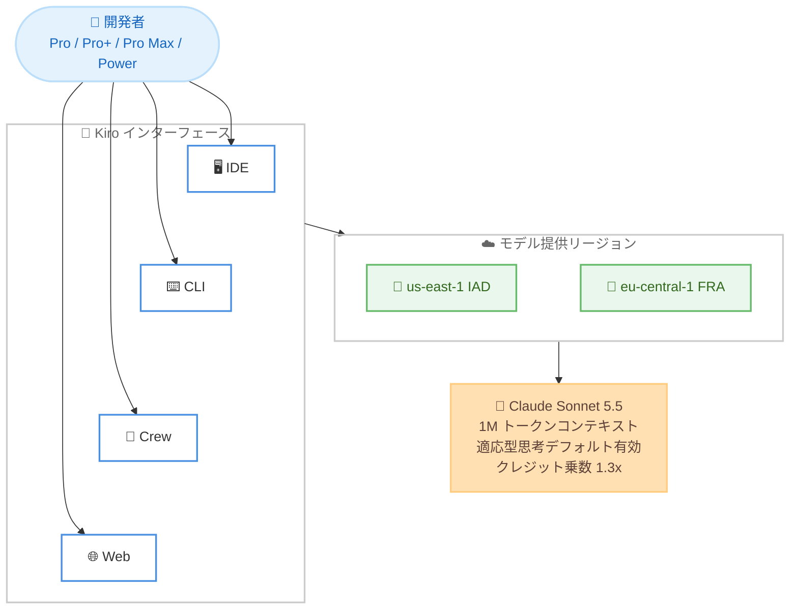

# Kiro - Claude Sonnet 5.5 の提供開始

**リリース日**: 2026 年 10 月 2 日
**サービス**: Kiro
**機能**: Claude Sonnet 5.5 の実験的サポート (Experimental Support)

📊 [このアップデートのインフォグラフィックを見る](https://takech9203.github.io/aws-news-summary/20261002-kiro-changelog-2026-10-02.html)

## 概要

AWS の AI 搭載 IDE である Kiro で、Anthropic の最新モデル Claude Sonnet 5.5 が実験的サポート (Experimental Support) として利用可能になりました。Kiro IDE、CLI、Crew、Web のすべてのインターフェースで、Pro、Pro+、Pro Max、Power プランのユーザーが us-east-1 (IAD) および eu-central-1 (FRA) で利用できます。

Claude Sonnet 5.5 は Anthropic 史上最速の Sonnet モデルであり、Sonnet 5 からの明確なアップグレードです。出力速度は 30% 以上高速化され、実世界のナレッジワークでは Opus 5.5 に迫る性能を発揮し、より明瞭な文章生成により協働パートナーとしての能力が向上しています。1M トークンのコンテキストウィンドウ、デフォルトで有効な適応型思考 (Adaptive Thinking) を備え、クレジット乗数は 1.3x に設定されています。

**アップデート前の課題**

- 高速な応答と高い性能を両立するには、クレジット乗数の高い Opus 系モデル (Opus 5.5 は 2.0x) を選択する必要があった
- Sonnet 5 では、複雑なナレッジワークにおいて Opus 系モデルとの性能差があった
- 大規模なコードベースや長大なドキュメントを扱う際、コンテキストウィンドウの制約を考慮する必要があった

**アップデート後の改善**

- Sonnet 5 比で 30% 以上高速な出力により、対話的な開発作業の待ち時間が短縮された
- 実世界のナレッジワークで Opus 5.5 に迫る性能を、1.3x という低いクレジット乗数で利用できるようになった
- 1M トークンのコンテキストウィンドウにより、大規模なコードベースやドキュメントを一度に扱えるようになった
- 適応型思考がデフォルトで有効となり、タスクの複雑さに応じた推論が自動的に行われるようになった

## アーキテクチャ図



Kiro の 4 つのインターフェース (IDE、CLI、Crew、Web) すべてから、us-east-1 と eu-central-1 でホストされる Claude Sonnet 5.5 を利用できる構成を示しています。

## サービスアップデートの詳細

### 主要機能

1. **Anthropic 最速の Sonnet モデル**
   - Sonnet 5 と比較して出力が 30% 以上高速
   - 実世界のナレッジワークでは Opus 5.5 に迫る性能
   - より明瞭な文章生成により、協働パートナーとしての能力が向上

2. **1M トークンのコンテキストウィンドウ**
   - 大規模なコードベースや長大なドキュメントを一度に処理可能
   - 長時間のセッションでもコンテキストを維持しやすい

3. **適応型思考 (Adaptive Thinking) がデフォルトで有効**
   - タスクの複雑さに応じてモデルが推論の深さを自動調整
   - 追加設定なしで高度な推論を活用可能

4. **全インターフェースでの実験的サポート**
   - Kiro IDE、CLI、Crew、Web のすべてで利用可能
   - 実験的機能のため、グローバルクロスリージョン推論の対象となる点に注意

## 技術仕様

### モデル仕様

| 項目 | 詳細 |
|------|------|
| モデル名 | Claude Sonnet 5.5 |
| 提供形態 | 実験的サポート (Experimental Support) |
| コンテキストウィンドウ | 1M トークン |
| 適応型思考 | デフォルトで有効 |
| クレジット乗数 | 1.3x |
| 対応インターフェース | IDE、CLI、Crew、Web |
| 対象プラン | Pro、Pro+、Pro Max、Power |
| モデル提供リージョン | us-east-1 (IAD)、eu-central-1 (FRA) |

### 主要モデルとの比較

| モデル | 特徴 | クレジット乗数 |
|--------|------|----------------|
| Claude Sonnet 5.5 | 最速の Sonnet、ナレッジワークで Opus 5.5 に迫る性能 | 1.3x |
| Claude Opus 5.5 | 強力なエージェンティックコーディングと明瞭なコミュニケーション | 2.0x |
| Claude Sonnet 5 | 従来の Sonnet モデル | - |

### セキュリティ特性

Claude Sonnet 5.5 のサイバーセキュリティセーフガードは Opus 5.5 と同様です。通常の開発作業には影響しませんが、一部の限定的な高リスクのリクエストは拒否される場合があります。

## 設定方法

### 前提条件

1. Kiro の Pro、Pro+、Pro Max、Power のいずれかのプランを契約していること
2. Kiro IDE、CLI、Crew、Web のいずれかを利用していること
3. モデル提供リージョンが us-east-1 または eu-central-1 であること

### 手順

#### ステップ 1: 最新のモデルリストを読み込む

```bash
# IDE または CLI の場合: アプリケーションを再起動

# Crew の場合: 以下のコマンドを実行
kirocrew restart
```

IDE または CLI では再起動により、Crew では `kirocrew restart` コマンドにより最新のモデルリストが読み込まれます。Web の場合はブラウザでページを更新します。

#### ステップ 2: モデルを選択する

モデル選択メニューから Claude Sonnet 5.5 を選択します。実験的サポートのモデルとして表示されます。

#### ステップ 3: 動作を確認する

通常のチャットやエージェントタスクを実行し、応答速度や出力品質を確認します。クレジット消費は 1.3x の乗数で計算されます。

## メリット

### ビジネス面

- **コスト効率の向上**: Opus 5.5 (2.0x) に迫るナレッジワーク性能を 1.3x のクレジット乗数で利用でき、クレジット消費を抑制できる
- **生産性の向上**: 30% 以上高速な出力により、開発者の待ち時間が短縮され、イテレーションの速度が向上する
- **ドキュメント作業の品質向上**: より明瞭な文章生成により、ドキュメント、スライド、スプレッドシートなどの作業品質が向上する

### 技術面

- **大規模コンテキストの処理**: 1M トークンのコンテキストウィンドウにより、大規模なコードベースを扱うタスクに対応できる
- **自動的な推論調整**: 適応型思考がデフォルトで有効なため、追加設定なしでタスクの複雑さに応じた推論が行われる
- **全インターフェース対応**: IDE、CLI、Crew、Web のすべてで同じモデルを利用でき、ワークフローに合わせた使い分けが可能

## デメリット・制約事項

### 制限事項

- 実験的サポート (Experimental Support) としての提供であり、安定版ではない
- モデル提供リージョンは us-east-1 (IAD) と eu-central-1 (FRA) に限定される
- 対象プランは Pro、Pro+、Pro Max、Power であり、無料プランでは利用できない
- 一部の限定的な高リスクのリクエストは、サイバーセキュリティセーフガードにより拒否される場合がある

### 考慮すべき点

- 実験的機能はグローバルクロスリージョン推論の対象となるため、データ処理の所在地に関する要件がある場合はデータ保護ドキュメントを確認する必要がある
- クレジット乗数は 1.3x であり、標準モデル (1.0x) と比較するとクレジット消費が増加する
- 最新のモデルリストを反映するには、IDE / CLI の再起動、`kirocrew restart` の実行、または Web のブラウザ更新が必要

## ユースケース

### ユースケース 1: スコープが明確なコーディングとバグ修正

**シナリオ**: 既存のコードベースに対する機能追加やバグ修正を、高速なフィードバックループで進めたい。

**実装例**:
```
1. Kiro CLI で Claude Sonnet 5.5 を選択
2. バグの再現手順と対象ファイルを指定してタスクを依頼
3. 高速な出力により、修正案の確認と再依頼を短いサイクルで繰り返す
```

**効果**: Sonnet 5 比で 30% 以上高速な出力により、修正とレビューのイテレーションが短縮され、低いクレジット乗数でコストも抑制できる。

### ユースケース 2: エージェント・サブエージェントでの活用

**シナリオ**: Kiro の Workflows やサブエージェントで多数のタスクを並行実行するため、性能とクレジット消費のバランスが良いモデルを使いたい。

**実装例**:
```
1. エージェント設定でサブエージェントのモデルに Claude Sonnet 5.5 を指定
2. Workflows から複数のステップを委譲
3. 各ステップが 1.3x の乗数で実行される
```

**効果**: Opus 5.5 (2.0x) に迫る性能を低い乗数で利用でき、多数のサブエージェント実行時の総クレジット消費を削減できる。

### ユースケース 3: 大規模コードベースの理解とドキュメント作業

**シナリオ**: 大規模なリポジトリ全体を把握した上で、設計ドキュメントやレビューコメントを作成したい。

**実装例**:
```
1. Kiro IDE で Claude Sonnet 5.5 を選択
2. リポジトリの広範なファイルをコンテキストに含めて質問
3. 1M トークンのコンテキストウィンドウで全体を踏まえた回答を取得
```

**効果**: 大規模なコンテキストを一度に処理でき、明瞭な文章生成によりドキュメントやコードレビューの品質が向上する。

## 料金

Claude Sonnet 5.5 の利用には 1.3x のクレジット乗数が適用されます。Kiro の各プラン (Pro、Pro+、Pro Max、Power) に含まれるクレジットから、乗数を掛けた分が消費されます。

参考として、Claude Opus 5.5 の乗数は 2.0x (Opus 5 の 2.2x から引き下げ) であり、Sonnet 5.5 はより低コストで利用できます。詳細は [Kiro の料金ページ](https://kiro.dev/pricing/) を参照してください。

## 利用可能リージョン

Kiro はグローバルに利用可能なサービスです。ただし、Claude Sonnet 5.5 のモデル提供リージョンは us-east-1 (IAD) および eu-central-1 (FRA) です。実験的機能はグローバルクロスリージョン推論の対象となる点に注意してください。

## 関連サービス・機能

- **Kiro IDE / CLI / Crew / Web**: Claude Sonnet 5.5 を利用できる Kiro の各インターフェース
- **Claude Opus 5.5**: 2026 年 9 月 28 日に Kiro で利用可能になった上位モデル。乗数 2.0x
- **Kiro Workflows**: 再利用可能なマルチステップのエージェントプラン。サブエージェントのモデルとして Sonnet 5.5 を活用可能

## 参考リンク

- 📊 [インフォグラフィック](https://takech9203.github.io/aws-news-summary/20261002-kiro-changelog-2026-10-02.html)
- [Kiro Changelog](https://kiro.dev/changelog/)
- [Claude Sonnet 5.5 Now Available (Models Changelog)](https://kiro.dev/changelog/models/claude-sonnet-5-5/)
- [Kiro ドキュメント - 利用可能なモデル](https://kiro.dev/docs/models/available-models/#claude-sonnet-55)
- [Kiro ドキュメント - 実験的機能のクロスリージョン推論](https://kiro.dev/docs/privacy-and-security/data-protection/#global-cross-region-inference-for-experimental-features)
- [Kiro 料金ページ](https://kiro.dev/pricing/)

## まとめ

Claude Sonnet 5.5 の提供により、Kiro ユーザーは Opus 5.5 に迫るナレッジワーク性能と 30% 以上高速な出力を、1.3x という低いクレジット乗数で利用できるようになりました。スコープが明確なコーディング、コードレビュー、エージェント実行の既定モデルとして有力な選択肢です。IDE / CLI の再起動または Web の更新で最新のモデルリストを読み込み、まずは日常の開発タスクで試すことを推奨します。
