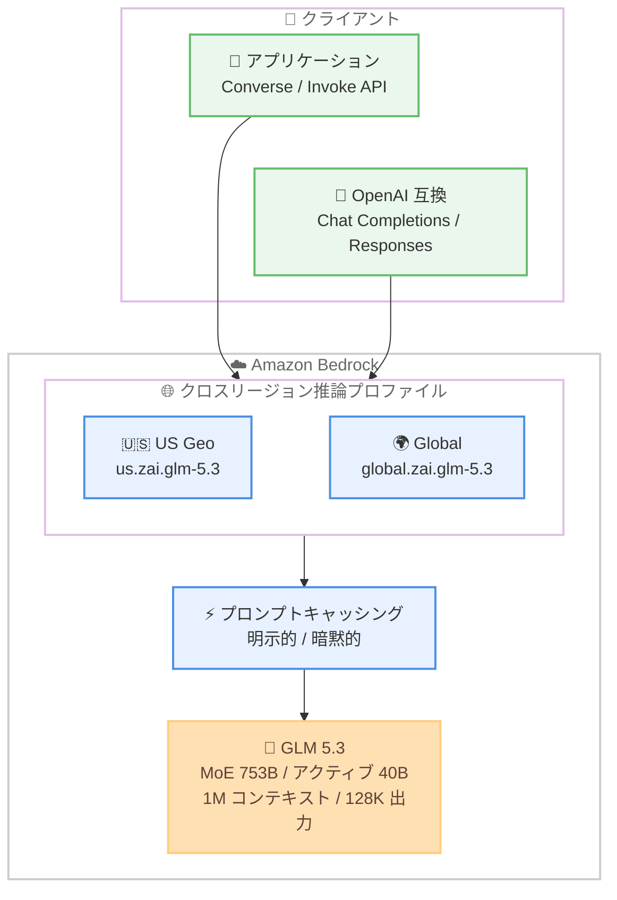

# Amazon Bedrock - Z.ai GLM 5.3 の一般提供開始

**リリース日**: 2026 年 10 月 5 日
**サービス**: Amazon Bedrock
**機能**: GLM 5.3 by Z.ai の一般提供 (GA)

📊 [このアップデートのインフォグラフィックを見る](https://takech9203.github.io/aws-news-summary/20261005-amazon-bedrock-glm-5-3.html)

## 概要

Amazon Bedrock で Z.ai のフラッグシップオープンウェイトモデル GLM 5.3 が一般提供開始されました。GLM 5.3 は、エージェンティックコーディングと長期にわたるソフトウェアエンジニアリング作業 (long-horizon software engineering) に最適化された Mixture-of-Experts (MoE) モデルで、総パラメータ数は 753B、トークンあたりのアクティブパラメータは約 40B です。GLM 5.2 と同じベースモデル上に構築されており、性能向上はすべてスケールされたポストトレーニングによって実現されています。

100 万トークンのコンテキストウィンドウと最大 128K の出力トークンをサポートし、推論 (reasoning) は常時有効で、effort レベルを選択することでレイテンシーおよびトークン消費量とタスク性能のトレードオフを調整できます。また、明示的プロンプトキャッシングに対応しており、システムプロンプトやメッセージにキャッシュポイントを設定することで、複数のモデル呼び出しにわたってコンテキストを再利用する際のレイテンシーと入力コストを削減できます。

本モデルは、米国 (US) およびグローバルのクロスリージョン推論プロファイル経由で、対象となるエンタープライズ顧客が利用できます。リポジトリ規模のコード生成・リファクタリング、ターミナル / CLI タスクの実行、多数のツール呼び出しにまたがる多段階エンジニアリングタスク、大規模コードベースの長文コンテキスト分析などのユースケースに適しています。

**アップデート前の課題**

- GLM 5.3 は AWS 上のマネージドサービスとして利用できず、オープンウェイトモデルを自前の GPU インフラでホスティングする必要があった
- 総パラメータ 753B 規模の MoE モデルをセルフホストするには、大規模なインフラ投資と運用負荷が発生していた
- エンタープライズ環境で最新のオープンウェイトモデルを利用する場合、AWS のセキュリティ・コンプライアンス体制の外で運用する必要があった

**アップデート後の改善**

- Amazon Bedrock のフルマネージド API 経由で GLM 5.3 を利用でき、インフラ管理が不要になった
- クロスリージョン推論プロファイル (US / グローバル) により、可用性とスループットを確保しながら利用できるようになった
- Guardrails、モデル評価、Agents、構造化出力、プロンプトキャッシングなど Bedrock の各機能と組み合わせて利用できるようになった
- AWS のセキュリティ・コンプライアンス体制のもとで最新のオープンウェイトモデルを利用できるようになった

## アーキテクチャ図



GLM 5.3 はクロスリージョン推論専用のモデルであり、リクエストは US 地理推論プロファイル `us.zai.glm-5.3` またはグローバル推論プロファイル `global.zai.glm-5.3` を経由してルーティングされます。リージョン内オンデマンド推論はサポートされません。

## サービスアップデートの詳細

### 主要機能

1. **エージェンティックコーディングに最適化されたフラッグシップ MoE モデル**
   - 総パラメータ 753B、トークンあたり約 40B がアクティブな Mixture-of-Experts アーキテクチャ
   - GLM 5.2 と同じベースモデルを使用し、スケールされたポストトレーニングで性能を向上
   - DeepSWE、Terminal Bench 3.0、FrontierSWE などのベンチマークで競争力のある性能 (Z.ai の社内コーディングベンチマークでは GLM 5.2 比 50% の改善と報告)
   - サイバーセキュリティベンチマーク CyberGym でリリース時点トップの 84.5 を記録 (Z.ai 報告) し、防御的セキュリティワークフローにも適用可能

2. **100 万トークンコンテキストウィンドウと最大 128K 出力トークン**
   - リポジトリ規模のコードベース全体を読み込んだコード生成・リファクタリングが可能
   - 多数のツール呼び出しにまたがる長期の多段階エンジニアリングタスクに対応
   - ストリーミング応答 (推論コンテンツのストリーミングを含む)、Function Calling、構造化 JSON 出力をサポート

3. **常時有効な推論と effort レベルの選択**
   - 推論 (reasoning) は常時有効で、effort レベルを選択可能
   - レイテンシーとトークン消費量をタスク性能とトレードオフして調整できる

4. **プロンプトキャッシング対応**
   - 暗黙的 (自動) プロンプトキャッシングがデフォルトで有効
   - 明示的プロンプトキャッシングにも対応し、システムプロンプトとメッセージにキャッシュポイントを設定可能
   - キャッシュチェックポイントあたり最低 1,024 トークン、キャッシュ保持期間 (TTL) は最低 30 分
   - キャッシュヒット率の向上によるレイテンシーと入力コストの削減のため、明示的プロンプトキャッシングの利用が推奨される

5. **Bedrock 機能との統合**
   - Guardrails、モデル評価、プロンプト管理、Flows、Agents、構造化出力をサポート
   - OpenAI 互換 API (Chat Completions / Responses)、Converse API、Invoke API に対応
   - サービスティアは Standard、Priority、Flex に対応 (Reserved は非対応)

## 技術仕様

### モデル仕様

| 項目 | 詳細 |
|------|------|
| モデル名 | GLM 5.3 (Z.ai) |
| アーキテクチャ | Mixture-of-Experts (MoE) |
| パラメータ数 | 総パラメータ 753B / トークンあたり約 40B アクティブ |
| コンテキストウィンドウ | 1M (100 万) トークン |
| 最大出力トークン | 128K |
| モダリティ | テキスト入力 / テキスト出力 |
| 推論 | 常時有効 (effort レベル選択可) |
| ベースモデル ID | `zai.glm-5.3` |
| US Geo 推論プロファイル ID | `us.zai.glm-5.3` |
| グローバル推論プロファイル ID | `global.zai.glm-5.3` |
| 対応 API | Converse、Invoke、Chat Completions、Responses |
| プロンプトキャッシング | 暗黙的 / 明示的 (最低 1,024 トークン、TTL 30 分以上) |
| サービスティア | Standard / Priority / Flex (Reserved 非対応) |
| ストリーミング | 対応 (推論コンテンツのストリーミングを含む) |
| ライセンス | [GLM-5 LICENSE](https://github.com/zai-org/GLM-5/blob/main/LICENSE) |

※ 総パラメータ数は What's New およびローンチブログでは 753B と記載されています。一方、Bedrock ドキュメントのモデルカードでは 744B と記載されており、情報源により差異があります。

### Bedrock 機能サポート状況

| 機能 | サポート |
|------|----------|
| ストリーミング応答 | ✓ |
| 暗黙的 / 明示的プロンプトキャッシング | ✓ |
| Guardrails | ✓ |
| モデル評価 | ✓ |
| プロンプト管理 / Flows / Agents | ✓ |
| 構造化出力 | ✓ |
| Intelligent Prompt Routing | ✗ |
| プロンプト最適化 | ✗ |
| Count Tokens | ✗ |
| Knowledge Base | ✗ |

## 設定方法

### 前提条件

1. AWS アカウントを保有していること
2. 対象となるエンタープライズ顧客であること (モデルへのアクセスは対象顧客に限定されるため、AWS アカウントチームへの問い合わせが必要)
3. Amazon Bedrock で GLM 5.3 へのモデルアクセスが有効化されていること
4. IAM 権限として `bedrock:InvokeModel`、`bedrock:InvokeModelWithResponseStream` (API キー利用時は `bedrock:CallWithBearerToken` も) が付与されていること

### 手順

#### ステップ 1: モデルアクセスの確認

Amazon Bedrock コンソールの [Model access] で GLM 5.3 へのアクセスを有効化します。アクセスが表示されない場合は、AWS アカウントチームに問い合わせます。

#### ステップ 2: Converse API での呼び出し

```python
import boto3

client = boto3.client('bedrock-runtime', region_name='us-east-1')
response = client.converse(
    modelId='us.zai.glm-5.3',
    messages=[
        {
            'role': 'user',
            'content': [{'text': 'Can you explain the features of Amazon Bedrock?'}]
        }
    ]
)
print(response)
```

Converse API を使用して US クロスリージョン推論プロファイル `us.zai.glm-5.3` 経由で GLM 5.3 を呼び出します。クロスリージョン推論専用のため、ベースモデル ID `zai.glm-5.3` ではなく推論プロファイル ID を指定する必要があります。

#### ステップ 3: Invoke API で reasoning effort を指定

```python
import json
import boto3

client = boto3.client('bedrock-runtime', region_name='us-east-1')
response = client.invoke_model(
    modelId='us.zai.glm-5.3',
    body=json.dumps({
        'messages': [{'role': 'user', 'content': 'Explain Amazon Bedrock features.'}],
        'reasoning_effort': 'max',
        'max_tokens': 1024
    })
)
print(json.loads(response['body'].read()))
```

Invoke API で `reasoning_effort` パラメータを指定し、推論の effort レベルを調整します。タスクの複雑さに応じて effort レベルを変更することで、レイテンシーとトークン消費量を制御できます。

#### ステップ 4: OpenAI 互換 API での呼び出し

```python
from openai import OpenAI

# OPENAI_API_KEY と OPENAI_BASE_URL を環境変数に設定しておく
# OPENAI_BASE_URL="https://bedrock-runtime.<your-region>.amazonaws.com/openai/v1"
client = OpenAI()

response = client.chat.completions.create(
    model="us.zai.glm-5.3",
    messages=[{"role": "user", "content": "Can you explain the features of Amazon Bedrock?"}]
)
print(response)
```

Bedrock の OpenAI 互換エンドポイント経由で Chat Completions API を使用します。新規開発には OpenAI 互換 API の利用が推奨されています。認証には長期 API キーより `aws-bedrock-token-generator` による短期トークンの利用が推奨されます。

## メリット

### ビジネス面

- **インフラ投資の不要化**: 総パラメータ 753B 規模のモデルをセルフホストすることなく、フルマネージド API の従量課金で利用できる
- **エンタープライズ対応**: AWS のセキュリティ・コンプライアンス体制のもとで最新のオープンウェイトモデルを利用でき、ガバナンス要件を満たしやすい
- **コスト最適化の選択肢**: プロンプトキャッシングと Flex ティアの組み合わせにより、ワークロード特性に応じたコスト削減が可能

### 技術面

- **長大コンテキストの活用**: 100 万トークンのコンテキストウィンドウにより、大規模コードベース全体を対象とした分析やリファクタリングが可能
- **エージェントワークフローへの適合**: 常時有効な推論、Function Calling、構造化出力、ストリーミングにより、多段階のエージェンティックタスクを構築しやすい
- **柔軟な性能チューニング**: reasoning effort レベルの選択により、タスクごとにレイテンシー・コスト・性能のバランスを調整できる
- **キャッシュによる高速化**: 明示的プロンプトキャッシングでエージェントループの繰り返し呼び出しにおけるレイテンシーと入力コストを削減できる

## デメリット・制約事項

### 制限事項

- モデルへのアクセスは対象となるエンタープライズ顧客に限定される (利用には AWS アカウントチームへの問い合わせが必要)
- クロスリージョン推論専用であり、リージョン内オンデマンド推論はサポートされない
- 入出力はテキストのみで、画像・音声・動画などのマルチモーダル入力には非対応
- Intelligent Prompt Routing、プロンプト最適化、Count Tokens、Knowledge Base には非対応
- Reserved サービスティア (専用スループット) には非対応
- 明示的プロンプトキャッシングのチェックポイントは最低 1,024 トークンが必要

### 考慮すべき点

- Geo クロスリージョン推論は US リージョン (us-east-1、us-east-2、us-west-1、us-west-2) からのみ利用可能。東京・大阪を含むその他のリージョンからはグローバル推論プロファイル経由となるため、データレジデンシー要件がある場合はルーティング先を確認する必要がある
- 推論が常時有効なため、単純なタスクでは effort レベルを下げてトークン消費を抑える設計が望ましい
- オープンウェイトモデルのライセンス (GLM-5 LICENSE) の条件を確認した上で利用する必要がある
- LiteLLM など一部のサードパーティライブラリでは新しいモデル ID が未解決の場合があり、Converse API で推論プロファイルの ARN を直接指定するなどの回避策が必要になることがある

## ユースケース

### ユースケース 1: リポジトリ規模のエージェンティックコーディング

**シナリオ**: 大規模なモノレポに対して、自律的なコード生成・リファクタリング・テスト修正を行うコーディングエージェントを構築する。

**実装例**:
```python
import boto3

client = boto3.client('bedrock-runtime', region_name='us-east-1')
response = client.converse(
    modelId='us.zai.glm-5.3',
    system=[{'text': 'あなたはリポジトリ全体を理解して修正を行うコーディングエージェントです。'}],
    messages=[{'role': 'user', 'content': [{'text': repo_context + '\n\n上記のコードベースのビルドエラーを修正してください。'}]}],
    toolConfig={'tools': tools}  # ファイル操作・テスト実行などのツール定義
)
```

**効果**: 100 万トークンのコンテキストウィンドウによりリポジトリ全体をコンテキストに含めた一貫性のある修正が可能になり、多数のツール呼び出しにまたがる長期タスクを安定して実行できる。

### ユースケース 2: 明示的プロンプトキャッシングによるエージェントループの高速化

**シナリオ**: システムプロンプトとコードベースコンテキストを固定し、エージェントが多数のツール呼び出しを繰り返すワークフローのレイテンシーとコストを削減する。

**実装例**:
```python
response = client.converse(
    modelId='us.zai.glm-5.3',
    system=[
        {'text': long_system_prompt},
        {'cachePoint': {'type': 'default'}}  # システムプロンプトをキャッシュ
    ],
    messages=messages
)
```

**効果**: 繰り返し呼び出しで再利用される長いプレフィックスがキャッシュされ、エージェントループ全体のレイテンシーと入力トークンコストを削減できる。

### ユースケース 3: 防御的セキュリティワークフローの自動化

**シナリオ**: 自社が所有する (または書面で許可を得た) アプリケーションに対し、AI エージェントによる脆弱性診断を実施する。

**実装例**:
```bash
# オープンソースのペネトレーションテストエージェント Strix と組み合わせる例
# Converse API 経由で GLM 5.3 の推論プロファイルを指定して実行
strix --target http://localhost:3000 \
      --model bedrock-converse/<inference-profile-arn>
```

**効果**: CyberGym ベンチマークで高いスコア (84.5、Z.ai 報告) を記録した GLM 5.3 の能力を活用し、承認済み環境における脆弱性の検出・診断ワークフローを自動化できる。

## 料金

GLM 5.3 はトークンベースの従量課金です。サービスティアとして Standard (デフォルト)、Priority (低レイテンシー優先・プレミアム価格)、Flex (時間に厳しくないワークロード向けの低コスト) を選択できます。プロンプトキャッシングを利用すると、キャッシュヒットした入力トークンのコストを削減できます。

最新の料金は [Amazon Bedrock 料金ページ](https://aws.amazon.com/bedrock/pricing/) を参照してください。

## 利用可能リージョン

クロスリージョン推論専用です。リージョン内オンデマンド推論はサポートされません。

- **US Geo クロスリージョン推論** (`us.zai.glm-5.3`): us-east-1 (バージニア北部)、us-east-2 (オハイオ)、us-west-1 (北カリフォルニア)、us-west-2 (オレゴン) から利用可能
- **グローバルクロスリージョン推論** (`global.zai.glm-5.3`): 上記 US リージョンに加え、ap-northeast-1 (東京)、ap-northeast-3 (大阪) を含む世界各地の多数のリージョンから利用可能

対応リージョンの詳細は [モデルカード](https://docs.aws.amazon.com/bedrock/latest/userguide/model-card-zai-glm-5-3.html) を参照してください。

## 関連サービス・機能

- **Amazon Bedrock クロスリージョン推論**: GLM 5.3 の利用に必須の機能。地理内 (Geo) またはグローバルにリクエストをルーティングし、可用性とスループットを確保する
- **Amazon Bedrock プロンプトキャッシング**: 繰り返し利用するプロンプトプレフィックスをキャッシュし、レイテンシーと入力コストを削減する
- **Amazon Bedrock Guardrails**: GLM 5.3 の入出力に対してコンテンツフィルタリングやポリシー制御を適用できる
- **Amazon Bedrock Agents / Flows**: GLM 5.3 を推論エンジンとしてエージェントやワークフローを構築できる

## 参考リンク

- 📊 [インフォグラフィック](https://takech9203.github.io/aws-news-summary/20261005-amazon-bedrock-glm-5-3.html)
- [公式発表 (What's New)](https://aws.amazon.com/about-aws/whats-new/2026/10/amazon-bedrock-glm-5-3/)
- [AWS Blog: Introducing GLM 5.3 on Amazon Bedrock](https://aws.amazon.com/blogs/machine-learning/introducing-glm-5-3-on-amazon-bedrock/)
- [ドキュメント: GLM 5.3 モデルカード](https://docs.aws.amazon.com/bedrock/latest/userguide/model-card-zai-glm-5-3.html)
- [プロンプトキャッシングガイド](https://docs.aws.amazon.com/bedrock/latest/userguide/prompt-caching.html)
- [料金ページ](https://aws.amazon.com/bedrock/pricing/)

## まとめ

Z.ai のフラッグシップ MoE モデル GLM 5.3 が Amazon Bedrock で一般提供開始され、100 万トークンコンテキスト・最大 128K 出力・常時有効な推論を備えたエージェンティックコーディング向けの強力な選択肢が加わりました。利用は対象エンタープライズ顧客に限定され、クロスリージョン推論プロファイル経由のアクセスとなるため、利用を検討する場合はまず AWS アカウントチームに問い合わせ、データレジデンシー要件に応じて US Geo またはグローバルプロファイルを選択することを推奨します。エージェントワークフローでは明示的プロンプトキャッシングと reasoning effort レベルの調整によるコスト・レイテンシー最適化が有効です。
