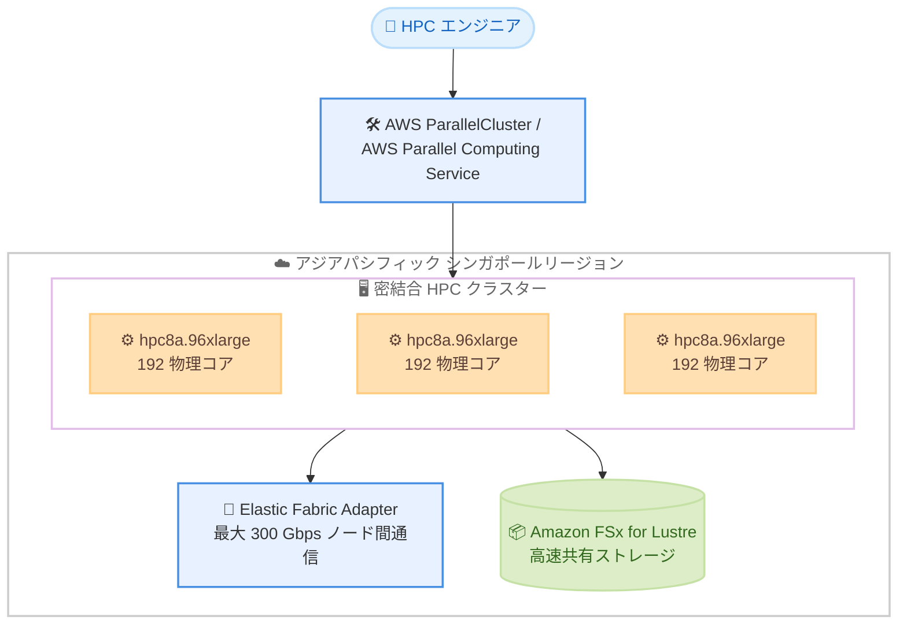

# Amazon EC2 - Hpc8a インスタンスがアジアパシフィック (シンガポール) リージョンで利用可能に

**リリース日**: 2026 年 10 月 5 日
**サービス**: Amazon EC2
**機能**: Amazon EC2 Hpc8a インスタンスのアジアパシフィック (シンガポール) リージョン対応

📊 [このアップデートのインフォグラフィックを見る](https://takech9203.github.io/aws-news-summary/20261005-amazon-ec2-hpc8a-asia-pacific.html)

## 概要

Amazon EC2 Hpc8a インスタンスが、アジアパシフィック (シンガポール) リージョンで利用可能になりました。Hpc8a は第 5 世代 AMD EPYC プロセッサ (コードネーム Turin) を搭載した HPC (ハイパフォーマンスコンピューティング) 向けインスタンスで、最大 4.5 GHz の高い動作周波数を実現します。

前世代の Hpc7a インスタンスと比較して、最大 40% 高いパフォーマンス、最大 25% 優れた価格性能比、最大 42% 高いメモリ帯域幅を提供します。特にメモリ帯域幅の向上は、メモリ集約型のシミュレーションや科学技術計算ワークロードに大きなメリットをもたらします。

Hpc8a インスタンスは第 6 世代 AWS Nitro Card 上に構築されており、数値流体力学 (CFD)、気象予測、陽解法有限要素解析 (FEA)、マルチフィジックスシミュレーションなど、高速なノード間通信と安定した高パフォーマンスを必要とする密結合でレイテンシーに敏感な HPC ワークロードに適しています。

**アップデート前の課題**

Hpc8a インスタンスは 2026 年 2 月のリリース時点では米国東部 (オハイオ) と欧州 (ストックホルム) で提供されており、アジアパシフィック地域のユーザーには以下の課題がありました。

- アジアパシフィック地域のユーザーが Hpc8a を利用するには、地理的に離れたリージョンを使用する必要があった
- データレジデンシー要件により海外リージョンを利用できない組織は、最新世代の AMD EPYC ベース HPC インスタンスを選択できなかった
- オンプレミスの計算資源や前世代インスタンスでは、大規模シミュレーションの実行時間やコスト効率に限界があった

**アップデート後の改善**

- アジアパシフィック (シンガポール) リージョンで Hpc8a インスタンスを起動できるようになり、東南アジア地域のユーザーが低レイテンシーで利用可能になった
- シンガポール国内にデータを保持したまま、最新世代の HPC ワークロードを実行できるようになった
- Hpc7a 比で最大 40% 高いパフォーマンスと最大 25% 優れた価格性能比により、同地域でのシミュレーションの高速化とコスト削減が可能になった

## アーキテクチャ図



シンガポールリージョンで Hpc8a インスタンスによる密結合 HPC クラスターを構築する典型的な構成です。EFA による最大 300 Gbps の低レイテンシーノード間通信と、FSx for Lustre などの高速共有ストレージを組み合わせて大規模シミュレーションを実行します。

## サービスアップデートの詳細

### 主要機能

1. **第 5 世代 AMD EPYC プロセッサ (Turin) 搭載**
   - 最大 4.5 GHz の高い動作周波数
   - Hpc7a 比で最大 40% 高いパフォーマンス
   - Hpc7a 比で最大 42% 高いメモリ帯域幅により、メモリ集約型シミュレーションを高速化
   - 同時マルチスレッディング (SMT) は無効化されており、192 コアすべてが物理コア

2. **第 6 世代 AWS Nitro Card による高効率な基盤**
   - 仮想化、ストレージ、ネットワーク処理を専用ハードウェアにオフロード
   - ホストのコンピューティングリソースをワークロードに最大限割り当て可能
   - Elastic Fabric Adapter (EFA) により最大 300 Gbps のノード間通信を実現

3. **密結合 HPC ワークロードへの最適化**
   - 数値流体力学 (CFD)、気象予測、陽解法有限要素解析 (FEA)、マルチフィジックスシミュレーションに対応
   - 1:4 のコア / メモリ比率 (192 コアに対し 768 GiB)
   - インスタンス起動時にコア数をカスタマイズ可能で、ライセンス費用の最適化やコアあたりメモリの増加に対応

## 技術仕様

### インスタンス仕様

| 項目 | 詳細 |
|------|------|
| インスタンスサイズ | hpc8a.96xlarge (単一サイズ) |
| 物理コア数 | 192 (SMT 無効) |
| メモリ | 768 GiB |
| プロセッサ | 第 5 世代 AMD EPYC (Turin)、最大 4.5 GHz |
| ネットワーク帯域幅 | 75 Gbps |
| EFA 帯域幅 | 最大 300 Gbps |
| ストレージ | EBS のみ |
| 基盤 | 第 6 世代 AWS Nitro Card |

### Hpc7a との比較

| 項目 | 改善内容 |
|------|----------|
| パフォーマンス | 最大 40% 向上 |
| 価格性能比 | 最大 25% 向上 |
| メモリ帯域幅 | 最大 42% 向上 |

## 設定方法

### 前提条件

1. アジアパシフィック (シンガポール) リージョン (ap-southeast-1) を利用できる AWS アカウント
2. Hpc8a インスタンスのサービスクォータ (vCPU 上限) の確認と必要に応じた引き上げ申請
3. 密結合ワークロードの場合は、クラスタープレイスメントグループと EFA 対応 AMI の準備

### 手順

#### ステップ1: クラスタープレイスメントグループの作成

```bash
aws ec2 create-placement-group \
  --group-name hpc8a-cluster \
  --strategy cluster \
  --region ap-southeast-1
```

ノード間のネットワークレイテンシーを最小化するため、クラスター戦略のプレイスメントグループを作成します。

#### ステップ2: Hpc8a インスタンスの起動

```bash
aws ec2 run-instances \
  --instance-type hpc8a.96xlarge \
  --image-id ami-xxxxxxxxxxxxxxxxx \
  --count 4 \
  --placement GroupName=hpc8a-cluster \
  --network-interfaces "DeviceIndex=0,InterfaceType=efa,SubnetId=subnet-xxxxxxxx,Groups=sg-xxxxxxxx" \
  --region ap-southeast-1
```

EFA を有効化したネットワークインターフェイスを指定して、プレイスメントグループ内に Hpc8a インスタンスを複数台起動します。

#### ステップ3: AWS ParallelCluster によるクラスター構築 (推奨)

```yaml
# cluster-config.yaml の抜粋
Region: ap-southeast-1
Scheduling:
  Scheduler: slurm
  SlurmQueues:
    - Name: hpc-queue
      ComputeResources:
        - Name: hpc8a
          InstanceType: hpc8a.96xlarge
          MinCount: 0
          MaxCount: 16
          Efa:
            Enabled: true
      Networking:
        PlacementGroup:
          Enabled: true
```

AWS ParallelCluster の設定ファイルで Hpc8a インスタンスと EFA を指定すると、ジョブスケジューラ (Slurm) を含む HPC クラスターを自動構築できます。AWS Parallel Computing Service (PCS) でも同様にクラスターを構成できます。

## メリット

### ビジネス面

- **価格性能比の向上**: Hpc7a 比で最大 25% 優れた価格性能比により、シミュレーションあたりのコストを削減できる
- **データレジデンシー対応**: シンガポール国内にデータを保持したまま最新世代の HPC 環境を利用でき、規制要件のある業界でも採用しやすい
- **開発サイクルの短縮**: 最大 40% のパフォーマンス向上により、製品設計や研究開発のイテレーションを高速化できる

### 技術面

- **高いメモリ帯域幅**: Hpc7a 比で最大 42% 高いメモリ帯域幅により、CFD や気象モデルなどメモリバウンドなワークロードが大幅に高速化する
- **低レイテンシーなノード間通信**: EFA による最大 300 Gbps の通信で、MPI ベースの密結合アプリケーションを効率的にスケールできる
- **物理コアによる安定した性能**: SMT 無効の 192 物理コアにより、HPC ワークロードで一貫した高パフォーマンスを発揮する

## デメリット・制約事項

### 制限事項

- インスタンスサイズは hpc8a.96xlarge の単一サイズのみ (ただし起動時にアクティブなコア数のカスタマイズは可能)
- インスタンスストレージは提供されず、EBS のみのサポート
- 購入オプションはオンデマンドインスタンスと Savings Plans のみで、スポットインスタンスには対応していない

### 考慮すべき点

- 密結合ワークロードで最大性能を得るには、クラスタープレイスメントグループと EFA の構成が前提となる
- 利用開始前にアカウントの vCPU クォータを確認し、必要に応じて引き上げを申請する必要がある
- HPC 最適化インスタンスは利用可能リージョンが限定されるため、マルチリージョン戦略を検討する場合は提供状況の確認が必要

## ユースケース

### ユースケース1: 自動車・航空宇宙分野の CFD シミュレーション

**シナリオ**: 東南アジアに拠点を置く製造業が、車体や機体の空力解析を大規模な CFD シミュレーションで実施する。

**実装例**:
```
AWS ParallelCluster + hpc8a.96xlarge (EFA 有効) + FSx for Lustre
Ansys Fluent や OpenFOAM などの CFD ソルバーを Slurm ジョブとして実行
```

**効果**: 高いメモリ帯域幅と EFA により解析時間を短縮し、設計イテレーションを高速化。Hpc7a 比で最大 25% 優れた価格性能比によりコストも削減。

### ユースケース2: 高解像度の気象・気候モデリング

**シナリオ**: 気象サービス企業や研究機関が、東南アジア域の高解像度気象予測モデル (WRF など) を定時実行する。

**実装例**:
```
AWS Parallel Computing Service + hpc8a.96xlarge クラスター
クラスタープレイスメントグループで配置し、MPI で数百〜数千コアに分散
```

**効果**: メモリ帯域幅の向上によりメモリバウンドな気象モデルが高速化し、予測の解像度向上や配信時刻の前倒しが可能になる。

### ユースケース3: 陽解法 FEA による衝突・構造解析

**シナリオ**: 自動車メーカーが衝突安全性評価のための陽解法 FEA (LS-DYNA など) を多数のケースで並列実行する。

**実装例**:
```
hpc8a.96xlarge で起動時にコア数をカスタマイズし、
ソフトウェアライセンスのコア数に合わせて最適化
```

**効果**: ライセンスコストを最適化しながら、物理コアによる安定した高パフォーマンスで多数の解析ケースを短時間で処理できる。

## 料金

Hpc8a インスタンスは、オンデマンドインスタンスおよび Savings Plans で利用できます。スポットインスタンスには対応していません。アジアパシフィック (シンガポール) リージョンにおける具体的な料金は、Amazon EC2 の料金ページを参照してください。

なお、起動時にコア数をカスタマイズした場合でも、インスタンスの料金は変わらない点に注意が必要です (コア数カスタマイズは主にライセンス最適化のための機能)。

## 利用可能リージョン

今回の拡大により、アジアパシフィック (シンガポール) リージョンで利用可能になりました。

- 米国東部 (オハイオ) - 2026 年 2 月のリリース時から提供
- 欧州 (ストックホルム) - 2026 年 2 月のリリース時から提供
- アジアパシフィック (シンガポール) - 今回追加

最新の提供状況は Hpc8a インスタンスの製品ページを参照してください。

## 関連サービス・機能

- **Elastic Fabric Adapter (EFA)**: 最大 300 Gbps の低レイテンシーノード間通信を提供し、密結合 MPI アプリケーションのスケールに不可欠
- **AWS ParallelCluster / AWS Parallel Computing Service**: Hpc8a を含む HPC クラスターの構築・運用を自動化するマネージドツール
- **Amazon FSx for Lustre**: HPC ワークロード向けの高速な共有ファイルシステムで、シミュレーションデータの入出力を高速化
- **Amazon EC2 Hpc7a インスタンス**: 前世代の AMD EPYC ベース HPC インスタンス。Hpc8a は最大 40% 高いパフォーマンスを提供

## 参考リンク

- 📊 [インフォグラフィック](https://takech9203.github.io/aws-news-summary/20261005-amazon-ec2-hpc8a-asia-pacific.html)
- [公式発表 (What's New)](https://aws.amazon.com/about-aws/whats-new/2026/10/amazon-ec2-hpc8a-asia-pacific/)
- [AWS Blog - Amazon EC2 Hpc8a instances powered by 5th Gen AMD EPYC processors are now available](https://aws.amazon.com/blogs/aws/amazon-ec2-hpc8a-instances-powered-by-5th-gen-amd-epyc-processors-are-now-available)
- [Amazon EC2 Hpc8a インスタンス製品ページ](https://aws.amazon.com/ec2/instance-types/hpc8a/)
- [AWS Nitro System](https://aws.amazon.com/ec2/nitro/)
- [Amazon EC2 料金ページ](https://aws.amazon.com/ec2/pricing/)

## まとめ

第 5 世代 AMD EPYC プロセッサを搭載した Amazon EC2 Hpc8a インスタンスがアジアパシフィック (シンガポール) リージョンに拡大し、東南アジア地域のユーザーが低レイテンシーかつデータレジデンシー要件を満たしながら最新世代の HPC 環境を利用できるようになりました。CFD、気象予測、FEA などの密結合 HPC ワークロードを同地域で運用している場合は、Hpc7a 比で最大 40% のパフォーマンス向上と最大 25% の価格性能比改善が見込めるため、既存ワークロードのベンチマークと移行の検討をお勧めします。
