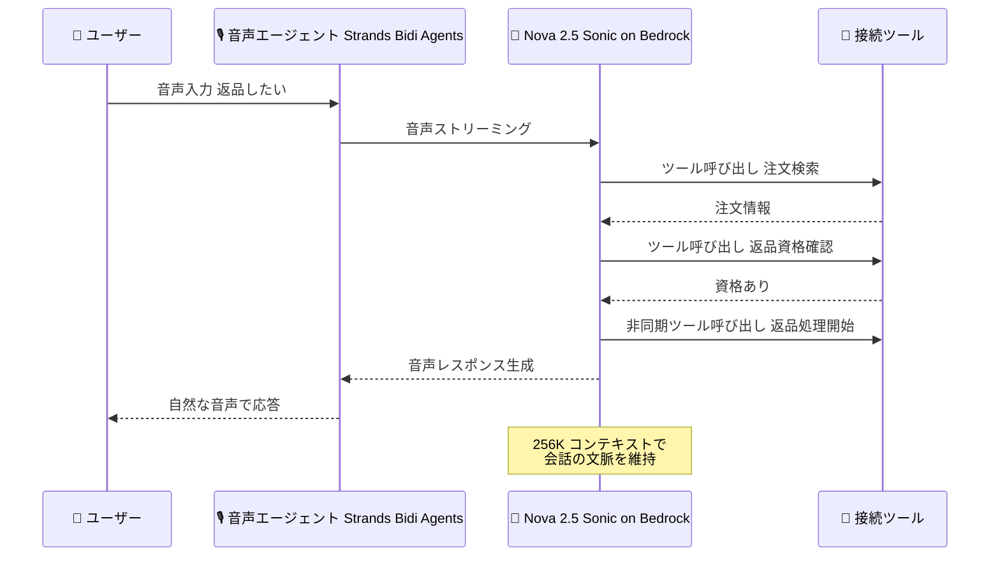

# Amazon Bedrock - Amazon Nova 2.5 Sonic (音声エージェント向け speech-to-speech モデル)

**リリース日**: 2026 年 10 月 5 日
**サービス**: Amazon Bedrock (Amazon Nova)
**機能**: Amazon Nova 2.5 Sonic - 推論能力が向上したリアルタイム音声エージェント向け speech-to-speech モデル

📊 [このアップデートのインフォグラフィックを見る](https://takech9203.github.io/aws-news-summary/20261005-amazon-nova-2.5-sonic.html)

## 概要

AWS は、自然なリアルタイム音声エージェントを構築するための最新 speech-to-speech モデル「Amazon Nova 2.5 Sonic」の一般提供 (GA) を発表しました。Nova 2.5 Sonic は、リアルタイム音声ユースケースにおける推論能力、指示追従性、ツール呼び出し精度が向上し、レイテンシも低減されています。これにより、より高速で自然な対話が可能になります。

Nova 2.5 Sonic を利用することで、音声エージェントはコンテキストを維持しながらマルチステップの指示に従い、接続されたツールを使用してタスクを完了できます。例えば、カスタマーサポートエージェントが 1 つの会話の中で「注文の検索 → 返品資格の確認 → 返品処理の開始」までを実行できます。カスタマーサービス、パーソナル AI アシスタント、リアルタイム会話アプリケーションの構築を検討している開発者が主な対象です。

同時に GA となった Strands Agents の Bidi Agents (双方向エージェント) と組み合わせることで、数行のコードで本番環境向けの音声エージェントを構築でき、長時間の会話や他のエージェントとの接続にも対応できます。

**アップデート前の課題**

- 従来の音声エージェントは、複雑なマルチステップの指示への追従やツール呼び出しの精度に課題があり、複数の処理を 1 つの会話内で完結させることが難しかった
- 応答レイテンシが大きい場合、会話の自然さが損なわれ、ユーザー体験が低下していた
- 音声モデルの接続制限などにより、本番品質の音声エージェントを構築するには多くの実装作業が必要だった

**アップデート後の改善**

- 推論能力、指示追従性、ツール呼び出し精度の向上により、注文検索から返品処理までのような複数ステップのタスクを 1 つの会話内で完了できるようになった
- レイテンシの低減により、より高速で自然なリアルタイム対話が可能になった
- GA となった Strands Bidi Agents との組み合わせにより、数行のコードで本番環境向けの音声エージェントを構築できるようになった

## アーキテクチャ図



ユーザーの音声入力を Nova 2.5 Sonic がリアルタイムに処理し、コンテキストを維持しながら複数のツールを呼び出してマルチステップのタスクを 1 つの会話内で完了する流れを示しています。

## サービスアップデートの詳細

### 主要機能

1. **推論・指示追従・ツール呼び出し精度の向上**
   - リアルタイム音声ユースケース向けに推論能力が強化され、複雑なマルチステップ指示への追従が可能
   - ツール呼び出しの精度が向上し、外部システムと連携したタスク完了の信頼性が向上
   - 会話全体を通してコンテキストを維持

2. **低レイテンシなリアルタイム対話**
   - レイテンシが低減され、より高速で自然なインタラクションを実現
   - 制御可能なターンテイキングにより、自然な会話の流れをコントロール可能
   - ユーザーによる割り込み (バージイン) にも対応した会話設計が可能

3. **柔軟な入出力とセッション管理**
   - 7 言語の表現力豊かな音声をサポート
   - 同一セッション内で音声とテキストの混在が可能
   - 非同期ツール呼び出しに対応し、処理中も会話を継続可能
   - 256K トークンのコンテキストウィンドウ

4. **Strands Bidi Agents との統合 (同時 GA)**
   - 数行のコードで本番環境向け音声エージェントを構築可能
   - 接続制限を超える長時間の会話をバックグラウンドでの接続再開により実現
   - 他のエージェントへのタスク委譲 (マルチエージェント構成) に対応

## 技術仕様

### モデル仕様

| 項目 | 詳細 |
|------|------|
| モデル名 | Amazon Nova 2.5 Sonic |
| モデルタイプ | Speech-to-speech (リアルタイム双方向ストリーミング) |
| 入力モダリティ | 音声、テキスト |
| 出力モダリティ | 音声、テキスト |
| 対応言語 | 7 言語の表現力豊かな音声 |
| コンテキストウィンドウ | 256K トークン |
| ツール呼び出し | 対応 (非同期ツール呼び出しを含む) |
| ターンテイキング | 制御可能 |
| 提供プラットフォーム | Amazon Bedrock |

### Strands Bidi Agents の主な機能

| 機能 | 詳細 |
|------|------|
| セッション継続 | 接続制限到達前にバックグラウンドで接続を再開し、コンテキストを引き継いで長時間の会話を実現 |
| エコー抑制 | WebRTC ベースのエコーキャンセル、ノイズ抑制、自動ゲイン制御 |
| 割り込み対応 | ユーザーの発話を検知して再生キューをクリア |
| 可観測性 | OpenTelemetry によるセッション、モデル応答、ツール呼び出しのトレース |
| マルチエージェント | 音声エージェントから他のエージェントへのタスク委譲 |

## 設定方法

### 前提条件

1. AWS アカウントと Amazon Bedrock へのアクセス権限
2. 利用リージョンで Amazon Nova 2.5 Sonic モデルへのアクセスが有効化されていること
3. Strands Bidi Agents を使用する場合は Python 実行環境

### 手順

#### ステップ1: Strands Agents のインストール

```bash
pip install "strands-agents[bidi-all,bidi-pyaudio]"
```

Strands Agents の Bidi Agents 機能と音声入出力 (PyAudio) の依存関係をインストールします。

#### ステップ2: 音声エージェントの作成

```python
from strands.experimental.bidi import BidiAgent, AudioIO
from strands.experimental.bidi.models import BedrockNovaSonicModel

model = BedrockNovaSonicModel()
agent = BidiAgent(model=model)
audio_io = AudioIO(audio_processor=True)
```

Nova Sonic モデルを指定して BidiAgent を作成します。`audio_processor=True` によりエコーキャンセルやノイズ抑制が有効になります。詳細な API は Strands Agents のドキュメントを参照してください。

#### ステップ3: ツールの接続とエージェントの実行

マイクとスピーカーを使用したストリーミング会話を開始し、必要に応じて `tools` パラメータでツールや他のエージェントを接続します。注文検索や返品処理などの業務ツールを接続することで、会話内でのタスク完了が可能になります。

## メリット

### ビジネス面

- **顧客体験の向上**: 低レイテンシで自然な音声対話により、カスタマーサービスの応対品質を向上できる
- **業務の自動化**: 注文検索から返品処理までのような複数ステップの業務タスクを音声エージェントだけで完結でき、オペレーターの負荷を軽減できる
- **開発コストの削減**: Strands Bidi Agents との組み合わせにより、数行のコードで本番品質の音声エージェントを構築できる

### 技術面

- **ツール呼び出し精度の向上**: 外部システムと連携するエージェントの信頼性が向上し、複雑なワークフローを安心して任せられる
- **柔軟なセッション設計**: 音声とテキストの同一セッション混在、非同期ツール呼び出し、制御可能なターンテイキングにより、多様な UX を設計できる
- **大きなコンテキストウィンドウ**: 256K トークンのコンテキストにより、長い会話でも文脈を維持できる

## デメリット・制約事項

### 制限事項

- 利用可能リージョンは米国東部 (バージニア北部)、米国西部 (オレゴン)、欧州 (ストックホルム)、アジアパシフィック (東京) の 4 リージョン
- 音声モデルには接続時間の制限があり (Strands のブログによると Nova Sonic は 8 分)、長時間セッションには接続再開の実装が必要 (Strands Bidi Agents はこれを自動化)

### 考慮すべき点

- 対応言語は 7 言語であり、対象ユーザーの言語がサポートされているか事前に確認が必要
- リアルタイム音声アプリケーションでは、モデル以外にもネットワークやクライアント側の音声処理がレイテンシと品質に影響するため、エンドツーエンドでの設計が必要
- ブラウザやモバイルから利用する場合は、バックエンドで BidiAgent を実行しクライアントから音声をストリーミングする構成が推奨される

## ユースケース

### ユースケース1: カスタマーサポートの音声エージェント

**シナリオ**: EC サイトのサポート窓口で、注文に関する問い合わせから返品処理までを音声エージェントで自動化する。

**実装例**:
```
1. Nova 2.5 Sonic を Bedrock で有効化
2. 注文検索、返品資格確認、返品処理の各ツールを BidiAgent に接続
3. 顧客との会話内でエージェントがツールを順次呼び出しタスクを完了
```

**効果**: 注文検索 → 返品資格確認 → 返品開始までを 1 つの会話内で完結し、オペレーターへのエスカレーションを削減できる。

### ユースケース2: パーソナル AI アシスタント

**シナリオ**: スケジュール管理や情報検索を音声で行えるパーソナルアシスタントを構築する。

**実装例**:
```
1. カレンダー API や検索ツールを BidiAgent に接続
2. 非同期ツール呼び出しにより、検索中も会話を継続
3. 音声とテキストを同一セッションで併用し、URL などはテキストで提示
```

**効果**: ハンズフリーで複数の操作を自然な会話として実行でき、ユーザーの生産性が向上する。

### ユースケース3: マルチエージェント構成のリアルタイム会話アプリケーション

**シナリオ**: 音声での会話を担当するエージェントが、調査などの重いタスクを別のエージェントに委譲する構成を構築する。

**実装例**:
```
1. BidiAgent (Nova 2.5 Sonic) を音声フロントエンドとして構成
2. Strands の create_harness と as_tool で調査用エージェントをツール化して接続
3. 音声用と調査用でそれぞれ最適なモデルを選択
```

**効果**: 音声の低レイテンシ応答と高度な調査能力を両立したエージェントシステムを実現できる。

## 料金

Amazon Nova 2.5 Sonic の料金は Nova 2 Sonic と同一です。Amazon Bedrock の料金体系に基づき、処理された入出力トークンに対して課金されます。最新の料金は [Amazon Bedrock 料金ページ](https://aws.amazon.com/bedrock/pricing/) を参照してください。

## 利用可能リージョン

- 米国東部 (バージニア北部)
- 米国西部 (オレゴン)
- 欧州 (ストックホルム)
- アジアパシフィック (東京)

## 関連サービス・機能

- **Amazon Bedrock**: Nova 2.5 Sonic の提供プラットフォーム。API 経由でモデルを利用
- **Amazon Nova 2 モデルファミリー**: Nova 2 Lite (テキスト・画像・動画・ドキュメント処理)、Nova Multimodal Embeddings などと組み合わせたマルチモーダルアプリケーションを構築可能
- **Strands Agents (Bidi Agents)**: 同時に GA となった、speech-to-speech 音声エージェントを構築するためのオープンソース SDK。セッション継続、エコー抑制、可観測性などを提供

## 参考リンク

- 📊 [インフォグラフィック](https://takech9203.github.io/aws-news-summary/20261005-amazon-nova-2.5-sonic.html)
- [公式発表 (What's New)](https://aws.amazon.com/about-aws/whats-new/2026/10/amazon-nova-2.5-sonic/)
- [Amazon Nova 2 ユーザーガイド](https://docs.aws.amazon.com/nova/latest/nova2-userguide/what-is-nova-2.html)
- [Amazon Nova モデルページ](https://aws.amazon.com/nova/models/)
- [Strands Bidi Agents GA ブログ](https://strandsagents.com/blog/bidi-agents-now-ga/)
- [料金ページ](https://aws.amazon.com/bedrock/pricing/)

## まとめ

Amazon Nova 2.5 Sonic は、推論・指示追従・ツール呼び出し精度の向上と低レイテンシ化により、マルチステップのタスクを会話内で完結できる本番品質の音声エージェント構築を可能にします。料金は Nova 2 Sonic と同一のため、既存の Nova Sonic ユーザーは追加コストなしでアップグレードを検討できます。東京リージョンでも利用可能なため、日本語圏のカスタマーサービスやリアルタイム会話アプリケーションへの適用をまず PoC で検証することを推奨します。
