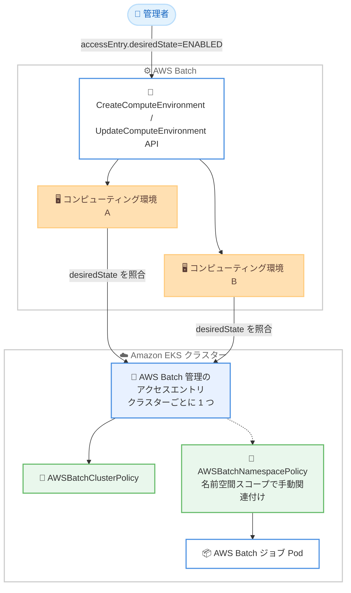

# AWS Batch - Amazon EKS アクセスエントリ認証のサポート

**リリース日**: 2026 年 10 月 5 日
**サービス**: AWS Batch
**機能**: Amazon EKS アクセスエントリ認証 (EKS Access Entry Authentication)

📊 [このアップデートのインフォグラフィックを見る](https://takech9203.github.io/aws-news-summary/20261005-aws-batch-access-entries.html)

## 概要

AWS Batch が、Amazon EKS 上のコンピューティング環境向けに Amazon EKS アクセスエントリ認証をサポートしました。アクセスエントリは、IAM プリンシパルに Kubernetes クラスターへのアクセスを付与するための API 駆動型の仕組みで、従来の `aws-auth` ConfigMap を補完するものです。これにより、クラスターのセットアップと認証ライフサイクル管理が簡素化されます。

利用を開始するには、CreateComputeEnvironment または UpdateComputeEnvironment API で、対象クラスターを参照するすべての AWS Batch コンピューティング環境の `accessEntry.desiredState` を `ENABLED` に設定します。条件を満たすと、AWS Batch はクラスターごとに 1 つのアクセスエントリを作成し、`AWSBatchClusterPolicy` アクセスポリシーを関連付けます。設定は AWS CLI、AWS SDK、AWS マネジメントコンソールのいずれからも可能です。

**アップデート前の課題**

- AWS Batch を EKS クラスターに接続するには、`aws-auth` ConfigMap を手動で編集して AWS Batch のサービスリンクロールをマッピングする必要があった
- ConfigMap の編集は Kubernetes API 経由の手作業となり、設定ミスによる認証エラーが発生しやすかった
- 認証モードが `API` のみの EKS クラスター (`aws-auth` ConfigMap をサポートしない) では、AWS Batch の認証を構成する標準的な方法が課題となっていた
- クラスターへアクセスできるプリンシパルを AWS API 経由で監査可能な形で管理することが難しかった

**アップデート後の改善**

- `accessEntry.desiredState=ENABLED` を設定するだけで、AWS Batch がアクセスエントリを自動的に作成・管理するため、`aws-auth` ConfigMap の手動編集が不要になった
- クラスターへアクセスできるプリンシパルを API 駆動で監査可能に管理できるようになった
- 認証モードが `API` の EKS クラスターでも AWS Batch を利用できるようになった
- `DescribeComputeEnvironments` の `accessEntry.status` フィールドで、アクセスエントリの状態 (`ACTIVE` / `INACTIVE`) を確認できるようになった

## アーキテクチャ図



同じクラスターを参照するすべてのコンピューティング環境で `desiredState=ENABLED` が設定されると、AWS Batch がクラスターごとに 1 つのアクセスエントリを作成し、`AWSBatchClusterPolicy` を関連付けます。ジョブの Pod を作成・管理するには、名前空間スコープの `AWSBatchNamespacePolicy` を別途関連付ける必要があります。

## サービスアップデートの詳細

### 主要機能

1. **アクセスエントリの自動管理**
   - `eksConfiguration.accessEntry.desiredState` を `ENABLED` に設定すると、AWS Batch がコンピューティング環境のためのアクセスエントリをクラスター上に作成・管理する
   - アクセスエントリはコンピューティング環境ごとではなくクラスターごとに 1 つ作成され、同じクラスターを参照するすべてのコンピューティング環境で共有される
   - 作成されたアクセスエントリには、クラスターレベルの `AWSBatchClusterPolicy` アクセスポリシーが関連付けられる

2. **複数コンピューティング環境間の調整 (リコンサイル)**
   - 単一の EKS クラスターは複数の AWS Batch コンピューティング環境のバックエンドになり得るため、クラスターのアクセス設定は共有リソースとして扱われる
   - クラスターの認証モードが `API_AND_CONFIG_MAP` の場合、同一アカウント・同一リージョンでクラスターを参照するすべてのコンピューティング環境の `desiredState` が `ENABLED` で一致した場合にのみアクセスエントリが作成される
   - すべてが `DISABLED` で一致した場合はアクセスエントリが削除され、値が混在する場合は既存のアクセスモードが維持される

3. **クラスターの認証モードに応じた挙動**
   - `CONFIG_MAP`: アクセスエントリは利用不可。AWS Batch は指定された値を記録のみ行い、認証モード変更後の API 呼び出しで有効化される
   - `API_AND_CONFIG_MAP`: 上記のリコンサイルロジックに従ってアクセスエントリを作成・削除する
   - `API`: アクセスエントリが常に作成・維持される。`DISABLED` の指定はリクエストが拒否される (ConfigMap にフォールバックできないため)

4. **状態の可視化**
   - `DescribeComputeEnvironments` のレスポンスに読み取り専用の `accessEntry.status` フィールドが追加された
   - `ACTIVE` は AWS Batch 管理のアクセスエントリがクラスター上に存在し、`aws-auth` ConfigMap より優先されることを示す
   - `INACTIVE` は AWS Batch 管理のアクセスエントリが存在せず、`aws-auth` ConfigMap が認証に使用されることを示す

## 技術仕様

### accessEntry.desiredState の設定値

| 設定値 | 動作 |
|------|------|
| `ENABLED` | クラスターを参照する全コンピューティング環境が `ENABLED` の場合、AWS Batch 管理のアクセスエントリを作成する |
| `DISABLED` | 全コンピューティング環境が `DISABLED` の場合、AWS Batch 管理のアクセスエントリを削除する。認証は `aws-auth` ConfigMap で行う |
| `INHERIT_FROM_CLUSTER` | クラスターの現在の状態に従う。認証モードが `API` のクラスターではアクセスエントリを作成・管理し、`CONFIG_MAP` / `API_AND_CONFIG_MAP` では追加も削除も行わない |
| 省略時 | `desiredState` は記録されず、`INHERIT_FROM_CLUSTER` と同様に動作する |

### 必要な IAM 権限

アクセスエントリの管理は、`CreateComputeEnvironment` / `UpdateComputeEnvironment` を呼び出す IAM アイデンティティの認証情報で行われます。呼び出し元に以下の Amazon EKS アクションの許可が必要です。

| アクション | 用途 |
|------|------|
| `eks:DescribeCluster` | クラスターの認証モードの確認 |
| `eks:DescribeAccessEntry` | 既存アクセスエントリの確認 |
| `eks:CreateAccessEntry` | アクセスエントリの作成 |
| `eks:AssociateAccessPolicy` | `AWSBatchClusterPolicy` の関連付け |
| `eks:DeleteAccessEntry` | アクセスエントリの削除 |

### API変更履歴

| 日付 | サービス | 変更内容 |
|------|----------|----------|
| 2026/09/30 | [AWS Batch](https://awsapichanges.com/archive/changes/ca596c-batch.html) | 3 updated api methods - CreateComputeEnvironment / UpdateComputeEnvironment に `accessEntry` 設定を追加、DescribeComputeEnvironments で状態を返却 |

### リクエスト例 (CreateComputeEnvironment)

```json
{
    "computeEnvironmentName": "my-eks-ce",
    "type": "MANAGED",
    "state": "ENABLED",
    "eksConfiguration": {
        "eksClusterArn": "arn:aws:eks:us-east-1:123456789012:cluster/my-cluster",
        "kubernetesNamespace": "my-aws-batch-namespace",
        "accessEntry": {
            "desiredState": "ENABLED"
        }
    },
    "computeResources": {
        "type": "EC2",
        "maxvCpus": 128,
        "subnets": ["subnet-a123456b"],
        "securityGroupIds": ["sg-a12b3456"],
        "instanceRole": "arn:aws:iam::123456789012:instance-profile/my-node-instance-profile"
    }
}
```

## 設定方法

### 前提条件

1. Amazon EKS クラスターの認証モードが `API` または `API_AND_CONFIG_MAP` であること (`CONFIG_MAP` ではアクセスエントリを利用できない)
2. API を呼び出す IAM アイデンティティに、上記の Amazon EKS アクションの権限が付与されていること
3. AWS Batch 用の Kubernetes 名前空間が作成済みであること

### 手順

#### ステップ1: 既存のコンピューティング環境でアクセスエントリを有効化

```bash
aws batch update-compute-environment \
    --compute-environment my-eks-ce \
    --eks-configuration 'accessEntry={desiredState=ENABLED}'
```

既存のコンピューティング環境の `accessEntry.desiredState` を `ENABLED` に設定します。同じクラスターを参照するすべてのコンピューティング環境に対して実行する必要があります。新規作成の場合は `create-compute-environment` の `--eks-configuration` に同様の `accessEntry` を含めます。

#### ステップ2: アクセスエントリの状態を確認

```bash
aws batch describe-compute-environments \
    --compute-environments my-eks-ce \
    --query "computeEnvironments[0].eksConfiguration.accessEntry"
```

コンピューティング環境のアクセスエントリ設定と状態を照会します。レスポンスには指定した `desiredState` と観測された `status` が含まれ、`"status": "ACTIVE"` であれば AWS Batch 管理のアクセスエントリがクラスター上に存在しています。

#### ステップ3: 名前空間スコープのアクセスポリシーを関連付け

```bash
aws eks associate-access-policy \
    --cluster-name my-cluster \
    --principal-arn arn:aws:iam::123456789012:role/aws-service-role/batch.amazonaws.com/AWSServiceRoleForBatch \
    --policy-arn arn:aws:eks::aws:cluster-access-policy/AWSBatchNamespacePolicy \
    --access-scope type=namespace,namespaces=my-aws-batch-namespace
```

AWS Batch のサービスリンクロールに対して、名前空間スコープの `AWSBatchNamespacePolicy` を関連付けます。クラスターレベルの `AWSBatchClusterPolicy` だけでは Pod の作成・管理権限が付与されないため、この関連付けを行わないとジョブが `RUNNABLE` 状態のまま進みません。

#### ステップ4: ノードインスタンスロールのクラスターアクセスを構成

```bash
aws eks create-access-entry \
    --cluster-name my-cluster \
    --principal-arn arn:aws:iam::123456789012:role/my-node-instance-role \
    --type EC2_LINUX

aws eks associate-access-policy \
    --cluster-name my-cluster \
    --principal-arn arn:aws:iam::123456789012:role/my-node-instance-role \
    --policy-arn arn:aws:eks::aws:cluster-access-policy/AmazonEKSWorkerNodePolicy \
    --access-scope type=cluster
```

AWS Batch が起動する EC2 インスタンスがクラスターに参加するには、ノードインスタンスロールのクラスターアクセスが別途必要です。認証モードが `API` のクラスターでは上記のようにアクセスエントリを作成します。`API_AND_CONFIG_MAP` のクラスターで既に `aws-auth` ConfigMap にマッピング済みの場合は、追加の作成は不要です。

## メリット

### ビジネス面

- **運用負荷の削減**: `aws-auth` ConfigMap の手動編集が不要になり、EKS 上で AWS Batch を利用開始する際のセットアップ作業と設定ミスのリスクが減少する
- **監査性の向上**: クラスターへアクセスできるプリンシパルが API 駆動で記録されるため、コンプライアンス要件への対応が容易になる
- **将来への備え**: Amazon EKS が推奨するアクセスエントリ方式に移行することで、`API` 認証モードのみのクラスター運用方針にも追随できる

### 技術面

- **宣言的な管理**: `desiredState` を宣言するだけで、AWS Batch がアクセスエントリの作成・削除のライフサイクルを管理する
- **安全なリコンサイル**: 同一クラスターを共有する複数のコンピューティング環境間で設定値が一致した場合のみ変更が適用されるため、意図しない認証の切り替えを防げる
- **状態の可視化**: `DescribeComputeEnvironments` の `accessEntry.status` により、どちらの認証メカニズムが有効かを API で確認できる

## デメリット・制約事項

### 制限事項

- 認証モードが `CONFIG_MAP` のクラスターではアクセスエントリを利用できない (指定値は記録のみされ、認証モード変更後の API 呼び出しで有効になる)
- 認証モードが `API` のクラスターでは `desiredState=DISABLED` の指定が拒否される (ConfigMap にフォールバックできないため)
- 認証モードが `API_AND_CONFIG_MAP` の場合、クラスターを参照するすべてのコンピューティング環境で `desiredState` が一致しない限り、アクセスエントリは作成も削除もされない
- コンピューティング環境を削除してもアクセスエントリは削除されない。削除するには、事前にすべてのコンピューティング環境で `desiredState=DISABLED` を設定する必要がある

### 考慮すべき点

- アクセスエントリが `ACTIVE` になると、AWS Batch サービスリンクロールに関する `aws-auth` ConfigMap のエントリより優先され、Kubernetes RBAC のロール設定はバイパスされる。この場合は `AWSBatchNamespacePolicy` の関連付けが必須となる
- アクセスエントリはクラスター上に存在した時点で `ACTIVE` と報告されるため、アクセスポリシーの関連付けが完了する前にコンピューティング環境が `INVALID` になる場合がある
- アクセスエントリは認証のみを担う。名前空間への Kubernetes 権限とノードインスタンスロールのクラスターアクセスは、引き続き利用者側で構成する必要がある

## ユースケース

### ユースケース1: 新規の AWS Batch on EKS 環境の迅速な構築

**シナリオ**: 新しい EKS クラスター上に AWS Batch のコンピューティング環境を構築する。ConfigMap の手動編集を避け、セットアップを自動化したい。

**実装例**:
```bash
aws batch create-compute-environment \
    --compute-environment-name my-eks-ce \
    --type MANAGED \
    --eks-configuration 'eksClusterArn=arn:aws:eks:us-east-1:123456789012:cluster/my-cluster,kubernetesNamespace=my-aws-batch-namespace,accessEntry={desiredState=ENABLED}' \
    --compute-resources 'type=EC2,maxvCpus=128,subnets=subnet-a123456b,securityGroupIds=sg-a12b3456,instanceRole=arn:aws:iam::123456789012:instance-profile/my-node-instance-profile'
```

**効果**: `kubectl` による ConfigMap 編集なしで AWS Batch がクラスターへ認証できるようになり、IaC パイプラインでの環境構築が AWS API だけで完結する。

### ユースケース2: 既存環境の ConfigMap からアクセスエントリへの移行

**シナリオ**: 認証モードが `API_AND_CONFIG_MAP` の既存クラスターで、`aws-auth` ConfigMap による認証からアクセスエントリ認証へ移行したい。

**実装例**:
```bash
# クラスターを参照するすべてのコンピューティング環境に対して実行
for ce in my-eks-ce-1 my-eks-ce-2; do
  aws batch update-compute-environment \
      --compute-environment "$ce" \
      --eks-configuration 'accessEntry={desiredState=ENABLED}'
done
```

**効果**: すべてのコンピューティング環境で `ENABLED` が揃った時点でアクセスエントリが作成され、ダウンタイムなく API 駆動の認証管理へ移行できる。元に戻す場合はすべてを `DISABLED` に設定する。

### ユースケース3: API 認証モードのクラスターでの AWS Batch 利用

**シナリオ**: セキュリティポリシーにより、組織の EKS クラスターは認証モード `API` で統一されている。`aws-auth` ConfigMap が使えないクラスターで AWS Batch を利用したい。

**実装例**:
```bash
aws batch update-compute-environment \
    --compute-environment my-eks-ce \
    --eks-configuration 'accessEntry={desiredState=INHERIT_FROM_CLUSTER}'
```

**効果**: 認証モードが `API` のクラスターでは `INHERIT_FROM_CLUSTER` でもアクセスエントリが自動的に作成・維持されるため、ConfigMap を使用しない組織標準の構成のまま AWS Batch を導入できる。

## 料金

このアップデートによる追加料金はありません。AWS Batch 自体に追加料金はなく、ジョブの実行に使用する EC2 インスタンスや Fargate などの AWS リソースの料金のみが発生します。Amazon EKS クラスターの料金は別途発生します。

## 利用可能リージョン

AWS Batch が利用可能なすべての AWS リージョンでサポートされています。詳細は [AWS リージョン別サービス一覧](https://aws.amazon.com/about-aws/global-infrastructure/regional-product-services/) を参照してください。

## 関連サービス・機能

- **Amazon EKS アクセスエントリ**: IAM プリンシパルに Kubernetes クラスターへのアクセスを付与する API 駆動の仕組み。本アップデートで AWS Batch が対応した基盤機能
- **aws-auth ConfigMap**: 従来の認証メカニズム。認証モードが `CONFIG_MAP` のクラスターや、アクセスエントリを無効化した場合に引き続き使用される
- **EKS アクセスポリシー**: `AWSBatchClusterPolicy` (クラスターレベル) と `AWSBatchNamespacePolicy` (名前空間スコープ) により、AWS Batch に必要な Kubernetes 権限を付与する
- **AWS Batch サービスリンクロール**: アクセスエントリのプリンシパルとなる `AWSServiceRoleForBatch`

## 参考リンク

- 📊 [インフォグラフィック](https://takech9203.github.io/aws-news-summary/20261005-aws-batch-access-entries.html)
- [公式発表 (What's New)](https://aws.amazon.com/about-aws/whats-new/2026/10/aws-batch-access-entries/)
- [ドキュメント: Amazon EKS access entry authentication (AWS Batch ユーザーガイド)](https://docs.aws.amazon.com/batch/latest/userguide/eks-access-entries.html)
- [ドキュメント: Grant IAM users access to Kubernetes with EKS access entries (Amazon EKS ユーザーガイド)](https://docs.aws.amazon.com/eks/latest/userguide/access-entries.html)
- [API リファレンス: CreateComputeEnvironment](https://docs.aws.amazon.com/batch/latest/APIReference/API_CreateComputeEnvironment.html)
- [料金ページ](https://aws.amazon.com/batch/pricing/)

## まとめ

AWS Batch on EKS の認証が、`aws-auth` ConfigMap の手動編集から API 駆動のアクセスエントリ管理へと進化しました。新規のコンピューティング環境ではアクセスエントリ認証が推奨されており、認証モードが `API` のクラスターでは必須となります。既存環境では、クラスターを参照するすべてのコンピューティング環境で `desiredState=ENABLED` を設定し、`AWSBatchNamespacePolicy` の関連付けを忘れずに実施することを推奨します。
