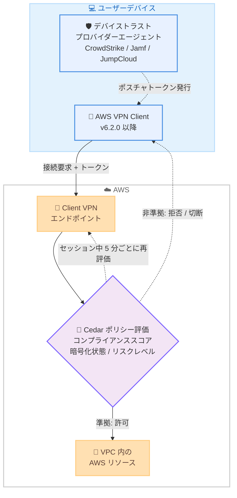

# AWS Client VPN - デバイスポスチャ評価のサポート

**リリース日**: 2026 年 10 月 5 日
**サービス**: AWS Client VPN
**機能**: デバイスポスチャ評価 (Device Posture Assessment)

📊 [このアップデートのインフォグラフィックを見る](https://takech9203.github.io/aws-news-summary/20261005-aws-client-vpn-device-posture.html)

## 概要

AWS Client VPN がデバイスポスチャ評価をサポートしました。接続を許可する前に、ユーザーのデバイスがセキュリティ要件とコンプライアンス要件を満たしているかを検証できるようになり、信頼された準拠デバイスのみが Client VPN 経由で AWS リソースにアクセスできることを保証します。

本機能は CrowdStrike、Jamf、JumpCloud といったデバイストラストプロバイダーと統合し、コンプライアンススコア、ディスク暗号化状態、デバイスリスクレベルなどのシグナルを自動的に評価します。デバイスの要件は Cedar ポリシー言語で定義し、どのデバイスが接続できるかをきめ細かく制御できます。ポリシー作成を支援する Test Policy ツールも提供されます。

さらに、評価は接続時の 1 回だけでなく、アクティブなセッション中も継続的に実行されます。セッション中にデバイスが非準拠になった場合 (リスクスコアの変化やセキュリティ設定の変更など)、セッションは自動的に切断されます。切断を行わずログ記録のみを行うモニタリング専用モードも利用でき、本番適用前にポリシーの影響を把握できます。

**アップデート前の課題**

- 以前は証明書、SAML、Active Directory などによる「ユーザー認証」が中心で、接続元デバイスのセキュリティ健全性を Client VPN 単体で検証できなかった
- 認証情報が正しければ、暗号化されていないデバイスやセキュリティリスクの高いデバイスからも接続できてしまう可能性があった
- 接続後にデバイスの状態が悪化しても、セッションを自動的に切断する仕組みがなかった

**アップデート後の改善**

- 接続前にデバイスのコンプライアンス状態を検証し、要件を満たさないデバイスの接続を拒否できるようになった
- セッション中も約 5 分ごとに継続的に再評価し、非準拠になったセッションを自動切断できるようになった
- Cedar ポリシーによるきめ細かな要件定義と、Test Policy ツールによるポリシー検証が可能になった
- モニタリング専用モードにより、ユーザー影響なしでポリシーの効果を事前評価できるようになった

## アーキテクチャ図



デバイストラストプロバイダーが発行する署名付きポスチャトークンを、Client VPN エンドポイントが Cedar ポリシーに照らして評価します。評価は接続時だけでなくセッション継続中も約 5 分ごとに実行され、非準拠デバイスは自動的に切断されます。

## サービスアップデートの詳細

### 主要機能

1. **デバイストラストプロバイダーとの統合**
   - CrowdStrike、Jamf、JumpCloud の 3 つのプロバイダーをサポート
   - プロバイダーがデバイス上で署名付きのデバイスポスチャトークン (コンプライアンス状態、ディスク暗号化状態などの健全性情報) を提供
   - コンプライアンススコア、暗号化状態、デバイスリスクレベルなどのシグナルを自動評価
   - 既存の認証方式 (証明書、SAML、Active Directory) を補完する多層防御として機能

2. **Cedar ポリシーによる要件定義**
   - オープンソースのポリシー言語 Cedar を使用して、デバイスが満たすべき要件を記述
   - ポスチャトークン、認証済みユーザー ID、接続の詳細を組み合わせたコンテキストに対して許可 / 拒否を判定
   - Test Policy ツールによりポリシーの作成と検証を支援

3. **継続的なセッション評価**
   - 接続時の評価に加え、セッション継続中も約 5 分ごとにポリシーを再評価
   - リスクスコアの変化やセキュリティ設定の変更などで非準拠になったセッションを自動的に切断
   - 例: ディスク暗号化が有効なデバイスのみ接続を許可する、ファイアウォールが有効なデバイスのみ接続を維持する、といった制御が可能

4. **モニタリング専用モード**
   - ユーザーを切断せず、ポスチャ評価の結果をログに記録するのみのモードを提供
   - 強制適用の前にポリシーの影響範囲を把握でき、段階的な導入が可能

## 技術仕様

### プロバイダー別の対応 OS

| デバイストラストプロバイダー | 対応 OS |
|------|------|
| CrowdStrike | macOS、Windows |
| Jamf | macOS |
| JumpCloud | macOS、Windows、Ubuntu |

### 動作要件

| 項目 | 詳細 |
|------|------|
| クライアント | AWS VPN Client バージョン 6.2.0 以降 |
| ポリシー言語 | Cedar |
| 再評価間隔 | セッション継続中、約 5 分ごと |
| 動作モード | 強制適用モード / モニタリング専用モード |
| プロバイダー設定 | エンドポイント側の設定に加え、各デバイス側でもプロバイダーのセットアップが必要 |

### API変更履歴

本アップデートに直接関連する API 変更は、awsapichanges.com の直近のフィードでは確認できませんでした。

## 設定方法

### 前提条件

1. AWS Client VPN エンドポイントが作成済みであること
2. デバイストラストプロバイダー (CrowdStrike、Jamf、JumpCloud のいずれか) の契約と管理環境があること
3. 接続する各デバイスにプロバイダーのエージェントがセットアップされ、ポスチャトークンが利用可能であること
4. 各デバイスに AWS VPN Client バージョン 6.2.0 以降がインストールされていること

### 手順

#### ステップ1: デバイストラストプロバイダーの設定

Client VPN エンドポイントに対して、使用するデバイストラストプロバイダー (CrowdStrike、Jamf、JumpCloud) を設定します。各プロバイダーのデバイス側セットアップ手順は、プロバイダー各社のドキュメント (CrowdStrike Zero Trust Assessment、Jamf Trusted Access、JumpCloud Device Trust) を参照してください。

#### ステップ2: Cedar ポリシーの作成

デバイスが満たすべき要件を Cedar ポリシーとして定義します。以下は概念を示すイメージ例です (実際の属性名はプロバイダーとドキュメントに従って記述します)。

```text
// 例: ディスク暗号化が有効なデバイスのみ接続を許可するイメージ
permit (principal, action, resource)
when {
    context.device.diskEncryption == true
};
```

Test Policy ツールを使用して、作成したポリシーが想定どおりに許可 / 拒否を判定するかを検証します。

#### ステップ3: モニタリング専用モードでの試験運用

最初はモニタリング専用モードで有効化し、ユーザーを切断することなくポスチャ評価結果のログを収集します。どのデバイスが非準拠と判定されるかを確認し、ポリシーの影響範囲を把握します。

#### ステップ4: 強制適用への切り替え

ログの確認とポリシーの調整が完了したら、強制適用モードに切り替えます。以降、非準拠デバイスは接続を拒否され、セッション中に非準拠となったデバイスは自動的に切断されます。

## メリット

### ビジネス面

- **ゼロトラストセキュリティの強化**: ユーザー認証だけでなくデバイスの健全性も検証することで、ゼロトラストの原則に沿ったリモートアクセスを実現できる
- **コンプライアンス対応**: 暗号化やセキュリティエージェントの稼働など、組織のコンプライアンス要件を満たすデバイスのみにアクセスを限定できる
- **追加コストなし**: Client VPN が利用可能なすべてのリージョンで追加料金なしで利用できる

### 技術面

- **継続的な評価**: 接続時の 1 回限りではなく、セッション中も約 5 分ごとに再評価されるため、接続後のリスク変化にも対応できる
- **きめ細かなポリシー制御**: Cedar ポリシーにより、デバイス属性、ユーザー ID、接続の詳細を組み合わせた柔軟な制御が可能
- **段階的な導入**: モニタリング専用モードにより、ユーザー影響なしでポリシーの効果を事前検証できる
- **多層防御**: 既存の認証方式や認可ルールと組み合わせて利用でき、防御層を追加できる

## デメリット・制約事項

### 制限事項

- 対応するデバイストラストプロバイダーは CrowdStrike、Jamf、JumpCloud の 3 つに限定される
- プロバイダーごとに対応 OS が異なる (例: Jamf は macOS のみ)
- AWS VPN Client バージョン 6.2.0 以降が必要であり、古いクライアントの更新が必要になる

### 考慮すべき点

- デバイストラストプロバイダーの構成と運用はユーザーの責任であり、AWS はサードパーティプロバイダーを管理しない。Client VPN はプロバイダーが提供するトークンを評価するのみで、デバイスの健全性を独立して検証するわけではない
- 各デバイス側でもプロバイダーのエージェントセットアップが必要なため、エンドユーザーへの展開計画が必要
- 強制適用モードでは非準拠デバイスが自動切断されるため、業務影響を避けるにはモニタリング専用モードでの十分な事前検証が重要

## ユースケース

### ユースケース1: ディスク暗号化を必須とするリモートアクセス

**シナリオ**: 機密データを扱う企業で、ディスク暗号化が有効なデバイスのみ社内 VPC へのアクセスを許可したい。

**実装例**:
```text
1. JumpCloud をデバイストラストプロバイダーとして設定
2. ディスク暗号化が有効であることを要求する Cedar ポリシーを作成
3. Test Policy ツールで判定結果を検証し、強制適用モードで有効化
```

**効果**: 暗号化されていないデバイスからの接続を自動的に拒否し、デバイス紛失時の情報漏えいリスクを低減できる。

### ユースケース2: EDR のリスクスコアに基づく継続的なアクセス制御

**シナリオ**: CrowdStrike を導入済みの組織で、デバイスのリスクレベルが悪化した場合に VPN セッションを即座に遮断したい。

**実装例**:
```text
1. CrowdStrike をデバイストラストプロバイダーとして設定
2. リスクレベルが基準値を満たすことを要求する Cedar ポリシーを作成
3. 強制適用モードで有効化し、約 5 分ごとの再評価で非準拠セッションを自動切断
```

**効果**: マルウェア感染などでリスクスコアが悪化したデバイスを自動的にネットワークから切り離し、被害の拡大を防止できる。

### ユースケース3: ポリシー導入前の影響評価

**シナリオ**: 新しいデバイスポスチャ要件を導入したいが、どの程度のユーザーが影響を受けるか不明なため、業務影響なしで事前評価したい。

**実装例**:
```text
1. 想定する要件を Cedar ポリシーとして作成
2. モニタリング専用モードで有効化し、評価結果のログを収集
3. 非準拠デバイスの割合と原因を分析し、デバイス側の是正とポリシー調整を実施
4. 影響が許容範囲になった時点で強制適用モードへ切り替え
```

**効果**: ユーザーを切断することなくポリシーの影響を定量的に把握でき、安全に段階的な導入ができる。

## 料金

デバイスポスチャ評価は追加料金なしで利用できます。AWS Client VPN の通常料金 (エンドポイントのサブネット関連付けおよび接続時間に基づく料金) のみが適用されます。詳細は料金ページを参照してください。

## 利用可能リージョン

AWS Client VPN が利用可能なすべての AWS リージョンで利用できます。

## 関連サービス・機能

- **AWS Client VPN 認可ルール**: 既存のネットワークベースの認可ルールと併用することで、多層防御を実現できる
- **Cedar**: デバイスポスチャ要件の記述に使用するオープンソースのポリシー言語。Amazon Verified Permissions や AWS Verified Access でも採用されている
- **AWS Verified Access**: VPN を使わないゼロトラストアクセスを提供するサービス。こちらもデバイストラストプロバイダーとの統合によるデバイスポスチャ評価をサポートしており、ユースケースに応じて使い分けられる

## 参考リンク

- 📊 [インフォグラフィック](https://takech9203.github.io/aws-news-summary/20261005-aws-client-vpn-device-posture.html)
- [公式発表 (What's New)](https://aws.amazon.com/about-aws/whats-new/2026/10/aws-client-vpn-device-posture/)
- [AWS Client VPN 管理者ガイド](https://docs.aws.amazon.com/vpn/latest/clientvpn-admin/what-is.html)
- [デバイスポスチャの概要 (管理者ガイド)](https://docs.aws.amazon.com/vpn/latest/clientvpn-admin/device-posture.html)
- [サポートされるデバイストラストプロバイダー](https://docs.aws.amazon.com/vpn/latest/clientvpn-admin/device-posture-providers.html)
- [デバイスポスチャ認可ポリシーの作成](https://docs.aws.amazon.com/vpn/latest/clientvpn-admin/device-posture-policies.html)
- [AWS Client VPN 料金ページ](https://aws.amazon.com/vpn/pricing/)

## まとめ

AWS Client VPN のデバイスポスチャ評価により、ユーザー認証に加えてデバイスの健全性に基づくアクセス制御が可能になり、ゼロトラストの原則に沿ったリモートアクセスを追加料金なしで実現できます。CrowdStrike、Jamf、JumpCloud のいずれかを利用中の組織は、まずモニタリング専用モードでポリシーの影響を評価し、AWS VPN Client 6.2.0 以降への更新と合わせて段階的に強制適用へ移行することを推奨します。
