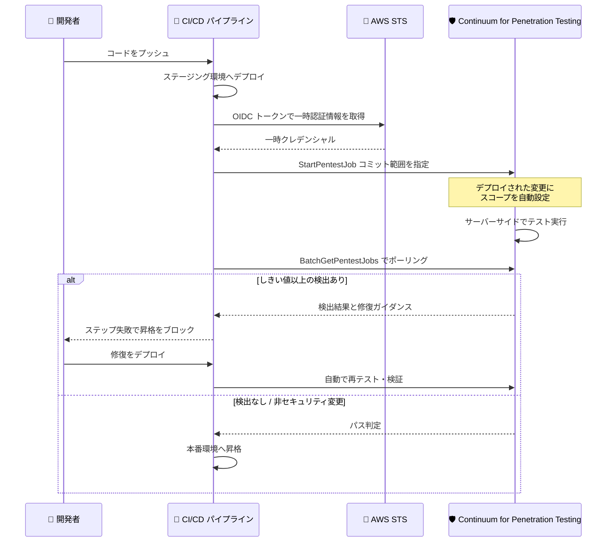

# AWS Continuum for Penetration Testing - CI/CD パイプライン統合による継続的ペネトレーションテスト

**リリース日**: 2026 年 10 月 5 日
**サービス**: AWS Continuum for Penetration Testing (旧 AWS Security Agent)
**機能**: CI/CD パイプラインに直接統合された継続的ペネトレーションテスト (パブリックプレビュー)

📊 [このアップデートのインフォグラフィックを見る](https://takech9203.github.io/aws-news-summary/20261005-aws-continuum-penetration-testing.html)

## 概要

AWS Continuum for Penetration Testing (旧 AWS Security Agent) が、CI/CD パイプラインへの直接統合による継続的ペネトレーションテストをパブリックプレビューとして発表しました。サードパーティのペンテストベンダーと契約することなくオンデマンドのペネトレーションテストを提供してきた本サービスが、セキュリティテストをさらにシフトレフトし、ペネトレーションテストを「デプロイ時のイベント」として実行できるようになります。

本統合は、デプロイ後のパイプラインステップとして動作するポストデプロイメントゲートです。デプロイされた変更 (コミット範囲) に自動的にスコープを絞ってテストを実行し、設定した重要度しきい値以上の検出結果があれば次のステージ (本番環境など) への昇格をブロックします。開発者は重要度、影響を受けるエンドポイント、修復ガイダンスを含む検出結果をパイプライン出力で直接受け取れます。セキュリティに関係しない変更は実質的な遅延なしで完了し、修復後は手動での再トリガーなしに自動で再テスト・検証が行われます。

セットアップにセキュリティの専門知識は不要で、自動生成されるパイプラインスニペットを既存のパイプラインに貼り付けるだけで 5 分以内に完了します。アプリケーションコンテキストは初回実行時に自動的にブートストラップされるため、事前のフルペネトレーションテストも必要ありません。GitHub Actions、GitLab CI/CD、Bitbucket Pipelines、Azure DevOps Pipelines の 4 つの主要 CI/CD プラットフォームに対応しています。

**アップデート前の課題**

このアップデート以前は、ペネトレーションテストがデプロイワークフローの外側で行われていました。

- オンデマンドのペネトレーションテストが利用可能であっても、セキュリティ検証はデプロイワークフローとは別のタイミングで実施する必要があった
- 開発チームは毎日コードをリリースする一方で、テストのスコープ定義やスケジュールされた評価の実施を待つ必要があった
- 検出結果の確認や修復後の再テストには、セキュリティチームとの調整や手動での再実行が必要だった

**アップデート後の改善**

今回のアップデートにより、ペネトレーションテストをデプロイパイプラインの一部として自動実行できるようになりました。

- デプロイごとにペネトレーションテストが自動実行され、変更されたコミット範囲に自動でスコープが絞られるため、スコープ定義や評価待ちが不要になった
- 重要度、影響エンドポイント、修復ガイダンスを含む検出結果が、開発者が普段使うパイプライン出力に直接表示されるようになった
- 修復をデプロイすると自動的に再テスト・検証が行われ、手動での再トリガーが不要になった
- 重要度しきい値に基づいて本番環境への昇格を自動でブロックするセキュリティゲートを構築できるようになった

## アーキテクチャ図



デプロイ後にパイプラインステップがペネトレーションテストジョブを開始し、結果に応じて本番昇格をゲートします。テスト本体は AWS アカウント内でサーバーサイド実行され、CI/CD ランナー上ではテストロジックは動作しません。

## サービスアップデートの詳細

### 主要機能

1. **ポストデプロイメントゲートとしてのペネトレーションテスト**
   - デプロイ後のパイプラインステップとして実行され、デプロイされた変更をテスト
   - 設定した重要度しきい値 (CRITICAL / HIGH / MEDIUM / LOW / NONE) 以上の検出結果があると昇格をブロック
   - プルリクエスト時のコードスキャンとは異なり、実際にデプロイされたアプリケーションを動的にテスト

2. **変更範囲への自動スコーピング**
   - Head (ゲート対象のコミット) と Base (前回クリアしたコミット) をサービス側が自動追跡し、差分のみをテスト
   - テスト完了時にスコープ判定を返却: In scope (攻撃対象領域を変更)、Scoped out (攻撃対象領域に影響なし、テスト不要でパス)、Scope conflict (設定スコープ外のため未テスト)
   - 非セキュリティ変更は実質的な遅延なしで完了

3. **4 つの CI/CD プラットフォーム対応**
   - GitHub Actions (アクションとして実行)、GitLab CI/CD (コンポーネントとして実行)、Bitbucket Pipelines (パイプとして実行)、Azure DevOps Pipelines (AWS Toolkit のタスクとして実行)
   - 設定項目と既定値は 4 プラットフォームで共通 (名称のみ異なる)

4. **OIDC フェデレーションによるキーレス認証**
   - 長期的な AWS アクセスキーを使用せず、CI/CD プロバイダーが発行する短命の OIDC トークンを AWS STS で一時認証情報に交換
   - IAM ロールの信頼ポリシーでリポジトリやブランチ単位にアクセスを制限可能

5. **自動再テスト・検証**
   - 修復後のデプロイで自動的に再テストと検証を実施し、手動での再トリガーが不要
   - ドライランモードで課金対象のテストを開始せずにセットアップ全体を検証可能

## 技術仕様

### 統合の既定値

| 設定 | 既定値 | 意味 |
|------|--------|------|
| 重要度しきい値 | HIGH | HIGH または CRITICAL の検出で昇格をブロック。それ未満は報告のみ |
| タイムアウト | 60 分 | テストジョブが終了状態になるまで最大 1 時間待機 |
| スコープ競合時の動作 | block | 設定スコープ外の変更はテストされないため、ステップを失敗させる |
| インフラエラー時の失敗 | false | 既定はフェイルオープン。ジョブが開始・完了できない場合は警告付きでパス |
| ドライラン | false | 既定では課金対象の実テストジョブを開始 |

### パイプラインの応答動作

| 結果 | パイプラインの動作 |
|------|------|
| しきい値以上の検出 | ステップ失敗、昇格をブロック |
| しきい値未満の検出のみ / スコープ外変更 | ステップはパス |
| スコープ競合 | block (既定) または warn を選択可能 |
| インフラエラー | フェイルクローズまたはフェイルオープン (既定) を選択可能 |
| 認可エラー (HTTP 401 / 403) | 設定にかかわらず常にステップ失敗 |
| 統合が認識する設定ミス (リポジトリ未接続など) | 設定にかかわらず常にステップ失敗 |

### 必要な IAM アクセス許可

パイプラインステップが必要とするのは以下の 6 アクションのみです。

```json
{
  "Version": "2012-10-17",
  "Statement": [
    {
      "Effect": "Allow",
      "Action": [
        "securityagent:StartPentestJob",
        "securityagent:BatchGetPentestJobs",
        "securityagent:StopPentestJob",
        "securityagent:ListFindings",
        "securityagent:BatchGetFindings",
        "securityagent:ListIntegratedResources"
      ],
      "Resource": "*"
    }
  ]
}
```

### プロバイダーごとの差異

| CI/CD プロバイダー | 実行形態 | ベースラインの保存場所 |
|------|------|------|
| GitHub Actions | アクション | リポジトリ内の git ref |
| GitLab CI/CD | コンポーネント | プロジェクト内のタグ (クリア済みコミットごとに 1 タグ) |
| Bitbucket Pipelines | パイプ | リポジトリ変数 |
| Azure DevOps Pipelines | AWS Toolkit のタスク | Azure Repos の場合はリポジトリ ref、それ以外はビルドタグ |

## 設定方法

### 前提条件

1. テスト対象のアプリケーションドメインを検証済みであること
2. Agent Space 内でペネトレーションテストを作成し、ターゲット・認証情報・ネットワークスコープを設定済みであること
3. ペネトレーションテストで CI/CD モードを有効化し、Agent Space ID (as-...) とペネトレーションテスト ID (pt-...) を控えていること
4. リポジトリをソースコントロール統合として接続済みであること

### 手順

#### ステップ 1: OIDC プロバイダーと IAM ロールの作成

```json
{
  "Version": "2012-10-17",
  "Statement": [
    {
      "Effect": "Allow",
      "Principal": {
        "Federated": "arn:aws:iam::111122223333:oidc-provider/token.actions.githubusercontent.com"
      },
      "Action": "sts:AssumeRoleWithWebIdentity",
      "Condition": {
        "StringEquals": {
          "token.actions.githubusercontent.com:aud": "sts.amazonaws.com"
        },
        "StringLike": {
          "token.actions.githubusercontent.com:sub": "repo:my-org/my-app:ref:refs/heads/main"
        }
      }
    }
  ]
}
```

CI/CD プロバイダー用の IAM OIDC アイデンティティプロバイダーを作成し、信頼ポリシーでロールを引き受け可能なパイプラインを制限します。上記は GitHub Actions の my-org/my-app リポジトリの main ブランチのみを許可する例です。sub クレームのリポジトリ部分をワイルドカードにすると、任意のリポジトリが課金対象のテストを開始できてしまうため、必ずリポジトリを固定します。

#### ステップ 2: パイプラインスニペットの追加

コンソールで自動生成されるパイプラインスニペットを既存のパイプライン定義に貼り付けます。デプロイステップの後に配置し、本番昇格をこのステップの結果でゲートします。アップストリームの統合の変更が無断でパイプラインの挙動を変えないよう、リリースタグやコミット SHA などの不変バージョンに統合を固定します。

#### ステップ 3: ドライランによる検証

既定ではインフラエラー時にフェイルオープンとなるため、検証していないゲートは何もテストせずにパスする可能性があります。本番運用前にドライランモードで 1 回実行し、AWS 認証・リージョン・リポジトリの統合解決をエンドツーエンドで確認します。ドライランでは課金対象のテストジョブは開始されず、検証に失敗した場合はエラーハンドリング設定にかかわらずステップが失敗します。セキュリティサインオフが必要なパイプラインでは、検証後に fail-on-error を true に設定します。

## メリット

### ビジネス面

- **ペンテストベンダー契約の不要化**: サードパーティベンダーとの契約や調整なしに、デプロイごとの継続的なペネトレーションテストを実現できる
- **リリース速度とセキュリティの両立**: 非セキュリティ変更は実質的な遅延なしで完了するため、セキュリティゲートの導入が開発速度を損なわない
- **5 分以内のセットアップ**: 自動生成スニペットの貼り付けだけで導入でき、セキュリティ専門知識や事前のフルペネトレーションテストが不要

### 技術面

- **変更範囲への自動スコーピング**: デプロイされたコミット範囲のみをサーバーサイドで差分計算してテストするため、テスト時間とコストを最小化できる
- **キーレスな認証**: OIDC フェデレーションにより長期認証情報を CI/CD 変数に保存する必要がなく、認可エラー時は常にステップが失敗するため設定ミスが昇格を黙認しない
- **修復ループの自動化**: 修復後のデプロイで自動的に再テスト・検証が行われ、手動再トリガーによる抜け漏れを防げる

## デメリット・制約事項

### 制限事項

- パブリックプレビューのため、仕様は変更される可能性がある
- 利用可能なリージョンは一部に限定され、Agent Space とペネトレーションテストが存在するリージョンをパイプラインで指定する必要がある
- ポストデプロイメントゲートであり、プルリクエスト前のコードスキャンの代替ではない (PR スキャンには別機能を使用)
- Bitbucket Pipelines ではブランチ単位の信頼ポリシースコープが設定できず、パイプラインキャンセル時に課金対象のジョブが実行し続ける場合がある

### 考慮すべき点

- 既定はインフラエラー時フェイルオープンのため、セキュリティサインオフが必要なパイプラインでは fail-on-error を true に設定する必要がある
- パスした実行はベースラインを前進させるため、レポートオンリー実行やフェイルオープンで通過したコミット範囲は、後からしきい値を厳格化しても再評価されない
- テストジョブはサーバーサイドで課金対象として実行され、パイプラインが待機をやめてもジョブは完了まで実行し続ける。IAM ロールの最大セッション時間は (タイムアウト + 10 分) 以上に設定する必要がある
- GitLab CI/CD ではパイプライン変数がコミット済み設定を上書きできるため、変数の上書きに必要な最小ロールを制限してからゲートを信頼する必要がある

## ユースケース

### ユースケース 1: 本番昇格ゲートとしての自動ペネトレーションテスト

**シナリオ**: 毎日複数回デプロイする Web アプリケーションチームが、ステージング環境へのデプロイ後に自動でペネトレーションテストを実行し、HIGH 以上の脆弱性があれば本番昇格をブロックしたい。

**実装例**:
```
ステージングデプロイ → ペネトレーションテストゲート (しきい値: HIGH、fail-on-error: true)
→ パス時のみ本番デプロイステージへ昇格
```

**効果**: デプロイごとに変更範囲のセキュリティ検証が自動実行され、重大な脆弱性を含む変更が本番環境に到達することを防げる。

### ユースケース 2: レポートオンリーモードでの段階的導入

**シナリオ**: ゲートがリリースをブロックすることによる影響を見極めるため、まずは検出結果の収集のみを行い、傾向を把握してから本格導入したい。

**実装例**:
```
しきい値: NONE、on-scope-conflict: warn、fail-on-error: false で導入
→ 実デプロイでの検出傾向を確認後、しきい値を HIGH に引き上げ
```

**効果**: パイプラインを止めることなく実環境での検出傾向を把握できる。ただしレポートオンリーで通過した範囲は再評価されないため、しきい値引き上げ前にベースラインレコードの削除を検討する。

### ユースケース 3: 修復検証の自動化

**シナリオ**: ペネトレーションテストで検出された SQL インジェクションを修復し、修正が有効であることを確認してからリリースしたい。

**実装例**:
```
検出 → パイプライン出力の修復ガイダンスに従い修正をコミット
→ 再デプロイで自動的に再テスト・検証 → パスで昇格再開
```

**効果**: 手動での再テスト依頼や再トリガーが不要になり、修復からリリース再開までのリードタイムを短縮できる。

## 料金

ペネトレーションテストジョブは課金対象として実行されます。ドライランモードでは課金対象のジョブは開始されません。パブリックプレビュー期間中の詳細な料金体系は公式ページで確認してください。なお、パイプラインのキャンセル時にジョブが停止されない場合 (特に Bitbucket Pipelines)、ジョブは完了まで課金が継続するため、コンソールから手動で停止する必要があります。

## 利用可能リージョン

AWS Continuum for Penetration Testing は一部の AWS リージョンで利用可能です。Agent Space とペネトレーションテストが配置されたリージョンをパイプラインで指定する必要があります。

## 関連サービス・機能

- **AWS IAM / AWS STS**: OIDC フェデレーションによる一時認証情報の発行と、信頼ポリシー・アクセス許可ポリシーによる最小権限制御
- **GitHub Actions / GitLab CI/CD / Bitbucket Pipelines / Azure DevOps Pipelines**: 統合がサポートする 4 つの CI/CD プラットフォーム
- **プルリクエストコードレビュー機能**: マージ前の個別プルリクエストをスキャンする機能。デプロイ済みアプリケーションを動的にテストする本統合とは補完関係

## 参考リンク

- 📊 [インフォグラフィック](https://takech9203.github.io/aws-news-summary/20261005-aws-continuum-penetration-testing.html)
- [公式発表 (What's New)](https://aws.amazon.com/about-aws/whats-new/2026/10/aws-continuum-penetration-testing/)
- [ドキュメント: Run penetration tests from your CI/CD pipeline](https://docs.aws.amazon.com/securityagent/latest/userguide/cicd-pentest.html)

## まとめ

AWS Continuum for Penetration Testing の CI/CD 統合により、ペネトレーションテストが専門家による定期的なイベントから、デプロイごとに自動実行されるパイプラインの一部へと変わります。自動生成スニペットで 5 分以内に導入できるため、まずはドライランとレポートオンリーモードで検出傾向を確認し、その後しきい値 HIGH / fail-on-error: true のブロッキングゲートへ段階的に移行することを推奨します。
