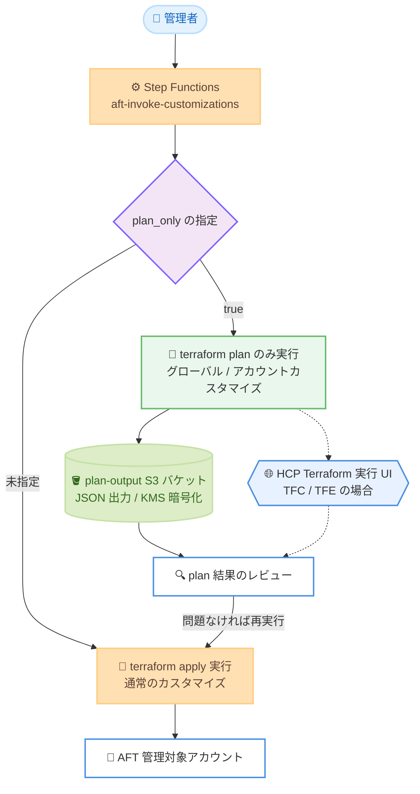

# AWS Control Tower - Account Factory for Terraform (AFT) の plan-only カスタマイズ実行サポート

**リリース日**: 2026 年 10 月 5 日
**サービス**: AWS Control Tower (Account Factory for Terraform)
**機能**: Plan-only customization runs (plan のみのカスタマイズ実行)

📊 [このアップデートのインフォグラフィックを見る](https://takech9203.github.io/aws-news-summary/20261005-aws-control-tower-aft.html)

## 概要

AWS Control Tower Account Factory for Terraform (AFT) が、plan-only カスタマイズ実行をサポートしました。管理者は、管理対象アカウントに変更を適用する前に、Terraform の変更内容をプレビューできるようになります。本機能は AFT バージョン 1.22.0 で導入されました。

AFT は、AWS Control Tower 環境でアカウントのプロビジョニングとカスタマイズを自動化するオープンソースの Terraform モジュールです。これまで、グローバルカスタマイズやアカウントカスタマイズを起動すると、常に `terraform apply` まで実行され、変更内容を事前に確認する手段がありませんでした。今回のアップデートにより、`aft-invoke-customizations` Step Functions ステートマシンの入力に `"plan_only": true` を指定するだけで、変更を適用せずに `terraform plan` のみを実行できます。

本機能は、ロールアウト前の安全な検証、構成ドリフトの検出、CI/CD レビューワークフローへの統合を可能にし、多数のアカウントを AFT で管理するエンタープライズ環境のガバナンスと運用の安全性を大きく向上させます。

**アップデート前の課題**

- 以前はカスタマイズを起動すると常に完全な `terraform apply` が実行され、変更内容を事前にプレビューできなかった
- 多数のアカウントへのロールアウト前に、変更の影響範囲を検証する安全な手段がなかった
- 実際の構成と Terraform コードの差異 (ドリフト) を、変更を適用せずに検出することが困難だった
- CI/CD パイプラインに「plan 結果のレビュー → 承認 → 適用」という一般的な Terraform ワークフローを組み込めなかった

**アップデート後の改善**

- Step Functions の入力に `"plan_only": true` を追加するだけで、グローバルカスタマイズとアカウントカスタマイズの `terraform plan` を変更適用なしで実行できるようになった
- plan 結果を確認してから通常実行で適用するという、段階的で安全なロールアウトが可能になった
- 定期的な plan-only 実行により、構成ドリフトを非破壊的に検出できるようになった
- plan の JSON 出力を AFT 管理アカウント内の専用 S3 バケットにエクスポートし、CI/CD レビューワークフローや自動解析に活用できるようになった

## アーキテクチャ図



`plan_only` パラメータの指定有無によって、AFT カスタマイズパイプラインの動作が `terraform plan` のみの実行と通常の `terraform apply` 実行に分岐するフローを示しています。plan 結果は S3 バケットまたは HCP Terraform の実行 UI でレビューでき、問題がなければ通常実行で変更を適用します。

## サービスアップデートの詳細

### 主要機能

1. **plan-only カスタマイズ実行**
   - `aft-invoke-customizations` Step Functions ステートマシンの入力に `"plan_only": true` を指定すると、`terraform apply` の代わりに `terraform plan` のみを実行
   - グローバルカスタマイズとアカウントカスタマイズの両方に適用される
   - 既存の `include` / `exclude` フィルタ (全アカウント、OU、タグ、アカウント ID) と組み合わせて、対象アカウントを柔軟に指定可能
   - plan 結果をレビューした後、`plan_only` パラメータなしで再実行することで変更を適用する

2. **plan 出力の S3 エクスポート**
   - AFT のデプロイ時に、AFT 管理アカウント内に専用の plan-output S3 バケットが作成される (Terraform ディストリビューションを問わず常に作成)
   - バケットは AFT の KMS キーで暗号化され、バージョニング有効、パブリックアクセスブロック、書き込みは AFT カスタマイズビルドロールに限定
   - Community Edition (オープンソース) では、plan-only 実行のたびに plan の JSON 出力がデフォルトでエクスポートされる
   - HCP Terraform (Terraform Cloud) / Terraform Enterprise では、plan 結果は HCP Terraform の実行 UI で確認でき、`aft_plan_output_export_enabled = true` を設定することで S3 への JSON エクスポートも有効化できる
   - エクスポートされた plan の保持期間はデフォルト 30 日で、`aft_plan_output_retention_days` 変数で変更可能

3. **全 Terraform ディストリビューション対応**
   - Terraform Community Edition (オープンソース)、HCP Terraform (Terraform Cloud)、Terraform Enterprise のすべての AFT サポート対象ディストリビューションで動作

4. **AFT 1.22.0 のその他の改善 (バグ修正)**
   - plan と apply が別々のファイルシステムで実行されるパイプラインで、plan 時に作成した Lambda デプロイアーカイブが apply 時に見つからずプロビジョニングが失敗する問題を修正
   - 新規 AFT デプロイで、ステートバケットのバージョニング有効化前にレプリケーションが設定され失敗する問題を修正 (設定順序を是正)

## 技術仕様

### plan-only 実行の仕様

| 項目 | 詳細 |
|------|------|
| 導入バージョン | AFT 1.22.0 |
| 起動方法 | `aft-invoke-customizations` Step Functions の入力に `"plan_only": true` を指定 |
| 実行内容 | グローバル / アカウントカスタマイズの `terraform plan` (apply は実行しない) |
| 対象の指定 | `include` / `exclude` で all、OU、タグ、アカウント ID によるフィルタが可能 |
| 同時実行数 | AFT が一度に起動できるカスタマイズは最大 5 件 (従来と同様) |
| plan 出力先 | plan-output S3 バケット (JSON 形式) または HCP Terraform 実行 UI |
| 出力の保持期間 | デフォルト 30 日 (`aft_plan_output_retention_days` で変更可能) |
| 対応ディストリビューション | Community Edition、HCP Terraform (Terraform Cloud)、Terraform Enterprise |

### Step Functions 入力例

特定のアカウントを対象に plan-only 実行を行う場合の入力例です。

```json
{
  "include": [
    {
      "type": "accounts",
      "target_value": ["123456789012"]
    }
  ],
  "plan_only": true
}
```

`123456789012` は対象の AWS アカウント ID に置き換えます。OU やタグによる指定、`exclude` による除外も従来どおり併用できます。

### AFT デプロイ入力の設定変数

HCP Terraform / Terraform Enterprise で plan の JSON 出力を S3 にエクスポートする場合の設定です。

```hcl
module "aft" {
  source = "github.com/aws-ia/terraform-aws-control_tower_account_factory"

  # ... 既存の設定 ...

  # plan 出力の S3 エクスポート (TFC / TFE のみ有効、CE ではデフォルトでエクスポート)
  aft_plan_output_export_enabled = true

  # エクスポートした plan 出力の保持日数 (デフォルト: 30)
  aft_plan_output_retention_days = 30
}
```

## 設定方法

### 前提条件

1. AWS Control Tower が有効化され、AFT がデプロイ済みであること
2. AFT モジュールをバージョン 1.22.0 以降に更新していること
3. グローバルカスタマイズ / アカウントカスタマイズ用の Git リポジトリが設定済みであること
4. AFT 管理アカウントで Step Functions を実行する権限があること

### 手順

#### ステップ 1: AFT モジュールを 1.22.0 以降に更新

```hcl
module "aft" {
  source = "github.com/aws-ia/terraform-aws-control_tower_account_factory?ref=1.22.0"
  # ... 既存の設定 ...
}
```

AFT デプロイ入力設定の `source` で参照するバージョンを 1.22.0 以降に更新し、AFT 管理アカウントで `terraform apply` を実行して AFT 自体を更新します。plan-output S3 バケットはこの更新時に自動的に作成されます。

#### ステップ 2: カスタマイズの変更を Git リポジトリにプッシュ

```bash
git add .
git commit -m "Update account customizations"
git push origin main
```

グローバルカスタマイズまたはアカウントカスタマイズのリポジトリに変更をプッシュします。この時点ではパイプラインは起動せず、次のステップで Step Functions から起動します。

#### ステップ 3: plan-only 実行を開始

```bash
aws stepfunctions start-execution \
  --state-machine-arn arn:aws:states:ap-northeast-1:111122223333:stateMachine:aft-invoke-customizations \
  --input '{
    "include": [
      {"type": "accounts", "target_value": ["123456789012"]}
    ],
    "plan_only": true
  }'
```

AFT 管理アカウントで `aft-invoke-customizations` ステートマシンを起動します。`"plan_only": true` を指定しているため、対象アカウントのカスタマイズパイプラインは `terraform plan` のみを実行し、変更は適用されません。ARN のリージョン、アカウント ID、対象アカウント ID はご自身の環境の値に置き換えてください。

#### ステップ 4: plan 結果をレビュー

```bash
# plan-output バケット名を確認してオブジェクトを一覧表示
aws s3 ls s3://<plan-output-bucket-name>/ --recursive
```

Community Edition の場合は AFT 管理アカウントの plan-output S3 バケットから plan の JSON 出力を取得してレビューします。HCP Terraform / Terraform Enterprise の場合は HCP Terraform の実行 UI で plan 結果を確認できます。また、AWS CodePipeline のコンソールで対象アカウントのカスタマイズパイプラインの実行状況を監視できます。

#### ステップ 5: 問題がなければ通常実行で変更を適用

```bash
aws stepfunctions start-execution \
  --state-machine-arn arn:aws:states:ap-northeast-1:111122223333:stateMachine:aft-invoke-customizations \
  --input '{
    "include": [
      {"type": "accounts", "target_value": ["123456789012"]}
    ]
  }'
```

plan 結果に問題がないことを確認したら、`plan_only` パラメータを含めずに再度ステートマシンを起動し、通常のカスタマイズ実行 (terraform apply) で変更をアカウントに適用します。

## メリット

### ビジネス面

- **変更リスクの低減**: 多数のアカウントに影響する変更を適用前にプレビューできるため、意図しない変更による障害やサービス影響のリスクを大幅に低減できる
- **ガバナンスと監査性の向上**: plan の JSON 出力が暗号化・バージョニングされた S3 バケットに保存されるため、変更前レビューの証跡として監査やコンプライアンス対応に活用できる
- **運用の信頼性向上**: 「plan → レビュー → 承認 → apply」という業界標準の Terraform ワークフローをマルチアカウント管理に適用でき、変更管理プロセスを標準化できる

### 技術面

- **ドリフト検出**: 定期的な plan-only 実行により、実際のアカウント構成と Terraform コードの差異を非破壊的に検出できる
- **CI/CD 統合**: plan の JSON 出力を S3 から取得して自動解析やレビューの自動化に組み込めるため、CI/CD パイプラインとの統合が容易になる
- **全ディストリビューション対応**: Community Edition、HCP Terraform、Terraform Enterprise のいずれでも同じ方法で利用でき、ディストリビューション間での運用手順の差異が少ない
- **簡単な導入**: 既存の Step Functions 入力に `"plan_only": true` を 1 行追加するだけで利用でき、既存の include / exclude フィルタもそのまま使える

## デメリット・制約事項

### 制限事項

- plan-only 実行は変更を適用しないため、実際に適用するには `plan_only` パラメータなしで再度カスタマイズパイプラインを実行する必要がある (パイプラインが 2 回実行される)
- AFT が一度に起動できるカスタマイズは最大 5 件であり、多数のアカウントを対象とする場合は Step Functions が完了まで待機・ループする
- `aft_plan_output_export_enabled` 変数は HCP Terraform / Terraform Enterprise にのみ作用し、Community Edition では plan JSON が常にエクスポートされる (無効化は不可)
- 本機能を利用するには AFT 1.22.0 以降への更新が必要

### 考慮すべき点

- plan を実行してから apply を実行するまでの間に対象アカウントの構成が変化した場合、plan 結果と実際の適用内容が異なる可能性がある
- エクスポートされた plan 出力の保持期間はデフォルト 30 日のため、長期保存が必要な場合は `aft_plan_output_retention_days` の調整や別ストレージへの退避を検討する
- plan の JSON 出力にはリソース構成の詳細が含まれるため、plan-output バケットへのアクセス権限は最小権限で管理する

## ユースケース

### ユースケース 1: 大規模ロールアウト前の事前検証

**シナリオ**: 全 AFT 管理アカウントに適用するグローバルカスタマイズ (IAM ロールの追加など) を変更し、本番適用前に影響範囲を確認したい。

**実装例**:
```json
{
  "include": [
    {"type": "all"}
  ],
  "plan_only": true
}
```

**効果**: 全アカウントの plan 結果を適用前にレビューでき、想定外のリソース変更や削除を事前に検出して、安全に段階的なロールアウトを計画できる。

### ユースケース 2: 定期的な構成ドリフト検出

**シナリオ**: AFT で管理しているアカウントで、手動変更などにより Terraform コードと実際の構成に差異が生じていないかを定期的に確認したい。

**実装例**:
```json
{
  "include": [
    {"type": "ous", "target_value": ["Production"]}
  ],
  "plan_only": true
}
```

Amazon EventBridge Scheduler などで上記入力の Step Functions 実行を週次でスケジュールし、S3 にエクスポートされた plan JSON を Lambda で解析して差分があれば通知する。

**効果**: 変更を適用することなくドリフトを継続的に監視でき、ガバナンス違反や手動変更を早期に発見できる。

### ユースケース 3: CI/CD レビューワークフローへの統合

**シナリオ**: カスタマイズリポジトリへのプルリクエストに対して、plan 結果をレビュー担当者が確認してから本番適用する承認フローを構築したい。

**実装例**:
```json
{
  "include": [
    {"type": "tags", "target_value": [{"environment": "staging"}]}
  ],
  "plan_only": true
}
```

CI パイプラインからステージング相当のアカウント群に plan-only 実行を行い、S3 の plan JSON をプルリクエストにコメントとして添付。承認後に `plan_only` なしの実行で適用する。

**効果**: 業界標準の「plan レビュー → 承認 → apply」フローをマルチアカウントのアカウントカスタマイズに適用でき、変更管理の品質が向上する。

## 料金

AFT 自体の利用に追加料金はありません。AFT がデプロイ・利用する基盤サービス (AWS CodePipeline、AWS CodeBuild、AWS Step Functions、AWS Lambda、Amazon S3、Amazon DynamoDB、AWS KMS など) の使用量に応じた料金が発生します。

plan-only 実行に関連するコストとしては、plan-output S3 バケットのストレージ料金 (デフォルト 30 日保持)、plan 実行ごとの CodeBuild / Step Functions / Lambda の実行料金が挙げられます。plan と apply を分けて実行する運用では、パイプライン実行回数が増える点に留意してください。

## 利用可能リージョン

AFT がサポートされているすべての AWS リージョンで利用可能です (東京リージョンを含む)。

## 関連サービス・機能

- **AWS Control Tower**: マルチアカウント環境のセットアップとガバナンスを提供するサービス。AFT は Control Tower のアカウントファクトリーを Terraform で拡張する
- **AWS Step Functions**: `aft-invoke-customizations` ステートマシンとして plan-only 実行の起動ポイントを提供する
- **AWS CodePipeline / AWS CodeBuild**: AFT のカスタマイズパイプラインの実行基盤。plan-only 実行時は plan のみを実行する
- **Amazon S3 / AWS KMS**: plan の JSON 出力を保存する暗号化された plan-output バケットを提供する
- **HCP Terraform (Terraform Cloud) / Terraform Enterprise**: AFT がサポートする Terraform ディストリビューション。plan 結果を実行 UI で確認できる

## 参考リンク

- 📊 [インフォグラフィック](https://takech9203.github.io/aws-news-summary/20261005-aws-control-tower-aft.html)
- [公式発表 (What's New)](https://aws.amazon.com/about-aws/whats-new/2026/09/aws-control-tower-aft/)
- [AFT の概要 (ドキュメント)](https://docs.aws.amazon.com/controltower/latest/userguide/aft-overview.html)
- [アカウントカスタマイズと再起動 (ドキュメント)](https://docs.aws.amazon.com/controltower/latest/userguide/aft-account-customization-options.html)
- [機能オプション: Terraform plan 出力の S3 エクスポート (ドキュメント)](https://docs.aws.amazon.com/controltower/latest/userguide/aft-feature-options.html#plan-output-export-option)
- [AFT 1.22.0 リリースノート (GitHub)](https://github.com/aws-ia/terraform-aws-control_tower_account_factory/releases/tag/1.22.0)
- [AWS Control Tower 料金](https://aws.amazon.com/controltower/pricing/)

## まとめ

AFT 1.22.0 で導入された plan-only カスタマイズ実行により、マルチアカウント環境への Terraform 変更を適用前に安全にプレビューできるようになり、事前検証、ドリフト検出、CI/CD レビューワークフローへの統合が可能になりました。AFT を利用している環境では、モジュールを 1.22.0 以降に更新し、大規模な変更の前に `"plan_only": true` による事前検証を変更管理プロセスへ組み込むことを推奨します。
