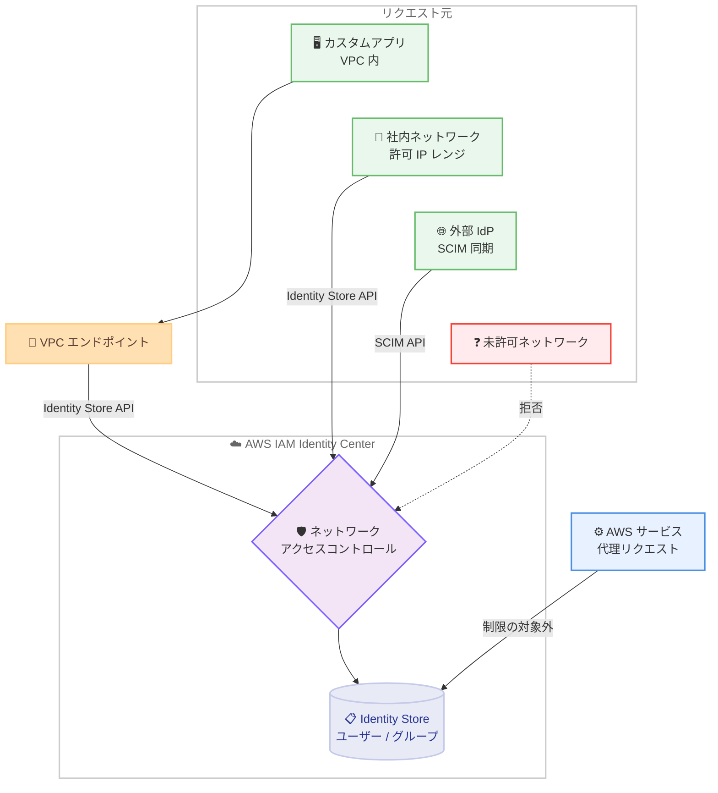

# AWS IAM Identity Center - Identity Store のネットワークアクセスコントロール

**リリース日**: 2026 年 10 月 5 日
**サービス**: AWS IAM Identity Center (Identity Store)
**機能**: Identity Store API および SCIM API に対するネットワークアクセスコントロール

📊 [このアップデートのインフォグラフィックを見る](https://takech9203.github.io/aws-news-summary/20261005-aws-identity-store-network-controls.html)

## 概要

AWS IAM Identity Center が、Identity Store へのアクセスをリクエスト元のネットワークに基づいて制限できるネットワークアクセスコントロールをサポートしました。対象となるのは、カスタムアプリケーションやプロビジョニングワークフローがユーザー・グループの管理や参照に使用する Identity Store API と、外部 ID プロバイダーがユーザー・グループの同期に使用する SCIM API の 2 つです。

Identity Store API については、自アカウントまたは AWS Organizations 組織内の許可された VPC エンドポイント経由のアクセスのみに制限したり、特定のソース VPC からのアクセスのみに制限したりできます。また、Identity Store API と SCIM API の両方について、特定の IP アドレスレンジからのアクセスのみを許可できます。API ごとに異なる制限を設定できるため、例えば Identity Store API は VPC エンドポイント経由のみに制限しつつ、SCIM API は ID プロバイダーが公開している IP レンジからのみ許可する、といった柔軟な構成が可能です。

本機能はオプションであり、デフォルトでは無効です。AWS サービスがお客様に代わって行うリクエストは制限の対象外となるため、既存の AWS サービス連携に影響を与えることなくネットワーク境界を強化できます。設定は AWS SDK または AWS CLI から Identity Store API (`UpdateIdentityStore`) を使用して行います。

**アップデート前の課題**

このアップデート以前は、Identity Store へのネットワークレベルのアクセス制御手段が限られていました。

- 以前は Identity Store API や SCIM API に対して、リクエスト元ネットワークに基づくアクセス制限を設定できなかった
- 有効な認証情報 (API の場合) や SCIM アクセストークンを持っていれば、インターネット上のどこからでも API を呼び出すことができた
- 組織のセキュリティポリシーで「ID 管理系 API は社内ネットワークからのみアクセス可能にする」といった要件を満たすには、IAM ポリシーの条件キーなどで個別に対処する必要があった

**アップデート後の改善**

今回のアップデートにより、Identity Store 自体にネットワーク境界を設定できるようになりました。

- Identity Store API へのアクセスを、許可された VPC エンドポイント (自アカウントまたは組織内) または特定のソース VPC 経由のみに制限できるようになった
- Identity Store API と SCIM API の両方について、特定の IP アドレスレンジからのアクセスのみを許可できるようになった
- API ごとに異なる制限を 1 つの設定内で定義できるようになり、ユースケースに応じた柔軟なネットワーク境界を構築できるようになった

## アーキテクチャ図



Identity Store の手前にネットワークアクセスコントロールが配置され、VPC エンドポイント・ソース VPC・IP レンジに基づいてリクエストを許可または拒否します。AWS サービスによる代理リクエストは制限の対象外です。

## サービスアップデートの詳細

### 主要機能

1. **VPC エンドポイント経由アクセスの強制 (Identity Store API)**
   - `VpceAccessRequired` を有効にすると、Identity Store API へのアクセスを VPC エンドポイント経由のみに制限できる
   - 許可される VPC エンドポイントは、自アカウント内または AWS Organizations 組織内のもの
   - パブリックインターネット経由の直接アクセスを遮断し、プライベートネットワーク境界を確立できる

2. **ソース VPC によるアクセス制限 (Identity Store API)**
   - `ApiRestrictSourceVpcs` で、アクセスを許可する特定の VPC ID のリストを指定できる
   - 指定した VPC 内のワークロードからのリクエストのみが許可される

3. **IP アドレスレンジによるアクセス制限 (Identity Store API / SCIM API)**
   - `ApiAllowSourceIps` で Identity Store API へのアクセスを許可する IP レンジ (CIDR) を指定できる
   - `ScimAllowSourceIps` で SCIM API へのアクセスを許可する IP レンジを指定できる
   - 外部 ID プロバイダー (Okta、Microsoft Entra ID など) が公開する送信元 IP レンジのみを SCIM API に許可する構成が可能

4. **API ごとに独立した制限設定**
   - Identity Store API と SCIM API に対して、1 つの設定内で異なる制限を適用できる
   - 例: Identity Store API は VPC エンドポイント経由のみ + 例外 IP レンジ、SCIM API は IdP の IP レンジのみ許可

5. **安全なデフォルトと AWS サービスの除外**
   - 本機能はオプションであり、デフォルトでは無効 (既存環境への影響なし)
   - AWS サービスがお客様に代わって実行するリクエストは制限の対象外のため、Identity Center 本体や連携サービスの動作は維持される

## 技術仕様

### NetworkConfiguration パラメータ

`UpdateIdentityStore` API の `NetworkConfiguration` オブジェクトで設定します。

| パラメータ | 型 | 説明 |
|------|------|------|
| `VpceAccessRequired` | boolean | Identity Store API へのアクセスに VPC エンドポイント経由を必須とするかどうか |
| `ApiRestrictSourceVpcs` | string のリスト | Identity Store API へのアクセスを許可するソース VPC の ID リスト |
| `ApiAllowSourceIps` | string のリスト | Identity Store API へのアクセスを許可する IP レンジ (CIDR) のリスト |
| `ScimAllowSourceIps` | string のリスト | SCIM API へのアクセスを許可する IP レンジ (CIDR) のリスト |

**重要な動作仕様**: `NetworkConfiguration` をリクエストに含めると、既存のネットワーク設定は指定した値で**完全に置き換え**られます。省略した値はクリアされるため、設定を維持・変更する場合は、必要な値の完全なセットをリクエストに含める必要があります。リストをクリアするにはそのリストを省略します (空のリストは受け付けられません)。

### API 変更履歴

| 日付 | サービス | 変更内容 |
|------|----------|----------|
| 2026/09/29 | [AWS SSO Identity Store](https://awsapichanges.com/archive/changes/e9bb16-identitystore.html) | 3 new 17 updated api methods - ネットワークアクセスコントロール、リソースリビジョンによる楽観的ロック、リクエスト識別子としてのリソース ARN サポートの追加 |

### 設定例

```json
{
    "IdentityStoreId": "d-1234567890",
    "NetworkConfiguration": {
        "VpceAccessRequired": true,
        "ApiRestrictSourceVpcs": ["vpc-0a1b2c3d4e5f67890"],
        "ApiAllowSourceIps": ["203.0.113.0/24"],
        "ScimAllowSourceIps": ["0.0.0.0/0"]
    }
}
```

この例では、VPC エンドポイント経由のアクセスを必須とし、Identity Store API へのアクセスを単一の VPC に制限 (IP アドレスによる例外付き) しつつ、SCIM トラフィックは任意の IP アドレスから許可しています。

## 設定方法

### 前提条件

1. AWS IAM Identity Center が有効化されており、Identity Store ID (例: `d-1234567890`) を把握していること
2. `identitystore:UpdateIdentityStore` を実行できる IAM 権限を持っていること
3. VPC エンドポイント経由の制限を使用する場合、Identity Store 用の VPC エンドポイントが作成済みであること
4. AWS CLI または AWS SDK の最新バージョンを使用していること

### 手順

#### ステップ1: 現在の Identity Store ID を確認

```bash
aws sso-admin list-instances \
  --query "Instances[0].IdentityStoreId" \
  --output text
```

IAM Identity Center インスタンスの一覧から Identity Store ID を取得しています。以降の手順でこの ID を使用します。

#### ステップ2: ネットワークアクセスコントロールを設定

```bash
aws identitystore update-identity-store \
  --identity-store-id d-1234567890 \
  --network-configuration '{
    "VpceAccessRequired": true,
    "ApiRestrictSourceVpcs": ["vpc-0a1b2c3d4e5f67890"],
    "ApiAllowSourceIps": ["203.0.113.0/24"],
    "ScimAllowSourceIps": ["198.51.100.0/24"]
  }'
```

`UpdateIdentityStore` API を呼び出し、Identity Store API へのアクセスを VPC エンドポイント経由かつ指定 VPC または指定 IP レンジに制限し、SCIM API へのアクセスを ID プロバイダーの IP レンジのみに制限しています。`NetworkConfiguration` は完全置き換えのため、維持したい値をすべて含める点に注意してください。

#### ステップ3: 動作確認

```bash
# 許可されたネットワーク (例: 指定 VPC 内の EC2) から実行 → 成功することを確認
aws identitystore list-users --identity-store-id d-1234567890

# 許可されていないネットワークから実行 → アクセス拒否されることを確認
aws identitystore list-users --identity-store-id d-1234567890
```

許可されたネットワークからのリクエストが成功し、許可されていないネットワークからのリクエストが拒否されることを確認しています。本番適用前に、既存のプロビジョニングワークフローやカスタムアプリケーションのアクセス元を棚卸しし、必要な経路がすべて許可されていることを検証してください。

## メリット

### ビジネス面

- **コンプライアンス要件への対応**: 「ID 管理系 API は信頼されたネットワークからのみアクセス可能にする」といった社内セキュリティポリシーや規制要件を、サービスネイティブな機能で満たせる
- **ID 基盤の攻撃対象領域の縮小**: 認証情報が漏洩した場合でも、許可されていないネットワークからの API アクセスを遮断できるため、被害を限定できる
- **段階的な導入が可能**: オプション機能でデフォルト無効のため、既存環境に影響を与えずに計画的に導入できる

### 技術面

- **API ごとの柔軟な制御**: Identity Store API と SCIM API に異なるネットワーク制限を適用でき、カスタムアプリと外部 IdP 同期という異なるユースケースに最適化できる
- **多層防御の実現**: IAM ポリシーによる認可に加えて、VPC エンドポイント・ソース VPC・IP レンジによるネットワーク層の制御を重ねられる
- **AWS サービス連携への無影響**: AWS サービスによる代理リクエストは制限の対象外のため、IAM Identity Center 本体や連携サービスの動作を損なわない

## デメリット・制約事項

### 制限事項

- 設定は AWS SDK / AWS CLI 経由の Identity Store API (`UpdateIdentityStore`) で行う必要がある (発表時点でコンソールでの設定手順は案内されていない)
- `NetworkConfiguration` は完全置き換え方式のため、部分更新ができない (省略した値はクリアされる)
- リストをクリアするには省略が必要で、空のリストは受け付けられない
- VPC エンドポイント / ソース VPC による制限は Identity Store API のみが対象で、SCIM API は IP レンジによる制限のみ

### 考慮すべき点

- 制限を有効化する前に、Identity Store API を利用するすべてのアプリケーション・スクリプト・プロビジョニングワークフローのアクセス元ネットワークを棚卸しする必要がある
- SCIM API を IP レンジで制限する場合、外部 ID プロバイダーが公開する送信元 IP レンジの変更に追従する運用が必要になる
- 設定ミスにより正規のワークロードがアクセス拒否される可能性があるため、検証環境または影響の少ない時間帯での段階的な適用が望ましい

## ユースケース

### ユースケース1: 社内 ID 管理アプリを VPC 内に閉じる

**シナリオ**: 人事システムと連携したユーザー・グループ管理アプリケーションを VPC 内で運用しており、Identity Store API へのアクセスをプライベートネットワーク経由のみに限定したい。

**実装例**:
```json
{
    "IdentityStoreId": "d-1234567890",
    "NetworkConfiguration": {
        "VpceAccessRequired": true,
        "ApiRestrictSourceVpcs": ["vpc-0a1b2c3d4e5f67890"]
    }
}
```

**効果**: Identity Store API へのアクセスが指定 VPC の VPC エンドポイント経由のみに限定され、インターネット経由のアクセスを遮断。認証情報の漏洩時にも外部からの悪用を防止できる。

### ユースケース2: 外部 IdP の SCIM 同期を IdP の公開 IP レンジに限定

**シナリオ**: Microsoft Entra ID や Okta から SCIM によるユーザー・グループの自動プロビジョニングを行っており、SCIM エンドポイントへのアクセスを IdP の公開 IP レンジのみに制限したい。

**実装例**:
```json
{
    "IdentityStoreId": "d-1234567890",
    "NetworkConfiguration": {
        "ScimAllowSourceIps": ["198.51.100.0/24", "198.51.101.0/24"]
    }
}
```

**効果**: SCIM アクセストークンが漏洩しても、IdP の公開 IP レンジ以外からの SCIM API 呼び出しは拒否されるため、不正なユーザー作成・変更のリスクを低減できる。

### ユースケース3: API ごとに異なるネットワーク境界を適用

**シナリオ**: カスタムアプリは VPC 経由のみ、運用チームの管理スクリプトは社内ネットワークの固定 IP から、SCIM 同期は IdP の IP レンジから、という複合要件がある。

**実装例**:
```json
{
    "IdentityStoreId": "d-1234567890",
    "NetworkConfiguration": {
        "VpceAccessRequired": true,
        "ApiRestrictSourceVpcs": ["vpc-0a1b2c3d4e5f67890"],
        "ApiAllowSourceIps": ["203.0.113.0/24"],
        "ScimAllowSourceIps": ["198.51.100.0/24"]
    }
}
```

**効果**: 1 つの設定で API ごとに異なるネットワーク制限を適用でき、各ユースケースに最適化されたゼロトラスト志向のアクセス制御を実現できる。

## 料金

AWS IAM Identity Center は追加料金なしで利用でき、ネットワークアクセスコントロール機能自体にも追加料金は発生しません。なお、VPC エンドポイント (AWS PrivateLink) を使用する場合は、インターフェイスエンドポイントの時間料金とデータ処理料金が別途発生します。

## 利用可能リージョン

AWS IAM Identity Center が利用可能なすべての AWS リージョンで利用できます。

## 関連サービス・機能

- **AWS IAM Identity Center**: Identity Store はその基盤となるユーザー・グループのディレクトリであり、本機能は Identity Center のセキュリティ境界を強化する
- **AWS PrivateLink (VPC エンドポイント)**: Identity Store API への VPC エンドポイント経由アクセスの強制に使用する
- **AWS Organizations**: 組織内の VPC エンドポイントを許可対象とする構成で連携する
- **SCIM 対応 ID プロバイダー (Microsoft Entra ID、Okta など)**: SCIM API による自動プロビジョニングの送信元として、IP レンジ制限の対象となる

## 参考リンク

- 📊 [インフォグラフィック](https://takech9203.github.io/aws-news-summary/20261005-aws-identity-store-network-controls.html)
- [公式発表 (What's New)](https://aws.amazon.com/about-aws/whats-new/2026/10/aws-identity-store-network-controls/)
- [UpdateIdentityStore API リファレンス](https://docs.aws.amazon.com/singlesignon/latest/IdentityStoreAPIReference/API_UpdateIdentityStore.html)
- [AWS IAM Identity Center 製品ページ](https://aws.amazon.com/iam/identity-center/)

## まとめ

Identity Store のネットワークアクセスコントロールにより、組織の ID 基盤である Identity Store API と SCIM API に対してネットワーク層の防御を追加できるようになりました。認証情報の漏洩に備えた多層防御として非常に有効な機能であるため、まずは Identity Store API を利用しているアプリケーションと SCIM 同期のアクセス元を棚卸しし、検証環境で `UpdateIdentityStore` による制限の適用を試すことを推奨します。
