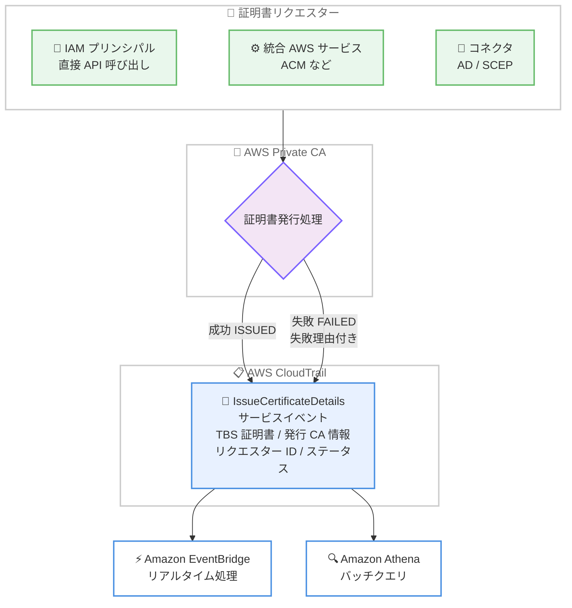

# AWS Private CA - 詳細な証明書発行ログの提供開始

**リリース日**: 2026 年 10 月 5 日
**サービス**: AWS Private Certificate Authority (AWS Private CA)
**機能**: CloudTrail サービスイベント IssueCertificateDetails による詳細な証明書発行ログ

📊 [このアップデートのインフォグラフィックを見る](https://takech9203.github.io/aws-news-summary/20261005-aws-private-ca-certificate-issuance-logs.html)

## 概要

AWS Private CA が、詳細な証明書発行ログを提供開始しました。新しい CloudTrail サービスイベント `IssueCertificateDetails` が、すべての証明書発行試行について、完全な証明書コンテンツ、発行 CA 情報、リクエスター ID、署名ステータスを記録します。

イベントには、完全な TBS (to-be-signed) 証明書 (すべての X.509 フィールドと拡張を含む base64 エンコードされた DER 形式) に加えて、subject、issuer、シリアル番号、有効期間、テンプレート、署名アルゴリズムなどの便利フィールドが含まれます。イベントは成功・失敗の両方で発行され、名前制約違反などの署名前の失敗についても失敗理由付きで記録されます。CloudTrail 管理イベントとして自動配信されるため、設定やオプトインは不要で、CloudTrail の標準料金以外の追加コストもかかりません。

コンプライアンス監査、証明書インベントリの構築、署名アルゴリズム移行の追跡、発行失敗の監視など、PKI 運用の可視性を大幅に向上させるアップデートであり、Private CA を利用するすべてのセキュリティチームと PKI 管理者に有用です。

**アップデート前の課題**

- 従来の `IssueCertificate` API の CloudTrail 管理イベントは、API 呼び出しの成功と証明書 ARN を記録するのみで、証明書の内容や発行 CA の詳細は含まれなかった
- 署名前に発生した失敗 (名前制約違反など) は記録されず、失敗原因の調査が困難だった
- 発行済み証明書の内容を監査するには、`GetCertificate` API の呼び出しや監査レポートの生成など、別途の仕組みが必要だった

**アップデート後の改善**

- すべての発行試行について、完全な TBS 証明書と発行メタデータが CloudTrail に自動記録されるようになった
- 署名前の失敗を含む失敗イベントが、`statusReason` フィールドによる失敗理由付きで記録されるようになった
- 設定不要・追加コストなしで、EventBridge によるリアルタイム処理や Athena によるバッチクエリが可能になった

## アーキテクチャ図



証明書発行試行が完了 (成功または失敗) するたびに、AWS Private CA が `IssueCertificateDetails` イベントを CloudTrail に自動発行します。EventBridge でリアルタイム処理したり、Athena でバッチクエリしたりできます。

## サービスアップデートの詳細

### 主要機能

1. **完全な証明書コンテンツの記録**
   - TBS (to-be-signed) 証明書を base64 エンコードされた DER 形式で記録し、すべての X.509 フィールドと拡張を含む
   - subject、issuer 名、シリアル番号、有効期間 (notBefore / notAfter)、テンプレート ARN、署名アルゴリズムの便利フィールドを提供
   - 発行 CA の名前、Authority Key Identifier、CA 証明書シリアル番号も記録

2. **成功・失敗両方のイベント発行**
   - `status` フィールドが `ISSUED` または `FAILED` の終端状態に達した時点でイベントを記録
   - 名前制約違反などの署名前の失敗も、`statusReason` フィールドによる失敗理由付きで記録
   - 失敗時は有効期間フィールドが省略され、TBS 証明書関連フィールドは TBS 証明書生成後の失敗の場合のみ含まれる

3. **リクエスターの識別**
   - 直接の API 呼び出しの場合は、リクエスターのアカウント ID (`requesterAccountId`) と IAM プリンシパルの ARN (`requesterArn`) を記録
   - コネクタや統合 AWS サービス経由の場合は、サービスプリンシパル (`requesterServicePrincipal`、例: acm.amazonaws.com) を記録
   - 共有 CA (クロスアカウント構成) で発行された場合、イベントは CA 所有者アカウントに配信される (ドキュメントによると、リクエスターアカウントにも配信される)

4. **設定不要の自動配信**
   - CloudTrail 管理イベント (`eventType: AwsServiceEvent`) として自動配信され、設定やオプトインは不要
   - CloudTrail の標準料金以外の追加コストなし
   - EventBridge によるリアルタイム処理、Athena によるバッチクエリに対応

## 技術仕様

### serviceEventDetails の主なフィールド

| フィールド | 説明 |
|------|------|
| `tbsCertificate` | TBS 証明書の base64 エンコードされた DER 表現。発行された証明書と同じ情報を含む |
| `issuerName` / `issuerAuthorityKeyIdentifier` / `issuerSerialNumber` | 発行 CA の識別名、Authority Key Identifier、CA 証明書シリアル番号 |
| `subject` | 証明書サブジェクトの識別名 (DN) |
| `serialNumber` | 証明書のシリアル番号 (コロン区切りの 16 進数) |
| `notBefore` / `notAfter` / `issuedAt` | 有効期間の開始・終了、発行時刻 (ISO 8601 形式)。発行失敗時は省略 |
| `templateArn` | 発行に使用された証明書テンプレートの ARN |
| `signingAlgorithm` | 署名アルゴリズム (例: ECDSAWITHSHA256、SHA256WITHRSA) |
| `status` | 発行結果。`ISSUED` または `FAILED` (終端状態のみでイベントを記録) |
| `statusReason` | 失敗理由。失敗理由が利用可能な場合のみ含まれる |
| `requesterAccountId` / `requesterArn` | リクエスターのアカウント ID と ARN。AWS サービス経由でない場合のみ |
| `requesterServicePrincipal` | リクエスト元の AWS サービスプリンシパル。AWS サービス経由の場合のみ |

**注意**: 一部の証明書発行は AWS 内部プロセスに起因するため、`requesterAccountId`、`requesterArn`、`requesterServicePrincipal` のいずれも含まれない場合があります。

### イベント例 (成功時の抜粋)

```json
{
    "eventSource": "acm-pca.amazonaws.com",
    "eventName": "IssueCertificateDetails",
    "eventType": "AwsServiceEvent",
    "managementEvent": true,
    "serviceEventDetails": {
        "tbsCertificate": "MIIBZaADAgECAhAamOsDIwCWYN...",
        "issuerName": "CN=Example Intermediate CA",
        "subject": "CN=www.example.com",
        "serialNumber": "1A:98:EB:03:23:00:96:60:DF:F8:1A:C7:9A:B4:53:9E",
        "notBefore": "2026-08-10T14:27:20Z",
        "notAfter": "2026-08-17T15:27:20Z",
        "templateArn": "arn:aws:acm-pca:::template/EndEntityCertificate/V1",
        "signingAlgorithm": "ECDSAWITHSHA256",
        "status": "ISSUED"
    },
    "eventCategory": "Management"
}
```

失敗時は `status` が `FAILED` となり、`statusReason` に失敗原因 (例: `Name Constraints violation: DNS name not found in a permitted subtree.`) が記録されます。

## 設定方法

### 前提条件

1. AWS Private CA でプライベート CA を運用していること
2. イベント履歴以外で継続的にログを保存・分析する場合は、CloudTrail の証跡 (trail) を作成済みであること
3. Athena でクエリする場合は、証跡の S3 バケットに対するテーブル定義があること

### 手順

#### ステップ 1: イベントの確認

```bash
aws cloudtrail lookup-events \
  --lookup-attributes AttributeKey=EventName,AttributeValue=IssueCertificateDetails \
  --max-results 10
```

CloudTrail のイベント履歴から `IssueCertificateDetails` イベントを検索します。本イベントは自動配信されるため、Private CA 側の設定変更は不要です。

#### ステップ 2: EventBridge ルールの作成 (リアルタイム処理)

```bash
aws events put-rule \
  --name private-ca-issuance-failures \
  --event-pattern '{
    "source": ["aws.acm-pca"],
    "detail-type": ["AWS Service Event via CloudTrail"],
    "detail": {
      "eventName": ["IssueCertificateDetails"],
      "serviceEventDetails": {
        "status": ["FAILED"]
      }
    }
  }'
```

発行失敗イベントのみを捕捉する EventBridge ルールを作成します。ターゲットに SNS トピックや Lambda 関数を設定することで、失敗発生時の即時通知や自動対応が可能です。

#### ステップ 3: Athena によるバッチクエリ

```sql
SELECT
  json_extract_scalar(serviceeventdetails, '$.subject') AS subject,
  json_extract_scalar(serviceeventdetails, '$.signingAlgorithm') AS signing_algorithm,
  json_extract_scalar(serviceeventdetails, '$.status') AS status,
  eventtime
FROM cloudtrail_logs
WHERE eventsource = 'acm-pca.amazonaws.com'
  AND eventname = 'IssueCertificateDetails'
ORDER BY eventtime DESC;
```

CloudTrail ログに対する Athena テーブルを使用して、発行された証明書のインベントリや署名アルゴリズムの利用状況を集計します。

## メリット

### ビジネス面

- **コンプライアンス監査の効率化**: すべての証明書発行が内容付きで自動記録されるため、監査証跡の収集・提出が容易になる
- **追加コストなし**: CloudTrail の標準料金以外の費用が発生せず、設定作業も不要なため、導入障壁が低い
- **インシデント対応の迅速化**: 不正または想定外の証明書発行をリクエスター情報付きで即座に検知できる

### 技術面

- **完全な証明書内容の記録**: TBS 証明書によりすべての X.509 フィールドと拡張を事後検証でき、`GetCertificate` の追加呼び出しが不要になる
- **失敗の可視化**: 従来記録されなかった署名前の失敗 (名前制約違反など) も失敗理由付きで記録され、トラブルシューティングが容易になる
- **既存の分析基盤との統合**: EventBridge、Athena、S3、CloudWatch Logs など、CloudTrail の既存エコシステムをそのまま活用できる

## デメリット・制約事項

### 制限事項

- 失敗イベントでは、TBS 証明書生成前に失敗した場合、`tbsCertificate`、`subject`、`issuerName` などのフィールドが含まれない
- `statusReason` フィールドは失敗理由が利用可能な場合のみ含まれ、すべての失敗イベントに存在するとは限らない
- AWS 内部プロセスに起因する発行では、リクエスター関連フィールドが一切含まれない場合がある
- イベントは発行が終端状態 (`ISSUED` / `FAILED`) に達した後にのみ記録されるため、処理中の証明書の状態確認には `GetCertificate` API が必要

### 考慮すべき点

- 中間サービス経由の発行では `userIdentity` に中間サービスの IAM アイデンティティが記録されるため、元のリクエスターを追跡するにはセッションタグや Source Identity の活用が必要
- 証明書の完全なポイントインタイムインベントリ (失効状態を含む) が必要な場合は、引き続き Private CA の監査レポート機能を使用する
- イベント履歴以外での長期保存・分析には CloudTrail 証跡の作成が必要であり、S3 ストレージコストなどが発生する

## ユースケース

### ユースケース 1: 署名アルゴリズム移行の追跡

**シナリオ**: 組織全体で RSA から ECDSA への署名アルゴリズム移行を進めており、進捗を定量的に把握したい。

**実装例**:
```sql
SELECT
  json_extract_scalar(serviceeventdetails, '$.signingAlgorithm') AS algorithm,
  COUNT(*) AS issuance_count
FROM cloudtrail_logs
WHERE eventname = 'IssueCertificateDetails'
  AND json_extract_scalar(serviceeventdetails, '$.status') = 'ISSUED'
GROUP BY 1;
```

**効果**: アルゴリズム別の発行件数を定期的に集計し、移行の進捗と残存するレガシーアルゴリズムの利用元を特定できる。

### ユースケース 2: 発行失敗のリアルタイム監視

**シナリオ**: 名前制約違反やポリシー違反による証明書発行の失敗を即座に検知し、設定ミスや不正な発行試行に対応したい。

**実装例**:
```
EventBridge ルール (status: FAILED でフィルタ)
  → SNS トピック (セキュリティチームへ通知)
  → Lambda 関数 (statusReason を解析してチケット起票)
```

**効果**: 従来は記録されなかった署名前の失敗を失敗理由付きで即時検知し、証明書発行が失敗し続けることによるワークロード障害を未然に防止できる。

### ユースケース 3: クロスアカウント環境でのコンプライアンス監査

**シナリオ**: 共有 CA を複数アカウントに公開しており、CA 所有者としてどのアカウント・プリンシパルがどのような証明書を発行したかを一元的に監査したい。

**実装例**:
```sql
SELECT
  json_extract_scalar(serviceeventdetails, '$.requesterAccountId') AS requester_account,
  json_extract_scalar(serviceeventdetails, '$.requesterArn') AS requester_arn,
  json_extract_scalar(serviceeventdetails, '$.subject') AS subject,
  json_extract_scalar(serviceeventdetails, '$.templateArn') AS template
FROM cloudtrail_logs
WHERE eventname = 'IssueCertificateDetails';
```

**効果**: CA 所有者アカウントに配信されるイベントを集約することで、クロスアカウントの発行アクティビティをリクエスター情報付きで一元監査できる。

## 料金

本機能に追加料金はありません。`IssueCertificateDetails` イベントは CloudTrail 管理イベントとして配信され、CloudTrail の標準料金以外のコストは発生しません。

なお、証跡による S3 への配信、Athena クエリ、EventBridge ターゲットの実行には、それぞれのサービスの標準料金が適用されます。

## 利用可能リージョン

AWS Private CA が提供されるすべての AWS リージョンで利用可能です。

## 関連サービス・機能

- **AWS CloudTrail**: 本イベントの配信基盤。管理イベントとして自動記録され、証跡により S3 や CloudWatch Logs へ継続配信できる
- **Amazon EventBridge**: `IssueCertificateDetails` イベントのリアルタイム処理。失敗検知や自動対応のトリガーとして利用
- **Amazon Athena**: CloudTrail ログに対するバッチクエリ。証明書インベントリやアルゴリズム利用状況の集計に利用
- **AWS Certificate Manager (ACM)**: ACM 経由で Private CA から発行された証明書も、サービスプリンシパル (acm.amazonaws.com) 付きで記録される
- **Private CA 監査レポート**: 失効状態を含む証明書のポイントインタイムインベントリが必要な場合の補完機能

## 参考リンク

- 📊 [インフォグラフィック](https://takech9203.github.io/aws-news-summary/20261005-aws-private-ca-certificate-issuance-logs.html)
- [公式発表 (What's New)](https://aws.amazon.com/about-aws/whats-new/2026/10/aws-private-ca-certificate-issuance-logs/)
- [ドキュメント: AWS Private CA サービスイベント](https://docs.aws.amazon.com/privateca/latest/userguide/logging-using-cloudtrail-pca.html#pca-service-events)
- [ドキュメント: CloudTrail による AWS Private CA API 呼び出しのログ記録](https://docs.aws.amazon.com/privateca/latest/userguide/logging-using-cloudtrail-pca.html)
- [料金ページ (AWS CloudTrail)](https://aws.amazon.com/cloudtrail/pricing/)

## まとめ

AWS Private CA の証明書発行が、完全な証明書内容、発行 CA 情報、リクエスター ID、失敗理由とともに CloudTrail に自動記録されるようになり、PKI 運用の可視性が大幅に向上しました。設定不要・追加コストなしで即座に利用できるため、Private CA を利用している組織は、まず CloudTrail イベント履歴で `IssueCertificateDetails` イベントを確認し、発行失敗の EventBridge 監視や Athena による証明書インベントリの整備を検討することを推奨します。
