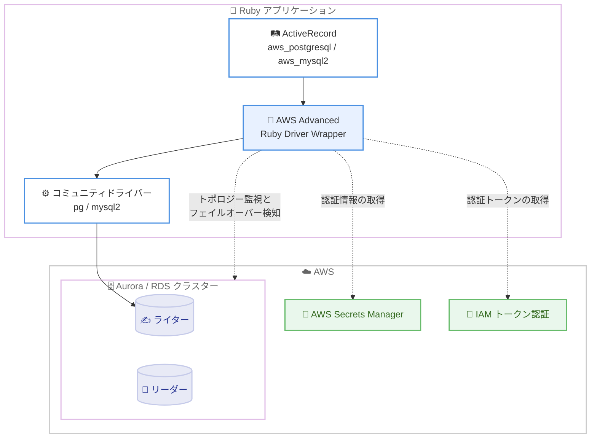

# AWS Advanced Ruby Driver Wrapper - 一般提供開始

**リリース日**: 2026 年 10 月 5 日
**サービス**: Amazon RDS / Amazon Aurora
**機能**: AWS Advanced Ruby Driver Wrapper の一般提供 (GA)

📊 [このアップデートのインフォグラフィックを見る](https://takech9203.github.io/aws-news-summary/20261005-aws-ruby-driver-wrapper-available.html)

## 概要

AWS Advanced Ruby Driver Wrapper が一般提供 (GA) になりました。これは、Amazon RDS および Amazon Aurora の PostgreSQL/MySQL 互換データベースに接続する Ruby アプリケーション向けのオープンソースデータベースドライバーラッパーです。コミュニティで広く利用されている pg (PostgreSQL 用) および mysql2 (MySQL 用) ドライバーの上に構築されており、既存のドライバーを置き換えるのではなく拡張する形で AWS 固有の機能を提供します。

このラッパーは、RDS Blue/Green デプロイのスイッチオーバー、Aurora Global Database のスイッチオーバー、およびデータベースフェイルオーバーにかかる時間を短縮し、アプリケーションの可用性を向上させます。クラスターのステータスを監視し、予期しない障害によるフェイルオーバー発生時には、新しく昇格したライターインスタンスへ迅速に接続します。

ActiveRecord とは aws_postgresql / aws_mysql2 アダプター経由でシームレスに統合できるため、Ruby on Rails アプリケーションではデータベース設定のアダプター名を変更するだけで導入でき、アプリケーションコードの変更は不要です。Apache 2.0 ライセンスのオープンソースとして GitHub で公開されています。

**アップデート前の課題**

- Ruby アプリケーションでは、Aurora のフェイルオーバー時に DNS 伝播を待つ必要があり、新しいライターへの再接続に時間がかかっていた
- JDBC、Python、NodeJS、Go、.NET、ODBC には AWS Advanced Driver Wrapper が提供されていたが、Ruby 向けの公式ラッパーは存在しなかった
- IAM 認証や AWS Secrets Manager 連携を利用するには、アプリケーション側で独自にトークン取得やシークレット取得のロジックを実装する必要があった
- Blue/Green デプロイや Global Database スイッチオーバーの際、クライアント側で接続断からの復旧が遅れ、ダウンタイムが長くなる可能性があった

**アップデート後の改善**

- クラスタートポロジーをキャッシュして DNS 解決を回避し、フェイルオーバー時に新しいライターへ迅速に再接続できるようになった
- RDS Blue/Green スイッチオーバーおよび Aurora Global Database スイッチオーバーの所要時間が短縮され、アプリケーションの可用性が向上した
- AWS Secrets Manager 認証と IAM トークンベース認証がプラグインとして組み込みでサポートされ、独自実装が不要になった
- aws_postgresql / aws_mysql2 アダプターにより、ActiveRecord を使用するアプリケーションはコード変更なしで導入できるようになった

## アーキテクチャ図



ラッパーは ActiveRecord とコミュニティドライバーの間に位置し、クラスタートポロジーの監視、フェイルオーバー時の迅速な再接続、AWS 認証機能の統合を担います。

## サービスアップデートの詳細

### 主要機能

1. **高速フェイルオーバー**
   - クラスタートポロジーをキャッシュし、DNS 解決を経由せずに新しいライターインスタンスへ直接再接続
   - 予期しない障害によるフェイルオーバー時のダウンタイムを短縮
   - Aurora Global Database のスイッチオーバーにも対応し、リージョン間フェイルオーバーを高速化

2. **Blue/Green デプロイのサポート**
   - RDS Blue/Green デプロイのスイッチオーバー時間を短縮
   - スイッチオーバーを検知し、新しい環境への接続切り替えを最小限のダウンタイムで実行

3. **AWS 認証の組み込みサポート**
   - IAM トークンベース認証: パスワードの代わりに短期間有効な IAM トークンで接続
   - AWS Secrets Manager 認証: データベース認証情報を Secrets Manager から自動取得
   - 注意: iam プラグインと secrets_manager プラグインは同時に有効化できない (PluginConflictError が発生)

4. **ActiveRecord とのシームレスな統合**
   - aws_postgresql / aws_mysql2 アダプターを提供
   - database.yml のアダプター名を変更するだけで導入可能で、アプリケーションコードの書き換えは不要

5. **プラグインアーキテクチャ**
   - 必要な機能のみを選択して読み込むモジュラー設計
   - Custom Endpoint、Initial Connection Strategy、AWS KMS によるカラムレベル暗号化などのプラグインも提供

## 技術仕様

### 基本情報

| 項目 | 詳細 |
|------|------|
| 対象データベース | Amazon RDS / Amazon Aurora の PostgreSQL および MySQL 互換データベース |
| ベースドライバー | pg (PostgreSQL)、mysql2 (MySQL) |
| ActiveRecord アダプター | aws_postgresql、aws_mysql2 |
| 認証方式 | 標準認証、IAM トークンベース認証、AWS Secrets Manager 認証 |
| 主要プラグイン | Failover、Global Database Failover、Blue/Green Deployment、IAM、Secrets Manager、Custom Endpoint、KMS 暗号化 |
| ライセンス | Apache 2.0 (オープンソース) |
| 配布形態 | RubyGems (aws_advanced_ruby_driver_wrapper) |

### Gemfile の設定例

```ruby
# Gemfile
gem 'aws_advanced_ruby_driver_wrapper'
gem 'pg'       # PostgreSQL の場合
# gem 'mysql2' # MySQL の場合
```

## 設定方法

### 前提条件

1. Amazon RDS または Amazon Aurora の PostgreSQL/MySQL 互換データベースクラスターが存在すること
2. Ruby アプリケーションが pg または mysql2 ドライバーを使用していること
3. IAM 認証を使用する場合は、データベース側で IAM 認証が有効化され、適切な IAM ポリシーが設定されていること

### 手順

#### ステップ 1: Gem のインストール

```bash
bundle add aws_advanced_ruby_driver_wrapper
bundle install
```

ラッパーの Gem をプロジェクトに追加してインストールします。ベースとなる pg または mysql2 の Gem も必要です。

#### ステップ 2: ラッパーの読み込み

```ruby
# PostgreSQL の場合
require 'aws_advanced_ruby_driver_wrapper/postgresql'

# MySQL の場合
require 'aws_advanced_ruby_driver_wrapper/mysql'
```

アプリケーションでラッパーを読み込みます。これにより aws_postgresql / aws_mysql2 アダプターが利用可能になります。

#### ステップ 3: database.yml のアダプター変更

```yaml
production:
  adapter: aws_postgresql
  host: my-cluster.cluster-xxxx.us-east-1.rds.amazonaws.com
  database: mydb
  username: admin
```

既存の postgresql / mysql2 アダプターを aws_postgresql / aws_mysql2 に変更します。アプリケーションコードの変更は不要で、この設定変更のみでフェイルオーバー高速化などの機能が有効になります。

## メリット

### ビジネス面

- **アプリケーション可用性の向上**: フェイルオーバーやスイッチオーバー時のダウンタイムが短縮され、エンドユーザーへの影響を最小化できる
- **導入コストの低さ**: アダプター名の変更のみで導入でき、既存の Rails アプリケーションへの移行コストがほぼ発生しない
- **オープンソース**: Apache 2.0 ライセンスで無償利用でき、コミュニティへの貢献や内部での検証も容易

### 技術面

- **DNS 依存の排除**: クラスタートポロジーのキャッシュにより、DNS 伝播を待たずに新しいライターへ接続できる
- **セキュリティ強化**: IAM トークン認証や Secrets Manager 連携により、パスワードのハードコーディングを回避できる
- **他言語との一貫性**: JDBC、Python、NodeJS、Go、.NET、ODBC の AWS Advanced Driver Wrapper ファミリーと同様の機能セットを Ruby でも利用できる

## デメリット・制約事項

### 制限事項

- iam プラグインと secrets_manager プラグインは相互排他であり、両方を同時に有効化すると PluginConflictError が発生する
- Blue/Green Deployment プラグインは特定のメタデータテーブルを必要とし、対応するデータベースエンジンバージョンに制約がある
- ベースドライバーとして pg または mysql2 が必要であり、他の Ruby データベースドライバーには対応していない

### 考慮すべき点

- 本番環境への導入前に、フェイルオーバーテストを実施して動作を検証することが推奨される
- プラグインアーキテクチャのため、必要な機能に応じたプラグイン設定の理解が必要
- GA 直後のため、利用する Ruby バージョンやフレームワークバージョンとの互換性を GitHub リポジトリのドキュメントで確認することが望ましい

## ユースケース

### ユースケース 1: Rails アプリケーションの Aurora フェイルオーバー高速化

**シナリオ**: Aurora PostgreSQL を使用する Ruby on Rails の EC サイトで、フェイルオーバー時の接続断による機会損失を最小化したい。

**実装例**:
```yaml
production:
  adapter: aws_postgresql
  host: shop-cluster.cluster-xxxx.ap-northeast-1.rds.amazonaws.com
  database: shop_production
  username: app_user
```

**効果**: フェイルオーバー時に DNS 伝播を待たず新しいライターへ再接続し、サービス中断時間を短縮できる。

### ユースケース 2: Blue/Green デプロイによる安全なデータベースアップグレード

**シナリオ**: RDS MySQL のメジャーバージョンアップグレードを、アプリケーションのダウンタイムを最小限に抑えて実施したい。

**実装例**:
```ruby
require 'aws_advanced_ruby_driver_wrapper/mysql'
# database.yml で adapter: aws_mysql2 を指定し
# Blue/Green Deployment プラグインを有効化
```

**効果**: Blue/Green スイッチオーバーをラッパーが検知し、新環境への接続切り替えを迅速に行うことで、アップグレード時のダウンタイムを短縮できる。

### ユースケース 3: Secrets Manager によるパスワードレス運用

**シナリオ**: データベース認証情報をコードや設定ファイルに保持せず、ローテーションにも自動追従したい。

**実装例**:
```yaml
production:
  adapter: aws_postgresql
  host: app-cluster.cluster-xxxx.ap-northeast-1.rds.amazonaws.com
  database: app_production
  # Secrets Manager プラグインを有効化し
  # シークレット ID を指定して認証情報を自動取得
```

**効果**: 認証情報の管理が Secrets Manager に一元化され、ローテーション時のアプリケーション再設定が不要になる。

## 料金

AWS Advanced Ruby Driver Wrapper 自体は Apache 2.0 ライセンスのオープンソースソフトウェアであり、無償で利用できます。接続先の Amazon RDS / Amazon Aurora、および AWS Secrets Manager や AWS KMS などの連携サービスの利用料金は通常どおり発生します。

## 利用可能リージョン

クライアントサイドのライブラリであるため、リージョンの制約はありません。Amazon RDS および Amazon Aurora が利用可能なすべてのリージョンで使用できます。

## 関連サービス・機能

- **Amazon Aurora**: フェイルオーバー、Global Database スイッチオーバーの高速化の主な対象となるデータベースサービス
- **Amazon RDS**: Blue/Green デプロイのスイッチオーバー高速化の対象となるマネージドデータベースサービス
- **AWS Secrets Manager**: データベース認証情報の安全な保管と自動取得に使用
- **AWS IAM**: トークンベースのデータベース認証に使用
- **AWS Advanced Driver Wrapper ファミリー**: JDBC、Python、NodeJS、Go、.NET、ODBC 向けにも同様のラッパーが提供されている

## 参考リンク

- 📊 [インフォグラフィック](https://takech9203.github.io/aws-news-summary/20261005-aws-ruby-driver-wrapper-available.html)
- [公式発表 (What's New)](https://aws.amazon.com/about-aws/whats-new/2026/10/aws-ruby-driver-wrapper-available/)
- [GitHub リポジトリ](https://github.com/aws/aws-advanced-ruby-driver-wrapper)
- [Amazon RDS](https://aws.amazon.com/rds/)
- [Amazon Aurora](https://aws.amazon.com/rds/aurora/)

## まとめ

AWS Advanced Ruby Driver Wrapper の GA により、Ruby アプリケーションでも他言語と同様に Aurora/RDS のフェイルオーバー高速化、Blue/Green スイッチオーバー対応、IAM/Secrets Manager 認証が利用できるようになりました。ActiveRecord のアダプター名を変更するだけで導入できるため、Aurora や RDS を利用する Rails アプリケーションでは、まず検証環境でフェイルオーバーテストを実施し、導入を検討することを推奨します。
