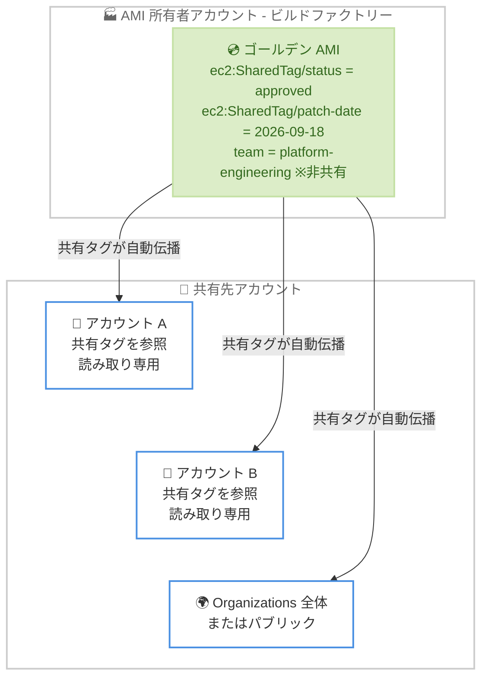

# Amazon EC2 - AMI 共有タグ (Shared Tags for Amazon Machine Images)

**リリース日**: 2026 年 10 月 5 日
**サービス**: Amazon EC2
**機能**: Amazon Machine Images (AMI) の共有タグ (AMI Tag Sharing)

📊 [このアップデートのインフォグラフィックを見る](https://takech9203.github.io/aws-news-summary/20261005-ec2-ami-shared-tags.html)

## 概要

Amazon EC2 が AMI のタグ共有 (AMI Tag Sharing) をサポートしました。AMI の所有者は、選択したタグを AMI の共有先となるすべての AWS アカウントから参照可能にできます。特定アカウントへの共有、AWS Organizations 全体への共有、パブリック公開のいずれの共有形態でも、共有タグは AMI とともに自動的に伝播します。

使い方は非常にシンプルで、タグキーに `ec2:SharedTag/` プレフィックスを付けるだけです。プレフィックスが付いたタグは、AMI の共有先アカウントすべてから即座に参照可能になります。これにより、これまで必要だったカスタムのタグレプリケーションワークフロー (SNS + Lambda による各アカウントへのタグコピー処理など) を構築・保守する必要がなくなります。

このアップデートは、ゴールデン AMI を一元管理する組織や、承認済みイメージのメタデータ (承認ステータス、パッチ適用日、OS バージョンなど) を複数アカウントへ配布しているマルチアカウント環境の管理者にとって特に価値があります。

**アップデート前の課題**

AMI を他アカウントへ共有しても、AMI に付与したタグは所有者アカウント内にとどまり、共有先からは参照できませんでした。

- 共有先アカウントで AMI のメタデータ (承認ステータスやパッチ適用日など) を参照するには、SNS + Lambda などで各アカウントの `CreateTags` を呼び出すカスタムレプリケーションパイプラインの構築・保守が必要だった
- タグコピー処理は、アカウント数 × リージョン数 × AMI 数に比例して API 呼び出しが増え、スロットリングや Lambda 実行失敗のリスクがあった
- 所有者側でタグを更新しても共有先に即時反映されず、タグのドリフト (不整合) が発生しやすかった

**アップデート後の改善**

- タグキーに `ec2:SharedTag/` プレフィックスを付けるだけで、AMI のすべての共有先アカウントからタグが参照可能になった
- 所有者によるタグの更新は追加の API 呼び出しなしで自動的に共有先へ伝播し、タグレプリケーションワークフローが不要になった
- 共有タグは共有先アカウントに対して読み取り専用のため、所有者が信頼できる単一の情報源 (Single Source of Truth) としてタグを管理できるようになった

## アーキテクチャ図



AMI 所有者が `ec2:SharedTag/` プレフィックス付きのタグを作成すると、AMI の共有先アカウントすべてから読み取り専用でタグが参照可能になります。プレフィックスのないタグは所有者アカウント内でのみ参照できます。

## サービスアップデートの詳細

### 主要機能

1. **`ec2:SharedTag/` プレフィックスによるタグ共有**
   - タグキーの先頭に `ec2:SharedTag/` を付けるだけで、そのタグが AMI の共有先すべてのアカウントから参照可能になる
   - 特定アカウントへの共有、AWS Organizations / OU への共有、パブリック公開のいずれの共有形態でも機能する
   - プレフィックスのないタグは従来どおり所有者アカウント内のプライベートタグとして扱われ、共有先からは参照できない

2. **読み取り専用の権限モデル**
   - 共有タグの作成・変更・削除ができるのは AMI の所有者のみ
   - 共有先アカウントは共有タグを参照できるが、変更はできない
   - 共有先アカウントは、共有された AMI に対して独自のプライベートタグを別途追加できる

3. **自動伝播によるレプリケーション不要化**
   - 所有者がタグを更新すると、追加の API 呼び出しなしで共有先に即時反映される
   - 例として、AMI を非推奨 (deprecated) にマークすると、すべての共有先で即座に可視化される

4. **クォータへの影響の明確化**
   - 共有タグは所有者側の「リソースあたり 50 タグ」のクォータにのみカウントされる (共有タグとプライベートタグの合計)
   - 共有先アカウントのタグクォータには一切影響しない

## 技術仕様

### 共有タグの仕様

| 項目 | 詳細 |
|------|------|
| プレフィックス | `ec2:SharedTag/` (タグキーの先頭に付与) |
| 対象リソース | AMI のみ (リリース時点) |
| 共有範囲 | 特定アカウント、Organizations / OU、パブリックのいずれも対応 |
| 権限 | 作成・変更・削除は所有者のみ。共有先は読み取り専用 |
| クォータ | 所有者の 50 タグ / リソース制限にカウント。共有先のクォータには影響なし |
| AMI コピー時の挙動 | `--copy-image-tags` パラメータを指定した場合のみ共有タグが引き継がれる |
| 料金 | 追加料金なし |

### IAM / ABAC に関する注意点

共有先アカウントの ABAC (属性ベースアクセス制御) ポリシーは、共有タグを評価対象とします。ただし、タグキーにプレフィックスが含まれる点に注意が必要です。

```json
{
  "Version": "2012-10-17",
  "Statement": [
    {
      "Effect": "Allow",
      "Action": "ec2:RunInstances",
      "Resource": "arn:aws:ec2:*::image/ami-*",
      "Condition": {
        "StringEquals": {
          "aws:ResourceTag/ec2:SharedTag/status": "approved"
        }
      }
    }
  ]
}
```

既存の ABAC ポリシーが `status=approved` というタグキーを条件にしている場合、所有者が `ec2:SharedTag/status=approved` として共有するとキー名が一致せず、ポリシーは拒否と評価されます。共有タグを ABAC で利用する場合は、プレフィックスを含めた完全なキー名で条件を記述する必要があります。

## 設定方法

### 前提条件

1. AMI を所有している AWS アカウントであること (共有タグの作成は所有者のみ可能)
2. AMI が共有先アカウント、Organizations / OU、またはパブリックに共有されていること
3. タグ操作に必要な IAM 権限 (`ec2:CreateTags`、`ec2:DeleteTags` など) があること

### 手順

#### ステップ 1: 既存の AMI に共有タグを作成する

```bash
aws ec2 create-tags \
    --resources ami-0abcdef1234567890 \
    --tags Key=ec2:SharedTag/status,Value=approved
```

`create-tags` コマンドで、タグキーに `ec2:SharedTag/` プレフィックスを付けてタグを作成します。このタグは AMI の共有先アカウントすべてから即座に参照可能になります。

#### ステップ 2: AMI 作成時に共有タグを付与する

```bash
aws ec2 create-image \
    --instance-id i-1234567890abcdef0 \
    --name "My server" \
    --tag-specifications "ResourceType=image,Tags=[{Key=ec2:SharedTag/publicTag,Value=text}]"
```

`create-image` コマンドの `--tag-specifications` パラメータを使用して、AMI の作成と同時に共有タグを付与します。ゴールデン AMI のビルドパイプラインに組み込む場合に便利です。

#### ステップ 3: 共有タグを持つリソースを検索する

```bash
aws ec2 describe-images \
    --filters "Name=tag-key,Values=ec2:SharedTag/*"
```

`describe-images` コマンドのタグキーフィルターにワイルドカードを指定して、共有タグが付与された AMI を一覧表示します。共有先アカウントからも同様のフィルターで承認済み AMI を検索できます。

#### ステップ 4: タグの共有を停止する

```bash
aws ec2 delete-tags \
    --resources ami-0abcdef1234567890 \
    --tags Key=ec2:SharedTag/status
```

`delete-tags` コマンドでプレフィックス付きのタグを削除すると、共有が停止されます。タグの内容を所有者アカウント内に残したい場合は、プレフィックスなしのキーでタグを再作成します。

## メリット

### ビジネス面

- **運用コストの削減**: SNS + Lambda によるタグレプリケーションパイプラインの構築・保守が不要になり、マルチアカウント環境での運用負荷が大幅に軽減される
- **ガバナンスの強化**: 承認ステータスやパッチ適用日などのメタデータを所有者が一元管理でき、組織全体で一貫したイメージガバナンスを実現できる
- **追加料金なし**: すべての AWS リージョンで追加費用なく利用できる

### 技術面

- **即時かつ確実な伝播**: 所有者のタグ更新が追加の API 呼び出しなしで全共有先に反映され、タグドリフトが発生しない
- **スロットリングリスクの排除**: アカウント数 × リージョン数 × AMI 数に比例していた `CreateTags` 呼び出しが不要になる
- **信頼できる情報源**: 共有タグは共有先では読み取り専用のため、改ざんされない正確なメタデータとして ABAC や自動化ワークフローで利用できる
- **出所の明確化**: `ec2:SharedTag/` プレフィックスにより、タグが所有者から共有されたものであることが一目でわかる

## デメリット・制約事項

### 制限事項

- リリース時点では AMI リソースのみが対象 (スナップショットなど他の EC2 リソースは対象外)
- 共有タグの作成・変更・削除は所有者のみ可能で、共有先アカウントは値を修正できない
- 共有タグは所有者の 50 タグ / リソースのクォータにカウントされる (プライベートタグとの合計)
- AMI をコピーする際、`--copy-image-tags` パラメータを指定しない場合は共有タグが引き継がれない

### 考慮すべき点

- 共有タグは AMI の共有先すべてのアカウント (パブリック共有の場合は全アカウント) から参照可能なため、個人情報、機密情報、センシティブなデータをタグに含めないこと
- 既存の ABAC ポリシーやタグベースの自動化は、プレフィックスを含むキー名 (`ec2:SharedTag/status` など) に合わせた修正が必要になる場合がある
- タグ値を設定できるのは所有者のみであるため、共有タグをポリシーやワークフローの判断材料にする前に、所有者アカウントが信頼できることを確認する必要がある
- 信頼できるアカウントの AMI のみを検出・起動可能にする Allowed AMIs 機能との併用が推奨される (まず監査モードで影響を確認してから適用)

## ユースケース

### ユースケース 1: ゴールデン AMI の承認ステータス配布

**シナリオ**: 中央のビルドファクトリーアカウントでセキュリティ強化済みのゴールデン AMI を作成し、多数のワークロードアカウントへ共有している。各アカウントでは承認済みイメージのみ起動を許可したい。

**実装例**:
```bash
# ビルドファクトリーアカウントで承認済み AMI に共有タグを付与
aws ec2 create-tags \
    --resources ami-0abcdef1234567890 \
    --tags Key=ec2:SharedTag/status,Value=approved \
           Key=ec2:SharedTag/patch-date,Value=2026-09-18
```

**効果**: 従来はアカウント・リージョン・AMI ごとに SNS 経由で Lambda を起動して `CreateTags` を呼び出すパイプラインが必要だったが、共有タグ 1 つでパイプライン全体を置き換えられる。イメージを非推奨にマークした場合も全アカウントへ即時反映される。

### ユースケース 2: ABAC による起動制御

**シナリオ**: ワークロードアカウント側で、承認済みタグを持つ AMI からのみインスタンス起動を許可する IAM ポリシーを運用したい。

**実装例**:
```json
{
  "Effect": "Allow",
  "Action": "ec2:RunInstances",
  "Resource": "arn:aws:ec2:*::image/ami-*",
  "Condition": {
    "StringEquals": {
      "aws:ResourceTag/ec2:SharedTag/status": "approved"
    }
  }
}
```

**効果**: 所有者のみが設定できる読み取り専用の共有タグを条件とすることで、改ざんの心配なく承認済みイメージの利用を強制できる。キー名にプレフィックスを含める点に注意する。

### ユースケース 3: ソフトウェアベンダーによるメタデータ公開

**シナリオ**: ソフトウェアベンダーがパブリック AMI を提供しており、OS バージョンや製品バージョンなどのメタデータを利用者に伝えたい。

**実装例**:
```bash
aws ec2 create-tags \
    --resources ami-0abcdef1234567890 \
    --tags Key=ec2:SharedTag/os-version,Value=al2023 \
           Key=ec2:SharedTag/product-version,Value=5.2.1
```

**効果**: パブリック共有された AMI でも共有タグが全アカウントから参照できるため、利用者は `describe-images` のタグフィルターで必要なバージョンの AMI を容易に特定できる。

## 料金

追加料金はありません。AMI のタグ付けおよびタグ共有自体に費用は発生しません。

## 利用可能リージョン

すべての AWS リージョンで利用可能です。

## 関連サービス・機能

- **AMI 共有 (Launch Permissions)**: 共有タグの可視範囲は AMI の共有設定 (特定アカウント、Organizations / OU、パブリック) に従う
- **Allowed AMIs**: 信頼できる所有者アカウントの AMI のみを検出・起動可能に制限する機能。共有タグを信頼する前提として併用が推奨される
- **IAM ABAC (属性ベースアクセス制御)**: 共有タグを条件に `ec2:RunInstances` などのアクションを制御できる
- **EC2 Image Builder**: ゴールデン AMI のビルドパイプラインに共有タグの付与を組み込むことで、承認フローを自動化できる

## 参考リンク

- 📊 [インフォグラフィック](https://takech9203.github.io/aws-news-summary/20261005-ec2-ami-shared-tags.html)
- [公式発表 (What's New)](https://aws.amazon.com/about-aws/whats-new/2026/10/ec2-ami-shared-tags)
- [AWS Blog: Introducing EC2 AMI tag sharing - Share EC2 tags across AWS accounts](https://aws.amazon.com/blogs/compute/introducing-ec2-ami-tag-sharing-share-ec2-tags-across-aws-accounts/)
- [ドキュメント: Share an AMI with specific AWS accounts](https://docs.aws.amazon.com/AWSEC2/latest/UserGuide/sharingamis-explicit.html)

## まとめ

AMI の共有タグは、マルチアカウント環境におけるゴールデン AMI 運用の長年の課題であったタグレプリケーションを、`ec2:SharedTag/` プレフィックスという極めてシンプルな仕組みで解消するアップデートです。カスタムのタグコピーパイプラインを運用している組織は、共有タグへの移行によって運用負荷とタグドリフトのリスクを大幅に削減できます。移行時は、既存の ABAC ポリシーのキー名修正と、Allowed AMIs 機能による所有者アカウントの信頼確認を併せて実施することを推奨します。
