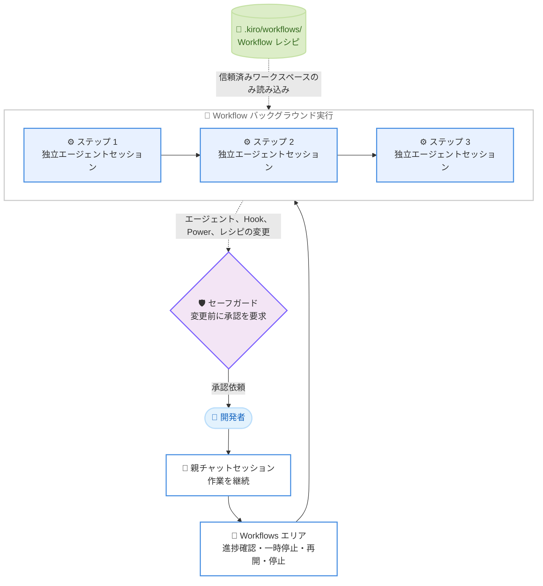

# Kiro - Workflows、Untrusted Workspace の安全性強化、エンタープライズサインイン制御 (IDE 1.2)

**リリース日**: 2026 年 10 月 5 日
**サービス**: Kiro
**機能**: IDE 1.2 - Workflows, Safer Untrusted Workspaces, and Enterprise Sign-In Controls

📊 [このアップデートのインフォグラフィックを見る](https://takech9203.github.io/aws-news-summary/20261005-kiro-changelog-2026-10-05.html)

## 概要

AWS の AI 搭載 IDE である Kiro の IDE 1.2 がリリースされました。本リリースでは、再利用可能なマルチエージェント Workflows をバックグラウンドで実行する機能が IDE に導入され、untrusted workspace (未信頼ワークスペース) における Kiro 設定へのセーフガードが強化されました。また、エンタープライズ向けにサインイン方法を管理するコントロールが追加されています。

Workflows は、親チャットで作業を続けながら、複数ステップのエージェントプランをバックグラウンドで実行できる機能です。各ステップは独立したエージェントセッションで実行され、チャット上部の Workflows エリアから進捗の確認、ステップの表示、実行の一時停止・再開・停止を行えます。あわせて、エージェントが Kiro の設定ファイルや Workflow レシピを変更する前に確認を求めるセーフガードが導入され、信頼していないリポジトリを開いた際の安全性が向上しました。

このほか、Agent Focus Mode のセッション詳細の刷新、エンタープライズプロファイルのリージョン内にテレメトリとアクティビティデータを維持するリージョナルデータハンドリング、認証・デバッグ・信頼性に関する多数の修正が含まれています。

**アップデート前の課題**

- IDE 内でマルチステップのエージェントプランを再利用可能な形で定義し、バックグラウンドで実行する仕組みがなかった
- ファイル書き込み権限が広く許可されていると、エージェントがエージェント定義、Hook、Power などの Kiro 設定ファイルを確認なしに変更できた
- untrusted workspace でも、以前に許可したコマンドが確認なしに実行される余地があった
- エンタープライズ管理者が、組織で許可するサインイン方法を制限する手段がなかった
- エンタープライズ利用時のテレメトリとアクティビティデータの送信先リージョンを、プロファイルのリージョンに揃えられなかった

**アップデート後の改善**

- 親チャットで作業を続けながら、再利用可能なマルチエージェント Workflows をバックグラウンドで実行できるようになった
- エージェント、Hook、Power の各ファイルや `.kiro/workflows/` の Workflow レシピの変更前に、Kiro が必ず確認を求めるようになった
- untrusted workspace では、その他の Kiro 設定の変更前と各コマンドの実行前にも毎回確認が求められ、Workflow レシピはワークスペースを信頼するまで読み込まれなくなった
- 管理者が許可するサインイン方法の制限、組織のサインイン情報の事前入力、サインイン画面へのヘルプリンクの追加を行えるようになった
- テレメトリとアクティビティデータが、選択したエンタープライズプロファイルの AWS リージョンに送信されるようになった

## アーキテクチャ図



親チャットで作業を続けながら Workflow がバックグラウンドで複数ステップを実行し、Kiro 設定や Workflow レシピの変更時にはセーフガードが開発者の承認を求める構成を示しています。

## サービスアップデートの詳細

### 主要機能

1. **マルチエージェント Workflows のバックグラウンド実行**
   - 再利用可能なマルチステップのプランを、親チャットで作業を続けながらバックグラウンドで実行できる
   - 各ステップは独立したエージェントセッションで実行される
   - チャット上部の Workflows エリアから、進捗の確認、ステップの表示、実行の一時停止・再開・停止が可能
   - デフォルトでは無効。Agent Focus の Workspace Configuration で有効化するか、Settings で `kiroAgent.workflows.enabled` を設定し、新しいチャットセッションを開始する

2. **Kiro 設定と Workflow レシピの保護**
   - 広範なファイル書き込み権限が許可されている場合でも、エージェントがエージェント定義、Hook、Power の各ファイル、および `.kiro/workflows/` の Workflow レシピを変更する前に Kiro が確認を求める
   - untrusted workspace では、その他の Kiro 設定の変更前にも確認が求められる
   - untrusted workspace では、以前に許可したコマンドであっても、各コマンドの実行前に毎回確認が求められる
   - untrusted workspace の Workflow レシピは、ワークスペースを信頼するまで読み込まれない

3. **エンタープライズサインイン制御**
   - 管理者が組織で許可するサインイン方法を制限できる
   - 組織のサインイン情報を事前入力し、サインイン画面にヘルプリンクを追加できる
   - 許可されていない方法を選択した場合、Kiro が許可されている選択肢を表示する

4. **Agent Focus Mode のセッション詳細の刷新**
   - Workflows と Artifacts に専用ビューが追加された
   - ステップのアクティビティ、アーティファクトのプレビューを確認でき、すべてのアーティファクトに Open in IDE が用意された

5. **リージョナルデータハンドリング**
   - テレメトリとアクティビティデータが、選択したエンタープライズプロファイルの AWS リージョンに送信されるようになった

### 主な修正

- Electron を 44.4.3 (Chromium 152.0.7977.130 を含む) に更新し、CVE-2026-87491 に対処
- us-east-1 以外のエンタープライズプロファイルで、アカウントまたはプロファイル切り替え後にウィンドウを再読み込みするまでリクエストが失敗する問題を修正
- `oauth.redirectUri` にドキュメント記載の完全な URL またはポートのみの形式を使用すると MCP OAuth サインインが失敗する問題を修正
- プロファイルファイルが変更なしで書き換えられた際に、アカウント更新が繰り返されて IDE が応答しなくなる問題を修正
- JavaScript デバッガーが Node.js 24.20 以降にアタッチできない問題を修正
- GitHub リポジトリのルートからのスキルのインポート、スペックの Acceptance Criteria 見出しの大文字小文字の認識、セッション再読み込み後にツールが返した画像が消える問題などを修正

## 技術仕様

### Workflows の設定項目

| 項目 | 詳細 |
|------|------|
| 機能の既定値 | 無効 (オプトイン) |
| 有効化方法 1 | Agent Focus の Workspace Configuration で Workflows を有効化 |
| 有効化方法 2 | Settings で `kiroAgent.workflows.enabled` を設定 |
| 反映条件 | 設定後、新しいチャットセッションを開始 |
| レシピの配置場所 | `.kiro/workflows/` |
| 実行単位 | 各ステップが独立したエージェントセッションで実行 |
| 実行中の操作 | 進捗確認、ステップ表示、一時停止、再開、停止 |

### untrusted workspace でのセーフガード

| 対象 | 動作 |
|------|------|
| エージェント、Hook、Power の各ファイルと Workflow レシピ | ワークスペースの信頼状態にかかわらず、変更前に常に確認 |
| その他の Kiro 設定 | untrusted workspace では変更前に確認 |
| コマンド実行 | untrusted workspace では、以前の許可にかかわらず毎回確認 |
| Workflow レシピの読み込み | untrusted workspace ではワークスペースを信頼するまで読み込まない |

## 設定方法

### 前提条件

1. Kiro IDE 1.2 以降にアップデートしていること
2. Workflows を利用する場合、ワークスペースを信頼していること (untrusted workspace ではレシピが読み込まれない)
3. エンタープライズサインイン制御を利用する場合、エンタープライズの管理者権限があること

### 手順

#### ステップ 1: Workflows を有効化する

```
方法 1: Agent Focus の Workspace Configuration で Workflows をオンにする
方法 2: Settings で kiroAgent.workflows.enabled を有効にする
```

Workflows はデフォルトで無効のため、いずれかの方法で有効化します。設定後、新しいチャットセッションを開始すると反映されます。

#### ステップ 2: Workflow を実行する

チャットで達成したい成果を Kiro に依頼すると、再利用可能なマルチステップのプランがバックグラウンドで実行されます。各ステップは独立したエージェントセッションで実行されます。

#### ステップ 3: 実行を監視・操作する

チャット上部の Workflows エリアから、進捗の確認、各ステップの表示、実行の一時停止・再開・停止を行います。

#### ステップ 4: エンタープライズサインイン制御を設定する (管理者)

管理者は、許可するサインイン方法の制限、組織のサインイン情報の事前入力、サインイン画面へのヘルプリンクの追加を設定します。詳細は [エンタープライズガバナンスのドキュメント](https://kiro.dev/docs/enterprise/governance/sign-in/) を参照してください。

## メリット

### ビジネス面

- **生産性の向上**: Workflow がバックグラウンドで実行されるため、開発者は親チャットでの作業を中断せずに複数の作業を並行して進められる
- **ガバナンスの強化**: 管理者がサインイン方法を制限し、組織のポリシーに沿った認証フローを強制できる
- **データ所在地要件への対応**: テレメトリとアクティビティデータがエンタープライズプロファイルのリージョン内に維持され、コンプライアンス要件に対応しやすくなる

### 技術面

- **再利用性**: `.kiro/workflows/` にレシピとして定義したマルチステップのプランをチームで再利用できる
- **多層的なセーフガード**: ファイル権限の設定にかかわらず、エージェント、Hook、Power の各ファイルと Workflow レシピの変更時に必ず承認が求められ、プロンプトインジェクションなどによる設定改ざんのリスクが低減される
- **untrusted workspace の安全性**: 信頼していないリポジトリを開いた際に、設定変更とコマンド実行が毎回確認されるため、悪意あるリポジトリによる意図しない操作を防ぎやすい

## デメリット・制約事項

### 制限事項

- Workflows はデフォルトで無効であり、有効化後に新しいチャットセッションを開始する必要がある
- untrusted workspace では、ワークスペースを信頼するまで Workflow レシピが読み込まれない
- エンタープライズサインイン制御の設定には管理者権限が必要

### 考慮すべき点

- untrusted workspace では各コマンドの実行前に毎回確認が求められるため、確認操作が増える。信頼できるリポジトリは早めにワークスペースを信頼することで作業効率を維持できる
- Kiro 設定ファイルの変更時に承認が求められるようになるため、エージェントに設定ファイルを編集させる自動化フローを利用している場合は動作を確認する必要がある

## ユースケース

### ユースケース 1: 機能開発を Workflow に委譲して並行作業

**シナリオ**: 機能実装のマルチステップ作業をバックグラウンドに委譲し、その間に別の設計検討を進めたい。

**実装例**:
```
1. Settings で kiroAgent.workflows.enabled を有効化し、新しいチャットを開始
2. 達成したい成果 (機能の実装とテスト) を Kiro に依頼し、Workflow として実行
3. 親チャットで設計検討を継続しつつ、Workflows エリアで進捗を確認
```

**効果**: 各ステップが独立したエージェントセッションで実行され、開発者は待ち時間なく複数の作業を並行して進められる。

### ユースケース 2: 外部リポジトリの安全な調査

**シナリオ**: 信頼できるかわからない外部のリポジトリを開き、コードを調査したい。

**実装例**:
```
1. リポジトリを untrusted workspace として開く
2. エージェントにコードの調査を依頼
3. 設定変更やコマンド実行のたびに表示される確認ダイアログで内容を確認して承認
```

**効果**: Kiro 設定の変更とコマンド実行が毎回確認されるため、悪意ある指示が埋め込まれたリポジトリでも意図しない操作を防ぎやすい。Workflow レシピも信頼するまで読み込まれない。

### ユースケース 3: 組織全体でのサインイン方法の統制

**シナリオ**: 企業の IT 管理者として、開発者が組織で承認された認証方式のみで Kiro にサインインするよう統制したい。

**実装例**:
```
1. エンタープライズのガバナンス設定で許可するサインイン方法を制限
2. 組織のサインイン情報を事前入力として設定
3. サインイン画面に社内ヘルプデスクへのリンクを追加
```

**効果**: 開発者が許可されていない方法を選択しても許可された選択肢が提示され、組織のセキュリティポリシーに沿った認証を徹底できる。

## 利用可能リージョン

Kiro はグローバルに利用可能なサービスです。IDE 1.2 では、エンタープライズ利用時のテレメトリとアクティビティデータが、選択したエンタープライズプロファイルの AWS リージョンに送信されるようになりました。

## 関連サービス・機能

- **Kiro CLI 2.26 / 2.27**: CLI でも Workflows が V3 セッションのオプトイン機能として提供されており、`/workflow run` コマンドでレシピを実行できる
- **Kiro Web**: Kiro Web のクラウドセッションでも Workflows がオプトイン機能として利用可能
- **Kiro Agent Focus / Hooks / Powers**: 今回のセーフガード強化の保護対象となる Kiro のエージェント機能群

## 参考リンク

- 📊 [インフォグラフィック](https://takech9203.github.io/aws-news-summary/20261005-kiro-changelog-2026-10-05.html)
- [Kiro Changelog](https://kiro.dev/changelog/)
- [Kiro Changelog - IDE 1.2](https://kiro.dev/changelog/ide/1-2)
- [Kiro ドキュメント - Workflows](https://kiro.dev/docs/workflows/)
- [Kiro ドキュメント - Permissions](https://kiro.dev/docs/permissions/)
- [Kiro ドキュメント - エンタープライズサインイン管理](https://kiro.dev/docs/enterprise/governance/sign-in/)

## まとめ

Kiro IDE 1.2 は、マルチエージェント Workflows のバックグラウンド実行による生産性向上と、untrusted workspace でのセーフガード強化によるセキュリティ向上を同時に実現するリリースです。エンタープライズ向けにはサインイン方法の統制とリージョナルデータハンドリングが追加され、組織での導入・運用がしやすくなりました。まずは信頼できるワークスペースで `kiroAgent.workflows.enabled` を有効化し、Workflows による作業の委譲を試すことを推奨します。
