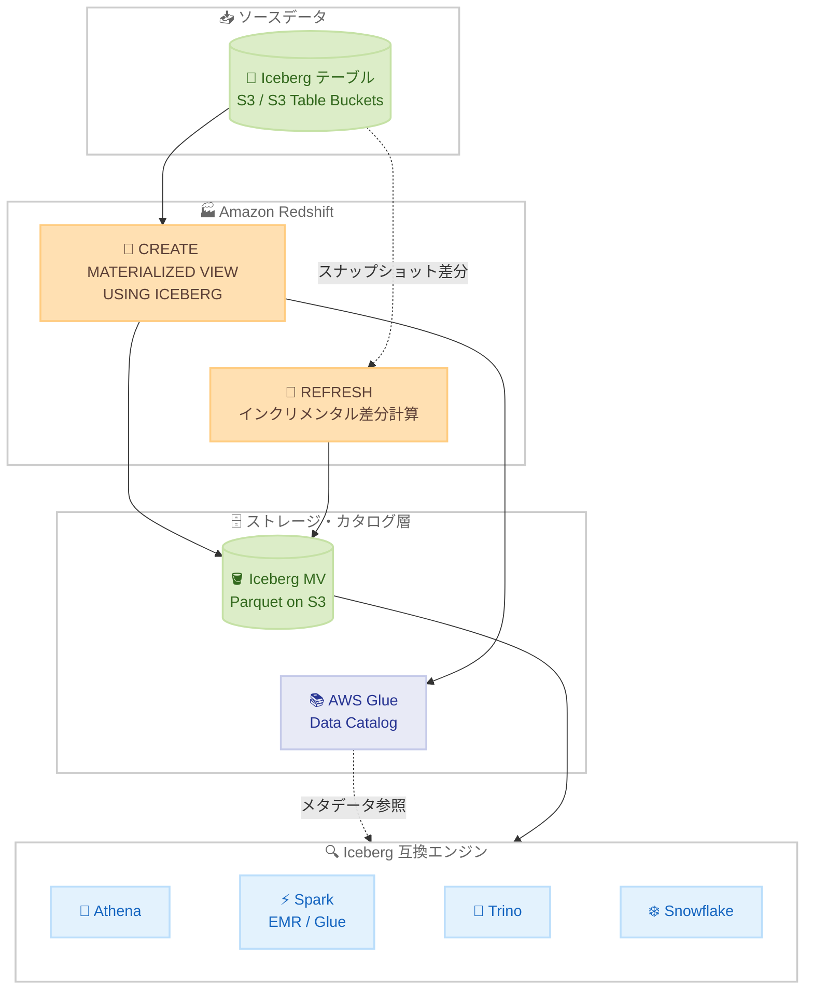

# Amazon Redshift - Apache Iceberg マテリアライズドビューの作成・リフレッシュサポート

**リリース日**: 2026 年 10 月 5 日
**サービス**: Amazon Redshift
**機能**: Apache Iceberg マテリアライズドビュー

📊 [このアップデートのインフォグラフィックを見る](https://takech9203.github.io/aws-news-summary/20261005-redshift-iceberg-materialized-views.html)

## 概要

Amazon Redshift が、Apache Iceberg テーブルとして保存されるマテリアライズドビューの作成とリフレッシュをサポートしました。`CREATE MATERIALIZED VIEW ... USING ICEBERG` という標準 SQL 構文を使用して、コストの高い結合や集計の事前計算結果を Amazon S3 または S3 Table Buckets 上の Iceberg テーブルとして保存し、AWS Glue Data Catalog に自動登録できます。

従来の Redshift マテリアライズドビューは Redshift Managed Storage (RMS) に内部保存され、Redshift からのみ利用可能でした。今回のアップデートにより、マテリアライズドビューの結果が標準の Iceberg テーブルとなるため、Amazon Athena、Amazon EMR や AWS Glue 上の Apache Spark、さらには Trino や Snowflake などのサードパーティエンジンからも、追加の設定なしで即座にクエリ可能になります。「Materialize once, query anywhere (一度マテリアライズすれば、どこからでもクエリできる)」というコンセプトを実現する機能です。

データレイクハウスアーキテクチャを採用し、複数の分析エンジンを併用している組織にとって、エンジンごとの重複した集計処理やパイプラインのオーケストレーションを削減し、単一の信頼できる結果を全エンジンで共有できる重要なアップデートです。

**アップデート前の課題**

このアップデート以前には、以下の課題がありました。

- Redshift のマテリアライズドビューは RMS に保存され、Redshift 以外のエンジンからアクセスできなかった
- 複数のエンジン (Athena、Spark、Trino など) で同じ集計結果を利用するには、エンジンごとに同じ結合・集計処理を繰り返し実行する必要があり、計算コストが重複していた
- エンジンごとに別々のパイプラインを構築・運用する必要があり、オーケストレーションの負荷や、エンジン間での集計結果の不一致 (セマンティックドリフト) のリスクがあった

**アップデート後の改善**

今回のアップデートにより、以下が可能になりました。

- `USING ICEBERG` 句を追加するだけで、マテリアライズドビューの結果を S3 上のオープンな Iceberg テーブルとして保存できるようになった
- 結果が Glue Data Catalog に登録され、Iceberg 互換の任意のエンジンから追加設定なしで即座にクエリできるようになった
- 手動インクリメンタルリフレッシュにより、前回リフレッシュ以降に変更されたデータのみを差分計算し、効率的にビューを最新化できるようになった
- 高価な計算を Redshift で一度だけ実行し、下流の全コンシューマーが単一の結果を共有できるようになった

## アーキテクチャ図



Redshift が Iceberg ソーステーブルに対する集計・結合結果を S3 上の Iceberg テーブルとして書き出し、Glue Data Catalog に登録します。Athena、Spark、Trino、Snowflake などの Iceberg 互換エンジンは、この結果を標準の Iceberg テーブルとして直接読み取れます。

## サービスアップデートの詳細

### 主要機能

1. **Iceberg 形式でのマテリアライズドビュー作成**
   - `CREATE MATERIALIZED VIEW ... USING ICEBERG` 構文で作成し、結果を Parquet データファイルとして S3 に書き込み
   - 保存先は汎用 S3 バケット (`LOCATION` 句で指定) または S3 Table Buckets (`LOCATION` 省略時は S3 Tables がストレージを管理)
   - `PARTITIONED BY` 句によるパーティショニングもサポート
   - テーブルは AWS Glue Data Catalog に Iceberg メタデータ付きで登録され、他エンジンから発見・ガバナンス可能

2. **手動インクリメンタルリフレッシュ**
   - `REFRESH MATERIALIZED VIEW` コマンドで手動リフレッシュを実行
   - 前回リフレッシュ時の Iceberg スナップショット ID を追跡し、変更されたデータのみを差分計算
   - COUNT・SUM 集計を含む GROUP BY クエリ、Iceberg テーブル間の内部結合、非集計クエリでインクリメンタルリフレッシュをサポート
   - DISTINCT や外部結合、ウィンドウ関数などの構文では自動的にフルリフレッシュにフォールバック

3. **クロスエンジン相互運用性**
   - 作成されたビューは Glue Data Catalog 上の標準 Iceberg テーブルとして表示され、Athena、Spark、Trino、Snowflake 等から追加設定なしで読み取り可能
   - コンシューマー側は S3 の標準読み取りコストのみで、追加のコンピューティング料金は不要
   - リフレッシュとドロップは作成元の Redshift のみ実行可能 (他エンジンが作成した Iceberg マテリアライズドビューは Redshift から読み取り専用)

4. **クラスター非依存の管理と同時リフレッシュ制御**
   - ビュー定義とリフレッシュ状態は AWS Glue に保存され、特定のクラスターに紐付かない
   - 適切な IAM ロールを持つ任意のワークグループ・クラスターからリフレッシュ可能
   - Glue Data Catalog の条件付き更新による楽観的同時実行制御 (OCC) で、同時リフレッシュ時も 1 つのみ成功することを保証

## 技術仕様

### 機能仕様

| 項目 | 詳細 |
|------|------|
| 作成構文 | `CREATE MATERIALIZED VIEW ... USING ICEBERG` |
| 保存形式 | Apache Iceberg テーブル (Parquet データファイル) |
| 保存先 | 汎用 S3 バケットまたは S3 Table Buckets |
| カタログ | AWS Glue Data Catalog に自動登録 |
| リフレッシュ方式 | 手動のみ (`REFRESH MATERIALIZED VIEW`)、自動リフレッシュは非サポート |
| インクリメンタルリフレッシュ対象 | COUNT / SUM + GROUP BY、Iceberg テーブル間の内部結合、非集計クエリ |
| ソーステーブル要件 | Iceberg 形式のみ、同一リージョン・同一アカウント |
| 対応コンピューティング | Redshift Serverless、RG (Graviton) プロビジョンドインスタンス |
| 非対応コンピューティング | RA3、DC2 インスタンスタイプ |
| コンパクション | S3 Table Buckets は自動管理、汎用 S3 バケットは外部ツール (Spark の `rewrite_data_files` 等) で実施 |

### SQL 構文例

```sql
-- Iceberg マテリアライズドビューの作成
CREATE MATERIALIZED VIEW awsdatacatalog.analytics.daily_revenue
USING ICEBERG
LOCATION 's3://amzn-s3-demo-analytics/daily_revenue/'
PARTITIONED BY (day(order_date))
AS
SELECT order_date, region,
       SUM(amount) AS total_revenue, COUNT(*) AS transaction_count
FROM awsdatacatalog.source.transactions
GROUP BY 1, 2;

-- 手動インクリメンタルリフレッシュ
REFRESH MATERIALIZED VIEW awsdatacatalog.analytics.daily_revenue;
```

### 必要な権限

| 操作 | 必要な権限 |
|------|-----------|
| CREATE | 対象 Glue データベースへの CREATE TABLE 権限 + 定義者 IAM ロールの全ソーステーブルへの SELECT 権限 |
| REFRESH | マテリアライズドビューへの ALTER 権限 + 定義者ロールのソーステーブルへの SELECT 権限 |
| DROP | マテリアライズドビューへの DROP 権限 |
| QUERY | Lake Formation または Glue リソースポリシーで付与された SELECT 権限 |

定義者 IAM ロールには、`redshift.amazonaws.com` と `glue.amazonaws.com` の 2 つのサービスプリンシパルを信頼するトラストポリシーが必要です。

## 設定方法

### 前提条件

1. Redshift Serverless ワークグループまたは RG インスタンスのプロビジョンドクラスター
2. Iceberg 形式のソーステーブル (同一リージョン・同一アカウント内)
3. S3 アクセス権限、Glue Data Catalog アクセス権限、`iam:PassRole` を持つ定義者 IAM ロール
4. セッション設定 `enable_case_sensitive_identifier` が `false` であること

### 手順

#### ステップ 1: IAM ロールの準備と関連付け

```bash
# IAM ロールをクラスター / 名前空間に関連付け
aws redshift modify-cluster-iam-roles \
    --cluster-identifier my-cluster \
    --add-iam-roles arn:aws:iam::123456789012:role/IcebergMvDefiner
```

Redshift と Glue が引き受け可能なトラストポリシーを持つ IAM ロールを作成し、S3 の読み書き権限と Glue Data Catalog のテーブル操作権限を付与したうえで、クラスターまたは Serverless 名前空間に関連付けます。

#### ステップ 2: 外部スキーマの作成

```sql
SET enable_case_sensitive_identifier TO FALSE;

CREATE EXTERNAL SCHEMA iceberg_schema
FROM DATA CATALOG
DATABASE 'analytics'
IAM_ROLE 'arn:aws:iam::123456789012:role/IcebergMvDefiner';
```

大文字小文字を区別する識別子設定を無効化したうえで、Glue データベースを指す外部スキーマを定義者 IAM ロールとともに作成します。

#### ステップ 3: Iceberg マテリアライズドビューの作成とリフレッシュ

```sql
CREATE MATERIALIZED VIEW iceberg_schema.sales_by_region
USING ICEBERG
LOCATION 's3://amzn-s3-demo-analytics/sales_by_region/'
AS
SELECT region, SUM(amount) AS total_sales, COUNT(*) AS order_count
FROM awsdatacatalog.source.orders
GROUP BY region;

-- ソースデータ更新後に差分リフレッシュ
REFRESH MATERIALIZED VIEW iceberg_schema.sales_by_region;
```

`USING ICEBERG` 句付きでマテリアライズドビューを作成すると、クエリ結果が S3 に Iceberg テーブルとして書き出され、Glue Data Catalog に登録されます。リフレッシュ時はソーステーブルのスナップショット差分のみが再計算されます。

#### ステップ 4: 他エンジンからのクエリ

```sql
-- Athena から直接クエリ
SELECT * FROM analytics.sales_by_region WHERE region = 'us-east';
```

Glue Data Catalog に登録された Iceberg テーブルとして、Athena や Spark などから追加設定なしでクエリできます。

## メリット

### ビジネス面

- **コンピューティングコストの削減**: 高価な集計を Redshift で一度だけ実行し、全エンジンで結果を共有することで、エンジンごとの重複計算を排除できる。AWS Blog の試算例では、4 エンジンでの個別集計 (約 7,500 USD/月) が単一リフレッシュ (約 1,500 USD/月) に削減される
- **単一の信頼できる情報源**: 全エンジンが同一のスナップショットを参照するため、エンジン間で集計値が食い違うセマンティックドリフトを防止できる
- **運用負荷の軽減**: エンジンごとの個別パイプラインやマルチエンジンオーケストレーションが不要になる

### 技術面

- **オープンフォーマットによる相互運用性**: 結果が標準 Iceberg テーブルのため、ベンダーロックインなしに Athena、Spark、Trino、Snowflake 等から利用可能
- **効率的なインクリメンタルリフレッシュ**: スナップショット差分の追跡により、変更分のみを再計算してリフレッシュ時間とコストを最小化
- **クラスター非依存の管理**: ビュー状態が Glue に保存されるため、任意のワークグループからリフレッシュでき、OCC により同時実行も安全
- **RMS マテリアライズドビューとの併用**: レイテンシー重視のダッシュボード向けには、Iceberg マテリアライズドビューの結果を RMS マテリアライズドビューとしてロードする組み合わせも可能

## デメリット・制約事項

### 制限事項

- RA3 および DC2 インスタンスタイプは非サポート (Redshift Serverless と RG インスタンスのみ)
- 自動リフレッシュ (autorefresh)、自動マテリアライズドビュー、クエリの自動書き換え (automatic query rewriting) は非サポート
- ソーステーブルは Iceberg 形式のみ (Redshift ネイティブテーブル、Hive、Parquet、Delta Lake、Hudi は不可)、かつ同一リージョン・同一アカウント内に限定
- Iceberg フォーマットバージョン 3 のソーステーブル、UDF、ミュータブル関数 (GETDATE、RANDOM 等)、ORDER BY / LIMIT / OFFSET、大文字の識別子は定義に使用不可
- DISTINCT、外部結合、ウィンドウ関数、サブクエリ、集合演算、COUNT / SUM 以外の集計関数はフルリフレッシュにフォールバック
- 細かい粒度のアクセス制御 (FGAC) は非サポート。Lake Formation のガバナンスはデータベース / テーブルレベルの粗粒度のみ (行・列フィルターは不可)
- CASCADE リフレッシュは非サポート

### 考慮すべき点

- `DROP MATERIALIZED VIEW` は Glue カタログエントリを削除するが、S3 上のデータは削除されないため、手動での削除 (`aws s3 rm --recursive` 等) が必要
- 汎用 S3 バケット保存時はインクリメンタルリフレッシュにより小さなファイルが蓄積するため、Spark の `rewrite_data_files` 等による定期的なコンパクションとスナップショット有効期限の設定が必要 (S3 Table Buckets では自動管理)
- ソーステーブルのスナップショット保持期間はリフレッシュ間隔より長く設定する必要がある。スナップショットが期限切れになるとフルリフレッシュにフォールバックする
- Iceberg テーブルはスナップショット履歴を持つため、基盤ファイルにアクセスできる読み取り者はリフレッシュ間の行の増減を観察できる。機密データでは Lake Formation 権限や S3 バケットポリシーによるアクセス制御を検討する

## ユースケース

### ユースケース 1: メダリオンアーキテクチャの Gold レイヤー構築

**シナリオ**: Bronze → Silver → Gold のメダリオンアーキテクチャを採用しており、Gold レイヤーの集計テーブルを Athena のアドホック分析、Spark の ML パイプライン、BI ツールの全てから利用したい。

**実装例**:
```sql
CREATE MATERIALIZED VIEW awsdatacatalog.gold.customer_metrics
USING ICEBERG
LOCATION 's3://amzn-s3-demo-lakehouse/gold/customer_metrics/'
AS
SELECT customer_id, COUNT(*) AS order_count, SUM(amount) AS lifetime_value
FROM awsdatacatalog.silver.orders
GROUP BY customer_id;
```

**効果**: Redshift の最適化されたクエリエンジンで Gold レイヤーを一度計算し、全エンジンが同一の結果を共有。エンジンごとの重複パイプラインを排除できる。

### ユースケース 2: ML / 生成 AI 向け特徴量ストア

**シナリオ**: SageMaker のモデル学習、Bedrock エージェント、Spark ML パイプラインが同じ顧客特徴量を必要としているが、JDBC 経由での Redshift アクセスを避けたい。

**実装例**:
```python
# PyIceberg から特徴量を直接読み取り
from pyiceberg.catalog import load_catalog
catalog = load_catalog("glue", **{"type": "glue"})
table = catalog.load_table("gold.customer_metrics")
df = table.scan().to_pandas()
```

**効果**: 特徴量が S3 上のオープンな Iceberg テーブルとして提供されるため、JDBC 接続やデータコピーなしに、各 ML ワークロードが S3 読み取りコストのみで最新の特徴量にアクセスできる。

### ユースケース 3: 複数エンジンでの日次売上ダッシュボード共有

**シナリオ**: 日次売上集計を Athena ベースの社内ダッシュボードと Snowflake を利用するパートナー分析チームの両方に提供しており、集計結果の一貫性維持が課題になっている。

**実装例**:
```sql
-- 日次バッチの最後にリフレッシュを実行
REFRESH MATERIALIZED VIEW awsdatacatalog.analytics.daily_revenue;
```

**効果**: 1 回のインクリメンタルリフレッシュで両チームが同一スナップショットの集計値を参照。エンジン間での数値の不一致を解消し、集計コンピューティングコストを一本化できる。

## 料金

Iceberg マテリアライズドビュー自体に追加料金はありません。以下の標準料金が適用されます。

- **Redshift コンピューティング**: ビューの作成・リフレッシュ時の Redshift Serverless (RPU 時間) または RG プロビジョンドインスタンスの料金
- **Amazon S3**: マテリアライズドビューデータのストレージ料金とリクエスト料金 (S3 Table Buckets 使用時は S3 Tables の料金)
- **AWS Glue Data Catalog**: カタログのストレージおよびリクエスト料金
- **コンシューマー側**: 各エンジンからの読み取りは標準の S3 読み取りコストのみで、Redshift 側に追加コンピューティング料金は発生しない

なお、AWS Blog によると、RG インスタンスは RA3 と比較して最大 2.4 倍高速な Iceberg クエリ性能を vCPU あたり 30% 低いコストで提供し、データレイクスキャンに対する TB あたりの課金もありません。

## 利用可能リージョン

Amazon Redshift Serverless および Graviton ベース (RG) プロビジョンドインスタンスがサポートされる全ての AWS リージョンで利用可能です。

## 関連サービス・機能

- **AWS Glue Data Catalog**: マテリアライズドビューの登録先であり、ビュー定義・リフレッシュ状態の保存と同時リフレッシュの調整 (OCC) を担う
- **Amazon S3 / S3 Table Buckets**: Iceberg テーブルデータの保存先。S3 Table Buckets ではコンパクションとスナップショット管理が自動化される
- **Amazon Athena / Apache Spark (EMR、AWS Glue) / Trino / Snowflake**: 作成された Iceberg マテリアライズドビューを直接クエリできる Iceberg 互換エンジン
- **AWS Lake Formation**: データベース / テーブルレベルの粗粒度アクセス制御をオプションで適用可能
- **Redshift マテリアライズドビュー (RMS)**: 従来の内部保存型マテリアライズドビュー。サブ秒レイテンシーが必要なダッシュボード向けに Iceberg マテリアライズドビューと併用可能

## 参考リンク

- 📊 [インフォグラフィック](https://takech9203.github.io/aws-news-summary/20261005-redshift-iceberg-materialized-views.html)
- [公式発表 (What's New)](https://aws.amazon.com/about-aws/whats-new/2026/10/redshift-iceberg-materialized-views)
- [AWS Blog: Materialize once, query anywhere - Introducing Iceberg materialized views in Amazon Redshift](https://aws.amazon.com/blogs/big-data/materialize-once-query-anywhere-introducing-iceberg-materialized-views-in-amazon-redshift/)
- [ドキュメント: Materialized views stored as Apache Iceberg tables](https://docs.aws.amazon.com/redshift/latest/dg/materialized-view-iceberg.html)
- [料金ページ: Amazon Redshift の料金](https://aws.amazon.com/redshift/pricing/)

## まとめ

Amazon Redshift の Iceberg マテリアライズドビューは、高価な集計・結合処理を一度だけ実行し、その結果をオープンな Iceberg テーブルとして全ての互換エンジンで共有できるようにする、レイクハウスアーキテクチャの中核となるアップデートです。複数の分析エンジンで重複した集計パイプラインを運用している場合は、コスト削減と結果の一貫性確保の観点から導入を検討する価値があります。利用には Redshift Serverless または RG インスタンスが必要であり、リフレッシュは手動のみである点に留意して、既存の RMS マテリアライズドビューとの使い分けを設計することを推奨します。
