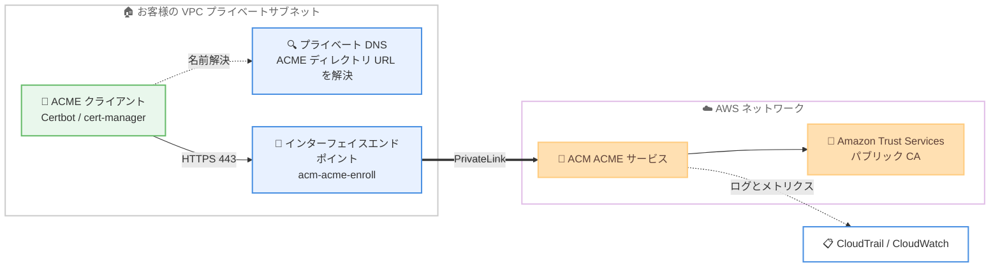

# AWS Certificate Manager - AWS PrivateLink 経由の ACME 証明書発行サポート

**リリース日**: 2026 年 10 月 6 日
**サービス**: AWS Certificate Manager (ACM)
**機能**: AWS PrivateLink 経由の ACME パブリック証明書発行

📊 [このアップデートのインフォグラフィックを見る](https://takech9203.github.io/aws-news-summary/20261006-AWS-Certificate-Manager-ACME-Privatelink.html)

## 概要

AWS Certificate Manager (ACM) が、ACME (Automated Certificate Management Environment) プロトコルによるパブリック TLS 証明書の発行・更新を AWS PrivateLink 経由で行えるようになりました。VPC 内に ACM ACME サービスへのインターフェイスエンドポイントを作成することで、証明書の発行トラフィックをパブリックインターネットに出すことなく、AWS ネットワーク内のプライベートな経路で完結できます。

ACM の ACME サポート自体は 2026 年 6 月に発表されており、Certbot や cert-manager などの ACMEv2 互換クライアントから、Amazon Trust Services が発行するパブリック証明書を自動取得できる機能です。今回のアップデートにより、インターネットへのアウトバウンド経路を持たないプライベートサブネット内のワークロードや、厳格なネットワーク統制が求められる環境でも、ACME による証明書の自動発行・自動更新が可能になります。

プライベート DNS により既存の ACME ディレクトリ URL が自動的にインターフェイスエンドポイントへ解決されるため、ACME クライアント側の設定変更は不要です。アカウント登録、オーダー作成、ドメイン検証、ファイナライズ、証明書取得といった発行オペレーションのすべてが PrivateLink 経由で流れ、AWS CloudTrail によるログ記録と Amazon CloudWatch メトリクスによる監視も引き続き利用できます。

**アップデート前の課題**

- ACME クライアントから ACM の ACME エンドポイントへの通信は、パブリックインターネット経由のアクセスが前提だった
- プライベートサブネット内のワークロードから証明書を発行するには、NAT ゲートウェイやインターネットゲートウェイなどのアウトバウンド経路が必要だった
- コンプライアンス要件により証明書発行トラフィックをインターネットに出せない環境では、ACME による自動化を採用しにくかった

**アップデート後の改善**

- VPC インターフェイスエンドポイントを作成するだけで、証明書の発行・更新トラフィックが AWS ネットワーク内に閉じるようになった
- プライベート DNS が既存の ACME ディレクトリ URL をエンドポイントへ自動解決するため、ACME クライアントの再設定が不要になった
- VPC エンドポイントポリシーにより、特定の ACME エンドポイントに対する発行・失効操作をネットワーク層で制御できるようになった

## アーキテクチャ図



VPC 内の ACME クライアントは、プライベート DNS により解決された既存のディレクトリ URL を使い、インターフェイスエンドポイント経由で ACM ACME サービスと通信します。発行トラフィックはインターネットを経由せず AWS ネットワーク内に閉じます。

## サービスアップデートの詳細

### 主要機能

1. **PrivateLink 経由の証明書発行**
   - VPC インターフェイスエンドポイントを作成することで、ACME による証明書発行トラフィックが AWS ネットワーク内のプライベート経路で完結する
   - インターネットゲートウェイ、NAT デバイス、VPN 接続、AWS Direct Connect 接続が不要
   - アカウント登録、オーダー作成、ドメイン検証、ファイナライズ、証明書取得のすべての発行オペレーションに対応

2. **クライアント設定変更不要のプライベート DNS 統合**
   - プライベート DNS ホスト名を有効化すると、既存の ACME ディレクトリ URL が VPC 内でインターフェイスエンドポイントへ自動解決される
   - Certbot、cert-manager など任意の ACMEv2 互換クライアントが、設定変更なしでそのまま動作する
   - 独自 DNS を使用する場合は条件付き DNS フォワーディングで対応可能

3. **2 種類の VPC エンドポイントサービス**
   - `com.amazonaws.{region}.acm-acme`: PKI 管理者向けの管理オペレーション用 (CreateAcmeEndpoint、CreateAcmeDomainValidation、CreateAcmeExternalAccountBinding など)
   - `com.amazonaws.{region}.acm-acme-enroll`: ACME クライアントによる証明書発行・失効のプロトコル通信用
   - 両者は独立しており、それぞれに個別のエンドポイントポリシーを設定できる

4. **可観測性の維持**
   - PrivateLink 経由の発行アクティビティも ACM コンソールで確認可能
   - AWS CloudTrail によるログ記録と Amazon CloudWatch メトリクスにより、監査性を確保

## 技術仕様

### VPC エンドポイントの仕様

| 項目 | 詳細 |
|------|------|
| 発行用エンドポイントサービス名 | `com.amazonaws.{region}.acm-acme-enroll` |
| 管理用エンドポイントサービス名 | `com.amazonaws.{region}.acm-acme` |
| プロトコル / ポート | HTTPS / 443 |
| プライベート DNS | 有効化が必須 (無効の場合、ACME クライアントはエンドポイント経由で到達できない) |
| クロスリージョン | 非対応 (ACME エンドポイントと同じリージョンに VPC エンドポイントを作成する) |
| DNS | Amazon 提供 DNS (Route 53) のみ対応。独自 DNS は条件付きフォワーディングで対応 |
| 対応クライアント | 任意の ACMEv2 互換クライアント (Certbot、cert-manager など) |

### ACME 発行フローと IAM アクションの対応

VPC エンドポイントポリシーで特定の ACME エンドポイントに発行を制限する場合、2 種類のリソースをカバーする必要があります。

| 発行フローのステップ | 評価対象リソース | IAM アクション |
|------|------|------|
| アカウント登録、オーダー作成、認可、証明書ダウンロード | `acme-endpoint/{endpoint-id}` | 名前付きアクションなし (`"Action": "*"` が必要) |
| ファイナライズ | `certificate/*` | `acm:RequestCertificate` |
| 失効 | `certificate/*` | `acm:RevokeCertificate` |

### VPC エンドポイントポリシーの例

特定の ACME エンドポイントに対する発行操作のみを許可するポリシーの例です。

```json
{
   "Version": "2012-10-17",
   "Statement": [
      {
         "Principal": "*",
         "Effect": "Allow",
         "Action": "*",
         "Resource": "arn:aws:acm:{region}:{account-id}:acme-endpoint/{endpoint-id}"
      },
      {
         "Principal": "*",
         "Effect": "Allow",
         "Action": [
            "acm:RequestCertificate",
            "acm:RevokeCertificate"
         ],
         "Resource": "arn:aws:acm:{region}:{account-id}:certificate/*"
      }
   ]
}
```

エンドポイントポリシーは呼び出し元プリンシパルを識別できないため、どのプリンシパルが発行・失効できるかの制御は、EAB 認証情報に関連付けた IAM ロールのアイデンティティポリシーで行います。リクエストはエンドポイントポリシーと IAM ポリシーの両方で許可される必要があります。

### API 変更履歴

今回のアップデートに伴う ACM の API 変更は、直近の AWS API Changes フィード (過去 7 日間) では確認されませんでした。PrivateLink 対応は既存の ACME エンドポイント機能に対するネットワーク経路の追加であり、新しい API オペレーションの追加はありません。

## 設定方法

### 前提条件

1. ACM で ACME エンドポイントを作成済みであること (PKI 管理者が `CreateAcmeEndpoint` で作成)
2. ドメイン検証 (AcmeDomainValidation) と EAB (External Account Binding) 認証情報を設定済みであること
3. ACME クライアントを実行する VPC とプライベートサブネットが存在すること
4. VPC エンドポイントにアタッチするセキュリティグループで、プライベートサブネットからのポート 443 のインバウンド接続を許可すること

### 手順

#### ステップ 1: VPC インターフェイスエンドポイントの作成

```bash
aws ec2 create-vpc-endpoint \
  --vpc-id vpc-0123456789abcdef0 \
  --vpc-endpoint-type Interface \
  --service-name com.amazonaws.ap-northeast-1.acm-acme-enroll \
  --subnet-ids subnet-0123456789abcdef0 \
  --security-group-ids sg-0123456789abcdef0 \
  --private-dns-enabled
```

ACME 証明書発行用のサービス名 `acm-acme-enroll` を指定して、VPC にインターフェイスエンドポイントを作成します。`--private-dns-enabled` によりプライベート DNS ホスト名を有効化しています。これが無効の場合、ACME クライアントはエンドポイント経由で ACME エンドポイントに到達できないため、必ず有効化してください。なお、一部のアベイラビリティーゾーンでは ACME 用 VPC エンドポイントがサポートされない場合があるため、作成前にコンソールで対応状況を確認してください。

#### ステップ 2: エンドポイントポリシーの設定 (任意)

```bash
aws ec2 modify-vpc-endpoint \
  --vpc-endpoint-id vpce-0123456789abcdef0 \
  --policy-document file://acme-endpoint-policy.json
```

作成した VPC エンドポイントに、技術仕様セクションで示したポリシードキュメントを適用し、特定の ACME エンドポイントに対する操作のみを許可するように制限します。

#### ステップ 3: ACME クライアントからの証明書発行

```bash
certbot certonly \
  --standalone \
  --server https://{acme-endpoint-url}/directory \
  --eab-kid {eab-key-id} \
  --eab-hmac-key {eab-hmac-key} \
  -d www.example.com
```

ACME クライアント (この例では Certbot) から、従来と同じディレクトリ URL と EAB 認証情報を使って証明書を発行します。プライベート DNS によりディレクトリ URL が VPC 内でインターフェイスエンドポイントへ解決されるため、クライアント側の設定変更は不要です。発行トラフィックは PrivateLink 経由で AWS ネットワーク内に閉じます。

#### ステップ 4: 発行アクティビティの確認

ACM コンソールの証明書ダッシュボードで発行された証明書を確認し、CloudTrail ログと CloudWatch メトリクスで発行の成功・失敗を監視します。

## メリット

### ビジネス面

- **コンプライアンス対応の強化**: 証明書発行トラフィックがインターネットを経由しないため、金融や公共など厳格なネットワーク統制が求められる業界の要件を満たしやすくなる
- **運用コストの削減**: 証明書発行のためだけに NAT ゲートウェイなどのアウトバウンド経路を維持する必要がなくなり、構成の簡素化とコスト削減につながる
- **自動化の適用範囲拡大**: これまで ACME を採用できなかった閉域ネットワーク環境でも、45 日有効期間の短期証明書を自動更新する運用に移行できる

### 技術面

- **クライアント設定変更不要**: プライベート DNS により既存のディレクトリ URL がそのまま使えるため、Certbot や cert-manager の設定を変更せずに移行できる
- **ネットワーク層でのアクセス制御**: VPC エンドポイントポリシーにより、特定の ACME エンドポイントへの発行・失効操作だけを許可する多層防御を実現できる
- **可観測性の維持**: PrivateLink 経由でも CloudTrail ログと CloudWatch メトリクスが利用でき、発行アクティビティの監査性が保たれる

## デメリット・制約事項

### 制限事項

- 一部のアベイラビリティーゾーンでは ACME 用 VPC エンドポイントがサポートされない場合がある (コンソールで事前確認が必要)
- VPC エンドポイントはクロスリージョンリクエストに対応していないため、ACME エンドポイントと同じリージョンに作成する必要がある
- プライベート DNS は Amazon 提供 DNS (Route 53) のみ対応。独自 DNS を使う場合は条件付き DNS フォワーディングの構成が必要
- 管理用 (`acm-acme`) と発行用 (`acm-acme-enroll`) のエンドポイントは独立しており、片方のエンドポイントではもう片方のオペレーションにアクセスできない

### 考慮すべき点

- インターフェイスエンドポイントには標準の PrivateLink 料金 (時間課金とデータ処理料金) が発生するため、発行頻度が低い場合は費用対効果を検討する
- 発行フローの大半のオペレーションには名前付き IAM アクションがなく、エンドポイントポリシーで `"Action": "*"` の指定が必要になる点を理解した上でポリシーを設計する
- エンドポイントポリシーは呼び出し元プリンシパルを識別できないため、プリンシパル単位の制御は EAB に関連付けた IAM ロールのポリシーで行う
- ACME 発行証明書は有効期間が 45 日と短く、Elastic Load Balancing や CloudFront などの AWS 統合サービスには関連付けできない (ACM の ACME 共通の制約)

## ユースケース

### ユースケース 1: プライベートサブネット内の Kubernetes クラスターでの証明書自動化

**シナリオ**: インターネットへのアウトバウンド経路を持たないプライベートサブネットで稼働する Amazon EKS クラスターの Ingress に、パブリック TLS 証明書を自動発行・自動更新したい。

**実装例**:
```
1. ACME エンドポイントとドメイン検証、EAB 認証情報を PKI 管理者が作成
2. クラスターの VPC に acm-acme-enroll のインターフェイスエンドポイントを作成 (プライベート DNS 有効)
3. cert-manager の ClusterIssuer に ACME ディレクトリ URL と EAB 認証情報を設定
4. Ingress リソースのアノテーションで証明書を自動発行
```

**効果**: NAT ゲートウェイを追加することなく、閉域構成のまま 45 日サイクルの証明書自動更新を実現できる。

### ユースケース 2: 規制業界におけるネットワーク統制下での証明書発行

**シナリオ**: 金融機関のワークロードで、すべての外部通信を禁止するネットワークポリシーが適用されており、証明書発行トラフィックもインターネットに出せない。

**実装例**:
```
1. acm-acme-enroll のインターフェイスエンドポイントを作成
2. エンドポイントポリシーで自社の ACME エンドポイントのみに操作を制限
3. セキュリティグループでプライベートサブネットからの 443 番ポートのみ許可
4. CloudTrail と CloudWatch で発行アクティビティを監査
```

**効果**: 証明書発行の全トラフィックが AWS ネットワーク内に閉じ、ネットワーク統制とトラフィックの監査要件を同時に満たせる。

### ユースケース 3: ハイブリッド環境からの証明書発行

**シナリオ**: AWS Direct Connect または VPN で VPC に接続されたオンプレミスサーバーで TLS を終端しており、秘密鍵を自社システム内に保持したままパブリック証明書を自動発行したい。

**実装例**:
```
1. VPC に acm-acme-enroll のインターフェイスエンドポイントを作成
2. オンプレミス側の DNS から VPC の Route 53 Resolver へ条件付きフォワーディングを設定
3. オンプレミスサーバーの Certbot から ACME ディレクトリ URL 経由で証明書を発行
```

**効果**: 秘密鍵をオンプレミスに保持したまま、プライベート接続経由でパブリック証明書のライフサイクルを自動化できる。

## 料金

ACME 経由で発行されるパブリック証明書を含め、ACM の料金詳細は ACM 料金ページを参照してください。VPC インターフェイスエンドポイントには標準の AWS PrivateLink 料金が適用され、エンドポイントがプロビジョニングされている時間あたりの料金と、処理データ量に応じた料金が発生します。詳細は AWS PrivateLink 料金ページを参照してください。

## 利用可能リージョン

すべての AWS 商用リージョンで利用可能です。

## 関連サービス・機能

- **AWS PrivateLink**: VPC と ACM ACME サービスをプライベートに接続する基盤。エンドポイントポリシーによるアクセス制御も提供
- **Amazon Route 53**: プライベート DNS により ACME ディレクトリ URL をインターフェイスエンドポイントへ解決
- **AWS CloudTrail / Amazon CloudWatch**: PrivateLink 経由の発行アクティビティのログ記録とメトリクス監視
- **AWS Private CA**: パブリック証明書ではなくプライベート CA からの証明書が必要な場合の選択肢。ACME プロトコルにも対応

## 参考リンク

- 📊 [インフォグラフィック](https://takech9203.github.io/aws-news-summary/20261006-AWS-Certificate-Manager-ACME-Privatelink.html)
- [公式発表 (What's New)](https://aws.amazon.com/about-aws/whats-new/2026/10/AWS-Certificate-Manager-ACME-Privatelink)
- [AWS Blog: Automate public TLS certificate issuance with ACME support in AWS Certificate Manager](https://aws.amazon.com/blogs/aws/automate-public-tls-certificate-issuance-with-acme-support-in-aws-certificate-manager/)
- [ドキュメント: ACME certificate automation](https://docs.aws.amazon.com/acm/latest/userguide/acm-acme.html)
- [ドキュメント: Issuing ACME certificates over AWS PrivateLink](https://docs.aws.amazon.com/acm/latest/userguide/acm-acme-privatelink.html)
- [料金ページ: AWS Certificate Manager](https://aws.amazon.com/certificate-manager/pricing/)
- [料金ページ: AWS PrivateLink](https://aws.amazon.com/privatelink/pricing/)

## まとめ

今回のアップデートにより、ACM の ACME 証明書発行がインターネットに出ることなく PrivateLink 経由で完結できるようになり、閉域構成や厳格なネットワーク統制下の環境でもパブリック TLS 証明書の自動化を採用できるようになりました。プライベート DNS によりクライアント設定の変更が不要な点も導入障壁を大きく下げています。プライベートサブネットで ACME クライアントを運用している、または NAT ゲートウェイを証明書発行のためだけに維持しているチームは、`acm-acme-enroll` インターフェイスエンドポイントへの移行を検討することを推奨します。
