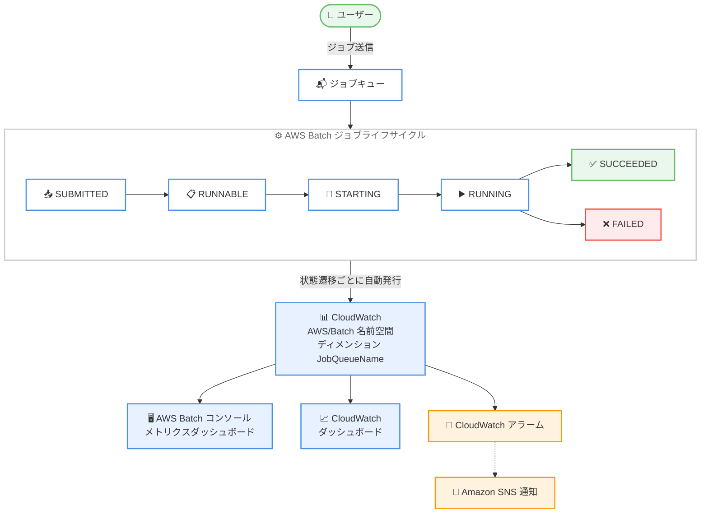

# AWS Batch - Amazon CloudWatch へのジョブメトリクス発行

**リリース日**: 2026 年 10 月 6 日
**サービス**: AWS Batch
**機能**: Amazon CloudWatch へのジョブメトリクスのネイティブ発行

📊 [このアップデートのインフォグラフィックを見る](https://takech9203.github.io/aws-news-summary/20261006-aws-batch-job-cloudwatch-metrics.html)

## 概要

AWS Batch がジョブメトリクスを Amazon CloudWatch に発行するようになり、バッチワークロードのネイティブなオブザーバビリティが提供されるようになりました。AWS Batch はジョブのライフサイクル全体を通じてメトリクスを発行し、ジョブキューの健全性、失敗率、ジョブの所要時間を可視化します。

ジョブの状態遷移メトリクスと所要時間メトリクスは、CloudWatch の `AWS/Batch` 名前空間に `JobQueueName` ディメンション付きで自動発行されます。状態遷移メトリクスは、SUBMITTED、RUNNING、SUCCEEDED、FAILED などの各状態に遷移したジョブ数を追跡します。所要時間メトリクスは、送信から RUNNABLE までの時間や合計実行時間など、状態間でジョブが費やした時間を追跡します。メトリクスは AWS Batch コンソール、Amazon CloudWatch コンソール、AWS CLI、AWS SDK から参照できます。

大規模なバッチ処理を運用するユーザーにとって、追加の実装なしで CloudWatch のダッシュボード、アラーム、異常検知といった標準的なモニタリング機能をそのまま活用できるようになる重要なアップデートです。

**アップデート前の課題**

このアップデート以前は、AWS Batch にはジョブに関するネイティブな CloudWatch メトリクスが存在しませんでした。

- ジョブキューの健全性や失敗率を把握するには、EventBridge のジョブ状態変更イベントを Lambda で処理してカスタムメトリクスを発行するなど、独自のモニタリング基盤を構築する必要があった
- ジョブの滞留 (RUNNABLE 状態での待機時間) や実行時間の傾向を定量的に追跡する標準的な手段がなく、キャパシティ不足やパフォーマンス劣化の検知が遅れがちだった
- 失敗率の上昇に対する CloudWatch アラームを設定するために、カスタム実装とその運用コストが必要だった

**アップデート後の改善**

今回のアップデートにより、以下が追加の実装なしで可能になりました。

- ジョブの状態遷移数 (送信、実行、成功、失敗など) と所要時間が `AWS/Batch` 名前空間へ自動発行され、カスタム実装なしでバッチワークロードを可視化できるようになった
- `JobQueueName` ディメンションにより、ジョブキュー単位での健全性監視、失敗率アラーム、ダッシュボード作成が可能になった
- `JobSubmittedToRunnableDuration` や `JobAttemptExecutionDuration` などの所要時間メトリクスにより、スケジューリング遅延や実行時間のベースライン確立とリグレッション検知が容易になった

## アーキテクチャ図



ジョブがライフサイクルの各状態を遷移するたびに、AWS Batch が状態遷移メトリクスと所要時間メトリクスを `AWS/Batch` 名前空間へ自動発行し、コンソールでの可視化やアラーム通知に活用できる構成を示しています。

## サービスアップデートの詳細

### 主要機能

1. **状態遷移メトリクスの自動発行**
   - ジョブが SUBMITTED、PENDING、RUNNABLE、STARTING、RUNNING、SUCCEEDED、FAILED の各状態に遷移した件数を Count 単位で発行
   - キャンセル (`JobsCancelled`)、強制終了 (`JobsTerminated`)、リトライ (`JobsRetried`) も個別メトリクスとして追跡可能
   - ジョブキューに送信されたジョブが対象で、有効化の設定は不要

2. **所要時間メトリクスの自動発行**
   - 状態間の遷移に要した時間を Milliseconds 単位で発行
   - `JobSubmittedToRunnableDuration` (送信から RUNNABLE まで) や `JobAttemptExecutionDuration` (実行時間) など、スケジューリング遅延と実行性能の両方を計測
   - リトライが発生した場合、試行 (attempt) 単位のメトリクスは到達した試行ごとにデータポイントを発行

3. **`JobQueueName` ディメンションによるグループ化**
   - すべてのメトリクスは `JobQueueName` ディメンション付きで発行され、ジョブキュー単位でのフィルタリングと集計が可能
   - 優先度やワークロード種別ごとにジョブキューを分けている場合、キューごとの健全性を個別に監視できる

4. **AWS Batch コンソールのメトリクスダッシュボード**
   - Batch コンソールの [Dashboard] - [Batch metrics] タブで、最大 5 つのジョブキューとメトリクスを選択してグラフ表示が可能
   - フィルタセットを最大 5 つまで保存でき、ユーザー設定としてセッションをまたいで保持される
   - ジョブキュー詳細画面の [Monitoring] タブでは、そのキューにスコープしたメトリクスを表示可能

### メトリクス一覧

**すべてのジョブタイプに適用されるメトリクス**

| メトリクス | 説明 | 単位 |
|------------|------|------|
| `JobsSubmitted` | ジョブキューに送信されたジョブ数 (アレイジョブはアレイサイズが値になる) | Count |
| `JobsMovedToPending` | PENDING 状態に移行したジョブ数 (依存関係の待機中など) | Count |
| `JobsMovedToRunnable` | RUNNABLE 状態に移行したジョブ数 (初回およびリトライ時) | Count |
| `JobsMovedToStarting` | STARTING 状態に移行したジョブ数 | Count |
| `JobsMovedToRunning` | RUNNING 状態に移行したジョブ数 | Count |
| `JobsMovedToSucceeded` | 正常に完了したジョブ数 | Count |
| `JobsMovedToFailed` | FAILED 状態に移行したジョブ数 (キャンセル・強制終了を含む) | Count |
| `JobsCancelled` | キャンセルされたジョブ数 (実行開始前のキャンセルリクエストによる) | Count |
| `JobsTerminated` | 強制終了されたジョブ数 (終了リクエストによる) | Count |
| `JobsRetried` | リトライされたジョブ試行数 | Count |
| `JobSubmittedToRunnableDuration` | SUBMITTED から RUNNABLE までの所要時間 | Milliseconds |
| `JobAttemptStartingToRunningDuration` | 試行が STARTING で費やした時間 | Milliseconds |
| `JobAttemptExecutionDuration` | 試行の実行時間 (実行開始から停止まで) | Milliseconds |
| `JobAttemptDuration` | 試行の合計時間 (STARTING 開始から試行終了まで) | Milliseconds |

**コンピュートジョブのみに適用されるメトリクス**

| メトリクス | 説明 | 単位 |
|------------|------|------|
| `JobSubmittedToFirstStartingDuration` | SUBMITTED から最初の STARTING までの所要時間 | Milliseconds |
| `JobAttemptRunnableToStartingDuration` | 試行が RUNNABLE で費やした時間 | Milliseconds |

**サービスジョブのみに適用されるメトリクス**

| メトリクス | 説明 | 単位 |
|------------|------|------|
| `JobsMovedToScheduled` | SCHEDULED 状態に移行したジョブ数 (プリエンプション後の再スケジュールを含む) | Count |
| `JobSubmittedToFirstScheduledDuration` | SUBMITTED から最初の SCHEDULED までの所要時間 | Milliseconds |
| `JobAttemptRunnableToScheduledDuration` | 試行が RUNNABLE から SCHEDULED に移行するまでの時間 | Milliseconds |
| `JobAttemptScheduledToStartingDuration` | 最初の SCHEDULED から STARTING までの時間 | Milliseconds |
| `JobsPreempted` | プリエンプトされたジョブ数 (クォータ管理ジョブが対象) | Count |

## 技術仕様

### メトリクスの基本仕様

| 項目 | 詳細 |
|------|------|
| 名前空間 | `AWS/Batch` |
| ディメンション | `JobQueueName` (単一ディメンション) |
| 単位 | 状態遷移メトリクス: Count、所要時間メトリクス: Milliseconds |
| 発行タイミング | ジョブの状態遷移時およびジョブ試行の完了時 (イベント駆動) |
| 有効化設定 | 不要 (自動発行) |
| メトリクス発行の料金 | 追加料金なし |
| 発行の信頼性 | ベストエフォート (まれにデータポイントが欠落する可能性あり) |

### アレイジョブとマルチノード並列ジョブの計上動作

二重カウントを防ぐため、親ジョブと子ジョブのどちらか一方からのみメトリクスが発行されます。

| ジョブタイプ | 動作 |
|--------------|------|
| アレイジョブ | 親ジョブは `JobsSubmitted` のみ発行 (値はアレイサイズ)。その他のメトリクスは各子ジョブが個別に発行。たとえば子ジョブ 1,000 件のアレイジョブを 1 件送信すると、`JobsSubmitted` は値 `1000` の単一データポイントとして発行される |
| マルチノード並列 (MNP) ジョブ | 親ジョブからのみ発行。ノード数にかかわらずジョブ全体として 1 回カウントされる |

### API 変更履歴

本アップデートはサービス側で自動発行されるメトリクスの追加であり、関連する AWS Batch API の変更はありません。

## 設定方法

### 前提条件

1. AWS Batch のジョブキューが作成済みで、ジョブを送信していること
2. メトリクスを参照する IAM ユーザー/ロールに CloudWatch の読み取り権限 (`cloudwatch:GetMetricData`、`cloudwatch:ListMetrics` など) があること
3. アラーム通知を行う場合は Amazon SNS トピックが作成済みであること

### 手順

#### ステップ 1: AWS Batch コンソールでメトリクスを表示する

1. AWS Batch コンソールのナビゲーションペインで [Dashboard] を選択し、[Batch metrics] タブを開く
2. [Display CloudWatch metrics] をオンにする
3. [Filter metrics] で最大 5 つのジョブキューと表示したいメトリクスを選択し、[Apply filters] を選択する

メトリクスごとに 1 つのグラフが表示され、ジョブキューごとに 1 本の線が描画されます。選択内容はフィルタセットとして最大 5 つまで保存できます。なお、コンソールでのメトリクス表示には標準の CloudWatch 料金が発生します。

#### ステップ 2: AWS CLI でメトリクスを取得する

```bash
aws cloudwatch get-metric-statistics \
  --namespace AWS/Batch \
  --metric-name JobsMovedToFailed \
  --dimensions Name=JobQueueName,Value=my-job-queue \
  --start-time 2026-10-06T00:00:00Z \
  --end-time 2026-10-07T00:00:00Z \
  --period 3600 \
  --statistics Sum
```

ジョブキュー `my-job-queue` で FAILED 状態に移行したジョブ数を 1 時間ごとの合計値として取得するコマンドです。`JobQueueName` ディメンションを指定することで、特定のジョブキューにスコープしたデータを取得できます。

#### ステップ 3: 失敗ジョブ数に対する CloudWatch アラームを作成する

```bash
aws cloudwatch put-metric-alarm \
  --alarm-name batch-job-failures-my-job-queue \
  --namespace AWS/Batch \
  --metric-name JobsMovedToFailed \
  --dimensions Name=JobQueueName,Value=my-job-queue \
  --statistic Sum \
  --period 300 \
  --evaluation-periods 1 \
  --threshold 10 \
  --comparison-operator GreaterThanOrEqualToThreshold \
  --treat-missing-data notBreaching \
  --alarm-actions arn:aws:sns:ap-northeast-1:123456789012:batch-alerts
```

5 分間に失敗ジョブが 10 件以上発生した場合に SNS トピックへ通知するアラームを作成するコマンドです。メトリクスはジョブの失敗が発生したときのみ発行されるため、`--treat-missing-data notBreaching` を指定してデータポイントがない期間を正常として扱います。

## メリット

### ビジネス面

- **運用コストの削減**: EventBridge と Lambda によるカスタムメトリクス基盤の構築・保守が不要になり、モニタリングの実装と運用にかかる工数を削減できる
- **障害検知の迅速化**: 失敗率や滞留時間の増加をアラームで即座に検知でき、バッチ処理の遅延がビジネスに影響する前に対処できる
- **追加料金なしのメトリクス発行**: メトリクスの発行自体は無料であり、既存ワークロードに対して追加費用なしで可視性が向上する

### 技術面

- **CloudWatch エコシステムとの統合**: ダッシュボード、アラーム、メトリクス演算、異常検知など CloudWatch の標準機能をそのまま適用できる
- **スケジューリング遅延の定量化**: `JobSubmittedToRunnableDuration` や `JobAttemptRunnableToStartingDuration` により、依存関係待ちやキャパシティ不足によるボトルネックを状態ごとに切り分けられる
- **パフォーマンスベースラインの確立**: `JobAttemptExecutionDuration` の推移を追跡することで、ジョブ実行時間のリグレッションをデータに基づいて検知できる

## デメリット・制約事項

### 制限事項

- メトリクスはベストエフォートで発行される。ジョブの状態遷移はイベント駆動であるため、まれにメトリクスが欠落する可能性がある (例: RUNNING への遷移直後に終了したジョブでは RUNNING 関連メトリクスが発行されないことがある)
- 課金、監査、突合 (リコンシリエーション) 用途には適さず、正確な件数のソースとしては利用できない
- ディメンションは `JobQueueName` のみで、ジョブ定義やコンピュート環境単位での集計はネイティブにはできない
- メトリクスの対象はジョブキューに送信されたジョブのみ

### 考慮すべき点

- アラームやダッシュボードは、まれなデータ欠落を許容する設計 (欠落データの扱いの明示的な指定、適切な評価期間の設定など) にする必要がある
- アレイジョブでは親ジョブが `JobsSubmitted` のみを発行し、その他は子ジョブ単位で計上されるため、「送信数」と「状態遷移数」の母数が異なる点に注意が必要
- コンソールでのメトリクス表示には標準の CloudWatch 料金が発生する (表示をオフにすれば課金は停止)

## ユースケース

### ユースケース 1: ジョブ失敗率の監視とアラート

**シナリオ**: 夜間バッチで大量のジョブを処理しており、コンテナイメージの不具合やデータ異常によるジョブ失敗の多発を早期に検知したい。

**実装例**:
```
CloudWatch メトリクス演算で失敗率を定義してアラームを設定
  失敗率 e1 = (m1 / (m1 + m2)) * 100
  m1: JobsMovedToFailed (Sum, 15 分)
  m2: JobsMovedToSucceeded (Sum, 15 分)
  条件: e1 >= 5 で SNS 通知
```

**効果**: カスタム実装なしでジョブキューごとの失敗率を常時監視でき、障害の影響範囲が拡大する前にオンコール担当へ通知できる。

### ユースケース 2: キャパシティ不足によるジョブ滞留の検知

**シナリオ**: スポットインスタンスベースのコンピュート環境でコスト最適化しているが、キャパシティ不足時にジョブが RUNNABLE 状態で長時間滞留し、SLA に影響することがある。

**実装例**:
```
JobAttemptRunnableToStartingDuration (Average または p90) にアラームを設定
  ディメンション: JobQueueName = spot-queue
  条件: 10 分間の平均が 600000 ミリ秒 (10 分) を超えたら通知
対応アクション: オンデマンドのフォールバックキューへの切り替えや
allocationStrategy の見直しを検討
```

**効果**: スケジューリング遅延を定量的に検知でき、キャパシティ戦略の見直しやフォールバック運用の判断をデータに基づいて行える。

### ユースケース 3: ジョブ実行時間のベースライン管理

**シナリオ**: ゲノム解析やレンダリングなどの長時間ジョブを運用しており、アプリケーション更新後の処理時間の悪化 (リグレッション) を検知したい。

**実装例**:
```
CloudWatch ダッシュボードに以下を配置
  - JobAttemptExecutionDuration (Average, p50, p90) の時系列グラフ
  - JobsMovedToSucceeded / JobsMovedToFailed の Sum
  - JobsRetried の Sum (リトライ増加はアプリ品質劣化のシグナル)
CloudWatch 異常検知 (Anomaly Detection) を JobAttemptExecutionDuration に適用
```

**効果**: 実行時間のベースラインが自動的に学習され、リリース後の性能劣化やリトライ増加を早期に発見できる。

## 料金

AWS Batch によるメトリクスの発行自体は追加料金なしで利用できます。ただし、以下には標準の CloudWatch 料金が適用されます。

- AWS Batch コンソールまたは CloudWatch コンソールでのメトリクス表示 (`GetMetricData` などの API リクエスト料金)
- CloudWatch アラーム、ダッシュボードの作成・利用

| 項目 | 料金 |
|------|------|
| メトリクスの発行 (`AWS/Batch` 名前空間) | 追加料金なし |
| コンソールでのメトリクス表示 | 標準の CloudWatch 料金 (API リクエスト課金) |
| アラーム・ダッシュボード | 標準の CloudWatch 料金 |

詳細は [Amazon CloudWatch の料金ページ](https://aws.amazon.com/cloudwatch/pricing/) を参照してください。

## 利用可能リージョン

AWS Batch が利用可能なすべての AWS リージョンで利用できます (東京・大阪リージョンを含む)。

## 関連サービス・機能

- **Amazon CloudWatch**: メトリクスの保存・可視化・アラーム・異常検知を担う。本アップデートで AWS Batch が `AWS/Batch` 名前空間へのネイティブ発行元となった
- **Amazon EventBridge**: AWS Batch のジョブ状態変更イベントを配信する。個々のジョブ単位でのイベント駆動処理には引き続き EventBridge が適しており、集計ベースの監視は CloudWatch メトリクスで代替できる
- **CloudWatch Container Insights**: AWS Batch コンピュート環境 (ECS/EKS) のリソース使用率 (CPU、メモリなど) を収集する。ジョブライフサイクルメトリクスと組み合わせることで、ジョブとインフラの両面から監視できる
- **Amazon SNS**: CloudWatch アラームの通知先として、ジョブ失敗や滞留の検知を運用チームへ通知できる

## 参考リンク

- 📊 [インフォグラフィック](https://takech9203.github.io/aws-news-summary/20261006-aws-batch-job-cloudwatch-metrics.html)
- [公式発表 (What's New)](https://aws.amazon.com/about-aws/whats-new/2026/10/aws-batch-job-cloudwatch-metrics/)
- [ドキュメント: Using CloudWatch Metrics with AWS Batch](https://docs.aws.amazon.com/batch/latest/userguide/using_cloudwatch_metrics.html)
- [Amazon CloudWatch 料金ページ](https://aws.amazon.com/cloudwatch/pricing/)

## まとめ

AWS Batch のジョブメトリクスが CloudWatch にネイティブ発行されるようになり、これまでカスタム実装が必要だったバッチワークロードの監視が追加料金なし・設定不要で実現できるようになりました。AWS Batch を利用中の場合は、まずコンソールの Batch metrics ダッシュボードでメトリクスを確認し、失敗数 (`JobsMovedToFailed`) と滞留時間 (`JobAttemptRunnableToStartingDuration`) に対するアラームの整備から着手することを推奨します。既存の EventBridge ベースのカスタムメトリクス基盤がある場合は、本機能への移行によって運用の簡素化を検討する価値があります。
