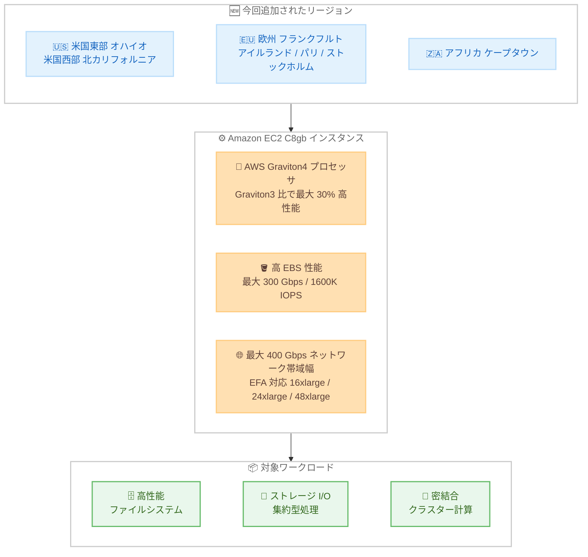

# Amazon EC2 - C8gb インスタンスの利用可能リージョン拡大

**リリース日**: 2026 年 10 月 7 日
**サービス**: Amazon EC2
**機能**: Amazon EC2 C8gb インスタンスの追加リージョン展開

📊 [このアップデートのインフォグラフィックを見る](https://takech9203.github.io/aws-news-summary/20261007-amazon-ec2-c8gb.html)

## 概要

AWS Graviton4 プロセッサを搭載した Amazon EC2 C8gb インスタンスが、新たに米国東部 (オハイオ)、米国西部 (北カリフォルニア)、欧州 (フランクフルト、アイルランド、パリ、ストックホルム)、アフリカ (ケープタウン) の 7 リージョンで利用可能になりました。

C8gb インスタンスは、Graviton3 ベースの EC2 インスタンスと比較して最大 30% 高いコンピュート性能を提供するコンピューティング最適化インスタンスです。最大の特徴は Amazon EBS 性能の高さで、最大 300 Gbps の EBS 帯域幅と 1600K IOPS を実現し、同サイズの他の Graviton4 ベースインスタンスよりも高い EBS 性能を提供します。これにより、高性能ファイルシステムのようなワークロードで、より高いスループットの実現とコストの最適化が可能になります。

スケーラビリティの面では、最大 48xlarge のインスタンスサイズ、最大 384 GiB のメモリ、最大 400 Gbps のネットワーク帯域幅を提供します。また、16xlarge、24xlarge、48xlarge の各サイズでは Elastic Fabric Adapter (EFA) をサポートしており、密結合クラスターでのレイテンシー低減とクラスター性能の向上を実現します。

**アップデート前の課題**

- 米国東部 (オハイオ)、米国西部 (北カリフォルニア)、欧州 (フランクフルト、アイルランド、パリ、ストックホルム)、アフリカ (ケープタウン) の各リージョンでは C8gb インスタンスを利用できなかった
- これらのリージョンで高い EBS 性能を必要とするコンピューティング最適化ワークロードを実行する場合、EBS 帯域幅が相対的に小さい他のインスタンスタイプを選択する必要があった
- 欧州やアフリカのデータレジデンシー要件でリージョンが固定されているワークロードは、C8gb の高い EBS 性能の恩恵を受けられなかった

**アップデート後の改善**

- 上記 7 リージョンで Graviton4 ベースの C8gb インスタンスが起動可能になった
- 最大 300 Gbps の EBS 帯域幅と 1600K IOPS を、これらのリージョンでも利用できるようになった
- 欧州 4 リージョンとアフリカ (ケープタウン) での提供開始により、データレジデンシー要件のあるワークロードでも高性能ブロックストレージアクセスを前提としたアーキテクチャを採用できるようになった

## アーキテクチャ図



今回のアップデートで C8gb インスタンスが利用可能になった 7 リージョンと、C8gb インスタンスの主要な特徴および対象ワークロードの関係を示しています。

## サービスアップデートの詳細

### 主要機能

1. **AWS Graviton4 プロセッサによる高いコンピュート性能**
   - Graviton3 ベースの EC2 インスタンスと比較して最大 30% 高いコンピュート性能を実現
   - AWS が設計した Arm ベースの最新世代プロセッサにより、優れた価格性能比とエネルギー効率を提供

2. **クラス最高水準の EBS 性能**
   - 最大 300 Gbps の EBS 帯域幅と 1600K IOPS を提供
   - 同サイズの他の Graviton4 ベースインスタンスよりも高い EBS 性能を実現
   - 高性能ファイルシステムなどのワークロードで、より高いスループットとコスト最適化が可能

3. **大規模なスケーラビリティ**
   - 最大 48xlarge のインスタンスサイズと最大 384 GiB のメモリを提供
   - 最大 400 Gbps のネットワーク帯域幅をサポート

4. **Elastic Fabric Adapter (EFA) のサポート**
   - 16xlarge、24xlarge、48xlarge の各サイズで EFA をサポート
   - 密結合クラスターにおけるノード間通信のレイテンシーを低減し、クラスター性能を向上

## 技術仕様

### C8gb インスタンスの主な仕様

| 項目 | 詳細 |
|------|------|
| プロセッサ | AWS Graviton4 (Arm ベース) |
| コンピュート性能 | Graviton3 ベースインスタンス比で最大 30% 向上 |
| 最大インスタンスサイズ | 48xlarge |
| 最大メモリ | 384 GiB |
| EBS 帯域幅 | 最大 300 Gbps |
| EBS IOPS | 最大 1600K IOPS |
| ネットワーク帯域幅 | 最大 400 Gbps |
| EFA 対応サイズ | 16xlarge、24xlarge、48xlarge |
| ローカルストレージ | なし (EBS のみ) |

### 主なインスタンスサイズ (Amazon EC2 C8gb インスタンスページより)

| インスタンスサイズ | vCPU | メモリ (GiB) | ネットワーク帯域幅 (Gbps) | EBS 帯域幅 (Gbps) |
|--------------------|------|--------------|---------------------------|--------------------|
| c8gb.medium | 1 | 2 | 最大 16.666 | 最大 25 |
| c8gb.xlarge | 4 | 8 | 最大 26.666 | 最大 25 |
| c8gb.4xlarge | 16 | 32 | 33.333 | 25 |
| c8gb.8xlarge | 32 | 64 | 66.666 | 50 |
| c8gb.16xlarge | 64 | 128 | 133.333 | 100 |
| c8gb.24xlarge | 96 | 192 | 200 | 150 |
| c8gb.48xlarge | 192 | 384 | 400 | 300 |

ベアメタルサイズ (c8gb.metal-24xl、c8gb.metal-48xl) も提供されています。全サイズの一覧は [Amazon EC2 C8gb インスタンスページ](https://aws.amazon.com/ec2/instance-types/c8g/) を参照してください。

### C8g インスタンスとの比較

| 項目 | C8g | C8gb |
|------|-----|------|
| プロセッサ | AWS Graviton4 | AWS Graviton4 |
| EBS 帯域幅 (最大) | 40 Gbps | 300 Gbps |
| 主な用途 | 汎用的なコンピューティング集約型処理 | EBS 性能を重視するコンピューティング集約型処理 |

## 設定方法

### 前提条件

1. AWS アカウントを保有していること
2. アフリカ (ケープタウン) はオプトインリージョンのため、利用前にアカウントで有効化されていること
3. Arm64 アーキテクチャに対応した AMI およびアプリケーションを用意していること

### 手順

#### ステップ 1: 対象リージョンでの利用可能状況を確認

```bash
aws ec2 describe-instance-type-offerings \
  --region eu-central-1 \
  --filters "Name=instance-type,Values=c8gb.*" \
  --query "InstanceTypeOfferings[].InstanceType" \
  --output table
```

欧州 (フランクフルト) リージョンで利用可能な C8gb インスタンスタイプの一覧を取得します。他のリージョンを確認する場合は `--region` の値 (オハイオ: us-east-2、北カリフォルニア: us-west-1、アイルランド: eu-west-1、パリ: eu-west-3、ストックホルム: eu-north-1、ケープタウン: af-south-1) を変更します。

#### ステップ 2: Arm64 対応 AMI を確認

```bash
aws ec2 describe-images \
  --region eu-central-1 \
  --owners amazon \
  --filters "Name=name,Values=al2023-ami-2023*-arm64" "Name=state,Values=available" \
  --query "sort_by(Images, &CreationDate)[-1].{ImageId:ImageId,Name:Name}" \
  --output table
```

欧州 (フランクフルト) リージョンで利用可能な最新の Arm64 版 Amazon Linux 2023 AMI を検索します。C8gb インスタンスは Arm ベースの Graviton4 プロセッサを搭載しているため、Arm64 アーキテクチャの AMI が必要です。

#### ステップ 3: C8gb インスタンスを起動

```bash
aws ec2 run-instances \
  --region eu-central-1 \
  --instance-type c8gb.xlarge \
  --image-id <Arm64 対応 AMI の ID> \
  --key-name <キーペア名> \
  --subnet-id <サブネット ID> \
  --security-group-ids <セキュリティグループ ID>
```

欧州 (フランクフルト) リージョンで c8gb.xlarge インスタンスを起動します。AMI ID、キーペア名、サブネット ID、セキュリティグループ ID は環境に合わせて指定します。AWS Management Console や AWS SDK からも同様に起動できます。

## メリット

### ビジネス面

- **ストレージコストの最適化**: 高い EBS 帯域幅と IOPS により、少ないインスタンス数で高いストレージスループットを実現でき、インスタンスコストの削減が期待できる
- **データレジデンシー要件への対応**: 欧州 4 リージョンとアフリカ (ケープタウン) での提供開始により、域内にデータを保持する必要があるワークロードでも C8gb を選択できるようになった
- **価格性能比の向上**: Graviton3 ベースインスタンス比で最大 30% 高いコンピュート性能により、同一ワークロードのコスト効率改善が期待できる

### 技術面

- **高性能ブロックストレージアクセス**: 最大 300 Gbps の EBS 帯域幅と 1600K IOPS により、ストレージ I/O がボトルネックになりやすいワークロードの性能を改善できる
- **密結合クラスターへの対応**: 16xlarge、24xlarge、48xlarge での EFA サポートにより、ノード間通信のレイテンシーを低減した大規模クラスター構成が可能
- **大規模なスケールアップ**: 最大 48xlarge、384 GiB メモリ、400 Gbps ネットワーク帯域幅により、大規模ワークロードを単一インスタンスまたは少数のインスタンスで処理できる

## デメリット・制約事項

### 制限事項

- C8gb インスタンスは Arm ベースの Graviton4 プロセッサを搭載しているため、x86 専用のソフトウェアやバイナリは動作しない
- 利用にあたっては Arm64 アーキテクチャ対応の AMI、ライブラリ、ミドルウェアが必要
- ローカル NVMe ストレージは搭載されない (EBS のみ)。ローカルストレージが必要な場合は C8gd などの別バリアントを検討する必要がある
- EFA を利用できるのは 16xlarge、24xlarge、48xlarge のサイズに限られる

### 考慮すべき点

- x86 ベースのインスタンスから移行する場合は、アプリケーションの Arm64 対応状況の確認と動作検証が必要
- 最大の EBS 帯域幅 (300 Gbps) を利用できるのは最大サイズ (48xlarge など) であり、サイズごとに EBS 帯域幅とネットワーク帯域幅の上限が異なるため、ワークロードの要件に応じたサイズ選定が必要
- アフリカ (ケープタウン) はオプトインリージョンのため、利用前にアカウントでの有効化が必要
- リージョンごとに利用可能なインスタンスサイズや料金が異なる場合があるため、事前に各リージョンの提供状況と料金を確認することを推奨

## ユースケース

### ユースケース 1: 欧州リージョンでの高性能ファイルシステム構築

**シナリオ**: 欧州域内にデータを保持する要件がある企業が、フランクフルトリージョンで Lustre や自己管理型の並列ファイルシステムを構築し、高いストレージスループットを必要とする。

**実装例**:
```bash
# 欧州 (フランクフルト) リージョンで最大サイズの C8gb インスタンスを起動
aws ec2 run-instances \
  --region eu-central-1 \
  --instance-type c8gb.48xlarge \
  --image-id <Arm64 対応 AMI の ID> \
  --placement "GroupName=<クラスタープレイスメントグループ名>"
```

**効果**: 最大 300 Gbps の EBS 帯域幅と 1600K IOPS により、欧州域内にデータを保持したまま高スループットなファイルシステムを構築できる。

### ユースケース 2: EFA を活用した密結合クラスターの構築

**シナリオ**: ストックホルムリージョンで、ノード間通信のレイテンシーが性能に直結する密結合の分散処理クラスターを運用する。

**実装例**:
```bash
# EFA を有効にして c8gb.24xlarge インスタンスを起動
aws ec2 run-instances \
  --region eu-north-1 \
  --instance-type c8gb.24xlarge \
  --image-id <Arm64 対応 AMI の ID> \
  --network-interfaces "DeviceIndex=0,InterfaceType=efa,SubnetId=<サブネット ID>,Groups=<セキュリティグループ ID>" \
  --placement "GroupName=<クラスタープレイスメントグループ名>"
```

**効果**: EFA によるノード間通信のレイテンシー低減と、Graviton4 の高いコンピュート性能により、クラスター全体の処理性能を向上できる。

### ユースケース 3: ストレージ I/O 集約型データベースワークロードの性能改善

**シナリオ**: 米国東部 (オハイオ) リージョンで自己管理型データベースを運用しており、EBS への I/O がボトルネックになっている。

**実装例**:
```bash
# io2 Block Express ボリュームを接続した C8gb インスタンスを起動
aws ec2 run-instances \
  --region us-east-2 \
  --instance-type c8gb.16xlarge \
  --image-id <Arm64 対応 AMI の ID> \
  --block-device-mappings '[{"DeviceName":"/dev/sdf","Ebs":{"VolumeType":"io2","Iops":64000,"VolumeSize":1000}}]'
```

**効果**: 高い EBS 帯域幅と IOPS により、ストレージ I/O のボトルネックを解消し、データベースのスループットとレイテンシーを改善できる。

## 料金

C8gb インスタンスは、オンデマンド、Savings Plans、リザーブドインスタンス、スポットインスタンスの各購入オプションで利用できます。料金はリージョンおよびインスタンスサイズによって異なるため、最新の料金は [Amazon EC2 料金ページ](https://aws.amazon.com/ec2/pricing/) を参照してください。

## 利用可能リージョン

今回のアップデートにより、以下の 7 リージョンで新たに利用可能になりました。

- 米国東部 (オハイオ)
- 米国西部 (北カリフォルニア)
- 欧州 (フランクフルト)
- 欧州 (アイルランド)
- 欧州 (パリ)
- 欧州 (ストックホルム)
- アフリカ (ケープタウン)

今回の拡大により、C8gb インスタンスは以下のリージョンで利用可能です。

- 米国東部 (バージニア北部、オハイオ)
- 米国西部 (北カリフォルニア、オレゴン)
- 欧州 (フランクフルト、アイルランド、パリ、ストックホルム)
- アフリカ (ケープタウン)

## 関連サービス・機能

- **AWS Graviton4**: C8gb インスタンスに搭載されている AWS 設計の Arm ベースプロセッサ。高い価格性能比とエネルギー効率を提供する
- **Amazon EBS**: C8gb インスタンスは最大 300 Gbps の EBS 帯域幅と 1600K IOPS をサポートし、高スループットなブロックストレージアクセスが可能
- **Elastic Fabric Adapter (EFA)**: 16xlarge、24xlarge、48xlarge でサポートされるネットワークインターフェイス。密結合クラスターのノード間通信レイテンシーを低減する
- **Amazon EC2 C8g インスタンス**: 同じ Graviton4 ベースの標準的なコンピューティング最適化インスタンス。EBS 帯域幅は最大 40 Gbps で、EBS 性能要件が高くない場合の選択肢となる
- **Amazon EC2 C8gd インスタンス**: ローカル NVMe SSD を搭載した Graviton4 ベースのバリアント。ローカルストレージが必要な場合の選択肢となる
- **AWS Graviton Fast Start プログラム**: Graviton ベースインスタンスへの移行を支援するプログラム

## 参考リンク

- 📊 [インフォグラフィック](https://takech9203.github.io/aws-news-summary/20261007-amazon-ec2-c8gb.html)
- [公式発表 (What's New)](https://aws.amazon.com/about-aws/whats-new/2026/10/amazon-ec2-c8gb/)
- [Amazon EC2 C8g / C8gb インスタンス](https://aws.amazon.com/ec2/instance-types/c8g/)
- [Level up your compute with AWS Graviton](https://aws.amazon.com/ec2/graviton/level-up-with-graviton/)
- [AWS Graviton プロセッサ](https://aws.amazon.com/ec2/graviton/)
- [Elastic Fabric Adapter](https://aws.amazon.com/hpc/efa/)
- [Amazon EC2 料金ページ](https://aws.amazon.com/ec2/pricing/)

## まとめ

AWS Graviton4 を搭載し、最大 300 Gbps の EBS 帯域幅と 1600K IOPS を提供する Amazon EC2 C8gb インスタンスが、米国 2 リージョン、欧州 4 リージョン、アフリカ 1 リージョンの計 7 リージョンに拡大しました。高性能ファイルシステムやストレージ I/O 集約型ワークロードをこれらのリージョンで運用している場合は、C8gb への移行によりスループット向上とコスト最適化が期待できます。まずは対象リージョンでのインスタンスサイズの提供状況と、アプリケーションの Arm64 対応状況を確認することを推奨します。
