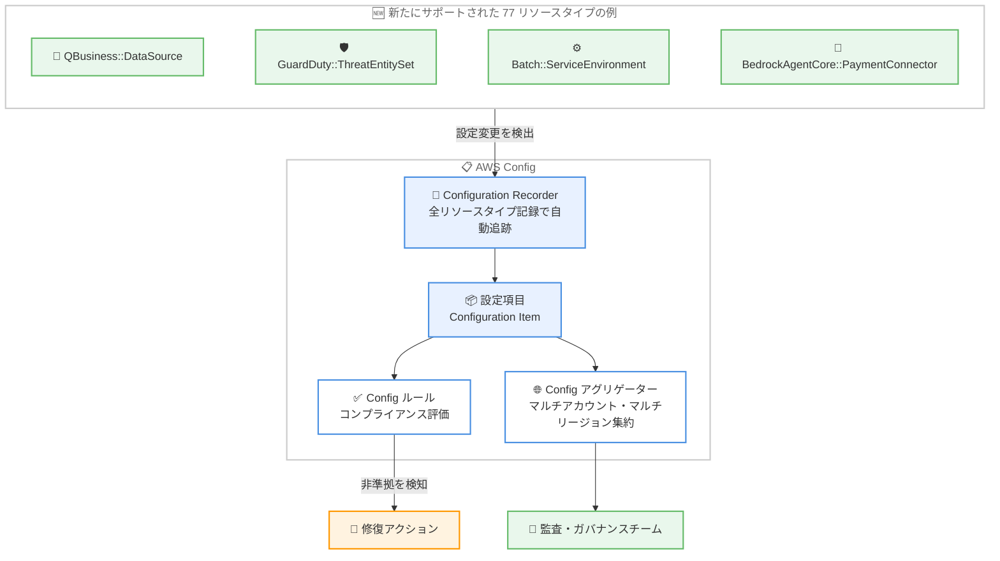

# AWS Config - 77 の新しいリソースタイプのサポート

**リリース日**: 2026 年 10 月 7 日
**サービス**: AWS Config
**機能**: 77 の新しいリソースタイプの記録・評価サポート

📊 [このアップデートのインフォグラフィックを見る](https://takech9203.github.io/aws-news-summary/20261007-aws-config-new-resource-types.html)

## 概要

AWS Config が、Amazon EC2、Amazon S3 Files、Amazon Q Business などの主要サービスにまたがる 77 の新しいリソースタイプをサポートしました。AWS Config は AWS リソースの設定を記録し、変更履歴の追跡、設定の評価、監査、修復を行うサービスです。今回のアップデートにより、より広範な AWS 環境のリソースを検出、評価、監査、修復できるようになります。

すべてのリソースタイプの記録を有効化しているユーザーは、追加の設定なしでこれらの新しいリソースタイプの追跡が自動的に開始されます。また、新しいリソースタイプは Config ルールおよび Config アグリゲーターでも利用可能であり、コンプライアンス評価やマルチアカウント・マルチリージョンでの設定データ集約に組み込むことができます。

追加されたリソースタイプには、`AWS::ApplicationAutoScaling::ScalableTarget` や `AWS::GuardDuty::ThreatEntitySet`、`AWS::QBusiness::DataSource`、`AWS::Batch::ServiceEnvironment`、`AWS::BedrockAgentCore::PaymentConnector` など、生成 AI、セキュリティ、メディア、分析といった幅広い分野のリソースが含まれます。ガバナンスやコンプライアンス要件を持つ組織にとって、監査対象のカバレッジが大きく広がる重要なアップデートです。

**アップデート前の課題**

このアップデート以前は、今回追加された 77 のリソースタイプは AWS Config の記録対象外でした。

- Amazon Q Business のデータソースやプラグイン、Amazon Bedrock AgentCore 関連リソースなど、新しい生成 AI サービスのリソース設定を AWS Config で追跡できなかった
- GuardDuty の脅威エンティティセットや Inspector のコードセキュリティスキャン設定など、セキュリティ関連リソースの設定変更履歴を一元的に監査できなかった
- 対象外のリソースタイプについては、Config ルールによる自動コンプライアンス評価や、アグリゲーターによる組織全体の可視化ができず、個別のカスタム実装や手動確認が必要だった

**アップデート後の改善**

今回のアップデートにより、以下が可能になりました。

- 77 の新しいリソースタイプの設定項目が自動的に記録され、設定変更の履歴追跡とタイムライン表示が可能になった
- 全リソースタイプの記録を有効化している場合、追加の設定作業なしで新しいリソースタイプの追跡が自動的に開始されるようになった
- Config ルールと Config アグリゲーターで新しいリソースタイプを利用でき、コンプライアンス評価と組織全体での設定データ集約の対象範囲が拡大した

## アーキテクチャ図



新たにサポートされたリソースタイプの設定変更が Configuration Recorder により自動的に記録され、設定項目として保存された後、Config ルールによるコンプライアンス評価と Config アグリゲーターによる組織全体の集約に活用される流れを示しています。

## サービスアップデートの詳細

### 主要機能

1. **77 の新しいリソースタイプの記録**
   - Amazon EC2、Amazon S3 Files、Amazon Q Business をはじめとする幅広いサービスのリソースタイプが追加
   - 設定変更が設定項目として記録され、変更履歴の追跡とリソース間の関係性の把握が可能
   - 全リソースタイプの記録 (recording all resource types) を有効化している場合は自動的に追跡が開始され、追加の作業は不要

2. **Config ルールでの利用**
   - 新しいリソースタイプを対象としたカスタムルールやマネージドルールによる評価が可能
   - 設定変更をトリガーとした継続的なコンプライアンスチェックに組み込み可能

3. **Config アグリゲーターでの利用**
   - マルチアカウント・マルチリージョン環境での設定データとコンプライアンス状況の集約対象に新しいリソースタイプが追加
   - AWS Organizations と連携した組織全体のガバナンス強化に活用可能

### 新規サポートリソースタイプの主な分野

| 分野 | リソースタイプの例 |
|------|--------------------|
| 生成 AI / 機械学習 | `AWS::QBusiness::DataSource`、`AWS::QBusiness::Index`、`AWS::QBusiness::Plugin`、`AWS::BedrockAgentCore::PaymentConnector`、`AWS::BedrockAgentCore::ResourcePolicy`、`AWS::Wisdom::AIGuardrail` |
| セキュリティ | `AWS::GuardDuty::ThreatEntitySet`、`AWS::GuardDuty::TrustedEntitySet`、`AWS::InspectorV2::CodeSecurityScanConfiguration`、`AWS::SSO::Application` |
| コンピューティング | `AWS::ApplicationAutoScaling::ScalableTarget`、`AWS::Batch::ServiceEnvironment`、`AWS::Batch::QuotaShare`、`AWS::PCS::Cluster`、`AWS::EKS::Capability` |
| ストレージ | `AWS::S3Files::AccessPoint`、`AWS::S3Files::FileSystem`、`AWS::S3Files::FileSystemPolicy`、`AWS::S3Files::MountTarget` |
| ネットワーキング | `AWS::EC2::VPCCidrBlock`、`AWS::EC2::TransitGatewayMeteringPolicy`、`AWS::ARCRegionSwitch::Plan` |
| 分析・データ | `AWS::Timestream::InfluxDBCluster`、`AWS::OpenSearchServerless::CollectionGroup`、`AWS::Glue::Blueprint`、`AWS::DataSync::LocationFSxONTAP` |
| メディア | `AWS::MediaConnect::RouterInput`、`AWS::MediaLive::Multiplex`、`AWS::MediaPackageV2::ChannelPolicy`、`AWS::MediaTailor::ChannelPolicy` |
| 運用管理 | `AWS::CloudWatch::AlarmMuteRule`、`AWS::SSM::MaintenanceWindow`、`AWS::CUR::ReportDefinition`、`AWS::Notifications::NotificationHub` |

上記は 77 タイプの一部です。完全な一覧は [AWS Config がサポートするリソースタイプ](https://docs.aws.amazon.com/config/latest/developerguide/resource-config-reference.html) を参照してください。

## 技術仕様

### 記録動作

| 項目 | 詳細 |
|------|------|
| 自動追跡の条件 | Configuration Recorder で全リソースタイプの記録を有効化している場合、自動的に追跡開始 |
| 選択的記録 | 特定のリソースタイプのみ記録する設定の場合、新しいリソースタイプを明示的に追加する必要あり |
| 記録される情報 | リソースの設定内容、メタデータ、リソース間の関係性、設定変更履歴 |
| 利用可能な機能 | 設定履歴、設定スナップショット、Config ルール、Config アグリゲーター |

## 設定方法

### 前提条件

1. AWS Config が有効化されていること
2. Configuration Recorder が設定されていること
3. AWS Config のサービスにリンクされたロール、または適切な IAM ロールが設定されていること

### 手順

#### ステップ 1: 現在の記録設定を確認する

```bash
aws configservice describe-configuration-recorders
```

Configuration Recorder の現在の設定を表示します。`recordingGroup` の `allSupported` が `true` の場合、全リソースタイプの記録が有効であり、新しいリソースタイプは自動的に追跡されるため追加の作業は不要です。

#### ステップ 2: 特定のリソースタイプのみ記録している場合は記録対象に追加する

```bash
aws configservice put-configuration-recorder \
  --configuration-recorder name=default,roleARN=arn:aws:iam::123456789012:role/aws-service-role/config.amazonaws.com/AWSServiceRoleForConfig \
  --recording-group allSupported=false,includeGlobalResourceTypes=false,resourceTypes="AWS::QBusiness::DataSource,AWS::GuardDuty::ThreatEntitySet"
```

選択的記録を使用している場合に、新しいリソースタイプを記録対象として明示的に追加します。この例では Amazon Q Business のデータソースと GuardDuty の脅威エンティティセットを追加しています。

#### ステップ 3: 記録された設定項目を確認する

```bash
aws configservice list-discovered-resources \
  --resource-type "AWS::QBusiness::DataSource"
```

指定したリソースタイプについて AWS Config が検出したリソースの一覧を表示し、新しいリソースタイプの記録が開始されたことを確認します。

## メリット

### ビジネス面

- **コンプライアンスカバレッジの拡大**: 生成 AI やセキュリティ関連の新しいサービスを含む 77 のリソースタイプが監査対象となり、組織のガバナンス要件への対応範囲が広がる
- **運用負荷の軽減**: 全リソースタイプの記録を有効化している場合は自動的に追跡が開始されるため、追加の設定作業やカスタム実装が不要
- **監査対応の効率化**: 設定変更履歴が自動的に記録されるため、監査時のエビデンス収集を効率化できる

### 技術面

- **設定変更の可視化**: 新しいリソースタイプの設定変更履歴をタイムラインで追跡でき、障害調査や変更管理に活用できる
- **自動コンプライアンス評価**: Config ルールにより、新しいリソースタイプに対する組織ポリシーへの準拠を継続的かつ自動的に評価できる
- **組織全体の一元管理**: Config アグリゲーターにより、マルチアカウント・マルチリージョン環境における新しいリソースタイプの設定とコンプライアンス状況を一元的に把握できる

## デメリット・制約事項

### 制限事項

- 新しいリソースタイプが利用できるのは、各リソースタイプの基盤となるサービスが利用可能なリージョンに限られる
- 選択的記録 (特定リソースタイプのみの記録) を使用している場合は、新しいリソースタイプを記録対象に明示的に追加する必要がある
- リソースタイプごとにサポートされるリージョンが異なるため、[リソースカバレッジのドキュメント](https://docs.aws.amazon.com/config/latest/developerguide/what-is-resource-config-coverage.html)での確認が必要

### 考慮すべき点

- 全リソースタイプの記録を有効化している場合、新しいリソースタイプの設定項目が自動的に記録されるため、対象リソースを多く利用している環境では記録される設定項目数が増加し、AWS Config の利用料金が増える可能性がある
- 記録対象の増加に伴い、設定スナップショットや履歴を保存する S3 バケットのストレージコストも増加し得るため、ライフサイクルポリシーの見直しを推奨

## ユースケース

### ユースケース 1: 生成 AI サービスのガバナンス強化

**シナリオ**: Amazon Q Business を全社導入している企業が、データソースやプラグインの設定変更を追跡し、意図しない外部データ接続がないかを継続的に監査したい。

**実装例**:
```bash
# Q Business データソースの設定変更履歴を取得
aws configservice get-resource-config-history \
  --resource-type "AWS::QBusiness::DataSource" \
  --resource-id <データソース ID>
```

**効果**: データソースの追加・変更が設定項目として自動記録され、いつ、どのような設定変更が行われたかを監査証跡として残せる。

### ユースケース 2: セキュリティ設定のコンプライアンス評価

**シナリオ**: セキュリティチームが、GuardDuty の脅威エンティティセットや信頼済みエンティティセットの設定が組織の標準から逸脱していないかを自動チェックしたい。

**実装例**:
```bash
# カスタム Config ルールで新しいリソースタイプを評価対象に設定
aws configservice put-config-rule \
  --config-rule file://guardduty-entityset-rule.json
```

**効果**: 脅威エンティティセットの設定変更をトリガーに自動評価が実行され、非準拠の設定を早期に検知して修復アクションにつなげられる。

### ユースケース 3: マルチアカウント環境での新サービス利用状況の把握

**シナリオ**: 大規模組織の CCoE チームが、各アカウントで利用が始まった Amazon S3 Files や AWS PCS などの新しいサービスのリソースを組織全体で可視化したい。

**実装例**:
```bash
# アグリゲーターで組織全体のリソースを横断検索
aws configservice select-aggregate-resource-config \
  --configuration-aggregator-name organization-aggregator \
  --expression "SELECT accountId, awsRegion, resourceId WHERE resourceType = 'AWS::S3Files::FileSystem'"
```

**効果**: 組織内のどのアカウント・リージョンで新しいサービスのリソースが作成されているかを一元的に把握し、ガバナンスポリシーの適用漏れを防げる。

## 料金

AWS Config の料金は、記録された設定項目数と Config ルールの評価数に基づく従量課金です。新しいリソースタイプの追加自体に料金は発生しませんが、記録対象リソースが増えることで設定項目数と評価数が増加する可能性があります。

### 料金例 (米国東部、バージニア北部リージョン)

| 項目 | 料金 |
|------|------|
| 設定項目の記録 (継続的記録) | 0.003 USD / 設定項目 |
| 設定項目の記録 (日次記録) | 0.012 USD / 設定項目 |
| Config ルール評価 (最初の 100,000 評価) | 0.001 USD / 評価 |
| コンフォーマンスパック評価 (最初の 100,000 評価) | 0.001 USD / 評価 |

最新の料金は [AWS Config 料金ページ](https://aws.amazon.com/config/pricing/)を参照してください。

## 利用可能リージョン

新しいリソースタイプは、各リソースタイプの基盤となるサービスが利用可能なすべての AWS リージョンで利用できます。リソースタイプごとのリージョン対応状況は、[AWS Config developer guide のリソースカバレッジページ](https://docs.aws.amazon.com/config/latest/developerguide/what-is-resource-config-coverage.html)で確認できます。

## 関連サービス・機能

- **AWS Config ルール**: 新しいリソースタイプを対象としたコンプライアンス評価が可能になり、組織ポリシーへの準拠を自動チェックできる
- **AWS Config アグリゲーター**: マルチアカウント・マルチリージョンでの設定データ集約に新しいリソースタイプが含まれ、組織全体の可視性が向上する
- **AWS CloudTrail**: Config が「どのような設定になっているか」を記録するのに対し、CloudTrail は「誰が何を操作したか」を記録し、両者を組み合わせることで包括的な監査が実現できる
- **AWS Security Hub**: Config ルールの評価結果を Security Hub に集約し、セキュリティ態勢の一元管理に活用できる

## 参考リンク

- 📊 [インフォグラフィック](https://takech9203.github.io/aws-news-summary/20261007-aws-config-new-resource-types.html)
- [公式発表 (What's New)](https://aws.amazon.com/about-aws/whats-new/2026/10/aws-config-new-resource-types)
- [AWS Config がサポートするリソースタイプ](https://docs.aws.amazon.com/config/latest/developerguide/resource-config-reference.html)
- [リソースカバレッジのドキュメント](https://docs.aws.amazon.com/config/latest/developerguide/what-is-resource-config-coverage.html)
- [AWS Config 料金ページ](https://aws.amazon.com/config/pricing/)

## まとめ

AWS Config のサポート対象に 77 の新しいリソースタイプが追加され、生成 AI、セキュリティ、メディア、分析など幅広い分野のリソースを監査対象に含められるようになりました。全リソースタイプの記録を有効化している環境では自動的に追跡が開始されるため、まずは Configuration Recorder の設定を確認し、選択的記録を使用している場合は必要なリソースタイプの追加を検討してください。あわせて、記録対象の増加に伴うコスト影響の確認を推奨します。
