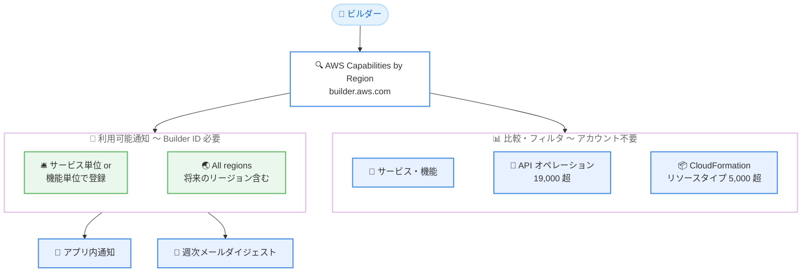

# AWS Builder Center - AWS Capabilities by Region の機能単位の利用可能通知と高度なフィルタ機能

**リリース日**: 2026 年 10 月 7 日
**サービス**: AWS Builder Center (AWS Capabilities by Region)
**機能**: 個別機能の利用可能通知と高度なフィルタ機能

📊 [このアップデートのインフォグラフィックを見る](https://takech9203.github.io/aws-news-summary/20261007-awscapabilities-enhancements.html)

## 概要

AWS Builder Center で提供されている AWS Capabilities by Region に、2 つの大きな機能強化が追加されました。1 つ目は利用可能通知で、AWS サービス全体だけでなく、サービス内の個別機能を単位として、関心のあるリージョンで利用可能になった際に通知を受け取れるようになりました。通知はアプリ内通知と週次のメールダイジェストで配信されます。2 つ目は高度なフィルタ機能で、19,000 を超える API オペレーションと 5,000 を超える CloudFormation リソースタイプを利用可能状況でフィルタリングし、リージョン間で比較できるようになりました。

AWS Capabilities by Region は、AWS のサービス、機能、API オペレーション、CloudFormation リソースのリージョン別の利用可能状況を一元的に確認できるプランニングツールです。将来のリージョン展開予定 (目標四半期) を含むロードマップ情報も提供しており、マルチリージョン展開やリージョン移行を計画するビルダーにとって信頼できる情報源となります。

リージョンの比較はアカウント不要で利用できます。通知の設定には無料の AWS Builder ID が必要です。

**アップデート前の課題**

このアップデート以前は、リージョン別の利用可能状況の追跡に手間がかかっていました。

- 特定の機能がリージョンで利用可能になったかを知るには、What's New の発表やドキュメントを定期的に手動で確認する必要があった
- サービス単位の情報は確認できても、サービス内の個別機能の展開を自動的に追跡する手段がなかった
- API オペレーションや CloudFormation リソースタイプを利用可能状況で絞り込んで比較することができず、大量の項目から目視で差分を探す必要があった

**アップデート後の改善**

今回のアップデートにより、リージョン展開の追跡と比較が大幅に効率化されました。

- サービス単位または個別機能単位で通知を設定でき、利用可能になるとアプリ内通知と週次メールダイジェストで自動的に把握できるようになった
- 「All regions」オプションを選択すると、将来開設されるリージョンを含むすべてのリージョンが通知対象になった
- 19,000 超の API オペレーションと 5,000 超の CloudFormation リソースタイプを利用可能状況でフィルタリングし、「すべて表示」「一致のみ」「差分のみ」の比較モードでリージョン間比較ができるようになった

## アーキテクチャ図



AWS Capabilities by Region では、アカウント不要でサービス・機能・API・CloudFormation リソースの比較とフィルタリングができ、Builder ID でサインインすると通知を設定してアプリ内通知と週次メールダイジェストを受け取れます。

## サービスアップデートの詳細

### 主要機能

1. **個別機能単位の利用可能通知**
   - ベルアイコンを選択することで、関心のあるリージョンにおけるサービスまたは個別機能の利用可能通知を登録できる
   - サービス単位で登録すると、そのサービス配下のすべての機能が自動的に通知対象になる
   - 機能単位で登録すると、その機能のみが通知対象になる
   - 通知が重複して登録されている場合でも、配信されるアラートは 1 件に集約される

2. **「All regions」オプション**
   - すべてのリージョンを対象とするキャッチオール設定で、将来開設される AWS リージョンも自動的に含まれる
   - 「All regions」を選択すると、同じ行に設定済みの個別リージョンの通知登録は置き換えられる
   - 広い範囲の通知が既に設定されているセルでは、ベルアイコンがグレーアウト表示される

3. **通知の配信方法**
   - アプリ内通知: AWS Builder Center 上でリアルタイムに確認できる
   - 週次メールダイジェスト: 通知を有効化して以降に利用可能になったケイパビリティをまとめて配信

4. **API オペレーションと CloudFormation リソースの高度なフィルタ**
   - 19,000 を超える API オペレーションを利用可能状況 (Available / Unavailable) でフィルタリングできる
   - 5,000 を超える CloudFormation リソースタイプ (EC2 インスタンスタイプ、RDS エンジンバージョンなど) も同様にフィルタリングできる
   - 既存の検索機能や表示設定と組み合わせて利用できる

5. **リージョン比較モード**
   - 「すべてのケイパビリティを表示」「一致する項目のみ表示」「差分のみ表示」の 3 つの比較モードを選択できる
   - 複数リージョンを並べて比較でき、デフォルトでは us-east-1 が選択済みの状態で表示される

## 技術仕様

### AWS Capabilities by Region のデータ構成

| 項目 | 詳細 |
|------|------|
| データの粒度 | サービス、機能、API オペレーション、CloudFormation リソースの 4 階層 |
| API オペレーション数 | 19,000 超 |
| CloudFormation リソースタイプ数 | 5,000 超 |
| サービスカテゴリ | Core AWS Services (全リージョン展開を想定)、Business Applications (地理的需要に応じて展開)、Specialized Offerings (需要・規制・技術要件に応じて選択的に展開) |
| 利用可能状況の表示 | Available、Planning、Not Expanding、目標四半期 (YYYY QQ) |
| 比較モード | すべて表示 / 一致のみ / 差分のみ |
| 通知の単位 | サービス単位、機能単位、リージョン単位、All regions (将来のリージョン含む) |
| 通知の配信方法 | アプリ内通知 + 週次メールダイジェスト |

### 利用要件

| 操作 | 要件 |
|------|------|
| ケイパビリティの検索・比較・フィルタリング | アカウント不要 |
| 利用可能通知の設定 | AWS Builder ID (無料) |

## 設定方法

### 前提条件

1. Web ブラウザから AWS Builder Center (builder.aws.com) にアクセスできること
2. 通知を設定する場合は、無料の AWS Builder ID を作成しておくこと (未サインインでベルアイコンを選択した場合はサインインを促され、サインイン後に同じ画面に戻る)

### 手順

#### ステップ 1: AWS Capabilities by Region にアクセスする

ブラウザで以下の URL を開きます。

```text
https://builder.aws.com/build/capabilities/explore
```

アカウントにサインインしていなくても、サービス・機能・API オペレーション・CloudFormation リソースの検索と比較が可能です。

#### ステップ 2: リージョンを選択してフィルタと比較モードを設定する

比較したいリージョンを追加し、「API operations」タブまたは「CloudFormation resources」タブで利用可能状況フィルタを設定します。比較モードは「すべて表示」「一致のみ」「差分のみ」から選択できます。たとえば「差分のみ」を選択すると、リージョン間で利用可能状況が異なる項目だけが表示され、移行時のギャップを素早く特定できます。

なお、Planning timeframe (計画時期) のフィルタは「Services and features」タブのみに存在します。API と CloudFormation のデータは Available / Unavailable の 2 値であり、計画日程を持たないためです。

#### ステップ 3: 利用可能通知を設定する

通知を受け取りたいサービスまたは機能の行で、対象リージョンのベルアイコンを選択します。Builder ID でサインインしていない場合はサインインを求められます。

- サービス単位で登録すると、配下のすべての機能が通知対象になります
- 将来のリージョンも含めてすべてのリージョンを対象にする場合は「All regions」列のベルアイコンを選択します

設定後は、対象のケイパビリティが利用可能になった時点でアプリ内通知が届き、週次のメールダイジェストにもまとめて記載されます。

## メリット

### ビジネス面

- **リージョン展開計画の精度向上**: 目標四半期を含むロードマップ情報と通知を組み合わせることで、新リージョンへの進出やサービス展開の計画を事実に基づいて立案できる
- **情報収集コストの削減**: What's New を手動で監視する作業が不要になり、必要な機能の利用可能通知だけを自動的に受け取れる
- **無料で利用可能**: ツール、通知、Builder ID のすべてが無料で、比較機能はアカウントすら不要なため導入障壁がない

### 技術面

- **機能単位の精緻な追跡**: サービス全体ではなく、依存している個別機能の展開状況をピンポイントで追跡できる
- **API・CloudFormation レベルの互換性確認**: 19,000 超の API オペレーションと 5,000 超のリソースタイプを対象に、IaC テンプレートや自動化コードがターゲットリージョンで動作するかを事前に検証できる
- **差分比較による移行ギャップの可視化**: 「差分のみ」モードにより、現行リージョンと移行先リージョンの機能ギャップを即座に特定できる

## デメリット・制約事項

### 制限事項

- 通知の設定には AWS Builder ID へのサインインが必要 (閲覧・比較は不要)
- メール通知は週次ダイジェスト形式であり、リアルタイムのメール配信ではない (リアルタイムの把握にはアプリ内通知を利用)
- Planning timeframe フィルタは「Services and features」タブのみで利用可能で、API オペレーションと CloudFormation リソースには計画日程の情報がない
- 「All regions」を選択すると、同じ行の既存の個別リージョン登録が置き換えられ、その後「All regions」を無効化するとその行の通知登録がすべて削除される

### 考慮すべき点

- 広い範囲の通知が既に設定されている場合、より狭い範囲のベルアイコンはグレーアウトされるため、通知設計はサービス単位か機能単位かを事前に決めておくとよい
- ロードマップ上の目標四半期は計画情報であり、実際のリリース時期は変更される可能性がある
- データの正確性に懸念がある場合は、サポートリクエストを通じて報告できる

## ユースケース

### ユースケース 1: 新機能の東京・大阪リージョン展開の自動追跡

**シナリオ**: 米国リージョンで先行リリースされた新機能を利用したいが、本番環境は東京リージョンと大阪リージョンにあり、利用可能になり次第すぐに導入したい。

**実装例**:
```text
1. AWS Capabilities by Region で対象機能を検索
2. 機能の行で Asia Pacific (Tokyo) と Asia Pacific (Osaka) の
   ベルアイコンを選択して通知を登録
3. 利用可能になるとアプリ内通知と週次メールダイジェストで把握
```

**効果**: What's New の手動監視が不要になり、機能が利用可能になった直後に導入検討を開始できる。

### ユースケース 2: リージョン移行前の API 互換性チェック

**シナリオ**: us-east-1 で稼働中のワークロードを別リージョンに移行するにあたり、利用中の API オペレーションと CloudFormation リソースタイプが移行先で利用可能かを確認したい。

**実装例**:
```text
1. 「API operations」タブで us-east-1 と移行先リージョンを選択
2. 比較モードを「差分のみ」に設定し、利用可能状況フィルタを適用
3. 「CloudFormation resources」タブでも同様に差分を確認
4. 差分として検出された項目について、代替手段や展開予定を検討
```

**効果**: 19,000 超の API オペレーションと 5,000 超のリソースタイプの差分を目視確認なしで特定でき、移行計画のリスクを事前に低減できる。

### ユースケース 3: 将来開設されるリージョンへの進出準備

**シナリオ**: 事業拡大に伴い、将来開設される可能性のある新リージョンも含めて、ワークロードの中核となるサービス群の展開状況を継続的に把握したい。

**実装例**:
```text
1. 中核サービス (例: コンピューティング、データベース、分析) を
   サービス単位で選択
2. 「All regions」列のベルアイコンを選択して、
   将来のリージョンを含むすべてのリージョンを通知対象に設定
3. 新リージョン開設後も自動的に通知対象に含まれる
```

**効果**: 新リージョンが開設されるたびに通知設定を追加する必要がなく、グローバル展開の判断材料を自動的に収集できる。

## 料金

AWS Capabilities by Region のすべての機能 (検索、比較、フィルタ、通知) は無料で利用できます。

- ケイパビリティの比較: アカウント不要・無料
- 利用可能通知: 無料の AWS Builder ID が必要
- AWS Builder ID の作成: 無料

## 利用可能リージョン

AWS Builder Center はグローバルに提供される Web ツールであり、特定のリージョンに依存せず利用できます。ツール自体がすべての AWS 商用リージョンの利用可能状況データをカバーしています。

## 関連サービス・機能

- **AWS Builder Center**: AWS Capabilities by Region をホストするビルダー向けポータル。Builder ID による通知管理機能を提供する
- **AWS Builder ID**: 通知設定に必要な無料のアカウント。AWS アカウントとは独立しており、個人に紐づく
- **AWS Knowledge MCP Server**: 既存インフラの分析とリージョン展開の推奨事項生成に利用できる無料の MCP サーバー。AWS アカウント不要だがレート制限がある
- **AWS CloudFormation**: リソースタイプ単位の利用可能状況が本ツールで確認でき、IaC テンプレートのリージョン互換性チェックに活用できる

## 参考リンク

- 📊 [インフォグラフィック](https://takech9203.github.io/aws-news-summary/20261007-awscapabilities-enhancements.html)
- [公式発表 (What's New)](https://aws.amazon.com/about-aws/whats-new/2026/10/awscapabilities-enhancements/)
- [AWS Capabilities by Region](https://builder.aws.com/build/capabilities/explore)
- [AWS Builder Center FAQ](https://builder.aws.com/faq#aws-capabilities-by-region)

## まとめ

AWS Capabilities by Region の今回の機能強化により、サービス単位・機能単位の利用可能通知と、API オペレーション・CloudFormation リソースの高度なフィルタリングが可能になり、リージョン展開の追跡と移行計画の立案が大幅に効率化されます。マルチリージョン構成やリージョン移行を検討しているチームは、無料の Builder ID を作成し、依存する機能の通知を設定しておくことを推奨します。
