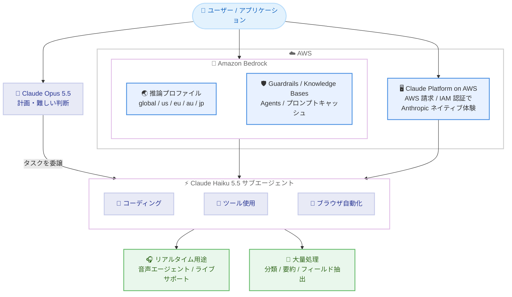

# AWS - Anthropic Claude Haiku 5.5 の提供開始

**リリース日**: 2026 年 10 月 7 日
**サービス**: Amazon Bedrock / Claude Platform on AWS
**機能**: Anthropic Claude Haiku 5.5 モデルの提供開始

📊 [このアップデートのインフォグラフィックを見る](https://takech9203.github.io/aws-news-summary/20261007-claude-haiku-5-5-aws.html)

## 概要

Claude 5.5 ファミリーで最速・最高効率のモデル Claude Haiku 5.5 が AWS で利用可能になりました。サブエージェントや大量・コスト重視のワークロード向けに設計されたモデルで、Anthropic によると多くのタスクで Claude Haiku 4.5 より約 75% 低いコストで利用できます。コーディング、ツール使用、コンピュータ操作 (computer use)、エージェントタスクのいずれでも Haiku 4.5 から大幅に向上した、これまでで最も高性能な Haiku です。また、Haiku として初めて effort controls をサポートし、タスクごとにコストと知能のバランスを調整できます。

想定される用途は 3 つあります。(1) 音声エージェント、ライブサポート、アプリ内アシスタントなどの応答速度が重要なリアルタイム体験、(2) 分類、要約、ドキュメントからのフィールド抽出などの大量処理タスク、(3) Claude Opus 5.5 などの上位モデルが作業を計画し、スコープが明確なコーディング・ツール使用・ブラウザ自動化タスクを委譲するサブエージェントとしての利用です。多数のエージェントを並列実行する構成において、実行役として経済的に機能します。

アクセス経路は 2 つ用意されています。(1) Amazon Bedrock 経由では、データを AWS インフラストラクチャ内に保持し、Guardrails や Knowledge Bases などの AWS マネージド機能と統合して利用できます。(2) Claude Platform on AWS 経由では、AWS コンソールから Anthropic のネイティブなプラットフォーム体験 (Claude Console、Anthropic の API) に、AWS の請求と認証を統合した形でアクセスできます。

**アップデート前の課題**

- Haiku 4.5 では、コーディングやエージェントタスクの性能と実行コストの両立に限界があり、大量実行ワークロードのコストが課題になりやすかった
- Haiku クラスのモデルでは effort controls が利用できず、タスクごとにコストと知能のバランスを調整できなかった
- 上位モデルからタスクを委譲するサブエージェント構成では、実行役モデルの能力がボトルネックになることがあった

**アップデート後の改善**

- 多くのタスクで Haiku 4.5 比約 75% の低コストとなり、分類・要約・抽出などの大量処理を経済的に実行できるようになった
- Haiku として初めて effort controls (low / medium / high / xhigh / max) に対応し、タスク単位でコストと知能をチューニングできるようになった
- コーディング、ツール使用、コンピュータ操作、エージェントタスクの性能が向上し、Opus 5.5 配下のサブエージェントとして明確に定義されたタスクを高速・並列に処理できるようになった
- 日本 (東京・大阪) を含む Geo クロスリージョン推論プロファイルが提供され、地理内にルーティングを留めた推論が可能になった

## アーキテクチャ図



Claude Haiku 5.5 は Amazon Bedrock または Claude Platform on AWS からアクセスでき、Claude Opus 5.5 などの上位モデルが計画した明確なタスクを並列に実行するサブエージェント、リアルタイム体験、大量処理タスクの実行役として機能します。

## サービスアップデートの詳細

### 主要機能

1. **Haiku 4.5 比約 75% の低コスト**
   - Anthropic によると、多くのタスクで Claude Haiku 4.5 より約 75% 低いコストで利用可能
   - 大量・コスト重視のワークロードや、多数のエージェントを並列実行する構成に適合
   - Claude 5.5 ファミリーで最速・最高効率のモデルという位置づけ

2. **Haiku 初の effort controls**
   - タスクごとにコストと知能のバランスを調整可能
   - effort レベルは low / medium / high / xhigh / max の 5 段階 (デフォルト: medium)
   - adaptive thinking (推論) がデフォルトで有効で、無効化も可能 (thinking 無効時の effort 上限は high)

3. **コーディング・エージェント能力の大幅向上**
   - コーディング、ツール使用、コンピュータ操作 (computer_20251124 ツール対応)、エージェントタスクで Haiku 4.5 から大幅に向上
   - リクエストのルーティング、コードレビュー、ナレッジベースへの Q&A、反復的なブラウザ・デスクトップ自動化などに対応
   - 上位モデル (Claude Opus 5.5 など) が計画した明確なタスクを受け取るサブエージェントとして動作

4. **1M トークンコンテキストと大規模出力**
   - コンテキストウィンドウは 1M トークン、最大出力は 128K トークン
   - 入力はテキストと画像 (高解像度画像を含む)、出力はテキストに対応。知識カットオフは 2026 年 6 月

5. **Amazon Bedrock の各種機能と統合**
   - Guardrails、Knowledge Bases、Agents、Flows、プロンプト管理・最適化、モデル評価、computer use に対応
   - 暗黙的・明示的プロンプトキャッシュに対応 (チェックポイントあたり最小 512 トークン、リクエストあたり最大 4 チェックポイント、TTL は 5 分または 1 時間)
   - Global に加えて US / EU / AU / JP の Geo クロスリージョン推論プロファイルを提供

6. **Claude Platform on AWS でのネイティブ体験**
   - AWS コンソールの Claude Platform on AWS サービスページからサインアップし、AWS Marketplace サブスクリプションを自動処理
   - Anthropic と直接取引する場合と同じ API・機能・コンソール体験を、AWS の請求と IAM 認証で利用可能

## 技術仕様

### モデル仕様

| 項目 | 詳細 |
|------|------|
| プロバイダー | Anthropic |
| モデル ID | `anthropic.claude-haiku-5-5` |
| 推論プロファイル | `global.anthropic.claude-haiku-5-5` (Global)、`us.` / `eu.` / `au.` / `jp.anthropic.claude-haiku-5-5` (Geo) |
| コンテキストウィンドウ | 1M トークン |
| 最大出力トークン | 128K トークン |
| 入力モダリティ | テキスト、画像 |
| 出力モダリティ | テキスト |
| 推論 | adaptive thinking がデフォルトで有効。effort は low / medium / high / xhigh / max (デフォルト: medium) |
| 知識カットオフ | 2026 年 6 月 |
| 対応 API | Messages / Converse / InvokeModel (bedrock-runtime)、Messages (bedrock-mantle) |
| サービスティア | Standard のみ (Priority / Flex / Reserved / Batch は非対応) |
| モデルリリース日 | 2026 年 10 月 7 日 |
| EOL | 2027 年 10 月 7 日以降 (レガシー期間は 6 か月) |

### 対応機能 (bedrock-runtime エンドポイント)

| 対応 | 非対応 |
|------|--------|
| レスポンスストリーミング | インテリジェントプロンプトルーティング |
| 暗黙的・明示的プロンプトキャッシュ | トークンカウント (Count tokens) |
| Guardrails | 構造化出力 (Structured outputs) |
| Knowledge Bases / Agents / Flows | Responses API / Chat Completions API |
| プロンプト管理・最適化 / モデル評価 | インリージョン推論 (商用リージョン) |
| computer use (computer_20251124) | - |

## 設定方法

### 前提条件

1. AWS アカウントと Amazon Bedrock へのアクセス権限
2. IAM 権限 `bedrock:InvokeModel` および `bedrock:InvokeModelWithResponseStream`
3. Bedrock API キーまたは IAM 認証情報 (AWS CLI / SDK 利用時)

### 手順

#### ステップ 1: コンソールでの動作確認

Amazon Bedrock コンソールの [Test] > [Playground] で Claude Haiku 5.5 を選択し、プロンプトを送信して動作を確認します。

#### ステップ 2: Converse API での呼び出し

```python
import boto3

client = boto3.client("bedrock-runtime", region_name="us-east-1")

response = client.converse(
    modelId="global.anthropic.claude-haiku-5-5",
    messages=[
        {"role": "user", "content": [{"text": "Amazon Bedrock の特徴を説明してください。"}]}
    ],
)
print(response)
```

AWS SDK (boto3) の Converse API で Claude Haiku 5.5 を呼び出します。modelId にはモデル ID ではなく推論プロファイル ID (Global の場合は `global.anthropic.claude-haiku-5-5`、日本国内にルーティングする場合は `jp.anthropic.claude-haiku-5-5`) を指定します。

#### ステップ 3: Anthropic Messages API での呼び出し

```python
from anthropic import Anthropic
from aws_bedrock_token_generator import provide_token

token = provide_token(region="us-east-1")

client = Anthropic(
    base_url="https://bedrock-runtime.us-east-1.amazonaws.com/anthropic",
    api_key=token,
)

response = client.messages.create(
    model="global.anthropic.claude-haiku-5-5",
    max_tokens=1024,
    messages=[{"role": "user", "content": "Amazon Bedrock の特徴を説明してください。"}],
)
print(response)
```

Anthropic SDK から Bedrock の Messages API 互換エンドポイントを呼び出します。`aws-bedrock-token-generator` で IAM 認証情報から短期トークンを生成して認証します。adaptive thinking により、レスポンスの先頭に thinking ブロックが返る場合があるため、固定インデックスではなくブロックタイプでテキストブロックを取得する実装が推奨されます。

#### ステップ 4: Claude Platform on AWS のセットアップ (ネイティブ体験を利用する場合)

AWS コンソールの Claude Platform on AWS サービスページからサインアップします。AWS Marketplace サブスクリプションは自動処理され、Anthropic と直接取引する場合と同じ API・機能・コンソール体験を AWS の請求と IAM 認証で利用できます。詳細は [Claude Platform on AWS ドキュメント](https://docs.aws.amazon.com/claude-platform/latest/userguide/welcome.html)を参照してください。

## メリット

### ビジネス面

- **大量処理コストの大幅削減**: 多くのタスクで Haiku 4.5 比約 75% の低コストとなり、分類・要約・フィールド抽出などの大量処理やマルチエージェント構成の運用コストを大きく削減できる
- **タスク単位のコスト最適化**: effort controls により、単純なタスクは低 effort で安価に、難しいタスクは高 effort で高品質に、とタスクごとに支出を調整できる
- **調達・請求の一元化**: Claude Platform on AWS により、Anthropic ネイティブのプラットフォームを AWS の請求・認証の枠組みで利用できる

### 技術面

- **低レイテンシーのリアルタイム体験**: 最速・最高効率のモデル特性により、音声エージェント、ライブサポート、アプリ内アシスタントなどの応答速度が重要な用途に適合
- **サブエージェント構成の実行役**: Opus 5.5 が計画・判断を担い、Haiku 5.5 が明確なコーディング・ツール使用・ブラウザ自動化タスクを並列実行する役割分担が可能
- **大規模コンテキスト**: 1M トークンのコンテキストウィンドウと 128K トークンの最大出力により、小型モデルでも大規模な入力を一括処理可能
- **日本国内での Geo 推論**: `jp.anthropic.claude-haiku-5-5` により東京・大阪リージョン内にルーティングを留めた推論が可能で、データレジデンシー要件に対応しやすい
- **AWS ガバナンス基盤との統合**: Bedrock 経由では IAM、CloudTrail、CloudWatch、Guardrails と統合され、統制された形でモデルを運用可能

## デメリット・制約事項

### 制限事項

- 商用リージョンではクロスリージョン推論プロファイル (Global または Geo) のみの提供で、単一リージョンに閉じたインリージョン推論は非対応 (bedrock-mantle のインリージョン提供は us-gov-west-1 のみ)
- サービスティアは Standard のみで、Priority / Flex / Reserved / Batch は非対応
- 構造化出力 (Structured outputs)、トークンカウント、インテリジェントプロンプトルーティング、Responses / Chat Completions API は非対応
- Claude Platform on AWS の利用では、プロンプトや補完などのコンテンツは AWS の外部で Anthropic により処理される

### 考慮すべき点

- 料金は AWS Marketplace 経由の請求となり、AWS Cost Explorer 上では Amazon Bedrock ではなくモデルプロバイダー (Anthropic) の項目として表示される
- adaptive thinking がデフォルトで有効なため、レスポンス解析では thinking ブロックの存在を前提とした実装が必要。thinking を無効化した場合、effort の上限は high になる
- 「約 75% の低コスト」は Anthropic による多くのタスクを対象とした評価であり、effort 設定や thinking の利用状況によって実際のコストは変動するため、自ワークロードでの検証が推奨される

## ユースケース

### ユースケース 1: 音声エージェント・ライブサポートなどのリアルタイム体験

**シナリオ**: コンタクトセンターやアプリ内アシスタントで、ユーザーの発話や問い合わせに対して低レイテンシーで応答する AI 体験を提供したい。

**実装例**:
```text
1. Bedrock で Claude Haiku 5.5 へのアクセスを設定
2. 音声パイプラインの応答生成に Converse API 経由で呼び出し
3. effort を low / medium に設定してレイテンシーとコストを最適化
4. Guardrails をアタッチして入出力の安全性を担保
```

**効果**: 最速・最高効率のモデル特性により、会話の自然さを損なわない応答速度と、常時稼働に耐える低コストを両立できる。

### ユースケース 2: 分類・要約・フィールド抽出の大量処理

**シナリオ**: 日次で大量に届くドキュメントや問い合わせを、分類・要約し、キーとなるフィールドを抽出してデータベースに格納したい。

**実装例**:
```text
1. S3 への格納をトリガーに Lambda から Haiku 5.5 を呼び出し
2. 明示的プロンプトキャッシュでシステムプロンプトと
   スキーマ定義のコストを削減
3. 抽出結果を DynamoDB / データウェアハウスに格納
```

**効果**: Haiku 4.5 比約 75% の低コストにより、これまでコストが見合わなかった大量処理ワークロードにも生成 AI を適用できる。

### ユースケース 3: Opus 5.5 配下のサブエージェント並列実行

**シナリオ**: 開発チームが、計画と難しい判断は Claude Opus 5.5 に任せ、個別のコーディング・ツール使用・ブラウザ自動化タスクを多数のサブエージェントで並列処理するマルチエージェント構成を構築したい。

**実装例**:
```text
1. オーケストレーターのモデルに Opus 5.5 を指定し、
   タスクを明確なサブタスクに分解
2. サブエージェントのモデルに
   global.anthropic.claude-haiku-5-5 を指定して並列実行
3. タスクの難易度に応じてサブエージェントの effort を調整
```

**効果**: 実行役を低コスト・高速な Haiku 5.5 に委譲することで、多数のエージェントを並列実行してもコストを抑えつつ、全体のスループットを向上できる。

## 料金

トークン単位の従量課金です。Anthropic によると、多くのタスクで Claude Haiku 4.5 より約 75% 低いコストで利用できます。Claude Haiku 5.5 は AWS Marketplace 経由で提供・請求されるサードパーティーモデルであり、料金は AWS の請求書に計上され、AWS Cost Explorer ではモデルプロバイダー (Anthropic) の項目として表示されます。What's New およびモデルカードでは具体的な単価は公表されていないため、最新の料金は [Amazon Bedrock 料金ページ](https://aws.amazon.com/bedrock/pricing/)を参照してください。

## 利用可能リージョン

Amazon Bedrock では Global クロスリージョン推論 (`global.anthropic.claude-haiku-5-5`) として、世界中の幅広い商用リージョンから利用できます。加えて Geo クロスリージョン推論として、US (`us.`)、EU (`eu.`)、AU (`au.`)、JP (`jp.`) の各推論プロファイルが提供され、JP プロファイルでは東京 (ap-northeast-1) と大阪 (ap-northeast-3) の間でルーティングされます。AWS GovCloud (US) では bedrock-runtime エンドポイントの Geo 推論 (us-gov-west-1、us-gov-east-1) および bedrock-mantle エンドポイントのインリージョン推論 (us-gov-west-1) で利用できます。Claude Platform on AWS は北米で利用可能です。最新の対応状況は[モデルのリージョン対応状況のドキュメント](https://docs.aws.amazon.com/bedrock/latest/userguide/models-region-compatibility.html#model-regions-anthropic)で確認してください。

## 関連サービス・機能

- **Claude Opus 5.5 / Claude Sonnet 5.5**: 同じ Claude 5.5 ファミリーの上位モデル。Opus 5.5 が計画・判断を担い、Haiku 5.5 がタスクを実行するサブエージェント構成が想定されている
- **Amazon Bedrock Guardrails**: コンテンツフィルター、拒否トピック、PII マスキングを Claude Haiku 5.5 の呼び出しにアタッチ可能
- **Amazon Bedrock Knowledge Bases / Agents / Flows**: RAG やエージェントワークフローの基盤モデルとして利用可能
- **Amazon Bedrock プロンプトキャッシュ**: 暗黙的・明示的キャッシュにより、繰り返し利用するプロンプトのコストとレイテンシーを削減
- **Claude Platform on AWS**: AWS の請求・IAM 認証で Anthropic ネイティブの API・Claude Console を利用できるサービス

## 参考リンク

- 📊 [インフォグラフィック](https://takech9203.github.io/aws-news-summary/20261007-claude-haiku-5-5-aws.html)
- [公式発表 (What's New)](https://aws.amazon.com/about-aws/whats-new/2026/10/claude-haiku-5-5-aws/)
- [AWS Blog: Introducing Claude Haiku 5.5 on AWS](https://aws.amazon.com/blogs/machine-learning/introducing-claude-haiku-5-5-on-aws/)
- [ドキュメント: Claude Haiku 5.5 モデルカード](https://docs.aws.amazon.com/bedrock/latest/userguide/model-card-anthropic-claude-haiku-5-5.html)
- [ドキュメント: モデルのリージョン対応状況](https://docs.aws.amazon.com/bedrock/latest/userguide/models-region-compatibility.html#model-regions-anthropic)
- [ドキュメント: Claude Platform on AWS](https://docs.aws.amazon.com/claude-platform/latest/userguide/welcome.html)
- [料金ページ](https://aws.amazon.com/bedrock/pricing/)

## まとめ

Claude Haiku 5.5 の提供開始により、リアルタイム体験、大量処理タスク、サブエージェント構成の実行役を、Haiku 4.5 比約 75% の低コストかつ高い能力で運用できるようになりました。まずは分類・要約などの大量実行ワークロードや既存の Haiku 4.5 利用箇所で移行効果を評価し、effort controls によるタスク単位のコスト調整を試すことを推奨します。日本国内でのデータレジデンシーが必要な場合は、JP Geo 推論プロファイル (`jp.anthropic.claude-haiku-5-5`) の利用を検討してください。
