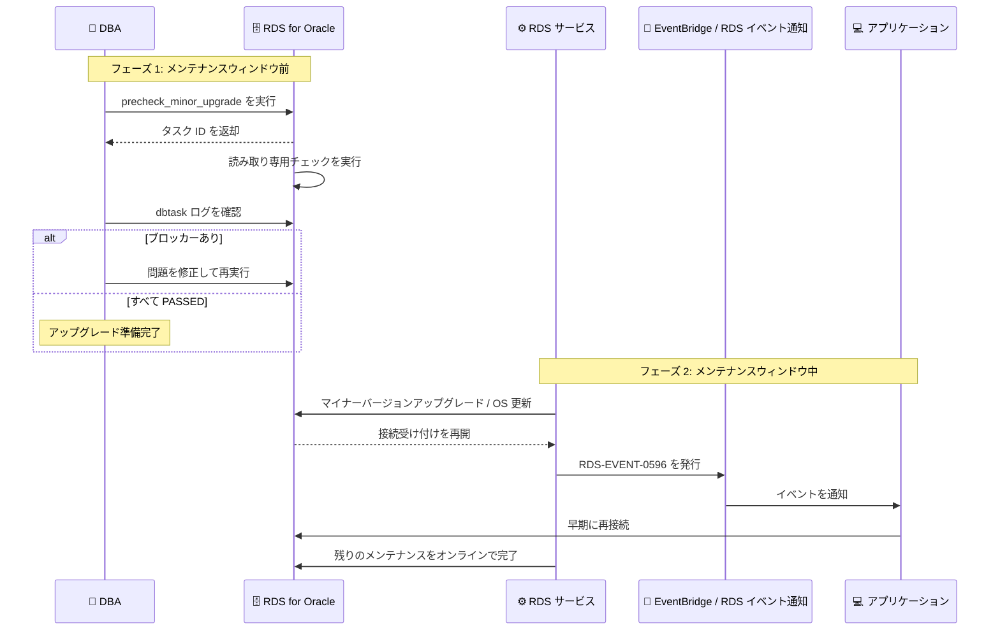

# Amazon RDS for Oracle - マイナーバージョンアップグレードのプリチェックと新しい RDS イベントによるパッチ適用ダウンタイムの削減

**リリース日**: 2026 年 10 月 8 日
**サービス**: Amazon RDS for Oracle
**機能**: マイナーバージョンアップグレードプリチェック (rdsadmin.rdsadmin_precheck_tasks.precheck_minor_upgrade) および新イベント RDS-EVENT-0596

📊 [このアップデートのインフォグラフィックを見る](https://takech9203.github.io/aws-news-summary/20261008-amazon-rds-oracle-minor-version-upgrade-precheck-new-patching-rds-event.html)

## 概要

Amazon RDS for Oracle が、マイナーバージョンアップグレードのプリチェック (事前検証) を利用者自身で実行できる新しいプロシージャ `rdsadmin.rdsadmin_precheck_tasks.precheck_minor_upgrade` のサポートを発表しました。従来はアップグレード処理の実行時にのみ行われていた検証を、アップグレードやメンテナンスウィンドウの前に任意のタイミングで実行し、空きストレージ不足、無効な Oracle 管理オブジェクト、無効なトリガーなどのブロッカーを事前に発見して修正できます。プリチェックは読み取り専用で、データや設定を変更せず、ワークロードへの影響もありません。

さらに、新しい RDS イベント **RDS-EVENT-0596** も追加されました。マイナーバージョンアップグレードや OS 更新によるパッチ適用中に、DB インスタンスが接続の受け付けを再開した時点でこのイベントが発行されます。残りのメンテナンスタスクはオンラインで完了するため、アプリケーションはイベントを契機により早く再接続でき、実質的なダウンタイムを短縮できます。Amazon RDS イベント通知や Amazon EventBridge を通じてサブスクライブすることで、再接続の自動化や運用チームへの通知を実装できます。

このアップデートは、計画メンテナンスの失敗リスクとアプリケーション停止時間の両方を削減したい、RDS for Oracle を運用するデータベース管理者やアプリケーション運用チームにとって重要な改善です。

**アップデート前の課題**

- アップグレードの前提条件チェックはアップグレード処理の中で実行されるため、問題 (ストレージ不足、無効オブジェクトなど) が見つかるとその時点でアップグレードが失敗し、メンテナンスウィンドウを無駄にしてしまうことがあった
- メンテナンスウィンドウ前に問題を網羅的に発見する公式な手段がなく、手動での個別確認に頼る必要があった
- パッチ適用中、DB インスタンスがいつ接続可能になったかをアプリケーション側で正確に知る手段がなく、メンテナンス全体の完了まで待つなど保守的な運用になりがちだった

**アップデート後の改善**

- `rdsadmin.rdsadmin_precheck_tasks.precheck_minor_upgrade` により、アップグレード前の任意のタイミングでプリチェックを実行し、ブロッカーを事前に修正できるようになった
- プリチェックはすべてのチェックを最後まで実行し、発見したすべての問題を 1 つのログにまとめて報告するため、修正と再実行のサイクルを効率的に回せるようになった
- RDS-EVENT-0596 により、DB インスタンスが接続受け付けを再開した時点を検知でき、残りのメンテナンスがオンラインで継続する間にアプリケーションを再接続させてダウンタイムを削減できるようになった

## アーキテクチャ図



メンテナンスウィンドウ前にプリチェックでブロッカーを解消し、パッチ適用中は RDS-EVENT-0596 を契機にアプリケーションを早期再接続させる、という 2 段階でダウンタイムとメンテナンス失敗のリスクを削減する流れを示しています。

## サービスアップデートの詳細

### 主要機能

1. **マイナーバージョンアップグレードプリチェック**
   - `rdsadmin.rdsadmin_precheck_tasks.precheck_minor_upgrade` プロシージャをパラメータなしで呼び出すと、バックグラウンドでプリチェックが実行され、タスク ID が返却される
   - プリチェックは読み取り専用で、データや設定を変更せず、本番ワークロードに影響を与えない
   - 結果は BDUMP ディレクトリの `dbtask-{task_id}.log` に出力され、`rdsadmin.rds_file_util.read_text_file` で参照できる
   - 一部のチェックが失敗しても、すべてのチェックを最後まで実行し、発見したすべての問題を 1 回の実行でまとめて報告する

2. **チェック結果の分類**
   - 各チェックは `PASSED` (問題なし)、`FAILED [BLOCKER]` (アップグレード前に修正が必須)、`WARN` (レビュー推奨、アップグレードは阻害しない)、`SKIPPED` (対象外)、`ERROR` (チェック未完了、再実行が必要) のいずれかで報告される
   - `FAILED [BLOCKER]` または `ERROR` が 1 件でもあればログの最終結果は `Result: FAILED` となる
   - 実行されるチェックはエンジンバージョン、データベースアーキテクチャ、DB インスタンス構成によって異なる

3. **新イベント RDS-EVENT-0596**
   - カテゴリ: maintenance (DB インスタンスイベント)
   - メッセージ: 「The DB instance is running and accepting connections. Remaining maintenance tasks will complete online.」
   - マイナーバージョンアップグレードや OS 更新の途中で、DB インスタンスが接続受け付けを再開した時点で発行される
   - Amazon RDS イベント通知または Amazon EventBridge でサブスクライブし、アプリケーションの再接続自動化やチームへの通知に利用できる

## 技術仕様

### プリチェックの検証項目

ドキュメントに記載されている各チェックと失敗条件は以下のとおりです。

| チェック | 失敗する条件 |
|------|------|
| FreeStorageSpace | DB インスタンスの空きストレージが 768 MB 未満 |
| SystemTablespace | SYSTEM または SYSAUX 表領域の空きが 300 MB 未満、または自動拡張が無効。CDB の場合は各コンテナを検証 |
| AuditTablespace | 監査表領域の空きが 300 MB 未満、または自動拡張が無効 |
| RedoApplyLag | リードレプリカの REDO 適用遅延が 5 分超。リードレプリカがない場合はスキップ |
| MdsysUser | MDSYS ユーザーが Oracle 管理でない |
| ConflictingSynonyms | 新しい Oracle バージョンの予約名と競合するシノニムが存在 |
| WorkspaceManager | Workspace Manager (WMSYS) オブジェクトが存在 |
| SchemaVersionRegistry | SCHEMA_VERSION_REGISTRY ビューが無効 |
| XmlDbSchema | XML DB スキーマオブジェクトが無効 |
| ApexStatus | APEX コンポーネントが VALID 状態でない |
| CtxsysSequences | CTXSYS スキーマに Oracle Text の 3 つのシーケンス (DR_ID_SEQ、MESG_ID_SEQ、THS_SEQ) がない。CDB の場合はスキップ |
| InvalidSystemObjects | Oracle 管理オブジェクトが無効 |
| InvalidTriggers | トリガーが無効 |
| PendingDistributedTransactions | 未解決の分散トランザクションが存在 |

### RDS-EVENT-0596 の仕様

| 項目 | 詳細 |
|------|------|
| イベント ID | RDS-EVENT-0596 |
| ソースタイプ | DB インスタンス |
| カテゴリ | maintenance |
| メッセージ | The DB instance is running and accepting connections. Remaining maintenance tasks will complete online. |
| 発行タイミング | マイナーバージョンアップグレードまたは OS 更新の途中で、DB インスタンスが接続受け付けを再開した時点 |
| 受信方法 | Amazon RDS イベント通知、Amazon EventBridge |

## 設定方法

### 前提条件

1. Amazon RDS for Oracle の DB インスタンスが稼働していること
2. プリチェックはプライマリ DB インスタンスで実行すること (リードレプリカでの実行はサポートされない)
3. SQL クライアント (SQL*Plus など) で DB インスタンスに接続できること

### 手順

#### ステップ 1: プリチェックを実行する

```sql
-- プリチェックを開始してタスク ID を取得
SELECT rdsadmin.rdsadmin_precheck_tasks.precheck_minor_upgrade() AS task_id FROM DUAL;

-- または、SQL クライアント変数にタスク ID を格納
VAR task_id VARCHAR2(80);
EXEC :task_id := rdsadmin.rdsadmin_precheck_tasks.precheck_minor_upgrade();
```

プロシージャはパラメータを取らず、タスク ID (例: `1784924903020-9`) を返します。プリチェックはバックグラウンドで実行されます。

#### ステップ 2: プリチェック結果を確認する

```sql
-- BDUMP ディレクトリのログファイルを読み取る
SELECT * FROM TABLE(
  rdsadmin.rds_file_util.read_text_file('BDUMP', 'dbtask-'||:task_id||'.log')
);

-- BDUMP ディレクトリのファイル一覧を確認する場合
SELECT * FROM table(rdsadmin.rds_file_util.listdir('BDUMP')) ORDER BY mtime;
```

ログの最終行が `The task finished successfully.` または `The task failed.` になればプリチェックは完了です。各チェックの `CHECK:` 行、`Summary:` 行、`Result:` 行を確認し、`FAILED [BLOCKER]` が報告された項目を修正します。修正後はプリチェックを再実行し、`Result: PASSED` になることを確認します。

#### ステップ 3: RDS-EVENT-0596 をサブスクライブする

```bash
# maintenance カテゴリのイベントサブスクリプションを作成
aws rds create-event-subscription \
  --subscription-name oracle-maintenance-events \
  --sns-topic-arn arn:aws:sns:ap-northeast-1:123456789012:rds-maintenance-topic \
  --source-type db-instance \
  --event-categories "maintenance" \
  --source-ids mydbinstance
```

このコマンドは、指定した DB インスタンスの maintenance カテゴリイベント (RDS-EVENT-0596 を含む) を SNS トピックに通知するサブスクリプションを作成します。EventBridge を使用する場合は、`aws.rds` をソースとするルールを作成して Lambda などのターゲットに連携します。

## メリット

### ビジネス面

- **計画メンテナンスの成功率向上**: メンテナンスウィンドウ前にブロッカーを解消できるため、アップグレード失敗によるウィンドウの浪費や再調整コストを削減できる
- **ダウンタイムの短縮**: RDS-EVENT-0596 を契機にアプリケーションを早期再接続させることで、ユーザー影響のある停止時間を最小化できる
- **運用の予見性向上**: 自動マイナーバージョンアップグレードの保留通知を受けた後、ウィンドウ前に準備状況を確認できるため、計画的な運用が可能になる

### 技術面

- **読み取り専用で安全**: プリチェックはデータや設定を変更せず、ワークロードへの影響なく本番環境でいつでも実行できる
- **網羅的なレポート**: 一部のチェックが失敗しても全チェックが実行され、1 回の実行ですべての問題を把握できるため、修正サイクルが短縮される
- **イベント駆動の自動化**: RDS イベント通知や EventBridge と組み合わせて、再接続やコネクションプールのリフレッシュを自動化できる

## デメリット・制約事項

### 制限事項

- プリチェックはプライマリ DB インスタンスで実行する必要があり、リードレプリカでの実行はサポートされない
- プリチェックは現在のエンジンバージョンの既知のチェックに対して検証するものであり、アップグレード先バージョン固有のチェック (autoupgrade など) は含まれない
- 実行されるチェックはエンジンバージョンや DB インスタンス構成によって異なる

### 考慮すべき点

- 空きストレージやリードレプリカの遅延など時間とともに変化する条件があるため、プリチェックはアップグレード直前に実行することが推奨される
- ストレージ追加、表領域変更、オブジェクトの削除や再コンパイル、分散トランザクションの解決など、チェック対象の条件に影響する変更を行った場合は再実行が必要
- プリチェックが PASSED でも、アップグレード先バージョン固有の問題が発生する可能性は残るため、テスト環境での検証は引き続き重要

## ユースケース

### ユースケース 1: 自動マイナーバージョンアップグレード前の事前検証

**シナリオ**: 自動マイナーバージョンアップグレードを有効にしている DB インスタンスで、保留中のメンテナンス通知を受け取った。メンテナンスウィンドウでの失敗を避けたい。

**実装例**:
```sql
VAR task_id VARCHAR2(80);
EXEC :task_id := rdsadmin.rdsadmin_precheck_tasks.precheck_minor_upgrade();
SELECT * FROM TABLE(
  rdsadmin.rds_file_util.read_text_file('BDUMP', 'dbtask-'||:task_id||'.log')
);
```

**効果**: ウィンドウ前にブロッカー (無効トリガー、ストレージ不足など) を発見して修正でき、メンテナンスウィンドウでのアップグレード失敗を回避できる。

### ユースケース 2: パッチ適用時のアプリケーション自動再接続

**シナリオ**: パッチ適用中のアプリケーション停止時間を最小化するため、DB インスタンスが接続可能になった時点でコネクションプールを再初期化したい。

**実装例**:
```json
{
  "source": ["aws.rds"],
  "detail-type": ["RDS DB Instance Event"],
  "detail": {
    "EventID": ["RDS-EVENT-0596"]
  }
}
```

**効果**: EventBridge ルールで RDS-EVENT-0596 を検知し、Lambda などからアプリケーションの再接続処理をトリガーすることで、メンテナンス全体の完了を待たずにサービスを再開できる。

### ユースケース 3: 大規模フリートの計画的なパッチ運用

**シナリオ**: 多数の RDS for Oracle インスタンスを運用しており、四半期ごとのパッチ適用キャンペーンで失敗インスタンスをゼロにしたい。

**実装例**:
```text
1. 各インスタンスでプリチェックを実行し、タスク ID と結果を収集
2. FAILED [BLOCKER] のインスタンスを抽出し、修正チケットを起票
3. 修正後に再実行し、全インスタンスが Result: PASSED になったことを確認
4. maintenance カテゴリのイベントサブスクリプションで適用状況を監視
```

**効果**: フリート全体の準備状況を事前に可視化でき、パッチキャンペーンの失敗率と再調整の工数を大幅に削減できる。

## 料金

プリチェックプロシージャおよび RDS イベントの利用自体に追加料金は発生しません。Amazon RDS for Oracle の通常の料金 (インスタンス、ストレージ、ライセンスなど) が適用されます。イベント通知に Amazon SNS や Amazon EventBridge を使用する場合は、それぞれのサービスの料金が適用されます。

## 利用可能リージョン

Amazon RDS for Oracle が利用可能なすべての AWS 商用リージョンおよび AWS GovCloud (US) リージョンで利用できます。

## 関連サービス・機能

- **Amazon RDS イベント通知**: RDS-EVENT-0596 を含む maintenance カテゴリのイベントを Amazon SNS 経由で受信できる
- **Amazon EventBridge**: RDS イベントをルールで検知し、Lambda や Step Functions などと連携して再接続や通知を自動化できる
- **RDS 自動マイナーバージョンアップグレード**: 保留中のメンテナンス通知を受けた後、プリチェックで準備状況を事前確認する運用と組み合わせられる
- **rdsadmin パッケージ**: `rds_file_util.read_text_file` や `rds_file_util.listdir` などのプロシージャでプリチェックログを参照する

## 参考リンク

- 📊 [インフォグラフィック](https://takech9203.github.io/aws-news-summary/20261008-amazon-rds-oracle-minor-version-upgrade-precheck-new-patching-rds-event.html)
- [公式発表 (What's New)](https://aws.amazon.com/about-aws/whats-new/2026/10/amazon-rds-oracle-minor-version-upgrade-precheck-new-patching-rds-event/)
- [ドキュメント: Running minor version upgrade prechecks in Amazon RDS for Oracle](https://docs.aws.amazon.com/AmazonRDS/latest/UserGuide/USER_UpgradeDBInstance.Oracle.Precheck.html)
- [ドキュメント: Amazon RDS event categories and event messages](https://docs.aws.amazon.com/AmazonRDS/latest/UserGuide/USER_Events.Messages.html)
- [ドキュメント: Monitoring Amazon RDS events](https://docs.aws.amazon.com/AmazonRDS/latest/UserGuide/working-with-events.html)
- [Amazon RDS for Oracle 製品ページ](https://aws.amazon.com/rds/oracle/)

## まとめ

Amazon RDS for Oracle のマイナーバージョンアップグレードにおいて、事前にブロッカーを発見・修正できるプリチェックと、接続受け付け再開を通知する RDS-EVENT-0596 が追加され、パッチ適用の失敗リスクとダウンタイムの両方を削減できるようになりました。RDS for Oracle を運用しているチームは、メンテナンスウィンドウ前のプリチェック実行を標準手順に組み込み、RDS-EVENT-0596 のサブスクリプションによる再接続自動化を検討することを推奨します。
