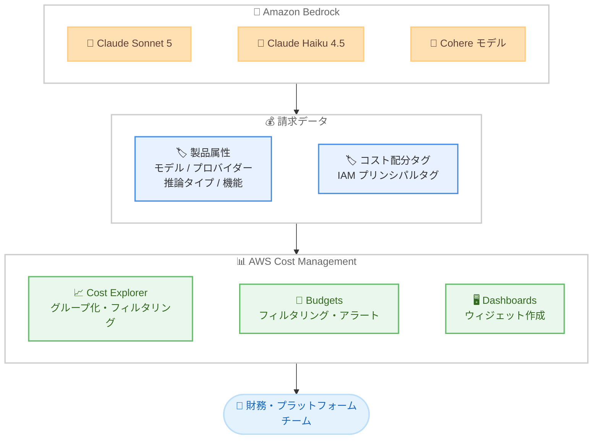

# AWS Cost Management - Amazon Bedrock 製品属性によるコスト分析サポート

**リリース日**: 2026 年 10 月 8 日
**サービス**: AWS Cost Explorer / AWS Budgets / AWS Cost Management Dashboards
**機能**: Amazon Bedrock 製品属性 (Product Attributes) によるコストのグループ化・フィルタリング

📊 [このアップデートのインフォグラフィックを見る](https://takech9203.github.io/aws-news-summary/20261008-aws-bedrock-attributes-in-cost-explorer.html)

## 概要

AWS Cost Explorer、AWS Budgets、AWS Cost Management Dashboards で、Amazon Bedrock のコストを「製品属性 (product attributes)」という新しいディメンションで分析できるようになりました。モデル (Claude Sonnet 5、Claude Haiku 4.5 など)、モデルプロバイダー (Anthropic、Cohere など)、推論タイプ (入力トークン、出力トークンなど)、機能 (オンデマンド推論、reranker など) といった属性で Bedrock のコストを分解できます。

Cost Explorer と Dashboards では属性によるグループ化とフィルタリングが可能で、Budgets では同じ属性で予算をフィルタリングできます。これにより、財務チームやプラットフォームチームは、どのモデルやワークロードが Bedrock の支出を押し上げているかを、使い慣れた既存の請求ツール上で直接把握できます。

さらに、アプリケーション推論プロファイルのコスト配分タグや IAM プリンシパルタグと組み合わせることで、どのアプリケーション、プロジェクト、ユーザーが特定のモデルの支出を牽引しているかまで可視化できます。生成 AI の利用が組織全体に広がる中で、Bedrock コストのガバナンスと最適化を強化したいすべてのユーザーが対象です。

**アップデート前の課題**

このアップデート以前は、Bedrock のコストをモデル単位で分析するために追加の作業が必要でした。

- Cost Explorer では Bedrock のコストをサービス単位や使用タイプ (usage type) 単位でしか分解できず、モデルやプロバイダーごとの内訳を直感的に把握できなかった
- モデル別のコスト分析には、Cost and Usage Report (CUR) を Athena や QuickSight で加工するなど、独自の分析パイプラインの構築が必要だった
- 特定モデルの支出に対して AWS Budgets でアラート予算を直接設定することが困難だった

**アップデート後の改善**

今回のアップデートにより、追加の仕組みを構築することなく標準ツールで分析が可能になりました。

- Cost Explorer と Dashboards で、モデル、モデルプロバイダー、推論タイプ、機能の各属性によるグループ化とフィルタリングが可能になった
- Budgets で製品属性によるフィルタリングが可能になり、特定モデルの支出に対するアラート予算を設定できるようになった
- コスト配分タグや IAM プリンシパルタグと組み合わせて、アプリケーション別・ユーザー別・モデル別の多軸でのコスト分析が可能になった

## アーキテクチャ図



Amazon Bedrock の各モデルの利用コストが製品属性付きで請求データに反映され、Cost Explorer、Budgets、Dashboards の各ツールで属性単位の分析・予算管理・可視化ができる流れを示しています。

## サービスアップデートの詳細

### 主要機能

1. **製品属性によるコスト分解**
   - Bedrock のコストを以下の 4 つの新しいディメンションで分解可能
   - モデル: Claude Sonnet 5、Claude Haiku 4.5 など
   - モデルプロバイダー: Anthropic、Cohere など
   - 推論タイプ: 入力トークン、出力トークンなど
   - 機能: オンデマンド推論、reranker など

2. **Cost Explorer / Dashboards でのグループ化とフィルタリング**
   - 月間 Bedrock 支出をモデル別にグループ化し、高コストのモデルを特定
   - プロバイダー別のコスト推移を追跡するダッシュボードウィジェットを作成
   - 推論タイプ別の内訳により、入力トークンと出力トークンのコスト比率を把握

3. **Budgets での属性フィルタリング**
   - 特定モデルの支出に対するアラート予算を設定可能
   - モデルやプロバイダー単位で予算の閾値超過を検知し、通知を受け取れる

4. **タグとの組み合わせによる多軸分析**
   - アプリケーション推論プロファイル、プロジェクト、ワークスペースのコスト配分タグと組み合わせて、アプリケーション別の支出を把握
   - IAM プリンシパルタグと組み合わせて、どのユーザーやロールがどのモデルの支出を牽引しているかを特定

## 技術仕様

### 製品属性の一覧

| 属性 | 例 | 用途 |
|------|-----|------|
| モデル | Claude Sonnet 5、Claude Haiku 4.5 | モデル単位のコスト把握、高コストモデルの特定 |
| モデルプロバイダー | Anthropic、Cohere | プロバイダー単位のコスト追跡 |
| 推論タイプ | 入力トークン、出力トークン | トークン種別ごとのコスト比率分析 |
| 機能 | オンデマンド推論、reranker | 機能単位の利用状況・コスト把握 |

### ツール別のサポート機能

| ツール | グループ化 | フィルタリング |
|--------|-----------|---------------|
| AWS Cost Explorer | ✓ | ✓ |
| AWS Cost Management Dashboards | ✓ | ✓ |
| AWS Budgets | - | ✓ |

## 設定方法

### 前提条件

1. AWS Cost Explorer が有効化されていること
2. Cost Explorer、Budgets、Dashboards へのアクセス権限 (ce:*、budgets:* など) を持つ IAM プリンシパルで操作すること
3. アプリケーション別・ユーザー別の分析を行う場合は、アプリケーション推論プロファイルのコスト配分タグや IAM プリンシパルタグが有効化されていること

### 手順

#### ステップ 1: Cost Explorer でモデル別にグループ化

AWS マネジメントコンソールで Cost Explorer を開き、以下を設定します。

1. フィルターで「サービス」に Amazon Bedrock を指定
2. 「グループ化の条件」で新しい製品属性ディメンション (モデルなど) を選択

これにより、月間の Bedrock 支出がモデル別に分解されて表示されます。

#### ステップ 2: Dashboards でウィジェットを作成

Cost Management Dashboards で新しいウィジェットを作成し、モデルプロバイダー属性でグループ化します。プロバイダー別のコスト推移を継続的に追跡するダッシュボードを構築できます。

#### ステップ 3: Budgets で特定モデルの予算を設定

AWS Budgets で新しいコスト予算を作成し、フィルターに製品属性 (特定のモデルなど) を指定します。設定した閾値を超過した場合に通知を受け取ることで、特定モデルの支出増加を早期に検知できます。

## メリット

### ビジネス面

- **コストの透明性向上**: どのモデルやプロバイダーが支出を押し上げているかを財務チームが直接把握でき、生成 AI 投資の説明責任を果たしやすくなる
- **チャージバックの精緻化**: タグとの組み合わせにより、アプリケーションやチーム単位でのコスト配賦が容易になる
- **予算ガバナンスの強化**: 特定モデルに対するアラート予算により、想定外のコスト増加を早期に検知できる

### 技術面

- **追加パイプライン不要**: CUR + Athena + QuickSight のような独自の分析基盤を構築せずに、標準ツールだけでモデル別分析が可能
- **既存ワークフローとの統合**: Cost Explorer や Budgets といった使い慣れたツールにそのまま組み込めるため、学習コストが低い
- **多軸分析**: 製品属性、コスト配分タグ、IAM プリンシパルタグを組み合わせた柔軟な分析が可能

## デメリット・制約事項

### 制限事項

- AWS GovCloud (US) および中国 (北京、寧夏) リージョンでは利用不可
- 対象は Amazon Bedrock のコストに限定され、他のサービスへの製品属性の適用については言及されていない
- Budgets ではフィルタリングのみ対応しており、グループ化には対応していない

### 考慮すべき点

- ユーザー別・アプリケーション別の分析には、IAM プリンシパルタグやアプリケーション推論プロファイルのコスト配分タグの事前整備が必要
- 過去データへの属性の遡及適用範囲は公式発表に明記されていないため、利用開始時に実際のデータで確認が必要

## ユースケース

### ユースケース 1: 高コストモデルの特定と最適化

**シナリオ**: 複数の Bedrock モデルを利用している組織で、月間支出が増加傾向にあり、どのモデルが原因かを特定したい。

**実装例**:
```
Cost Explorer:
  フィルター: サービス = Amazon Bedrock
  グループ化: モデル
  期間: 過去 6 か月 (月次)
```

**効果**: 高コストのモデルを特定し、より低コストなモデル (例: Claude Haiku 4.5) への切り替えやプロンプト最適化の判断材料にできる。

### ユースケース 2: アプリケーション別のモデル支出のチャージバック

**シナリオ**: 社内の複数アプリケーションが共通の Bedrock 環境を利用しており、アプリケーションごとにモデル支出を配賦したい。

**実装例**:
```
Cost Explorer:
  フィルター: サービス = Amazon Bedrock
  グループ化: モデル
  追加フィルター: コスト配分タグ (アプリケーション推論プロファイル)
```

**効果**: どのアプリケーションがどのモデルの支出を牽引しているかを可視化し、部門別のチャージバックを正確に実施できる。

### ユースケース 3: 特定モデルの予算アラート

**シナリオ**: 高価格帯モデルの利用を一定額以内に抑えたい。閾値を超えた場合にすぐに通知を受けたい。

**実装例**:
```
AWS Budgets:
  予算タイプ: コスト予算
  フィルター: モデル = Claude Sonnet 5
  閾値: 月額予算の 80% で通知
```

**効果**: 特定モデルの支出が予算に近づいた時点でアラートを受け取り、利用制御やコスト見直しを迅速に実施できる。

## 料金

この機能は追加料金なしで利用できます。Cost Explorer のコンソール利用は無料です (API 利用はリクエストごとに課金)。

## 利用可能リージョン

AWS GovCloud (US) および中国 (北京、寧夏) リージョンを除く、すべての AWS リージョンで利用可能です。

## 関連サービス・機能

- **Amazon Bedrock**: 分析対象となる生成 AI サービス。アプリケーション推論プロファイルによるタグ付けと組み合わせることで分析の粒度が向上する
- **AWS Cost and Usage Report (CUR)**: より詳細な分析やカスタムレポートが必要な場合に併用できる請求データのエクスポート機能
- **AWS Cost Allocation Tags**: アプリケーション、プロジェクト、ワークスペース単位のコスト配賦に使用するタグ機能
- **AWS Cost Anomaly Detection**: 支出の異常を機械学習で検知する機能。製品属性による分析と組み合わせて原因特定を迅速化できる

## 参考リンク

- 📊 [インフォグラフィック](https://takech9203.github.io/aws-news-summary/20261008-aws-bedrock-attributes-in-cost-explorer.html)
- [公式発表 (What's New)](https://aws.amazon.com/about-aws/whats-new/2026/10/aws-bedrock-attributes-in-cost-explorer/)
- [AWS Cost Explorer ユーザーガイド](https://docs.aws.amazon.com/cost-management/latest/userguide/ce-what-is.html)
- [AWS Budgets ユーザーガイド](https://docs.aws.amazon.com/cost-management/latest/userguide/budgets-managing-costs.html)
- [AWS Cost Management Dashboards ユーザーガイド](https://docs.aws.amazon.com/cost-management/latest/userguide/dashboards.html)

## まとめ

生成 AI の利用拡大に伴い課題となっていた Bedrock コストの可視化が、Cost Explorer、Budgets、Dashboards の標準機能だけで実現できるようになりました。独自の分析パイプラインを構築せずにモデル別・プロバイダー別のコスト分析や予算アラートが可能になるため、Bedrock を利用しているすべての組織でまず Cost Explorer のモデル別グループ化を試し、必要に応じてコスト配分タグや IAM プリンシパルタグの整備を進めることを推奨します。
