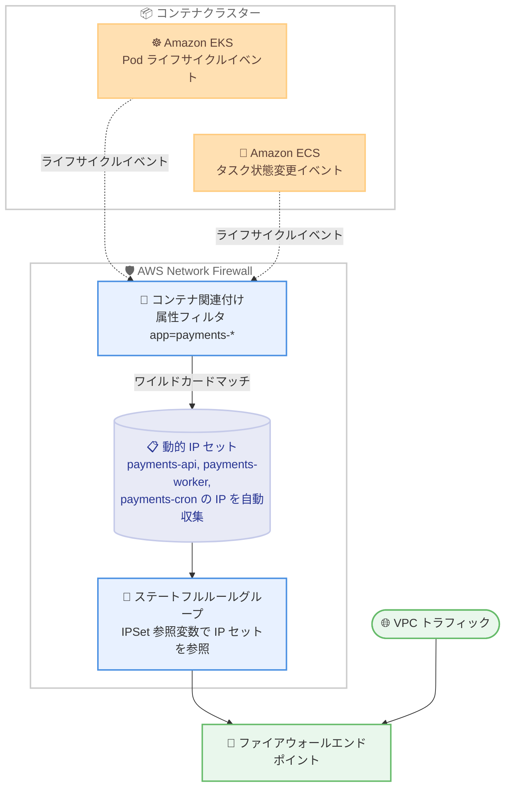

# AWS Network Firewall - コンテナ属性フィルタのワイルドカードサポート

**リリース日**: 2026 年 10 月 8 日
**サービス**: AWS Network Firewall
**機能**: コンテナ属性ベース検査フィルタにおけるワイルドカードマッチング

📊 [このアップデートのインフォグラフィックを見る](https://takech9203.github.io/aws-news-summary/20261008-aws-network-firewall-container-attributes-wildcard.html)

## 概要

AWS Network Firewall が、Amazon EKS および Amazon ECS 向けのコンテナ属性ベース検査フィルタにおいて、ワイルドカードマッチングをサポートしました。コンテナ関連付け (Container Association) の属性フィルタに `app=payments-*` のようなワイルドカードパターンを指定することで、`payments-api`、`payments-worker`、`payments-cron` といったアプリケーションの全バリアントを 1 つのルールで自動的にカバーできます。

コンテナ関連付けは、Amazon ECS のタスク開始/停止、Amazon EKS の Pod 開始/停止といったコンテナライフサイクルイベントを購読し、稼働中のコンテナの IP アドレスを動的 IP セットとして維持する仕組みです。この IP セットを Network Firewall のステートフルルールグループから参照することで、IP アドレスをハードコーディングせずにコンテナ単位のトラフィック検査が可能になります。今回のアップデートにより、属性フィルタの定義がワークロードの命名規則ベースで柔軟に行えるようになりました。

本アップデートは、新しいアプリケーションバリアントが頻繁にデプロイされる動的なコンテナ環境を運用するユーザーにとって、ファイアウォールルールの運用負荷を大幅に軽減するものです。

**アップデート前の課題**

ワイルドカードがサポートされる以前は、属性フィルタは個別の値の指定が必要でした。

- 以前はワークロードのバリアントごとに個別のフィルタ定義が必要だった
- 以前は新しいバリアント (例: `payments-cron`) を追加するたびにフィルタの更新作業が発生していた
- 以前は動的なコンテナ環境でセキュリティカバレッジの抜け漏れが発生するリスクがあった

**アップデート後の改善**

今回のアップデートにより、以下が可能になりました。

- `app=payments-*` のようなパターン 1 つで、複数のコンテナワークロードをまとめてカバーできるようになった
- 新しいバリアントがデプロイされても、命名規則に従っていればフィルタの更新が不要になった
- ルール数の削減により、ファイアウォールポリシーの管理がシンプルになった

## アーキテクチャ図



コンテナ関連付けがクラスターのライフサイクルイベントを購読し、ワイルドカードパターンにマッチするコンテナの IP アドレスを動的 IP セットとして維持します。ルールグループはこの IP セットを参照してトラフィックを検査します。

## サービスアップデートの詳細

### 主要機能

1. **属性フィルタでのワイルドカードマッチング**
   - コンテナ関連付けの属性フィルタに `app=payments-*` のようなワイルドカードパターンを指定可能
   - 1 つのパターンでアプリケーションの全バリアント (例: `payments-api`、`payments-worker`、`payments-cron`) を自動的にカバー
   - 新しいバリアントが命名規則に従ってデプロイされると、追加設定なしで自動的にフィルタの対象となる

2. **コンテナ関連付けによる動的 IP セットの維持**
   - コンテナライフサイクルイベント (Amazon ECS のタスク状態変更、Amazon EKS の Pod 開始/停止) を購読して稼働中のコンテナ IP を追跡
   - コンテナの起動/停止に合わせて IP セットが自動更新される
   - クラスターのデータパスには一切関与せず、IP 情報の収集のみを行う

3. **ステートフルルールグループからの参照**
   - コンテナ関連付けの ARN をルールグループの `ReferenceSets` に追加し、Suricata 互換ルール内で IPSet 参照変数として使用
   - IP アドレスのハードコーディングが不要になり、コンテナのスケールイン/アウトに自動追従

## 技術仕様

### コンテナ関連付けの仕様

| 項目 | 詳細 |
|------|------|
| 対応コンテナタイプ | Amazon ECS、Amazon EKS (作成時に指定、変更不可) |
| 属性フィルタ (Amazon EKS) | 名前空間、Kubernetes ラベルでフィルタリング可能 |
| 属性フィルタ (Amazon ECS) | コンテナインスタンス属性でフィルタリング可能 |
| ワイルドカード | 属性フィルタの値にワイルドカードパターンを指定可能 (例: `app=payments-*`) |
| モニタリング設定 | 1 つのコンテナ関連付けあたり最大 5 件 (クラスター ARN は同一リージョン/アカウント内) |
| コンテナ関連付け数 | アカウント/リージョンあたり 100 件 (引き上げ可能) |
| ルールグループからの参照 | 1 ルールグループあたり最大 30 件のコンテナ関連付け参照 |
| サービスリンクロール | `AWSServiceRoleForNetworkFirewall` が必要 (初回作成時に自動作成) |

### ネットワーク要件と制約

| 項目 | 詳細 |
|------|------|
| Amazon EKS | SNAT の無効化が必要 (有効の場合、ファイアウォールにはノード IP が到達し、ルールがマッチしない) |
| Amazon ECS | `awsvpc` ネットワークモードのみサポート (bridge、host モードは非対応) |
| Fargate | 属性フィルタは EC2 起動タイプのコンテナインスタンスのみ対象。Fargate タスクの IP を取得するには属性フィルタを付与しない |
| IPSet 参照の排他性 | 1 つのルールグループ内で通常の IPSet 参照とコンテナ関連付け参照の混在は不可 |

### API 変更履歴

2026 年 10 月 9 日時点で、本アップデートに対応する AWS API Changes (awsapichanges.com) のエントリは確認されていません。

### ルールグループでの参照例

```json
{
    "RulesSource": {
        "RulesString": "alert tcp @CONTAINER_IPS any -> any any (sid:1; rev:1;)"
    },
    "ReferenceSets": {
        "IPSetReferences": {
            "CONTAINER_IPS": {
                "ReferenceArn": "arn:aws:network-firewall:us-east-1:123456789012:container-association/my-ecs-monitor"
            }
        }
    }
}
```

## 設定方法

### 前提条件

1. IAM アイデンティティに `network-firewall:CreateContainerAssociation` (コンテナ関連付けリソースおよび対象クラスター ARN に対して)、`ecs:DescribeClusters` または `eks:DescribeCluster`、および初回のみ `iam:CreateServiceLinkedRole` の権限があること
2. Amazon EKS クラスターの場合、VPC CNI プラグインで SNAT が無効化されていること
3. Amazon ECS クラスターの場合、タスクが `awsvpc` ネットワークモードを使用していること

### 手順

#### ステップ 1: ワイルドカードを含む属性フィルタでコンテナ関連付けを作成

```bash
aws network-firewall create-container-association \
    --container-association-name payments-monitor \
    --type EKS \
    --container-monitoring-configurations '[
        {
            "ClusterArn": "arn:aws:eks:us-east-1:123456789012:cluster/my-cluster",
            "AttributeFilters": [
                {"Key": "app", "Value": "payments-*"}
            ]
        }
    ]'
```

対象クラスターを指定してコンテナ関連付けを作成します。属性フィルタの値にワイルドカードパターン `payments-*` を指定することで、`app` ラベルが `payments-` で始まるすべての Pod が追跡対象になります。

#### ステップ 2: ルールグループからコンテナ関連付けを参照

```bash
aws network-firewall create-rule-group \
    --rule-group-name my-container-rules \
    --type STATEFUL \
    --capacity 100 \
    --rule-group '{
        "RulesSource": {
            "RulesString": "alert tcp @CONTAINER_IPS any -> any any (sid:1; rev:1;)"
        },
        "ReferenceSets": {
            "IPSetReferences": {
                "CONTAINER_IPS": {
                    "ReferenceArn": "arn:aws:network-firewall:us-east-1:123456789012:container-association/payments-monitor"
                }
            }
        }
    }'
```

ステートフルルールグループを作成し、コンテナ関連付けの ARN を `ReferenceSets` に追加します。Suricata 互換ルール内では `@CONTAINER_IPS` という変数名で動的 IP セットを参照できます。

#### ステップ 3: ファイアウォールポリシーへの適用と動作確認

作成したルールグループをファイアウォールポリシーに関連付け、ファイアウォールエンドポイントを経由するトラフィックに対してルールが適用されることを確認します。コンテナ関連付けのステータスが `ACTIVE` になると、IP の追跡が開始されます。

## メリット

### ビジネス面

- **運用コストの削減**: ワークロードのバリアントごとのルール作成が不要になり、ファイアウォール管理の工数を削減できる
- **セキュリティカバレッジの一貫性**: 新しいバリアントのデプロイ時にルール更新の抜け漏れがなくなり、一貫したセキュリティ適用を維持できる
- **デプロイ速度への追従**: アプリケーションチームのリリースサイクルにセキュリティチームの作業がボトルネックとして入らない

### 技術面

- **ルール数の削減**: 1 つのワイルドカードパターンで複数のワークロードをカバーでき、ポリシーがシンプルになる
- **動的環境への自動追従**: コンテナの起動/停止やスケーリングに合わせて IP セットが自動更新される
- **IP ハードコーディングの排除**: Suricata ルール内で IP アドレスを直接記述する必要がなく、保守性が向上する

## デメリット・制約事項

### 制限事項

- Amazon ECS の属性フィルタは EC2 起動タイプのコンテナインスタンスのみ対象で、Fargate タスクには適用されない
- Amazon ECS タスクは `awsvpc` ネットワークモードのみサポートされる
- 1 つのルールグループ内で、通常の IPSet 参照 (プレフィックスリスト、静的 IP セット) とコンテナ関連付け参照を混在できない
- モニタリング設定は 1 つのコンテナ関連付けあたり最大 5 件 (引き上げ不可)

### 考慮すべき点

- Amazon EKS では SNAT を無効化しないと Pod の元 IP がファイアウォールに届かず、ルールがマッチしない
- ワイルドカードパターンは命名規則に依存するため、意図しないワークロードがマッチしないようラベルやタグの命名規則をチームで統一しておく必要がある
- コンテナ関連付けがルールグループから参照されている間は削除できない (参照を先に解除する必要がある)
- コンテナ属性ベース検査がサポートされているリージョンでのみ利用可能なため、利用予定リージョンの対応状況を事前に確認する

## ユースケース

### ユースケース 1: マイクロサービス群への一括ファイアウォールルール適用

**シナリオ**: 決済システムが `payments-api`、`payments-worker`、`payments-cron` など複数のマイクロサービスで構成されており、新しいサービスが頻繁に追加される。すべての決済関連 Pod からの外部通信を検査したい。

**実装例**:
```json
{
    "ClusterArn": "arn:aws:eks:ap-northeast-1:123456789012:cluster/prod-cluster",
    "AttributeFilters": [
        {"Key": "app", "Value": "payments-*"}
    ]
}
```

**効果**: 新しい決済関連サービスが `payments-` プレフィックスでデプロイされると自動的に検査対象となり、ルール更新作業なしでセキュリティカバレッジを維持できる。

### ユースケース 2: 環境別のトラフィック制御

**シナリオ**: 同一クラスター内に複数チームのワークロードが混在しており、特定チームのワークロード群 (例: `team-a-` プレフィックスのラベル) にのみ厳格なエグレス制御を適用したい。

**実装例**:
```json
{
    "ClusterArn": "arn:aws:eks:ap-northeast-1:123456789012:cluster/shared-cluster",
    "AttributeFilters": [
        {"Key": "team", "Value": "team-a-*"}
    ]
}
```

**効果**: チームごとの命名規則に基づいてワークロード群を一括で識別し、チーム単位のネットワークセキュリティポリシーを少ないルール数で実現できる。

### ユースケース 3: CI/CD による動的デプロイ環境の保護

**シナリオ**: フィーチャーブランチごとに `review-app-*` のような一時的なワークロードが CI/CD パイプラインから自動デプロイされる。これらの一時環境にも本番同等のファイアウォール検査を適用したい。

**実装例**:
```json
{
    "ClusterArn": "arn:aws:ecs:ap-northeast-1:123456789012:cluster/review-cluster",
    "AttributeFilters": [
        {"Key": "app-group", "Value": "review-app-*"}
    ]
}
```

**効果**: 一時環境の作成/削除のたびにファイアウォール設定を変更する必要がなくなり、短命なワークロードにも一貫した検査を自動適用できる。

## 料金

今回の発表では、ワイルドカードサポートに関する追加料金は言及されていません。AWS Network Firewall の標準料金 (ファイアウォールエンドポイントの時間課金とトラフィック処理量に基づく課金) が適用されます。詳細は [AWS Network Firewall 料金ページ](https://aws.amazon.com/network-firewall/pricing/) を参照してください。

## 利用可能リージョン

コンテナ属性ベース検査が AWS Network Firewall でサポートされているすべての AWS リージョンで利用可能です。最新の対応状況は [AWS リージョン別サービス表](https://aws.amazon.com/about-aws/global-infrastructure/regional-product-services/) を参照してください。

## 関連サービス・機能

- **Amazon EKS**: Pod のライフサイクルイベントを通じて IP を追跡。名前空間や Kubernetes ラベルによる属性フィルタリングに対応
- **Amazon ECS**: タスク状態変更イベントを通じて IP を追跡。コンテナインスタンス属性によるフィルタリングに対応 (EC2 起動タイプのみ)
- **AWS Network Firewall ステートフルルールグループ**: コンテナ関連付けの動的 IP セットを Suricata 互換ルールから参照

## 参考リンク

- 📊 [インフォグラフィック](https://takech9203.github.io/aws-news-summary/20261008-aws-network-firewall-container-attributes-wildcard.html)
- [公式発表 (What's New)](https://aws.amazon.com/about-aws/whats-new/2026/10/aws-network-firewall-container-attributes-wildcard)
- [ドキュメント: Container associations in AWS Network Firewall](https://docs.aws.amazon.com/network-firewall/latest/developerguide/container-associations.html)
- [AWS Network Firewall 製品ページ](https://aws.amazon.com/network-firewall/)
- [料金ページ](https://aws.amazon.com/network-firewall/pricing/)

## まとめ

AWS Network Firewall のコンテナ属性フィルタがワイルドカードマッチングに対応したことで、動的なコンテナ環境におけるファイアウォールルール管理が大幅に簡素化されました。Amazon EKS / Amazon ECS でマイクロサービスを運用しているユーザーは、ワークロードの命名規則を整備したうえで、ワイルドカードパターンを活用したコンテナ関連付けの導入を検討することを推奨します。導入時は SNAT の無効化 (EKS) や `awsvpc` ネットワークモード (ECS) などの前提条件を事前に確認してください。
