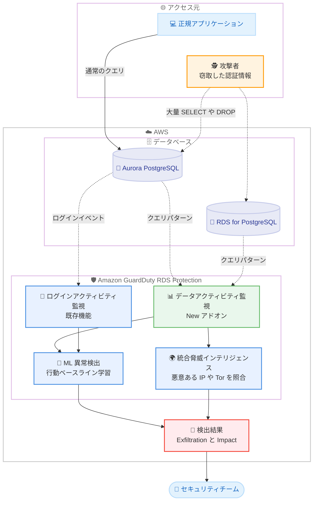

# Amazon GuardDuty - RDS Protection によるデータ流出・データ破壊の検出

**リリース日**: 2026 年 10 月 8 日
**サービス**: Amazon GuardDuty
**機能**: RDS Protection for data activity (データアクティビティモニタリング)

📊 [このアップデートのインフォグラフィックを見る](https://takech9203.github.io/aws-news-summary/20261008-guardduty-rds-data-exfiltration.html)

## 概要

Amazon GuardDuty は、RDS Protection の機能拡張として「RDS Protection for data activity」を発表しました。従来のログイン異常検出に加えて、Amazon Aurora PostgreSQL および Amazon RDS for PostgreSQL データベースを標的としたデータ流出 (exfiltration) 攻撃とデータ破壊 (destruction) 攻撃を検出できるようになります。

本機能は、機械学習ベースの異常検出と GuardDuty の統合脅威インテリジェンスを組み合わせ、データベースのクエリパターンを継続的に監視します。正常なクエリパターンの行動ベースラインを確立し、通常より大幅に多い行数の読み取り、異常な DELETE や DROP ステートメントの実行、既知の悪意ある IP アドレスや Tor 出口ノードからのアクセスなど、従来のツールでは見逃しがちな脅威を検出します。フィッシングやソーシャルエンジニアリング、設定ミスにより窃取された有効な認証情報を使用する攻撃は、正規のアプリケーションの動作と区別がつきにくいという課題に対応するものです。

エージェントのインストール、追加インフラストラクチャ、データベース設定の変更は一切不要で、データベースインスタンスのパフォーマンスに影響を与えない設計となっています。セキュリティチームやデータベース管理者は、GuardDuty コンソールからワンクリックで組織全体に有効化できます。

**アップデート前の課題**

GuardDuty RDS Protection はログインアクティビティの監視のみに対応しており、認証後のデータベース内の活動は監視できませんでした。

- 窃取された有効な認証情報によるログイン後のデータ流出・破壊活動は、正規のアプリケーションの動作と区別がつかず検出が困難だった
- データベース内のクエリパターンを監視するには、サードパーティのデータベースアクティビティモニタリングツールやエージェントの導入が必要だった
- 大量データの読み取りや破壊的な SQL ステートメントの実行をリアルタイムに検出する AWS ネイティブな仕組みがなかった

**アップデート後の改善**

- データベースクエリパターンの ML ベースの異常検出により、データ流出やデータ破壊の兆候を自動検出できるようになった
- 正常なクエリパターンの行動ベースラインを確立し、ユーザーやデータベースごとの異常な行動を特定できるようになった
- エージェント、追加インフラ、データベース設定変更なしで、ワンクリックで組織全体に有効化できるようになった
- 既知の悪意ある IP アドレスや Tor 出口ノードからのデータ抽出・破壊クエリを脅威インテリジェンスで検出できるようになった

## アーキテクチャ図



GuardDuty RDS Protection for data activity は、Aurora PostgreSQL と RDS for PostgreSQL のクエリパターンをエージェントレスで継続的に監視し、ML による行動ベースラインと脅威インテリジェンスを組み合わせて、データ流出 (Exfiltration) やデータ破壊 (Impact) の検出結果を生成します。

## サービスアップデートの詳細

### 主要機能

1. **データ流出 (Exfiltration) の検出**
   - ユーザーやデータベースごとの正常なクエリパターンをベースラインとして学習し、通常より大幅に多い行数を返す SELECT ステートメントの実行を異常として検出
   - 未知のユーザー、IP アドレス、データベース名などの新しい属性を伴う大量データ読み取りを特定
   - 既知の悪意ある IP アドレスや Tor 出口ノードからのデータ抽出クエリを脅威インテリジェンスで検出

2. **データ破壊 (Destruction) の検出**
   - 異常な DROP ステートメントの実行 (テーブルやデータベースオブジェクトの削除) を検出
   - 通常より大幅に多い行数に影響する異常な DELETE ステートメントの実行を検出
   - 悪意ある IP アドレスや Tor 出口ノードからの破壊的ステートメントの実行を検出

3. **エージェントレス・設定変更不要の監視**
   - エージェントのインストール、追加インフラストラクチャ、データベース設定の変更が不要
   - データベースインスタンスのパフォーマンスに影響を与えない設計
   - 有効化後、最大 2 週間の学習期間で正常な行動のベースラインを確立

4. **柔軟な有効化オプション**
   - RDS Protection for login activity のアドオンとして提供
   - GuardDuty コンソールからワンクリックで組織全体に有効化可能
   - API、SDK、CLI、AWS CloudFormation によるプログラムでの有効化にも対応

### 新しい検出タイプ

データアクティビティモニタリングにより、以下の検出タイプが追加されました。

| 検出タイプ | デフォルト重要度 | 内容 |
|------------|------------------|------|
| `Exfiltration:RDS/AnomalousBehavior` | 低〜高 (変動) | 通常より大幅に多い行数を抽出する異常な SELECT 活動 |
| `Exfiltration:RDS/MaliciousIPCaller` | 高 | 既知の悪意ある IP アドレスからのデータ抽出クエリの実行 |
| `Exfiltration:RDS/TorIPCaller` | 高 | Tor 出口ノード IP アドレスからのデータ抽出クエリの実行 |
| `Impact:RDS/AnomalousBehavior.Drop` | 中〜高 (変動) | テーブルやオブジェクトを削除する異常な DROP ステートメントの実行 |
| `Impact:RDS/AnomalousBehavior.Delete` | 低〜高 (変動) | 通常より大幅に多い行に影響する異常な DELETE ステートメントの実行 |
| `Impact:RDS/MaliciousIPCaller` | 高 | 既知の悪意ある IP アドレスからの破壊的ステートメントの実行 |
| `Impact:RDS/TorIPCaller` | 高 | Tor 出口ノード IP アドレスからの破壊的ステートメントの実行 |

重要度が変動する検出タイプでは、プライベートネットワークからのアクセスは低、パブリック IP アドレスからのアクセスは中、未知のパブリックネットワークや高権限ロールによる大量操作は高と判定されます。

## 技術仕様

### サポート対象データベースエンジン (データアクティビティモニタリング)

| データベースエンジン | サポートバージョン |
|----------------------|--------------------|
| Aurora PostgreSQL | 11.19 以降、12.14 以降、13.10 以降、14.7 以降、15.2 以降、以降のメジャーバージョン |
| RDS for PostgreSQL | 11.20 以降、12.15 以降、13.11 以降、14.8 以降、15.3 以降、以降のメジャーバージョン |

Aurora MySQL、RDS for MySQL、RDS for MariaDB、Aurora PostgreSQL Limitless Database はログインアクティビティモニタリングのみの対応で、データアクティビティモニタリングは現時点で未対応です。

### 機能の位置づけ

| 項目 | 詳細 |
|------|------|
| 機能名 | RDS Protection for data activity (データアクティビティモニタリング) |
| 提供形態 | RDS Protection for login activity のアドオン (API 上は `RDS_LOGIN_EVENTS` 機能の追加設定 `RDS_DATA_RISK`) |
| 検出方式 | ML ベースの異常検出 + 統合脅威インテリジェンス |
| 学習期間 | 有効化後または新規データベース作成後、最大 2 週間 |
| エージェント | 不要 |
| データベース設定変更 | 不要 |
| パフォーマンス影響 | なし (データベースインスタンスに影響しない設計) |

### API 変更履歴

| 日付 | サービス | 変更内容 |
|------|----------|----------|
| 2026/10/08 | [guardduty](https://awsapichanges.com/archive/changes/6b8067-guardduty.html) | 9 updated api methods - GuardDuty RDS Data Activity Monitoring のサポートを追加。`CreateDetector`、`UpdateDetector`、`UpdateMemberDetectors`、`UpdateOrganizationConfiguration` などに追加設定 `RDS_DATA_RISK` が追加され、`GetUsageStatistics` に `RDS_DATA_ACTIVITY_DBI_PROTECTION_PROVISIONED` などの使用量タイプが追加 |

## 設定方法

### 前提条件

1. GuardDuty が有効化されていること
2. 対象データベースが Aurora PostgreSQL または RDS for PostgreSQL のサポート対象バージョンであること
3. 組織全体で有効化する場合は、GuardDuty 委任管理者アカウントであること

### 手順

#### ステップ 1: RDS Protection とデータアクティビティモニタリングの有効化

```bash
aws guardduty update-detector \
  --detector-id <detector-id> \
  --features '[
    {
      "Name": "RDS_LOGIN_EVENTS",
      "Status": "ENABLED",
      "AdditionalConfiguration": [
        {
          "Name": "RDS_DATA_RISK",
          "Status": "ENABLED"
        }
      ]
    }
  ]'
```

既存の GuardDuty ディテクターに対して、RDS Protection のログインアクティビティモニタリング (`RDS_LOGIN_EVENTS`) を有効化し、追加設定としてデータアクティビティモニタリング (`RDS_DATA_RISK`) を有効化します。データアクティビティモニタリングはログインアクティビティモニタリングのアドオンであるため、両方を有効化する必要があります。

#### ステップ 2: 組織全体への自動有効化の設定

```bash
aws guardduty update-organization-configuration \
  --detector-id <detector-id> \
  --auto-enable-organization-members ALL \
  --features '[
    {
      "Name": "RDS_LOGIN_EVENTS",
      "AutoEnable": "ALL",
      "AdditionalConfiguration": [
        {
          "Name": "RDS_DATA_RISK",
          "AutoEnable": "ALL"
        }
      ]
    }
  ]'
```

GuardDuty 委任管理者アカウントから、AWS Organizations 配下のすべてのメンバーアカウントに対して RDS Protection とデータアクティビティモニタリングを自動有効化します。`AutoEnable` に `NEW` を指定すると、新規参加アカウントのみに自動有効化されます。

#### ステップ 3: 有効化状態と検出結果の確認

```bash
# 機能の有効化状態を確認
aws guardduty get-detector --detector-id <detector-id>

# RDS Protection の検出結果を確認
aws guardduty list-findings \
  --detector-id <detector-id> \
  --finding-criteria '{
    "Criterion": {
      "type": {
        "Equals": ["Exfiltration:RDS/AnomalousBehavior"]
      }
    }
  }'
```

`get-detector` で `RDS_DATA_RISK` の有効化状態を確認し、`list-findings` で検出タイプを指定してデータ流出関連の検出結果を取得します。有効化直後は最大 2 週間の学習期間があるため、この期間中は異常検出の結果が生成されない場合があります。

## メリット

### ビジネス面

- **データ侵害リスクの低減**: 窃取された認証情報による内部からのデータ流出や破壊を早期に検出し、情報漏えいによる事業影響や信頼失墜のリスクを低減できる
- **運用コストの削減**: サードパーティのデータベースアクティビティモニタリングツールやエージェントの導入・運用が不要になり、監視体制の構築コストを削減できる
- **コンプライアンス対応の強化**: データベースへの異常アクセスの継続的な監視により、個人情報や機密データを扱うワークロードのセキュリティ要件への対応を強化できる

### 技術面

- **エージェントレスで即時導入可能**: エージェント、追加インフラ、データベース設定変更が不要で、既存のワークロードに影響を与えずワンクリックで有効化できる
- **ML による行動ベースライン**: ユーザーやデータベースごとの正常なクエリパターンを自動学習し、シグネチャベースのツールでは検出できない異常を特定できる
- **脅威インテリジェンスとの統合**: 既知の悪意ある IP アドレスや Tor 出口ノードからのクエリ実行を自動的に検出できる
- **組織全体での一元管理**: AWS Organizations との統合により、委任管理者アカウントから全メンバーアカウントへ一括で有効化・管理できる

## デメリット・制約事項

### 制限事項

- データアクティビティモニタリングの対象は Aurora PostgreSQL と RDS for PostgreSQL のみで、Aurora MySQL、RDS for MySQL、RDS for MariaDB、Aurora PostgreSQL Limitless Database は対象外
- サポート対象のエンジンバージョンに制限がある (例: Aurora PostgreSQL 11.19 以降、RDS for PostgreSQL 11.20 以降)
- 有効化後または新規データベース作成後、最大 2 週間の学習期間中は異常検出の結果が生成されない場合がある
- GuardDuty は RDS データアクティビティのログ自体をユーザーに提供しない (検出結果のみ提供)

### 考慮すべき点

- データアクティビティモニタリングは RDS Protection for login activity のアドオンであり、単独では有効化できない
- 30 日間の無料トライアル終了後は自動的に無効化されず、使用量に応じた課金が開始されるため、トライアル中にコスト見積もりを確認する必要がある
- RDS for PostgreSQL のリードレプリカは、プライマリインスタンスがサポート対象バージョンであり、正常にレプリケーションされている必要がある

## ユースケース

### ユースケース 1: 窃取された認証情報によるデータ流出の検出

**シナリオ**: フィッシング攻撃により開発者のデータベース認証情報が窃取され、攻撃者が正規の認証情報を使用して顧客データベースから大量のレコードを抽出しようとしている。

**実装例**:
```bash
# EventBridge ルールで Exfiltration 検出結果を通知
aws events put-rule \
  --name guardduty-rds-exfiltration-alert \
  --event-pattern '{
    "source": ["aws.guardduty"],
    "detail-type": ["GuardDuty Finding"],
    "detail": {
      "type": [{"prefix": "Exfiltration:RDS/"}]
    }
  }'
```

**効果**: 正規の認証情報を使用した攻撃でも、通常のクエリパターンから逸脱した大量の SELECT 実行を ML が異常として検出し、`Exfiltration:RDS/AnomalousBehavior` 検出結果を生成する。EventBridge 経由で即時に通知を受け、パスワード変更やアクセス遮断などの初動対応を迅速化できる。

### ユースケース 2: ランサムウェアや内部不正によるデータ破壊の検出

**シナリオ**: 攻撃者または悪意ある内部関係者が、データベース内のテーブルを DROP したり、大量の行を DELETE したりしてデータを破壊しようとしている。

**実装例**:
```bash
# Impact 検出結果の確認
aws guardduty list-findings \
  --detector-id <detector-id> \
  --finding-criteria '{
    "Criterion": {
      "type": {
        "Equals": [
          "Impact:RDS/AnomalousBehavior.Drop",
          "Impact:RDS/AnomalousBehavior.Delete"
        ]
      }
    }
  }'
```

**効果**: 異常な DROP や DELETE ステートメントの実行を検出し、影響を受けたデータベースの詳細を含む検出結果を生成する。被害範囲を監査ログで特定し、ポイントインタイムリカバリやバックアップからの復旧を早期に開始できる。

### ユースケース 3: マルチアカウント環境での組織全体のデータベース保護

**シナリオ**: 数百の AWS アカウントを運用する企業が、全アカウントの Aurora PostgreSQL と RDS for PostgreSQL データベースに対して統一的なデータアクティビティ監視を導入したい。

**実装例**:
```bash
# 委任管理者アカウントから組織全体に自動有効化
aws guardduty update-organization-configuration \
  --detector-id <detector-id> \
  --features '[
    {
      "Name": "RDS_LOGIN_EVENTS",
      "AutoEnable": "ALL",
      "AdditionalConfiguration": [
        {"Name": "RDS_DATA_RISK", "AutoEnable": "ALL"}
      ]
    }
  ]'
```

**効果**: エージェント導入やデータベース設定変更なしに、既存および新規のすべてのメンバーアカウントでデータアクティビティ監視を一括有効化できる。セキュリティチームは委任管理者アカウントの GuardDuty コンソールで組織全体の検出結果を一元的に確認できる。

## 料金

RDS Protection for data activity を初めて有効化すると、アカウント・リージョンごとに 30 日間の無料トライアルが提供されます。既に RDS Protection for login activity を使用しているアカウントがデータアクティビティモニタリングを初めて有効化した場合も、データアクティビティモニタリングに対して 30 日間の無料トライアルが適用されます。

トライアル期間中は、GuardDuty コンソールの使用状況ページで対象アカウント・リージョンのコスト見積もりを確認できます。トライアル終了後は自動的に無効化されず、使用量に応じた課金が開始されます。最新の料金詳細は [Amazon GuardDuty 料金ページ](https://aws.amazon.com/guardduty/pricing/)を参照してください。

## 利用可能リージョン

GuardDuty RDS Protection が Aurora PostgreSQL および RDS for PostgreSQL をサポートするすべての AWS 商用リージョンと AWS GovCloud (US) リージョンで利用可能です。

## 関連サービス・機能

- **RDS Protection for login activity**: 既存のログイン異常検出機能。データアクティビティモニタリングはこの機能のアドオンとして提供される
- **Amazon Aurora PostgreSQL / Amazon RDS for PostgreSQL**: データアクティビティモニタリングの監視対象となるデータベースサービス
- **AWS Organizations**: GuardDuty 委任管理者アカウントから組織全体への一括有効化・自動有効化が可能
- **Amazon EventBridge**: GuardDuty 検出結果をトリガーとした通知や自動修復ワークフローの構築に利用可能
- **AWS Security Hub / Amazon Detective**: 検出結果の集約や、侵害の根本原因調査との連携が可能

## 参考リンク

- 📊 [インフォグラフィック](https://takech9203.github.io/aws-news-summary/20261008-guardduty-rds-data-exfiltration.html)
- [公式発表 (What's New)](https://aws.amazon.com/about-aws/whats-new/2026/10/guardduty-rds-data-exfiltration/)
- [ドキュメント: GuardDuty RDS Protection](https://docs.aws.amazon.com/guardduty/latest/ug/rds-protection.html)
- [ドキュメント: RDS Protection の検出タイプ](https://docs.aws.amazon.com/guardduty/latest/ug/findings-rds-protection.html)
- [製品ページ: Amazon GuardDuty](https://aws.amazon.com/guardduty/)
- [料金ページ: Amazon GuardDuty](https://aws.amazon.com/guardduty/pricing/)

## まとめ

GuardDuty RDS Protection for data activity により、窃取された認証情報を使用した正規アクセスを装うデータ流出・破壊攻撃を、エージェントレスかつデータベース設定変更なしで検出できるようになりました。Aurora PostgreSQL または RDS for PostgreSQL で機密データを扱うワークロードを運用している場合は、30 日間の無料トライアルを活用してデータアクティビティモニタリングの有効化を検討することを推奨します。
